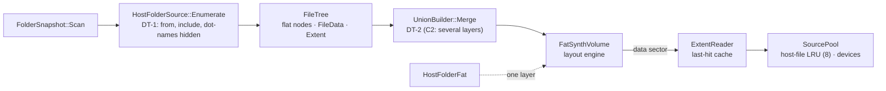

# C0 / C1 — the core and the `HostFolderFat` parity refactor

**Status:** done 2026-10-05 (commit 39d6aa78 and the C2 commit after it). Phases C0 and C1 of
[tdd.md](../tdd.md) §13.

## 1. Scope

- C0: hashes of `HostFolderFat` volumes and read benchmark numbers on master, before any change.
- C1: the multi-source core (`FileTree`, `SourcePool`, `ExtentReader`, `HostFolderSource`, `UnionBuilder`),
  the layout engine moved into `FatSynthVolume`, and `HostFolderFat` rebuilt on top of it as a one-layer
  volume with byte-identical output.

## 2. As built

| Class | Place | Notes |
|---|---|---|
| `FileTree` | `io/storage/compose/filetree.h` | The tdd's `UnionTree`. Nodes in one vector, children by index; `FileData` says where bytes are (`Zero`, `HostFile`, `DeviceExtents`); `Extent` is 16 bytes |
| `SourcePool` | `compose/sourcepool.h` | Host files read through an LRU of 8 open streams; a file that shrank or vanished reads as zeros with one warning |
| `ExtentReader` | `compose/extentreader.h` | Zero-copy sector reads; last-hit extent and the next one in O(1), else binary search |
| `HostFolderSource` | `compose/hostfoldersource.h` | A scanned folder as a tree: `from`, `include` ("path: not included" report lines), dot-names hidden |
| `UnionBuilder` | `compose/unionbuilder.h` | Shadow, keep-lower, error, opaque, whiteout, mount; FAT key folding; directories first, then byte-wise order |
| `FatSynthVolume` | `io/storage/fat/fatsynthvolume.h` | The layout engine taken out of `HostFolderFat` unchanged; `Build(tree, pool, options, ...)` |
| `HostFolderFat` | `io/storage/hostfolder/hostfolderfat.h` | `HostFolderSource` into a tree, then `FatSynthVolume::Init`. Messages and `Describe()` as before |

## 3. Evidence

- **Parity:** `HostFolderFatParity_Test` holds FNV-1a hashes of 24 corpus volumes recorded on master before
  the swap (sectors up to `UsedSectorEnd`, every 1021st sector, the last one). The refactored class
  builds byte-identical volumes.
- **NFR-P1 A/B** (`core/benchmarks/emulator/io/hostfolderfat_benchmark.cpp`, Linux, 4 cores):

  | Benchmark (FAT16) | Before | After |
  |---|---|---|
  | `HostFolderFatSeqRead` | 618 ns | 571 ns |
  | `HostFolderFatRandRead` | 1554 ns | 1361 ns |
  | `HostFolderFatMetaRead` | 2357 ns | 1998 ns |
  | `HostFolderFatBuild` | same | same |

  The extent last-hit cache pays for the extra indirection.
- 39 new unit tests (`core/tests/emulator/io/storage/compose/`, `fatsynthvolume_test.cpp`, the parity test).
- Full build with zero warnings. `core-tests` on Linux x86 gcc all pass except `TsfmGolden_Test.*`, which fails
  without this work too (digests recorded on the macOS host).
