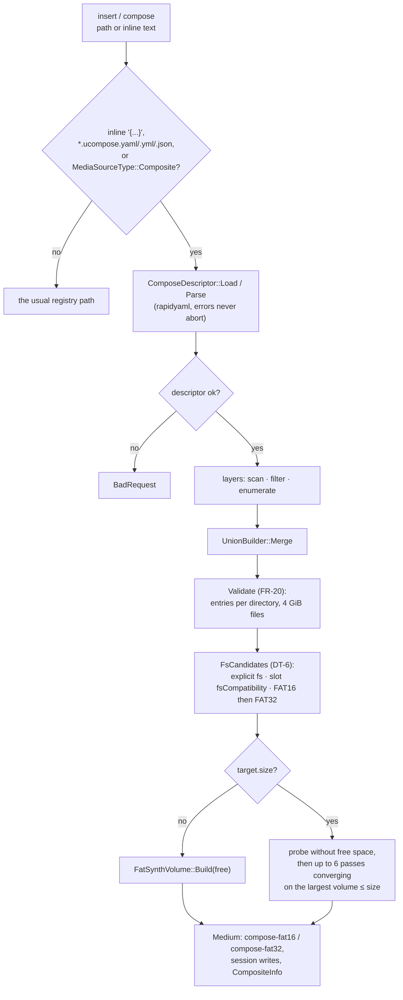

# C2 — descriptor, composite media, `compose` / `layers`

**Status:** done 2026-10-05 (commit 9e82f1cd). Phase C2 of [tdd.md](../tdd.md) §13. Exit: ACC-C1,
ACC-C2.

## 1. As built

| Part | Place | Notes |
|---|---|---|
| `ComposeDescriptor` | `media/composedescriptor.h` | YAML / JSON; relative paths against the descriptor's folder, `~` = home; target paths normalized; unknown keys and bad values are report lines, not failures; `Normalized()` is the canonical JSON (writes excluded) the content id hashes |
| `CompositeMediumFactory` | `media/compositemediumfactory.h` | `Build` (descriptor → volume + `CompositeInfo`), `Open` (registry entry), `FsCandidates` (DT-6). `TargetValidator` is not a class: its checks are `Validate` here plus the size checks in `FatSynthVolume` |
| `MediaSourceType::Composite` | `media/mediatypes.h` | `MediaSource::inlineBody` carries an inline descriptor; `Medium::Composite()` the layers and layout |
| Manager | `media/mediamanager.cpp` | A composite is treated like a folder volume: never written in place (`writethrough` refused), session writes; `rescan` rebuilds with the FS the medium was built with, so the guest never sees the FAT type change |
| `MediaControl` | `media/mediacontrol.cpp` | `compose` (slotless: build and report, insert nothing; options `fs`, `codepage`, `free`) and `layers <slot>` |
| Surfaces | `core/automation/` | CLI `media compose` / `media layers`; WebAPI `GET /media/compose?path=` and `POST /media/{slot}/layers`, a `descriptor` object on insert; OpenAPI; MCP actions `compose` / `layers`; Lua and Python `media_compose` / `media_layers` |
| Sprinter | `io/ide/idecontroller.cpp` | IDE disks of the Sprinter scheme get `fsCompatibility = {Fat16}` (Estex DSS reads FAT12 / FAT16 only). Set by scheme, so shared code names no Sprinter model id (`SprinterIsolation_Test`) |

## 2. Acceptance

- **ACC-C1:** `ZXEvoErs_Test.NedoOsBootsFromTwoComposedFolders`. NedoOS boots from the NedoOS folder plus an upper
  folder whose `bin/AUTOEXEC.BAT` shadows the lower `bin/autoexec.bat` (FAT names fold case). The shell runs the
  upper batch file only.
- **ACC-C2:** `TsConfBootSd_Test.ComposeWildCommanderListsFilteredFat32Layers` on Wild Commander Improved v1.11i
  (`testdata/machines/tsconf/wc-improved/`, MIT). The card is a FAT32 composite of the WC folder, a games folder
  filtered to `*.trd` / `*.scl`, and a docs folder at `/DOCS`. WC's panel lists exactly the filtered root. WC is
  a folder layer itself, so ACC-C2 needs no image source.

## 3. Evidence

- Unit tests: `ComposeDescriptor_Test` (10), `CompositeMediumFactory_Test` (8), `MediaControl_Test` compose /
  layers / Sprinter (3), the two acceptance tests.
- Full build with zero warnings (Python automation compile-checked in a separate build directory, as it is off
  by default). `core-tests` all pass except `TsfmGolden_Test.*` (see C1).
