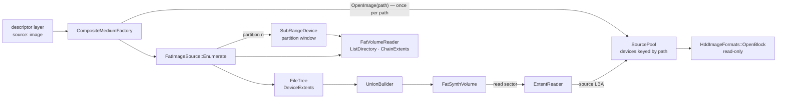
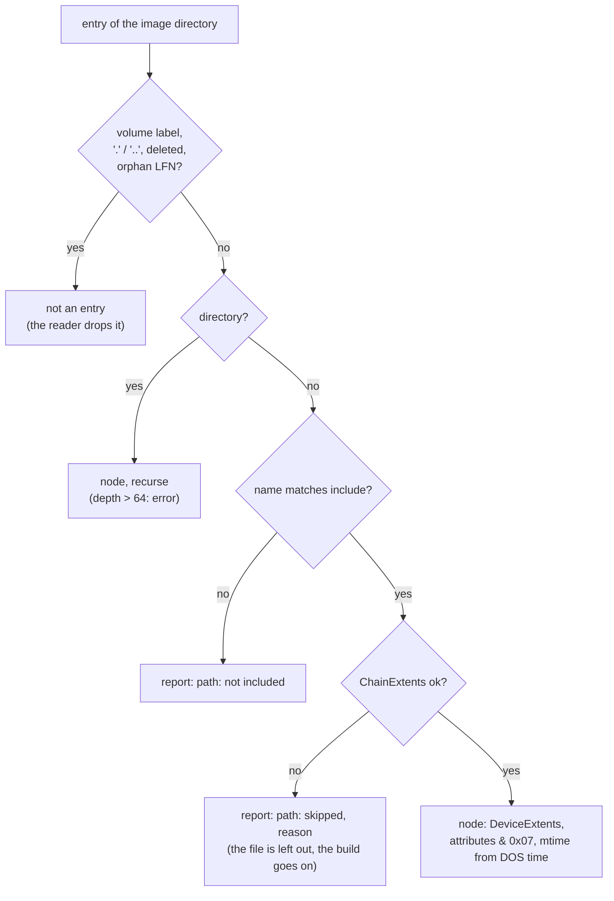
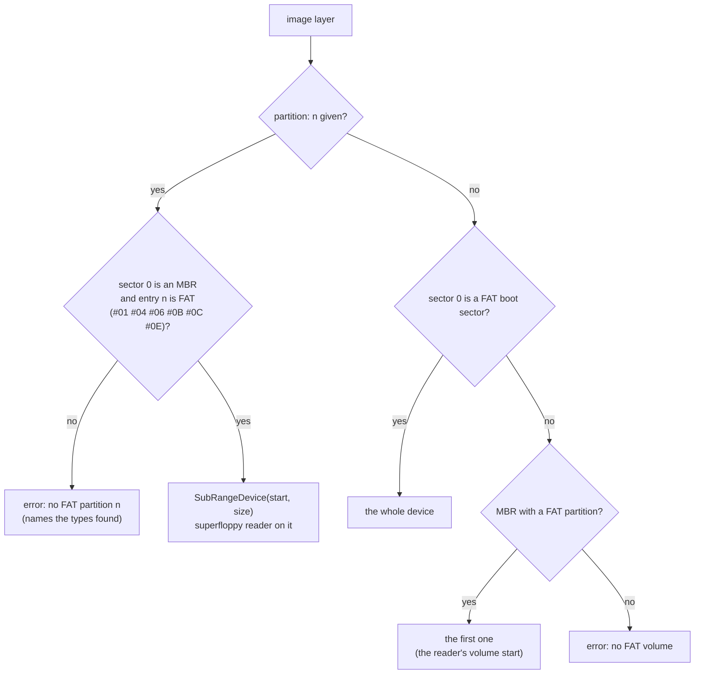

# C3 — FAT disk images as layers

**Status:** done 2026-10-05 (design first, as-built notes in §9). Phase C3 of [tdd.md](../tdd.md) §14: `FatVolumeReader::ChainExtents` /
partitions, `FatImageSource`, `SubRangeDevice`; image layers in a rebuilt volume. Exit: FAT16 and FAT32
images merged ([fs-compatibility.md](../fs-compatibility.md) S-1, S-2).

## 1. What changes for the user

A layer's source can be a FAT disk image instead of a folder:

```yaml
version: 1
target: {fs: fat32}
layers:
  - {name: dss, source: {image: dss-1.62.img, partition: 1, codepage: cp866}}
  - {name: games, source: {image: games-fat16.vhd}, from: /GAMES, include: ["*.trd"], mount: /GAMES}
  - {name: work, source: {folder: ~/zx/work}}
```

- Every format `HddImageFormats::OpenBlock` opens: raw `.img` / `.hdf` / `.hdi` / `.vhd` / `.chd`.
- The image is opened **read-only**. It is never written: guest writes go to the composite's
  change layer, as for folders.
- `partition: n` picks MBR entry *n* (1-4). Without it: a superfloppy, or else the first FAT
  partition (what `FatVolumeReader::Open` does today).
- `codepage` is the code page of the image's **short names** (CP866 default). The target's code page is
  separate. A CP1251 image merges into a CP866 card with the right names in both.
- `from`, `include`, `mount`, `conflict`, `opaque`, `whiteout` work exactly as for folders.
- The image's boot code, label and free space are not carried over: a rebuilt volume is new.
  Keeping the image's sectors in place is graft (C4).

## 2. Components



| Component | Place | Role |
|---|---|---|
| `FatVolumeReader` (extended) | `io/storage/fat/` | `ListDirectory(firstCluster)`, `ChainExtents(firstCluster, bytes)`, `FindPartition(device, n)`, a one-window FAT sector cache, `DosToUnix(date, time)` |
| `SubRangeDevice` | `io/storage/` | `IBlockDevice` over sectors `[first, first + count)` of another device; reads and writes outside fail. C7 reuses it for passthrough partitions |
| `FatImageSource` | `io/storage/compose/` | Walk the image's tree from `from` into a `FileTree`: files as `DeviceExtents`, the attributes and times of the entries |
| `SourcePool` (extended) | `io/storage/compose/` | `FindDevice(key)` / `AddDevice(device, key)`: one opened image per canonical path, shared by every layer that names it (one `ChdImage` and its hunk cache for a CHD) |
| `CompositeMediumFactory` (extended) | `media/` | Image layers: open through the pool, enumerate, identity, layer info |

## 3. Reading a file's place: `ChainExtents`

```
ChainExtents(firstCluster, bytes) -> [ {deviceLba, sectors} ... ]
  need = ceil(bytes / 512) sectors; walk the chain from firstCluster:
    cluster outside [2, clusterCount + 2) -> error "leaves the volume"
    more steps than clusterCount          -> error "loops"
    lba = volumeStart + dataStart + (cluster - 2) * spc
    lba == last.deviceLba + last.sectors -> last.sectors += spc   (coalesce)
    else                                 -> new extent
  stop when need is covered (the last extent is cut to need),
  or at end of chain: short -> error "the chain is shorter than the file"
```

- A file of size 0 has no extents (`Storage::Zero`).
- A contiguous file is one extent whatever its size. A fragmented one is one extent per run. The
  `Extent` table keeps 16 bytes per run (tdd.md §12).
- The FAT is read through a cache of the last two FAT sectors. A contiguous file reads one FAT sector
  per 128 (FAT32) or 256 (FAT16) clusters, not two per cluster as `NextCluster` does now.
- Extents are LBAs **of the device the reader was opened on**. For a partition that device is the
  `SubRangeDevice`, which the pool holds.

## 4. Walking the image: `FatImageSource::Enumerate`



- **Names:** the long name when the entry has a valid one, else the short name decoded with the layer's
  code page. The target lays out its own 8.3 names (`FatNameMapper`).
- **Attributes:** read-only, hidden, system (`& 0x07`) are kept. Archive and the rest are the target's.
- **Times:** DOS date and time are read as UTC, the same convention `FatSynthVolume` writes with, so
  an image entry keeps its exact DOS time through a rebuild.
- **Broken entries:** a file whose chain is broken is left out with a report line, not a failed build.
  A broken directory chain fails the layer: its subtree cannot be known.
- **`from`:** `Find(from)` must be a directory, else the layer fails ("no folder /X in the image").
- **Identity:** `device ContentId() ⊕ partition`. For a raw image, `ContentId` hashes path and size, so a
  changed image of the same size keeps its id. As for folders, `rescan` builds anew anyway.

## 5. Choosing the volume: `partition`



Extended partitions (`#05` / `#0F`, EBR chains) are C7.

## 6. Factory changes

- `Kind::Image` stops being `NotSupported`. ISO stays NotSupported until C5.
- The image path must be a file. A folder or a missing file fails with `UnreadableSource`.
- The pool opens each canonical path once (`OpenBlock(path, Probe(path), ReadOnly)`) and serves every
  layer that names it. Two partitions of one image are two `SubRangeDevice`s over one device.
- Identity mixed into the content id: device `ContentId`, partition, code page.
- Layer info: `kind: image`, files and bytes as for folders.
- FR-20 checks (`Validate`) and the FS choice (DT-6) are unchanged: an image layer is just a tree.

## 7. Tests (test-and-benchmark-plan.md §3.3)

| Test | Checks |
|---|---|
| `FatVolumeReader_Test.ChainExtentsCoalesces` | a hand-made FAT12 volume: a 3-fragment file gives 3 extents, a contiguous one gives 1; a looping chain and a short chain fail |
| `FatVolumeReader_Test.SelectsPartitionN` | an MBR with two FAT partitions: `FindPartition(2)` finds the second; a non-FAT entry fails |
| `FatVolumeReader_Test.ChainExtentsReadsFewFatSectors` | a contiguous file of 1000 clusters reads the FAT a few times, not 2000 |
| `SubRangeDevice_Test.Bounds` | reads and writes inside map to `first + lba`; outside fail; not writable when the base is not |
| `FatImageSource_Test.Fat12Fat16Fat32Sources` | each FAT type as a source: tree, sizes, bytes through `ExtentReader` |
| `FatImageSource_Test.SubdirectoriesLongNamesAttributesTimes` | a source built by `FatSynthVolume` from a host folder: names, LFN, hidden, DOS times survive |
| `FatImageSource_Test.CodePagePerLayer` | CP1251 short names read with `codepage: cp1251` into a CP866 target: right in both |
| `FatImageSource_Test.IgnoresDeletedAndOrphanLfn` | deleted entries and an LFN without its short entry do not appear |
| `FatImageSource_Test.FromIncludeAndBrokenChain` | `from` subtree, `include` report, a file with a broken chain skipped with a report line |
| `ComposeFat_Test.MergeFat16AndFat32IntoFat32` | S-1: two images (FAT16, FAT32) plus a folder, read back with `FatVolumeReader` |
| `ComposeFat_Test.IntoFat16WhenFits` / `.IntoFat16TooBigFails` | S-2: FAT16 target when it fits; `DoesNotFit` naming the size when it does not |
| `ComposeFat_Test.ChdSourceReadsThroughSharedCache` | a CHD written by `ChdWriter` named by two layers: right bytes, one device in the pool |
| `ComposeFat_Test.ImageLayerErrors` | missing file, a folder given as image, partition 3 of a one-partition image, an image with no FAT |

Benchmark: `HostFolderFatSeqRead` gets an image-source twin (`ComposeImageSeqRead`), so image layers are
measured against folder layers (NFR-P1 budget: within 10%).

## 8. Out of scope

- Writing to images (S3 / S4, C8), keeping the image's layout (graft, C4).
- Non-FAT images (TR-DOS, +3DOS, MSX, ...): the library extraction's platform packs.
- EBR / logical partitions (C7).

## 9. As built

- As designed, with these differences:
  - Without `partition`, an MBR image's first FAT partition is read through the reader's volume start (what
    `FatVolumeReader::Open` always did). Only an explicit `partition: n` makes a `SubRangeDevice`, registered in the
    pool under `<image key>#partition<n>`.
  - `exclude` works for image layers too (names of files and directories, report "path: skipped, excluded"), as it
    does for folders through the scan.
  - A directory entry with first cluster 0 (damaged: 0 means the root) is kept as an empty directory with a report
    line instead of recursing into the root.
  - `CompositeInfo::sourceDevices` (and `sourceDevices` in the `compose` / `layers` reply): images opened for the layers.
- **FAT window cache:** `NextCluster` reads through a sliding two-sector window. A 400-cluster FAT12 file now costs at
  most 4 FAT sector reads instead of 800. `ReadFile` and `List` gain the same.
- **Test sources:** `core/tests/_helpers/fatsourceimage.h`: `FolderToFatDisk` (a folder through `FatSynthVolume`),
  `SaveSparse`, `Fat12Floppy` (hand-made 1.44 MB FAT12), on a `SparseDisk` that stores only the written sectors.
  The first version used `MemoryDisk`: a FAT32 source with 4 KiB clusters is 256 MiB, and clearing it cost
  ~150 ms per test. With `SparseDisk` every C3 test runs in under 10 ms. The same observation is behind phase C10.
- **Tests:** `FatVolumeReader_Test` (6 new: extents, broken chains, FAT reads, partition n, DOS time),
  `SubRangeDevice_Test.Bounds`, `FatImageSource_Test` (6), `ComposeFat_Test` (5: S-1, S-2 both ways, a CHD named by
  two layers opened once, image layer errors).
- **NFR-P1** (`core/benchmarks/emulator/io/composeimage_benchmark.cpp`, the same files as the `HostFolderFat`
  benchmarks, Linux, 4 cores, medians of 5):

  | Benchmark | Time |
  |---|---|
  | `HostFolderFatSeqRead/fat16` (folder layer) | 756 ns |
  | `ComposeImageSeqRead` (image layer) | 804 ns (+6%) |
  | `ComposeImageDirectSeqRead` (the image itself, no composite) | 810 ns |
  | `HostFolderFatRandRead/fat16` | 1740 ns |
  | `ComposeImageRandRead` | 1090 ns |
  | `HostFolderFatBuild/fat16` | 237 µs |
  | `ComposeImageBuild` (open the image, walk it, lay out) | 462 µs |

  The composite adds nothing over reading the image directly. The gap to a folder layer is `RawImage`'s own
  per-sector seek and read, within the 10% budget.
