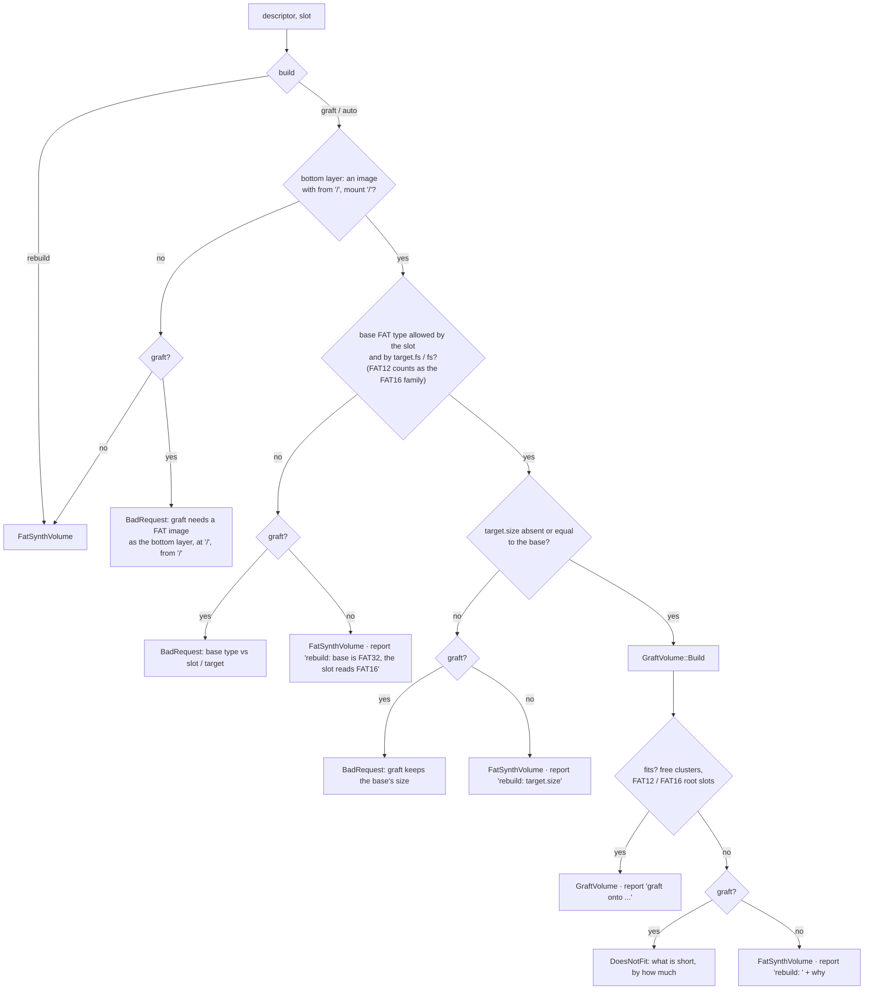
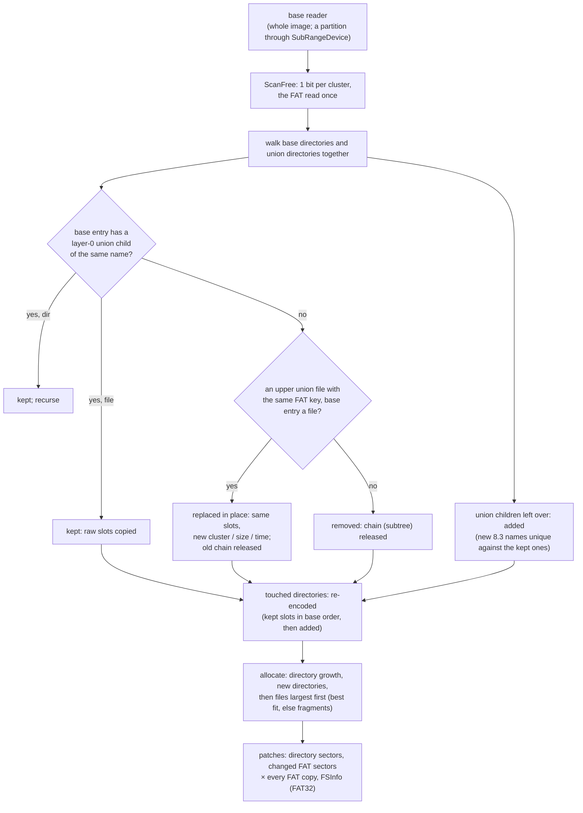

# C4 — graft: upper layers written into a FAT image base

**Status:** done 2026-10-05 (design first, as-built notes in §8). Phase C4 of [tdd.md](../tdd.md) §14 (§6 there is the outline this document
completes). Exit: ACC-C3 (read side), [fs-compatibility.md](../fs-compatibility.md) S-3, S-4 (with C5 for the ISO
part), S-10 fallback.

## 1. What changes for the user

When the bottom layer is a FAT image, the composite is the **image itself** with the upper layers' files placed
in its free clusters and its directories and FAT patched. Everything else is the base, sector for sector: MBR,
loaders in reserved sectors, boot code, system files at fixed places, the FAT copy count, the cluster size.

```yaml
version: 1
target: {build: auto}          # auto (default) | graft | rebuild
layers:
  - {name: dss, source: {image: dss.img}}                  # the base: the bottom layer, a FAT image
  - {name: util, source: {folder: ~/zx/util}, mount: /UTIL}
  - {name: fix, source: {folder: ./patch}}                 # SYSTEM.BAT replaced in place
```

- `build: auto` grafts when it can and rebuilds otherwise, saying why in the report.
- `build: graft` fails instead of falling back (`BadRequest` for a base that cannot be grafted, `DoesNotFit` for
  missing room, naming what is short and by how much).
- `build: rebuild` is C2 / C3 behavior.
- The base is never written: the composite's guest writes go to its change layer, as for every composite.

## 2. Decision tree DT-4 as built in this phase



- `target.free`, `label`, `mbr` do not apply to a graft. When the descriptor sets them, the report says
  they were ignored.
- New short names use the **base layer's** code page (the volume's own). A different `target.codepage` is
  reported and ignored.
- A rebuild after a failed graft does not carry the base's boot code yet. Boot carry-over for rebuilt volumes
  (D-6, `BootPlan`, the `boot:` section) is its own TODO item. It is not in any phase of the table so far.

## 3. Build



| Step | Rule |
|---|---|
| Matching | The base layer is layer 0 of the union. A union node with `layer == 0` under a base directory is that base entry, matched by its exact name (`FatImageSource` gave it that name). |
| Kept entry | Its raw directory slots (LFN pieces and the short entry) are copied verbatim: names, case bits, times, attributes stay byte-identical. |
| Replaced file | A base file shadowed by an upper file of the same FAT key keeps its slots and position; the short entry gets the new first cluster, size, write time and attributes. Its old chain is released. |
| Removed | Whiteouts, opaque directories, base-layer filters, a file replaced by a directory or the reverse: the base entry goes, its chain is released (a directory: its whole subtree). |
| Added | New entries after the kept ones; short names from `FatNameMapper::MapFolder(names, page, taken)` with the kept short names taken; LFN when needed. |
| New directory | `.` and `..` (`..` is 0 for a child of the root, FAT32 too), then its children; all its descendants are added. |
| Directory size | A re-encoded subdirectory keeps its chain and grows by new clusters when needed (the old last cluster is linked to the first new one); a shrunk one keeps its clusters, zeros after the last entry. The FAT12 / FAT16 root is fixed: more slots than `rootEntries` fails (`DoesNotFit`, S-10). |
| Allocation | Free = the base's free clusters plus the released ones. Directories first, then files by size, largest first: the smallest free run that holds the whole file, else the largest runs in turn. Short of room: `DoesNotFit` with the clusters needed and free. |
| FAT | Changed entries are written into a copy of their FAT sectors (FAT12 entries may straddle two); each changed sector is patched in every FAT copy (`fats` from the BPB: the DSS floppy has one). |
| FSInfo | FAT32: free count and next-free hint patched when the sector carries the FSInfo signatures. |
| Untouched | Directories nothing changed in are not read beyond the walk and not re-encoded (NFR-P6). |

## 4. Read

```
ReadSector(lba):
  patch hit (binary search over sorted patch LBAs)       -> the patch sector
  lba in the data region and in a grafted run            -> ExtentReader: the upper file's sector
     (last-hit run, else binary search over runs sorted by first cluster)
  else                                                   -> base.ReadSector(lba)
```

Only grafted clusters are looked up. Kept base files and free space come from the base with one comparison.

## 5. Components

| Component | Place | Role |
|---|---|---|
| `GraftVolume` | `io/storage/compose/graftvolume.{h,cpp}` | `Build(tree, pool, base, options, ...)` with a failure kind (`BaseNotFat`, `DoesNotFit`) for DT-4; `IBlockDevice` over base + patches + runs; counters for tests |
| `FatVolumeReader` (extended) | `io/storage/fat/` | Geometry accessors, `ReadRawDirectory` (slot groups incl. the label), `ChainClusters`, `ScanFree`, `FsInfoSector` |
| `FatNameMapper::MapFolder` (extended) | `io/storage/hostfolder/` | `taken`: short names already in the directory |
| `CompositeMediumFactory` (extended) | `media/` | DT-4, `Build` returns an `IBlockDevice`; `CompositeInfo::build` (`rebuild` / `graft`); formats `graft-fat12` / `graft-fat16` / `graft-fat32` |

## 6. Tests

| Test | Checks |
|---|---|
| `GraftVolume_Test.UnpatchedSectorsIdenticalToBase` | every sector outside patches and runs equals the base's |
| `GraftVolume_Test.AddedFilesReadByOracle` | files added in the root, in a base directory and in a new deep directory, read by `FatVolumeReader` |
| `GraftVolume_Test.ReplacedFileShowsNewData` | same slot position and short name, new bytes; the old chain is free |
| `GraftVolume_Test.WhiteoutHidesBaseFile` | a whiteout file and a whiteout directory are gone and their clusters free |
| `GraftVolume_Test.FreedClustersReused` | a base nearly full: replacing its big file makes room for the new one |
| `GraftVolume_Test.DirectoryGrowsNewCluster` | many files added to a one-cluster directory: its chain grows in the FAT patch |
| `GraftVolume_Test.Fat16RootFullFallsBackToRebuild` | S-10: `auto` rebuilds with a report, `graft` fails `DoesNotFit` |
| `GraftVolume_Test.Fat32FsInfoUpdated` | free count and next-free hint |
| `GraftVolume_Test.BuildCostIndependentOfBaseFiles` | directories re-encoded = the touched ones only |
| `GraftVolume_Test.BootSectorAndReservedPreserved` | the DSS floppy: boot sector, the loader in LBA 1-9, one FAT copy |
| `GraftVolume_Test.KeptEntriesByteIdentical` | a touched directory: kept slots byte-identical, in base order |
| `GraftVolume_Test.ExplicitPartition` | an MBR image, `partition: 1`: the MBR untouched, the volume grafted |
| `ComposeGraft_Test.AutoChoosesGraft` / `.AutoFallsBackOnType` / `.GraftFailsWithReason` / `.Fat32BaseOnSprinterRefused` | DT-4 leaves |
| `SprinterBoot_Test.ComposeDssGraftedUtilFolder` (ACC-C3, read side) | DSS 1.62 boots from a grafted hard disk; `SYSTEM.BAT` replaced by an upper layer runs `dir c:\util`; the folder's file is listed |

Benchmark: `GraftVolumeBuild` on a base of 2 000 files with 1 file grafted vs `ComposeImageBuild` (rebuild of the
same); `GraftSeqRead` over a grafted file (NFR-P1).

## 7. Out of scope

- Boot carry-over for rebuilt volumes (D-6): a separate TODO item.
- S3 commit of a graft into its base (C8), attribution of guest writes (C6).
- ISO upper layers (S-4's `/DEMOS`): C5 provides the ISO source; the graft takes any tree.

## 8. As built

- **As designed.** Additions:
  - `GraftVolume::SectorOrigin(lba)` (base, patch or grafted cluster) for tests, and later for provenance in C6.
  - `CompositeInfo::build` and `fsName`, also in the `compose` / `layers` reply (`build`, `fs`).
  - Medium formats `graft-fat12`, `graft-fat16`, `graft-fat32`.
  - `FatVolumeReader::UnixToDos`.
- **Every directory but the root** carries `.` and `..` when re-encoded: `ReadRawDirectory` leaves them out, and the
  encoder writes them anew (`..` = 0 for children of the root).
- **Freed clusters** are reused at once by best fit. A whiteout's cluster may hold the next new file.
- **ACC-C3** (read side): `SprinterBoot_Test.ComposeDssGraftedUtilFolder`.
  - Setup: DSS 1.62.92 boots from a graft of `BuildDssHdd`'s image (MBR, the loader at LBA 1-3, FAT16 at LBA 63)
    with `util/` at `/UTIL` and an upper `SYSTEM.BAT` that replaces the image's own in place.
  - Result: DSS runs the upper batch, changes to `C:\UTIL`, and `DIR` lists `HELLO.TXT` (1.8 s, boot-bound).
  - DSS 1.62's `dir c:\util` lists the `UTIL` entry itself, as DOS does without a trailing `\`.
- **Tests:** `GraftVolume_Test` (12) and `ComposeGraft_Test.DecisionTreeLeaves`, all under 50 ms. The C3 merge tests
  now say `build: rebuild`: with an image at the bottom, `auto` would graft.
- **Benchmarks** (`core/benchmarks/emulator/io/graftvolume_benchmark.cpp`, a base of 2 000 files in 20 directories
  plus a 1 MiB file, one 1 MiB host file grafted, medians of 5):

  | Benchmark | Time |
  |---|---|
  | `ComposeBuild/graft` | 2.45 ms |
  | `ComposeBuild/rebuild` (the same union) | 2.61 ms |
  | `GraftSeqRead/grafted` (the host file through the graft) | 594 ns per sector |
  | `GraftSeqRead/base` (a base file through the graft) | 689 ns per sector |

  **NFR-P6 is met by `GraftVolume` itself, not by the whole build.** It re-encodes only the touched directories
  (`BuildCostIndependentOfBaseFiles`: one of twenty). But the union still needs the whole base enumerated
  (`FatImageSource` walks all 2 000 files), and that walk dominates both builds. A later optimization: enumerate
  the base lazily, only the directories upper layers touch. Candidate for C9 / C10.
- **Mount point times** (owner decision 2026-10-05: fix it): a mount point created for a folder layer took the layer
  root's time, and a `FolderSnapshot` root had none, so `/UTIL` showed 1980-01-01. `FolderSnapshot::Scan` now gives
  the root its folder's time. As a deliberate exception to FR-34's byte parity, `HostFolderFat`'s volume label entry
  now carries the folder's time instead of 1980-01-01; every other byte is unchanged, and the parity corpus is
  unaffected because it builds with a fixed time. Tests: `FolderSnapshot_Test.RootCarriesTheFolderTime`,
  `CompositeMediumFactory_Test.MountPointCarriesTheLayerFolderTime`.
