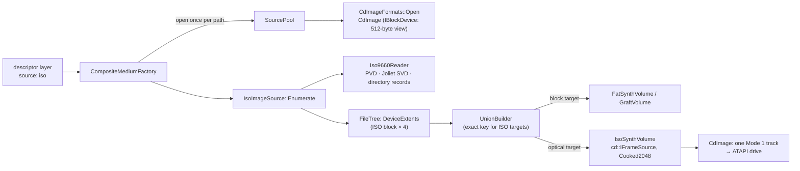
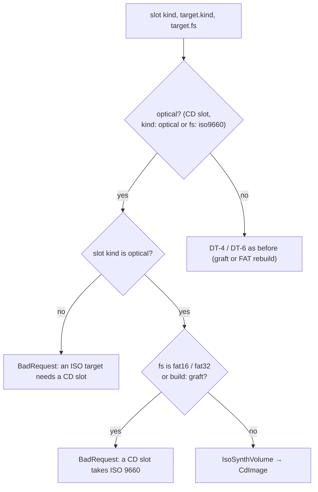

# C5 — ISO 9660: ISO images as layers, ISO targets, boot carry-over (D-6)

**Status:** done 2026-10-05: C5a (as-built notes in §9) and C5b (§10). Phase C5 of [tdd.md](../tdd.md) §13 (§7 there is the outline). Exit: ACC-C5,
[fs-compatibility.md](../fs-compatibility.md) S-7, S-8. The phase lands in two commits:

| Part | Scope |
|---|---|
| **C5a** | `Iso9660Reader`, `IsoImageSource` (an ISO as a layer of any target), `IsoSynthVolume` (an ISO 9660 L1 / L2 + Joliet target served as a one-track `CdImage`), optical composites in the factory and the manager, ACC-C5 |
| **C5b** | D-6 boot carry-over: El Torito from the bottom ISO layer or a `boot.eltorito` list; `BootPlan` for rebuilt FAT volumes (MBR code, volume boot code, reserved sectors from the bottom FAT image or the `boot:` section) |

## 1. What changes for the user

```yaml
version: 1
target: {kind: optical, iso: {level: 1, joliet: true}}   # or fs: iso9660, or simply a CD slot
layers:
  - {name: demos, source: {iso: ~/zx/demos.iso}}           # ISO / CUE / CHD: its first data track
  - {name: fat, source: {image: sd.img}, from: /GAMES, mount: /GAMES}
  - {name: work, source: {folder: ~/zx/work}}
```

- `source: {iso: ...}` takes any CD image `CdImageFormats` opens (ISO, CUE / BIN, CD CHD) and reads the ISO 9660
  file system of its first data track: Joliet names when present, else the ISO names without `;1`. An ISO layer can
  go into a FAT target too (S-4, S-6).
- An **optical target** (a CD slot, `target.kind: optical` or `target.fs: iso9660`) builds an ISO 9660 volume.
  The drive sees a pressed data CD: one session, one Mode 1 track, read-only. A FAT `fs` on a CD slot, or an ISO
  target on a block slot, fails with `BadRequest`.
- `target.iso`: `level` 1 (8.3 names, the default: what Spectrum CD readers expect) or 2 (31 characters);
  `joliet` (default true: long names for PC tools and Joliet-aware readers); `relaxDepth` (default false: deeper
  than 8 directory levels fails `DoesNotFit`).
- `build: graft` on an optical target fails (`BadRequest`): graft is for FAT images.

## 2. Components (C5a)



| Component | Place | Role |
|---|---|---|
| `Iso9660Reader` | `io/storage/cd/` | ECMA-119 from the specification alone (independent of the writer): volume descriptors, Joliet (escapes `%/@`, `%/C`, `%/E`), directory records across sectors, multi-extent files, hidden flag, recording dates |
| `IsoImageSource` | `io/storage/compose/` | An ISO volume as a `FileTree`: files as extents of the `CdImage` (block *b* = sectors 4*b*…4*b*+3), `from`, `include`, `exclude` as for other sources |
| `IsoSynthVolume` | `io/storage/cd/` | The ISO writer: metadata generated at build, file data served by `ExtentReader`; a `cd::IFrameSource` under a `CdImage` |
| `UnionBuilder::ExactKey` | `compose/` | ISO targets merge by exact (Joliet) name: `a.txt` and `A.TXT` are two files |
| Factory, manager | `media/` | Optical kind, ISO options, `compose-iso` format, `SetCd` so the drive gets the disc |
| `isoimagebuilder.h` | `core/tests/_helpers/` | A small independent ISO writer for reader tests |

## 3. The ISO target's layout

| Block | Contents |
|---|---|
| 0-15 | system area, zeros |
| 16 | Primary Volume Descriptor (ISO names) |
| 17 | (C5b) Boot Record when there are El Torito entries; the following move up by one |
| next | Supplementary Volume Descriptor, Joliet `%/E` (when `joliet`) |
| next | Volume Descriptor Set Terminator |
| … | path tables: L and M of the PVD tree, then L and M of the Joliet tree (each padded to whole blocks) |
| … | directory extents of the PVD tree, then of the Joliet tree (breadth-first, each a whole number of blocks) |
| … | (C5b) boot catalog, boot images (extents) |
| … | file extents in directory order, contiguous; **one extent per file shared by both trees** |

- **Names (DT-3):** Joliet name = the union name, cut to 64 UCS-2 units with a unique `~N` tail when longer. ISO
  name = upper-case d-characters (`A-Z 0-9 _`, anything else `_`), level 1: 8 + 3 (directories 8, no dot), level 2:
  31 in all; files end in `;1`. A name taken in its directory gets a unique tail `~N`, with a report line.
- **Order:** directory records are sorted by ISO name (PVD) and by UCS-2 big-endian name (Joliet), as ECMA-119 and
  Joliet require. Path tables: by level, then parent number, then name.
- **Dates:** every record gets the entry's time; the volume's creation date is `fixedTime`, or the newest time in
  the tree, so the same sources build the same bytes.
- **Big files:** a file of 4 GiB or more is written as several directory records (multi-extent, flag `0x80`),
  each section a multiple of 2048 bytes but the last.
- **Limits (FR-20):** depth > 8 (`relaxDepth: false`), a directory record set larger than 4 GiB, or a volume over
  2^32 blocks: `DoesNotFit`, naming the entry.

## 4. Read path

```
IFrameSource::Read(offset, dst, length)        (CdImage: whole 2048-byte blocks)
  block < metadataEnd     -> the generated metadata (one contiguous buffer)
  block in a file run     -> ExtentReader: four 512-byte sectors of the file
                              (an ISO source: four sectors of its CdImage, which caches the block)
  else                    -> zeros (padding)
```

File runs are sorted by first block and found by a last-hit index, then binary search, as in `GraftVolume`.

## 5. Decision tree: target kind and file system (extends DT-6)



## 6. C5b: boot carry-over (D-6)

| Structure | From (DT-5 order) | Carried as |
|---|---|---|
| El Torito entries (optical) | `boot.eltorito` list, else the bottom ISO layer's catalog (`Iso9660Reader::BootCatalog`) | a synthesized catalog (validation entry with checksum, default entry, sections) with relocated image LBAs; images served by extent, never copied |
| MBR code (FAT rebuild) | `boot.mbrCode`, else bytes 0-445 of the bottom FAT image's LBA 0 when it has an MBR | the rebuilt MBR's code area; the partition table stays the builder's |
| Volume boot code | `boot.volumeCode`, else the bottom image's boot sector code area (after the BPB, before `55 AA`) | the rebuilt boot sector's code area; BPB fields stay the builder's |
| Reserved sectors | `boot.reserved`, else the bottom image's reserved sectors 1…n−1 that are not FSInfo or the backup boot sector | the rebuilt volume reserves enough sectors and serves them from `FileData` |

- A bootable ISO or FAT image that is **not** the bottom layer is not carried; the report says so.
- Code larger than its area fails `DoesNotFit`.
- Tests are those of test-and-benchmark-plan.md §3.5 (El Torito, `FatSynthVolume_Test.CarriesBaseBootCode` and the
  boot-layer tests).

## 7. Tests (C5a)

| Test | Checks |
|---|---|
| `Iso9660Reader_Test.ReadsBuilderImages` | `IsoImageBuilder` volumes: level 1 and 2 names, Joliet, a deep tree, hidden files, dates |
| `Iso9660Reader_Test.RecordsAcrossSectors` | a directory with records filling several blocks (zero padding at block ends) |
| `IsoImageSource_Test.TreeAndBytes` | the tree with Joliet names, without Joliet the ISO names minus `;1`, bytes through `ExtentReader` |
| `IsoSynthVolume_Test.ReadBackByReader` | every file's bytes and names, both trees |
| `IsoSynthVolume_Test.PathTablesBothEndian` / `.VolumeDescriptorSetTerminated` | ECMA-119 structure |
| `IsoSynthVolume_Test.FilesSharedBetweenTrees` | PVD and Joliet records point at the same extents |
| `IsoSynthVolume_Test.NamesLevel1Level2AndCollisions` | d-characters, 8.3 / 31, `~N` tails, Joliet cut to 64 |
| `IsoSynthVolume_Test.DepthLimit` / `.MultiExtentFile` | depth 9 fails unless relaxed; a sparse 4.1 GiB file as two sections |
| `IsoSynthVolume_Test.ThroughCdImageReadToc` | the `CdImage` over it: one data track, the right lead-out, `ReadUser` |
| `ComposeIso_Test.FatSourcesIntoIso` / `.IsoPlusFolderIntoIso` / `.IsoLayerIntoFat` / `.KindMismatches` | S-7, S-8, an ISO into FAT, DT of §5 |
| ACC-C5 `ZXEvoErs_Test.ErsBootsAutorunFromComposedIso` | ZX-Evo, the CD on `ide0.slave` built from two folders (one holds `AUTORUN.ZX`); the ERS boots it |

Benchmark: `IsoSynthSeqRead` (a file read block by block through the `CdImage`) against `ComposeImageSeqRead`.

## 8. Out of scope

- Rock Ridge, UDF, multisession targets, mixed-mode (audio + data) targets.
- NedoOS listing the CD (the goals' ACC-C5 wording): NedoOS's own ISO driver is not part of the test fixtures yet;
  the ERS boot covers the drive path end to end.

## 9. As built (C5a)

- **As designed.** `Iso9660Reader`, `IsoImageSource`, `IsoSynthVolume`, `UnionBuilder::ExactKey`, the optical branch of
  the factory, `target.iso` (`level`, `joliet`, `relaxDepth`) in the descriptor and its normalized form.
- **Slot kind:** the factory gets `CompositeBuildOptions::slotKind` from the slot. A CD slot makes the target
  ISO 9660 with no `target` key needed; `media compose` without a slot follows the descriptor.
- **The medium:** format `compose-iso`, read-only, `SetCd` so the ATAPI drive has the disc (TOC, raw frames).
- **Folder layers of an optical target** are scanned without the 4 GiB file limit (FAT's): ISO stores big files as
  several sections.
- **Names:**
  - Level 1: 8 + 3 d-characters; level 2: base up to 30 less the extension, extension up to 8; directories 8 / 31.
  - Joliet: cut to 62 + `;1` for files, 64 for directories. Collisions get `~N` tails with a report line.
  - A name with no extension is recorded as `NAME.;1`.
- **Dates:** every record has the entry's time (or `fixedTime`); the volume's creation and modification dates are
  `fixedTime` or the newest time in the tree.
- **Tests:**
  - `Iso9660Reader_Test` (4, against `IsoImageBuilder`), `IsoSynthVolume_Test` (7), `ComposeIso_Test` (5: S-7, S-8,
    an ISO into FAT, kind mismatches, a CD medium through the registry).
  - Each runs in under 50 ms, the 4.4 GiB sparse multi-extent file included.
  - `IsoImageSource` is covered through `ComposeIso_Test`, so it has no separate test file.
- **ACC-C5:** `ZXEvoErs_Test.ErsBootsAutorunFromComposedIso`. The ZX-Evo ERS's CD boot reads the composite CD (two
  folders, `AUTORUN.ZX` in one) on `ide0.slave` and runs `AUTORUN.ZX` (191 ms, boot-bound). The goals' wording asks
  for NedoOS to list the CD; that needs NedoOS's ISO driver in the fixtures and is not covered.
- **Benchmarks** (`core/benchmarks/emulator/io/isosynth_benchmark.cpp`: 200 files of 4 KiB and a 1 MiB file, medians
  of 5):

  | Benchmark | Time |
  |---|---|
  | `IsoSynthSeqReadSector` (512-byte sectors of a file through the CdImage) | 686 ns |
  | `HostFolderFatSeqRead/fat16` (the same unit on a FAT folder volume) | 668 ns |
  | `IsoSynthSeqReadBlock` (2048-byte blocks, the drive's unit) | 2668 ns |
  | `IsoSynthBuild` (scan + union + layout of both trees) | 897 µs |

- **Not yet:** `media targets` does not offer a descriptor to a CD slot (it does not read the descriptor's target
  kind); inserting into the CD slot by name works.

## 10. As built (C5b)

- **Descriptor:** the `boot:` section is parsed (`eltorito`, `mbrCode`, `volumeCode`, `reserved`) and is part of the
  normalized form, so it changes the content id. A file is a target path of the union or `{host: path}`.
- **El Torito** (optical):
  - `Iso9660Reader::ReadBootCatalog` reads the validation entry (key and checksum), the default entry and the
    section entries. An image's size is the floppy's for floppy emulation, what the image's MBR partitions span for
    hard-disk emulation, and the sector count × 512 without emulation.
  - `IsoSynthVolume` writes the Boot Record at block 17 (SVD and terminator move up by one). It also writes a
    one-block catalog: the validation entry with checksum, the default entry, and one section per run of the same
    platform.
  - An image that is a file of the union shares that file's extent. Any other image (a host file, or a hidden image
    of the bottom ISO) is placed after the files and served from where it is.
  - The source: the boot section's list, else the bottom ISO layer's catalog. A bootable ISO above the bottom is
    reported and not carried; a catalog that fails its checksum is reported and not carried.
- **FAT rebuilds:**
  - `FatBootPlan` in `FatVolumeOptions` carries MBR code (bytes 0-445 of LBA 0), the boot sector's code area after the
    BPB (and FAT32's backup boot sector) and whole reserved sectors (the reserved count grows to hold them).
  - The BPB, the partition table and FAT32's FSInfo / backup sectors stay the builder's.
  - Without a plan the output is unchanged (parity test).
  - The source: the boot section, else the bottom FAT image:
    - its MBR code, when it has an MBR and the code is not all zeros;
    - its code area, up to the last non-zero byte, stopping at 446 when a superfloppy's sector 0 holds a FAT
      partition entry over itself;
    - its non-zero reserved sectors, except FSInfo and the backup boot record.
  - An implicit carry that does not fit the target is left out with a report line (`bestEffort`). An explicit
    boot section that does not fit fails with `DoesNotFit`.
- **Grafts:** a graft keeps the base's own boot structures. The boot section patches them through the patch map:
  MBR code, code area (and the FAT32 backup), reserved sectors within the base's reserved count. A reserved
  sector past that count fails the graft, and `auto` then rebuilds.
- **Tests:** `ComposeBoot_Test` (8), each under 10 ms in the run that passed:
  - El Torito from the boot section (a hidden floppy image and a shared visible one);
  - carried from the bottom ISO with relocated blocks;
  - an upper bootable ISO, and a bad checksum, both reported;
  - the DSS floppy's code and 3-sector loader carried into a FAT16 rebuild;
  - MBR / volume code and a 3-sector reserved file from the boot section;
  - code too large, and FSInfo taken, both failing;
  - a graft patching the base's boot sector, and a graft falling back.
- Full build without warnings; `core-tests` pass but the known `TsfmGolden_Test.*` (see C1) and, once in the C5b run,
  `DZRPServer_test.ClientDropWhileRunningCleansUpAndReconnects`: a break notification arrived with reason 2 instead
  of MANUAL (1), a timing race in the DeZog server test under the 4-way parallel run. The branch does not touch DeZog;
  the test passes 5 of 5 when run alone.
