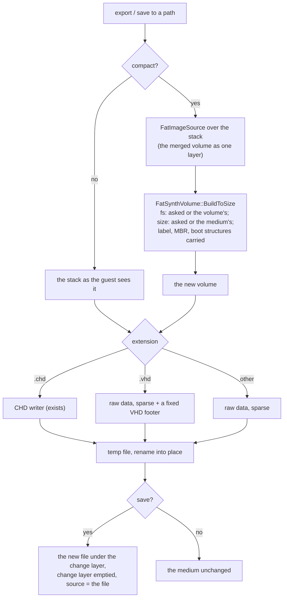

# C6 — flat images (S1), change attribution, session delta (S2)

**Status:** design, 2026-10-05. Phase C6 of [tdd.md](../tdd.md) §13 (§9, §10 there), strategies S1 and S2 of
[flatten-strategies.md](../flatten-strategies.md) (its decision trees DT-8, DT-9, DT-13 apply as written). Exit:
ACC-C3 (attribution), ACC-C6, ACC-C7. The phase lands in three commits:

| Part | Scope | Acceptance |
|---|---|---|
| **C6a** | S1: a fixed VHD writer, sparse raw writing, `compact` (re-synthesize the merged volume) on `export` and `save` | ACC-C6 |
| **C6b** | Provenance (`IComposedLayout` on `FatSynthVolume` / `GraftVolume`), `ChangeAttributor`, `media changes` on every surface | ACC-C3 attribution |
| **C6c** | S2: the session delta file (save, restore on insert per DT-13), DT-9 for composites | ACC-C7 |

## 1. What exists already

`export <slot> <path>` writes any block medium as the guest sees it (`BlockFormats::Write`: raw or CHD by extension).
`save <slot> <path>` writes it, then puts the new file under the change layer and empties it ("save into `target`,
which it then stands for"). A composite has no image file of its own, so `save` without a path refuses. S1 is
therefore mostly there for composites; C6a adds what is missing.

## 2. C6a: S1

| Piece | Rule |
|---|---|
| **Sparse raw writing** | `ExportBlockDevice` seeks over all-zero sectors instead of writing them and sets the file's size at the end. Host file systems with sparse files store only the data; others store zeros, as before. Synthesized free space costs nothing to write. |
| **Fixed VHD** | `.vhd` targets get a 512-byte footer after the data: cookie `conectix`, features 2, version 1.0, data offset `0xFFFFFFFFFFFFFFFF`, timestamp 0 (deterministic), creator `ung `, creator OS `Wi2k`, original and current size, CHS from the device's `NativeGeometry()` or the VHD specification's algorithm, disk type 2 (fixed), checksum, UUID from the content id. `HddImageFormats::Probe` already reads such files as `vhd`. |
| **Compact** | Any FAT block medium, composite or not: the merged volume through `FatImageSource` becomes the single layer of a new `FatSynthVolume`. Every file is contiguous; deleted data and lost clusters are gone. Options: `fs` (fat16 / fat32: converts), `size` (bytes; default: the medium's size, or the content plus the medium's free room when that does not fit). The label, the MBR and the boot structures of the merged volume are carried (D-6, best effort). |
| **`FatSynthVolume::BuildToSize`** | The fixed-size convergence the factory uses for `target.size`, moved into `FatSynthVolume` so the factory and compact share it. |
| **`FatBootPlan::FromVolume`** | The boot-structure carry from a FAT volume, moved out of the factory for the same reason. |
| **Surfaces** | `export` and `save` take `compact`, `fs`, `size`; CLI, WebAPI (body or query), MCP, Lua and Python pass them through `MediaControl` as for the other options. |

## 3. C6b: provenance and attribution

- **`IComposedLayout`**, implemented by `FatSynthVolume` and `GraftVolume`: `OwnerOf(lba)` → `SectorOwner` (kind:
  partition table, volume header, FAT, directory, file data, free, base, patch; the union node and layer; the offset).
  Answered from the run tables the read path already has: O(log n), nothing stored per sector.
- **`ProvenanceMap::ForEachChanged`**: the owners of the change layer's sectors in LBA order (a merge walk).
- **`ChangeAttributor::Attribute`** (DT-8): re-read the merged volume with `FatVolumeReader` only in the directories
  the evidence names (the parents of changed file data, changed directories, and the FAT's chains), compare with
  T0 (the union tree), and emit `FileChange`s: create, modify, delete, rename (same first cluster and size),
  mkdir, rmdir, attributes. The owner layer of each comes from T0. Lost clusters and cross-links are warnings.
- **`media changes <slot>`**: the change set as a reply (`changes`: op, path, oldPath, layer, sizes; `warnings`), on
  every surface. Nothing is written.

## 4. C6c: S2

- **Delta file** `<descriptor>.delta` (or `writes.delta`): header (magic `UNGDELTA`, version 1, the composite's
  content id, sector count, run count), then runs `(lba, count)` with their sectors, compressed per 1 MiB chunk
  with zstd (the codec the CHD code already links). Written to a temp file and renamed.
- **Save:** `save <slot>` on a dirty composite without a path runs DT-9: an explicit `strategy` (`flat` needs a
  path; `delta`), else `writes.save`, else S2. `save --strategy flat <path>` is the existing save to a path.
- **Restore on insert** (DT-13): after the composite is built, a delta whose content id and sector count match is
  loaded into the change layer ("session restored"); a damaged one is renamed `*.delta.bad`; one built over other
  sources is left alone and the report names the layers whose identities differ.

## 5. Tests

| Part | Test | Checks |
|---|---|---|
| C6a | `BlockFormats_Test.VhdFixedFooter` | footer fields and checksum; `Probe` → `vhd`; reopened, the same sectors |
| C6a | `BlockFormats_Test.SparseRawExport` | zero sectors not written (allocated size well under the file size where the host reports it); content equal |
| C6a | `FlattenFlat_Test.ImgVhdChdEqualMergedView` | a composite with guest writes exported to `.img`, `.vhd`, `.chd`: every sector equal to the live stack |
| C6a | `FlattenFlat_Test.CompactDefragmentsAndOracleAgrees` | a fragmented FAT image compacted: every file one extent, the same tree and bytes; `fs: fat32` converts |
| C6a | `FlattenFlat_Test.SaveCompactRebasesTheMedium` | `save` with `compact`: the slot reads the new file, the change layer is empty |
| C6a | ACC-C6 `SprinterBoot_Test.ComposeFlatImageBootsAlone` | the ACC-C3 session (graft + guest `mkdir`) exported to `.img` and `.vhd`; each boots DSS alone and shows the folder and the new directory |
| C6b | `ProvenanceMap_Test.EveryRegionKind` / `.ForEachChangedMergeWalk` | owners per region, rebuild and graft; the walk equals per-LBA calls |
| C6b | `ChangeAttributor_Test.*` | create, modify, append, truncate, delete, rename, move, mkdir, rmdir: one `FileChange` each with the right layer; an ISO layer's file; lost clusters warned; untouched subtrees not read |
| C6b | ACC-C3 `SprinterBoot_Test.ComposeDssGuestWriteAttributed` | the guest's `mkdir` and a file it writes show in `media changes` |
| C6c | `ComposeDelta_Test.RoundTrip` / `.IdMismatchRefusedWithReason` / `.TruncatedFileRefused` | S2 |
| C6c | ACC-C7 `ComposeAcceptance_Test.DeltaSurvivesRestart` | a new emulator, the same descriptor: the guest reads its earlier write; a changed source refuses the delta with the layer named |
