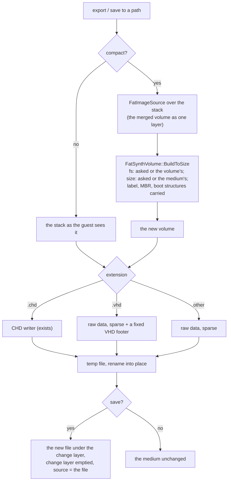

# C6 — flat images (S1), change attribution, session delta (S2)

**Status:** C6a built 2026-10-05, C6b 2026-10-06 (as-built notes in §6, §7); C6c designed. Phase C6 of [tdd.md](../tdd.md) §13 (§9, §10 there), strategies S1 and S2 of
[flatten-strategies.md](../flatten-strategies.md) (its decision trees DT-8, DT-9, DT-13 apply as written). Exit:
ACC-C3 (attribution), ACC-C6, ACC-C7. The phase lands in three commits:

| Part | Scope | Acceptance |
|---|---|---|
| **C6a** | S1: a fixed VHD writer, sparse raw writing, `compact` (re-synthesize the merged volume) on `export` and `save` | ACC-C6 |
| **C6b** | Provenance (`IComposedLayout` on `FatSynthVolume` / `GraftVolume`), `ChangeAttributor`, `media changes` on every surface | ACC-C3 attribution |
| **C6c** | S2: the session delta file (save, restore on insert per DT-13), DT-9 for composites | ACC-C7 |

## 1. What exists already

`export <slot> <path>` writes any block medium as the guest sees it (`BlockFormats::Write`: raw or CHD by extension).
`save <slot> <path>` writes it, then puts the new file under the change layer and empties it ("save into `target`,
which it then stands for"). A composite has no image file of its own, so `save` without a path refuses. S1 is
therefore mostly there for composites; C6a adds what is missing.

## 2. C6a: S1

| Piece | Rule |
|---|---|
| **Sparse raw writing** | `ExportBlockDevice` seeks over all-zero sectors instead of writing them and sets the file's size at the end. Host file systems with sparse files store only the data; others store zeros, as before. Synthesized free space costs nothing to write. |
| **Fixed VHD** | `.vhd` targets get a 512-byte footer after the data: cookie `conectix`, features 2, version 1.0, data offset `0xFFFFFFFFFFFFFFFF`, timestamp 0 (deterministic), creator `ung `, creator OS `Wi2k`, original and current size, CHS from the device's `NativeGeometry()` or the VHD specification's algorithm, disk type 2 (fixed), checksum, UUID from the content id. `HddImageFormats::Probe` already reads such files as `vhd`. |
| **Compact** | Any FAT block medium, composite or not: the merged volume through `FatImageSource` becomes the single layer of a new `FatSynthVolume`. Every file is contiguous; deleted data and lost clusters are gone. Options: `fs` (fat16 / fat32: converts), `size` (bytes; default: the medium's size, or the content plus the medium's free room when that does not fit). The label, the MBR and the boot structures of the merged volume are carried (D-6, best effort). |
| **`FatSynthVolume::BuildToSize`** | The fixed-size convergence the factory uses for `target.size`, moved into `FatSynthVolume` so the factory and compact share it. |
| **`FatBootPlan::FromVolume`** | The boot-structure carry from a FAT volume, moved out of the factory for the same reason. |
| **Surfaces** | `export` and `save` take `compact`, `fs`, `size`; CLI, WebAPI (body or query), MCP, Lua and Python pass them through `MediaControl` as for the other options. |

## 3. C6b: provenance and attribution

- **`IComposedLayout`**, implemented by `FatSynthVolume` and `GraftVolume`: `OwnerOf(lba)` → `SectorOwner` (kind:
  partition table, volume header, FAT, directory, file data, free, base, patch; the union node and layer; the offset).
  Answered from the run tables the read path already has: O(log n), nothing stored per sector.
- **`ProvenanceMap::ForEachChanged`**: the owners of the change layer's sectors in LBA order (a merge walk).
- **`ChangeAttributor::Attribute`** (DT-8): re-read the merged volume with `FatVolumeReader` only in the directories
  the evidence names (the parents of changed file data, changed directories, and the FAT's chains), compare with
  T0 (the union tree), and emit `FileChange`s: create, modify, delete, rename (same first cluster and size),
  mkdir, rmdir, attributes. The owner layer of each comes from T0. Lost clusters and cross-links are warnings.
- **`media changes <slot>`**: the change set as a reply (`changes`: op, path, oldPath, layer, sizes; `warnings`), on
  every surface. Nothing is written.

## 4. C6c: S2

- **Delta file** `<descriptor>.delta` (or `writes.delta`): header (magic `UNGDELTA`, version 1, the composite's
  content id, sector count, run count), then runs `(lba, count)` with their sectors, compressed per 1 MiB chunk
  with zstd (the codec the CHD code already links). Written to a temp file and renamed.
- **Save:** `save <slot>` on a dirty composite without a path runs DT-9: an explicit `strategy` (`flat` needs a
  path; `delta`), else `writes.save`, else S2. `save --strategy flat <path>` is the existing save to a path.
- **Restore on insert** (DT-13): after the composite is built, a delta whose content id and sector count match is
  loaded into the change layer ("session restored"); a damaged one is renamed `*.delta.bad`; one built over other
  sources is left alone and the report names the layers whose identities differ.

## 5. Tests

| Part | Test | Checks |
|---|---|---|
| C6a | `BlockFormats_Test.VhdFixedFooter` | footer fields and checksum; `Probe` → `vhd`; reopened, the same sectors |
| C6a | `BlockFormats_Test.SparseRawExport` | zero sectors not written (allocated size well under the file size where the host reports it); content equal |
| C6a | `FlattenFlat_Test.ImgVhdChdEqualMergedView` | a composite with guest writes exported to `.img`, `.vhd`, `.chd`: every sector equal to the live stack |
| C6a | `FlattenFlat_Test.CompactDefragmentsAndOracleAgrees` | a fragmented FAT image compacted: every file one extent, the same tree and bytes; `fs: fat32` converts |
| C6a | `FlattenFlat_Test.SaveCompactRebasesTheMedium` | `save` with `compact`: the slot reads the new file, the change layer is empty |
| C6a | ACC-C6 `SprinterBoot_Test.ComposeFlatImageBootsAlone` | the ACC-C3 session (graft + guest `mkdir`) exported to `.img` and `.vhd`; each boots DSS alone and shows the folder and the new directory |
| C6b | `ComposedLayout_Test.EveryRegionKindOfARebuild` / `.GraftOwners` / `.ForEachChangedOwnerInLbaOrder` | owners per region, rebuild and graft; the walk equals per-LBA calls |
| C6b | `ChangeAttributor_Test.*` | create, modify, append, truncate, delete, rename, move, mkdir, rmdir: one `FileChange` each with the right layer; an ISO layer's file; lost clusters warned; untouched subtrees not read |
| C6b | ACC-C3 `SprinterBoot_Test.ComposeDssGuestWriteAttributed` | the guest's `mkdir` (in the root and in a grafted folder) shows in `media changes` |
| C6c | `ComposeDelta_Test.RoundTrip` / `.IdMismatchRefusedWithReason` / `.TruncatedFileRefused` | S2 |
| C6c | ACC-C7 `ComposeAcceptance_Test.DeltaSurvivesRestart` | a new emulator, the same descriptor: the guest reads its earlier write; a changed source refuses the delta with the layer named |

## 6. As built: C6a

| Piece | Where | Notes |
|---|---|---|
| Sparse raw writing | `ExportBlockDevice` (`media/medium.cpp`) | An all-zero sector is skipped and the next written one is reached with a seek; `resize_file` gives the file its full size. Every raw, `.vhd` and compact export goes through it. |
| Fixed VHD | `BlockFormats::WriterFor` → `vhd`, `AppendVhdFooter` (`media/blockformats.cpp`) | The footer as in §2. CHS: the device's native geometry when it fits the footer's fields, else the VHD specification's algorithm. The UUID is mixed from the content id, the timestamp is 0, so the same disk gives the same file. A medium opened from a `.vhd` and saved in place keeps its footer (only sectors are written back). |
| `compact` | `BlockFormats::Compact` | The medium's stack is borrowed into a `SourcePool` (no-op deleter) and read by `FatImageSource`. The type is the volume's own unless `fs` is given; FAT12 is refused without `fs`, because `FatSynthVolume` writes FAT16 / FAT32 only. The volume start, so the MBR or not and the partition offset, and the label are kept. The size is `size`, else the medium's; when the medium's own size cannot hold the volume as the type asks (FAT32's minimum is 256 MiB with 4 KiB clusters), the smallest volume that fits is written and the report says so. An explicit `size` that is too small fails with `does-not-fit`. |
| Boot structures | `FatBootPlan::FromVolume` (moved from the factory), new field `gap` | The non-zero sectors between the MBR and the partition (up to LBA 2047) are now carried too: the DSS loader at LBA 1-3 is there. `FatSynthVolume` emits them for `lba < volumeStart`, and a gap sector at or past the new volume start is dropped with a report line. Rebuild composites over an image get the same carry. |
| `FatSynthVolume::BuildToSize` | moved from the factory | The factory's `target.size` path and compact share it. |
| Save | `BlockFormats::Save` | `compact` always writes a whole new file (never sectors in place) and needs a `path` (`MediaManager::SaveBlockMedium`); the medium is then rebased on that file as any save to a path. The report of the compact goes back with the save's result. |
| Surfaces | `MediaControl::OptionsFor` (`save`, `export`: `compact`, `fs`, `size`), `CompactOptions` | `fs` and `size` without `compact` are refused. MCP `media` takes the `compact` boolean (the `fs` and `size` fields exist already); OpenAPI documents `compact`; CLI help lists the options; Lua and Python go through `MediaControl`. |

Tests (all under 50 ms but the boot-bound one): `BlockFormats_Test.VhdFixedFooter`, `.SparseRawExport`;
`FlattenFlat_Test.ImgVhdChdEqualMergedView`, `.CompactDefragmentsAndOracleAgrees` (a FAT16 image whose two files
interleave cluster by cluster and with a deleted file's data left behind; compacted as FAT16 and as FAT32; a too
small `size`; a FAT12 floppy), `.SaveCompactRebasesTheMedium`; ACC-C6 `SprinterBoot_Test.ComposeFlatImageBootsAlone`
(the graft session with a guest `mkdir`, exported to `.img`, `.vhd` and a compact `.img`: each boots DSS 1.62 alone
and lists the grafted folder; ~7 s, four boots).

## 7. As built: C6b

| Piece | Where | Notes |
|---|---|---|
| `IComposedLayout`, `SectorOwner`, `SectorRole` | `compose/composedlayout.h` | Roles: partition table, boot area (the gap after the MBR), volume header, FAT, directory, file data, free. A directory or file sector names its union node, the node's layer, the byte offset in it and `dirCluster`, the first cluster of the directory that holds its entries (0: the root on every FAT type). The ChangeAttributor needs that cluster to know where to look. `ForEachChangedOwner` walks a change map in LBA order; one `OwnerOf` per changed sector costs O(log n), so no merge walk is needed. |
| `FatSynthVolume::OwnerOf` | `fat/fatsynthvolume.cpp` | From the existing run table, plus the tree node of each synthesized directory (`_directoryNodes`) and each directory node's first cluster. |
| `GraftVolume::OwnerOf` | `compose/graftvolume.cpp` | The builder records the clusters of every directory it walks (untouched base directories in `Walk`, touched and new ones after allocation). Grafted files come from the run table. A base file's sectors come from the union tree's extents on the base image (or its partition window): an index built at the first call that needs it. `patched` marks sectors re-encoded over the base. |
| `ChangeAttributor::Attribute` | `compose/changeattributor.{h,cpp}` | The evidence: header sectors become warnings (FAT32's FSInfo excluded: every DOS write updates it). A FAT change enables the lost-cluster check. A directory or file sector puts its directory into the scope; a free cluster adds nothing, because the entry that names it is in a changed directory. Each directory in scope is listed before and after the writes by its first cluster, and its path comes from the `..` chain, so only its ancestors are read. Entries are compared by name, ASCII case-insensitively. A file is modified when its size or first cluster changed or its chain holds a changed sector; only the read-only, hidden and system bits count for `attributes`. A delete and a create with the same first cluster, kind and size become a `rename`, which is also how a move between directories shows. A directory that disappears expands into `rmdir` and deletes of what it held; a new one into `mkdir` and creates. A directory present on only one side is left to its parent. Lost clusters are those allocated in the first FAT (FAT16 / FAT32; FAT12 is not checked) that no changed file or directory uses; a cluster used by two changed paths is reported as cross-linked. The layer of an entry is the `OwnerOf` of its first cluster before the writes; a new file, or an empty one, has none. |
| No layout | same | A medium that is not composite, or a composite saved and rebased onto a file, gets a full scan when any data or FAT sector changed: every directory of the medium before the writes is compared (`fullScan`), and no layers are reported. |
| `media changes <slot>` | `MediaControl::Changes`; CLI, MCP (`changes` action), WebAPI (`POST .../media/{slot}/changes`), Lua `media_changes`, Python `media_changes` | Block media with session writes; others are refused with the reason. The reply has `changes` (op, path, oldPath for a rename, layer name, sizeBefore, sizeAfter), `warnings`, `changedSectors`, `directoriesRead` and `fullScan`. The machine is parked while the volume is read. |

Tests: `ComposedLayout_Test` (3), `ChangeAttributor_Test` (7: nothing written; create / in-place modify / append /
truncate / delete with the folder, image and ISO layers named; rename, move, mkdir, rmdir, attributes; a moved
directory as one rename; lost clusters; the untouched subtrees not read (at most 4 listings for one write, against
20+ for the full scan); a graft), `MediaControl_Test.CompositeInsertLayersAndRescan` (the verb), ACC-C3
`SprinterBoot_Test.ComposeDssGuestWriteAttributed`. The guest in the unit tests is `core/tests/_helpers/fatguest.h`, a
writer that changes a FAT volume through its sectors the way DOS does. DSS 1.62 has no internal COPY and no output
redirection, so on the real machine the guest only makes directories, in the root and in a grafted folder.
