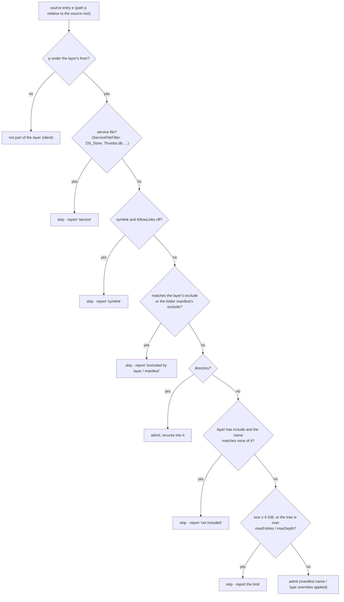
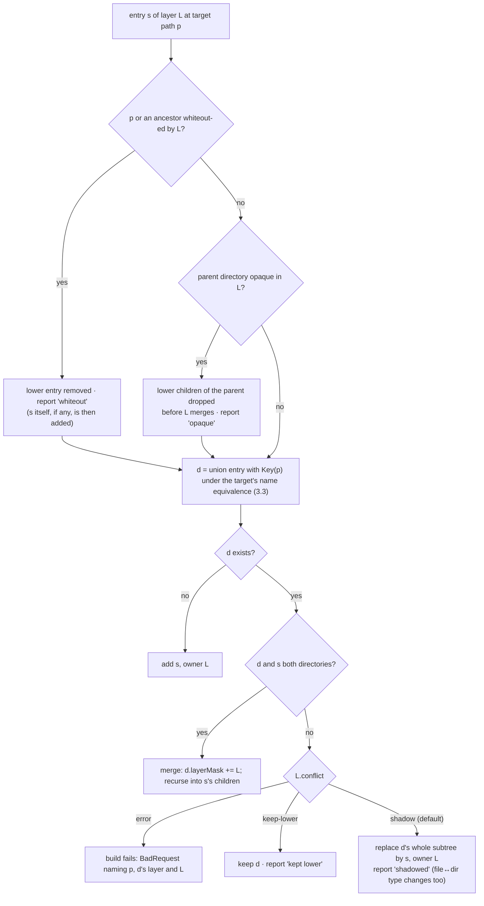
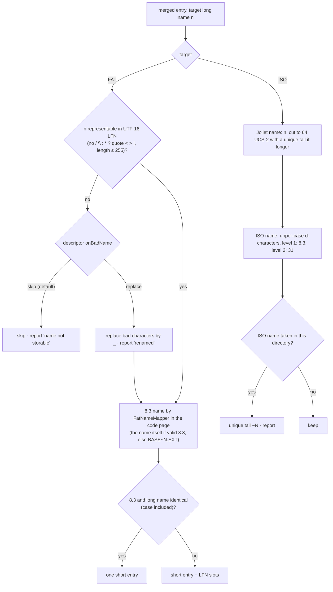
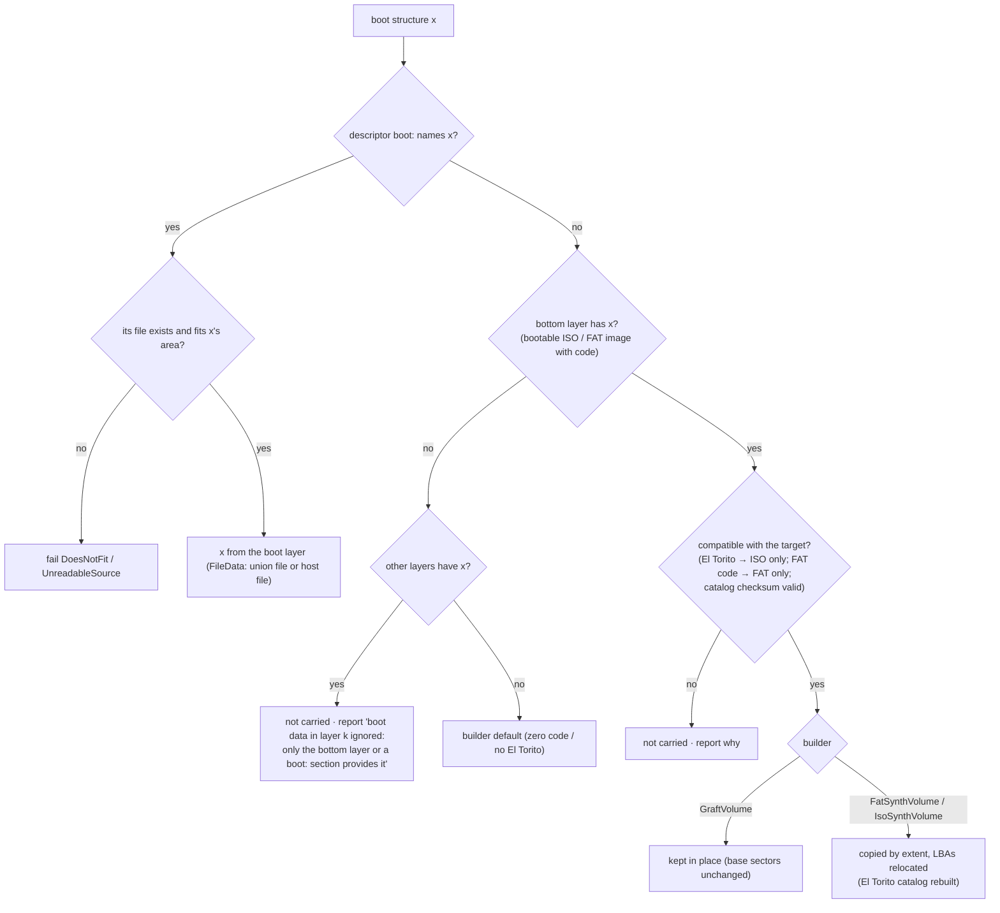
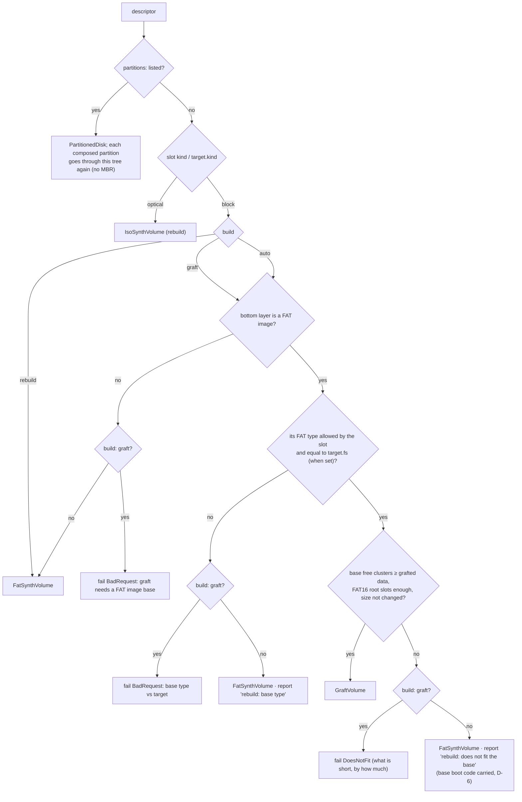

# Multi-source media — technical design

| | |
|---|---|
| **Date** | 2026-10-05 |
| **Status** | Draft for review |
| **Requirements** | [goals-and-requirements.md](goals-and-requirements.md) |
| **Architecture** | [architecture.md](architecture.md) |
| **Analyses** | [fs-compatibility.md](fs-compatibility.md), [flatten-strategies.md](flatten-strategies.md) |
| **Tests and benchmarks** | [test-and-benchmark-plan.md](test-and-benchmark-plan.md) |

## Contents

1. [Descriptor](#1-descriptor)
2. [Sources](#2-sources-ifiletreesource)
3. [Union tree](#3-union-tree)
4. [Extents and the read hot path](#4-extents-and-the-read-hot-path)
5. [FAT rebuild: `FatSynthVolume`](#5-fat-rebuild-fatsynthvolume)
6. [Graft: `GraftVolume`](#6-graft-graftvolume)
7. [ISO target: `IsoSynthVolume`](#7-iso-target-isosynthvolume)
8. [Partitions: `PartitionedDisk`](#8-partitions-partitioneddisk)
9. [Provenance and attribution](#9-provenance-and-attribution)
10. [Flatten implementation](#10-flatten-implementation)
11. [Media manager integration and surfaces](#11-media-manager-integration-and-surfaces)
12. [Memory budget](#12-memory-budget)
13. [Code placement](#13-code-placement)
14. [Phases](#14-phases)
15. [Risks](#15-risks)

---

## 1. Descriptor

### 1.1 Schema (version 1)

```yaml
# games.ucompose.yaml - every key optional unless marked (required)
version: 1                      # (required)
target:
  kind: block                   # block | optical          (default: the slot's kind)
  fs: auto                      # auto | fat16 | fat32 | iso9660
  build: auto                   # auto | rebuild | graft
  size: 2GiB                    # total volume; omitted = content + free
  free: 256MiB                  # room for guest writes (rebuild; costs nothing, never stored)
  label: GAMES
  codepage: cp866               # cp866 | cp1251 (FAT short names)
  onBadName: skip               # skip | replace: a name the target cannot store (DT-3)
  partition: mbr                # mbr | none   (none = "superfloppy")
  iso: {level: 1, joliet: true} # optical only
  fixedTime: 2026-01-01T00:00:00Z  # tests / reproducible builds: every timestamp this value
layers:                         # bottom first
  - name: base                  # unique; default "layer<N>"
    source: {image: ../sd/nedoos.img, partition: 1, codepage: cp866}
  - name: builds
    source: {folder: ~/work/out}
    mount: /BIN                 # where the layer's root lands (default /)
    from: /                     # subfolder of the source (default /)
    include: ["*.com", "*.$c"]  # wildcards on file names, case-insensitive
    exclude: ["*.bak"]
    order: {/: [boot.$c]}       # per-directory entry order (target paths)
    conflict: shadow            # shadow | keep-lower | error
    opaque: [/BIN/OLD]          # upper directory hides the lower one's contents
    whiteout: [/BIN/broken.com] # hide lower entries
    writable: true              # S4 may write here
    onDelete: keep              # S4: keep | trash | move | delete | ignore (D-4)
    deletedFolder: .deleted     # onDelete: move - relative to the descriptor; <date>/<layer>/<path> inside
  - name: demos
    source: {iso: ~/zx/demos.iso}
    from: /DEMOS
    mount: /DEMOS
boot:                           # boot layer (D-6): wins over the bottom source's boot structures
  eltorito:                     # optical targets
    - {image: /BOOT/boot.img, emulation: floppy, platform: x86}   # target path (a union file) or {host: path}
    - {image: {host: ./efi.img}, emulation: none, loadSegment: 0x07C0, sectors: 4}
  mbrCode: {host: ./mbr.bin}    # FAT targets: bytes 0-445 of LBA 0
  volumeCode: {host: ./vbr.bin} # boot code area of the volume boot sector; BPB fields stay the builder's
  reserved:                     # whole reserved sectors after the boot sector
    - {lba: 1, file: {host: ./dssboot.bin}}   # e.g. the DSS loader at LBA 1-3 (relative to the volume)
writes:
  access: session               # readonly | session
  save: delta                   # save policy for automation (D-7): flat (S1) | delta (S2) | commit (S3) | write-back (S4); the GUI asks, with this preselected
  upper: builds                 # S4 copy-up target (default: topmost writable layer)
  delta: games.ucompose.delta   # S2 file (default: <descriptor>.delta)
```

Partitions variant (`layers` and `partitions` are mutually exclusive):

```yaml
version: 1
target: {kind: block, partition: mbr, size: 4GiB}
partitions:
  - {source: {image: dos.img, partition: 1}}            # passthrough; type from the source
  - {fs: fat32, compose: {layers: [{source: {folder: ./data}}]}, size: 1GiB}
  - {fs: fat16, compose: {build: graft, layers: [
        {source: {image: tools.img}}, {source: {folder: ./tools-new}}]}}
```

### 1.2 Normalization rules

| Rule | Detail |
|---|---|
| Sizes | `512`, `64KiB`, `2GiB`, `1.44MB` (decimal); rounded up to whole sectors |
| Paths | relative to the descriptor's folder; `~` → home; stored canonical (`weakly_canonical`) for `SourcePool` dedup and `ContentId`; target paths `/`-separated, `.`/`..` resolved, trailing `/` dropped |
| Wildcards | `*`, `?`, `[...]`; matched on the **source** name (before conversion), case-insensitively |
| Defaults | filled into the normalized form; the normalized form (sorted keys, canonical numbers) is what `ContentId` hashes, so formatting differences never change the id |
| Errors | unknown keys and bad values → `report` (never abort, NFR-S5); a missing `version`, an empty `layers`, both `layers` and `partitions`, or an unknown source kind → `BadRequest` |

### 1.3 API

```cpp
struct ComposeSource
{
    enum class Kind : uint8_t { Folder, Image, Iso };
    Kind kind = Kind::Folder;
    std::filesystem::path path;
    std::optional<uint32_t> partition;  ///< Image: 1-based MBR partition; none = superfloppy or the first FAT partition
    std::optional<CodePage> codePage;   ///< Image: short names of the source
};

struct ComposeLayer
{
    std::string name;
    ComposeSource source;
    std::string mount = "/";
    std::string from = "/";
    std::vector<std::string> include, exclude, opaque, whiteout;
    std::map<std::string, std::vector<std::string>> order;
    ConflictPolicy conflict = ConflictPolicy::Shadow;
    bool writable = false;
    DeletePolicy onDelete = DeletePolicy::Keep;   ///< Keep, Trash, Move, Delete, Ignore
    std::filesystem::path deletedFolder;          ///< Move: default <descriptor dir>/.deleted
};

struct ComposeDescriptor
{
    ComposeTarget target;                 ///< kind, fs, build, size, free, label, codepage, partition, iso, fixedTime
    std::vector<ComposeLayer> layers;
    std::vector<ComposePartition> partitions;
    ComposeWrites writes;
    std::filesystem::path file;           ///< empty for an inline descriptor
    std::vector<std::string> report;

    static ComposeDescriptor Load(const std::filesystem::path& file);
    static ComposeDescriptor Parse(const std::string& text, const std::filesystem::path& baseDir,
                                   const std::string& sourceName);
    std::string Normalized() const;       ///< canonical JSON: ContentId input, `media layers` output
};
```

Parsing uses `rapidyaml` with the throwing error handler, as `FolderManifest` does. JSON is parsed
by the same code (rapidyaml reads JSON).

## 2. Sources: `IFileTreeSource`

```cpp
/// Where a file's bytes are, in its source
struct FileData
{
    enum class Storage : uint8_t { Zero, HostFile, DeviceExtents };
    Storage storage = Storage::Zero;
    uint16_t source = 0;        ///< SourcePool index
    uint32_t firstExtent = 0;   ///< DeviceExtents: into the tree's extent table
    uint32_t extentCount = 0;
    uint32_t hostFile = 0;      ///< HostFile: into the pool's host-file table
    uint64_t bytes = 0;
};

/// A run of whole sectors of a source device holding consecutive bytes of a file
struct Extent
{
    uint64_t sourceLba;         ///< 512-byte sector on the source device
    uint32_t sectors;
    uint32_t fileSectorStart;   ///< the file's sector index at the start of this extent
};
static_assert(sizeof(Extent) == 16);

struct SourceEntry              ///< one node of a source tree (flat array, children contiguous)
{
    uint32_t name;              ///< NamePool offset (UTF-8)
    uint32_t firstChild = 0, childCount = 0;
    bool isDirectory = false;
    uint8_t attributes = 0;     ///< FAT bits; ISO hidden → 0x02
    int64_t mtimeUtc = 0;
    FileData data;
};

class IFileTreeSource
{
public:
    virtual ~IFileTreeSource() = default;
    /// The tree under `from` (source path), filtered. Built once, on demand
    virtual bool Enumerate(const std::string& from, const SourceFilter& filter, SourceTree& out,
                           std::string* error) = 0;
    /// Identity for ContentId: equal = same bytes
    virtual uint64_t Identity() const = 0;
    virtual std::string Describe() const = 0;
};
```

| Implementation | Enumerate | Extents | Identity |
|---|---|---|---|
| `HostFolderSource` | `FolderSnapshot::Scan` (cancel and progress forwarded), then the manifest (`FolderManifest`), then the filters | `HostFile`: path index into the pool's table; offset = file offset | `FolderSnapshot::Identity()` |
| `FatImageSource` | `FatVolumeReader::List` recursively from `from` | `FatVolumeReader::ChainExtents(firstCluster, size)` (new): walk the chain, coalesce adjacent clusters, convert to source LBAs (volume start + data start + (cluster − 2) × spc) | device `ContentId()` ⊕ partition index |
| `IsoImageSource` | `Iso9660Reader` (new): PVD → Joliet SVD if present → directory records | one extent per file section (multi-extent files: several); source LBA = block × 4 | device `ContentId()` |

**`Iso9660Reader`** is a new production class (the source side). It is written from ECMA-119
independently of `IsoSynthVolume` (the target side), so each can be tested with the other, as
`FatVolumeReader` and `HostFolderFat` are today.

**Image partitions.** `FatImageSource` opens `SubRangeDevice(device, start, count)` for an MBR
partition (types `#01 #04 #06 #0B #0C #0E`). It reuses the partition logic `FatVolumeReader::Open`
has today (MBR or superfloppy), extended to pick partition *n*.

**`SourcePool`** keys sources by `(kind, canonical path, partition, codepage)`. It owns:
- the opened devices (through `HddImageFormats::OpenBlock` or `CdImageFormats`, always
  **read-only**, except a graft base opened for S3),
- the host-file table (paths) and the shared LRU of open host streams (`kMaxOpenFiles`, NFR-M4),
- the name pool.

## 3. Union tree

### 3.1 Node layout

```cpp
struct UnionNode
{
    uint32_t parent;
    uint32_t firstChild;     ///< children contiguous after the final sort
    uint32_t childCount;
    uint32_t sourceName;     ///< NamePool: original UTF-8 name (reports, S4)
    uint32_t targetName;     ///< NamePool: target long name (LFN / Joliet)
    uint32_t shortName;      ///< NamePool: 8.3 / ISO L1 name, filled by the target builder
    uint32_t fileData;       ///< index into data table; ~0u for directories
    uint16_t layer;          ///< layer that provided this node (top-most for a merged dir)
    uint16_t layerMask;      ///< merged directories: bit per contributing layer (first 16; overflow flag)
    uint8_t  attributes;
    uint8_t  flags;          ///< Directory, Opaque, Shadowed-something (report), Renamed
    int64_t  mtimeUtc;
    uint64_t size;
};   // 56 bytes + padding → 64
```

### 3.2 Merge algorithm


**Decision tree DT-1: is a source entry admitted into its layer?** Applied once per entry while
the source is enumerated, before any merge.



Include patterns filter files only; directories are always walked, and a directory left empty by
the filters is kept (the guest sees the mount structure).

```
UnionBuilder::Merge(layers, rules):
  tree ← empty root
  for layer L in bottom → top:
      src ← SourceTree of L (already filtered, under L.from)
      anchor ← EnsurePath(tree, L.mount)        # creates missing dirs, owned by L
      for each whiteout w of L: Remove(tree, w)  # recorded in report
      MergeDir(anchor, src.root, L)

MergeDir(dst, srcDir, L):
  if srcDir is opaque in L: drop all children of dst (report)
  index ← hash map: Key(child) → child, for dst's children      # built lazily, freed after
  for s in srcDir.children:
      k ← Key(s.name)                                           # target equivalence (3.3)
      d ← index[k]
      if d == none:            add copy of s (owner L)
      elif d.dir and s.dir:    d.layerMask |= L; MergeDir(d, s, L)
      elif L.conflict == error: fail(BadRequest, path)
      elif L.conflict == keep-lower: report(kept lower)
      else:                    replace subtree d by s (owner L); report(shadowed d by L)
```

Cost: O(total source entries) hash operations plus one sort per directory at the end
(O(n log n) total). Memory: the per-directory hash index is built only while that directory
merges, so the peak is the largest single directory.

**Decision tree DT-2: one entry of layer L meets the union.** This is `MergeDir`'s inner step, the
merge policy of FR-10…FR-13.




### 3.3 Name equivalence

| Target | `Key(name)` | Notes |
|---|---|---|
| FAT | Unicode simple upper-case of the long name after the LFN normalization `FatNameMapper` applies (trailing dots and spaces stripped) | FAT matches long names case-insensitively, so `Readme.txt` ≡ `README.TXT` |
| ISO | the Joliet name as is (case-sensitive), and separately the ISO L1 key (upper, d-chars) checked for collisions **after** merge | Joliet keeps both `a.txt` and `A.TXT`; the L1 names get unique tails |

8.3 names are assigned per final directory by the target builder (`FatNameMapper::MapFolder` on
the merged children), never during the merge. Generated names are unique within the directory,
whatever layer each entry came from.

**Decision tree DT-3: an entry's name on the target** (FR-21), per final directory after the merge.




### 3.4 Ordering

Within each directory: the layer's `order` list for that target path (the topmost layer that names
the directory wins), then directories, then files, each byte-wise by **target** long name. This is
the same rule as `FolderSnapshot` and keeps NFR-S1.

## 4. Extents and the read hot path

### 4.1 `ExtentReader`

```cpp
/// Shared by FatSynthVolume, GraftVolume and IsoSynthVolume: read sector `fileSector` of a file
/// into dst (512 bytes). Zero-pads past EOF. Zero heap allocations
class ExtentReader
{
public:
    bool ReadFileSector(const FileData& data, uint64_t fileSector, uint8_t* dst);
private:
    const Extent* FindExtent(const FileData& data, uint64_t fileSector);   // last-hit, else binary search
    SourcePool* _pool;
    const Extent* _extents;            // tree's table
    struct { const FileData* data; uint32_t extent; } _lastHit{};
};
```

```
ReadFileSector(data, s, dst):
  if s * 512 >= data.bytes:            memset(dst, 0, 512); return true
  switch data.storage:
    Zero:          memset(dst, 0, 512)
    HostFile:      pool.ReadHost(data.hostFile, s * 512, dst, min(512, bytes - s*512)); zero tail
    DeviceExtents: e ← FindExtent(data, s)            # O(1) for sequential, O(log k) otherwise
                   pool.Device(data.source).ReadSector(e.sourceLba + (s - e.fileSectorStart), dst)
                   zero the tail if this is the file's last sector (slack, fs-compatibility §4)
```

One read call per target sector, straight into `dst`: **zero intermediate copies** (NFR-P3).
`ReadHost` uses the existing LRU-of-streams logic from `HostFolderFat`, moved into `SourcePool`.

### 4.2 Run table (target side)

Unchanged from `HostFolderFat`: `std::vector<Run>` sorted by `firstCluster`, `upper_bound`, plus a
new **last-hit run** cache for sequential reads. A run is a file or a directory laid out
contiguously in the target. The run → `FileData` → extent indirection adds one indexed load on top
of today's path. NFR-P1 allows 10% for that; the benchmark decides.

### 4.3 Optional bulk read (phase C9, A/B gated)

```cpp
// IBlockDevice
virtual bool ReadSectors(uint64_t lba, uint32_t count, uint8_t* dst)
{
    for (uint32_t i = 0; i < count; ++i)
        if (!ReadSector(lba + i, dst + i * kSectorSize)) return false;
    return true;
}
```

`RawImage` overrides it with one `read` call. The composite overrides it by splitting at run and
extent boundaries and forwarding each piece as one `ReadSectors` to the source. `SessionWriteMap`
splits around changed sectors. Callers: ATA READ MULTIPLE / DMA, SD CMD18, ATAPI READ (10). It only
lands if the A/B shows a gain on bulk reads and no loss on single-sector reads (NFR-P7).

## 5. FAT rebuild: `FatSynthVolume`

`HostFolderFat` today = folder scan + layout + per-sector synthesis. The split:

| Piece | From | To |
|---|---|---|
| Folder scan | `HostFolderFat::Build` | `HostFolderSource` |
| Names (`FatNameMapper`) | per folder at build | per merged directory at build (same calls) |
| Layout (cluster size choice, FAT sizes, runs, directories bytes) | `HostFolderFat::Build` | `FatSynthVolume::Build(const UnionTree&, const FatVolumeOptions&)` |
| Boot sector / FSInfo / MBR / FAT sector formulas | `HostFolderFat` | `FatSynthVolume` (code moved, unchanged) |
| File data | `ReadFile` (host stream) | `ExtentReader` |
| `HostFolderFat` | — | a factory: one `HostFolderSource` layer → `UnionBuilder` → `FatSynthVolume`; same public API (`Build`, `Type`, `ClusterCount`, `Warnings`) |

**Parity gate (FR-34):** before any composite feature lands, the refactored `HostFolderFat` must
produce byte-identical images for every case in `hostfolderfat_test.cpp` plus a corpus test (hash
of every sector of 12 generated folders: FAT16/32, MBR and superfloppy, CP866/CP1251, deep trees,
4 GiB − 1 sparse file, 65 535 entries). The hashes are recorded from master **before** the
refactor.

Boot structures (D-6): `BootPlan` collects, in priority order, the descriptor's `boot` section and the bottom FAT image's boot code (MBR bytes 0-445, the volume boot sector's code area, and reserved sectors 1…reserved−1 that are not FSInfo or backup boot). `FatSynthVolume` reserves enough sectors for them and serves them from their `FileData` (a small slab when read from a file, an extent when from the base). Boot code larger than its area fails with `DoesNotFit`. `GraftVolume` keeps the base's own boot sectors, and a `boot` section patches them through the patch map.

**Decision tree DT-5: where each boot structure comes from (D-6).** Run per structure: El Torito
entry list (optical), MBR code, volume boot code, each reserved boot sector (block).




Layout additions over today:
- `size` (fixed total) as well as `free`.
- Root directory sized for the merged root (FAT16: rounded up to whole sectors; ≥ 512 entries for
  compatibility).
- Volume label from the descriptor or the bottom layer.

## 6. Graft: `GraftVolume`

### 6.1 Build

```
GraftVolume::Build(base: FatImageSource, upperTree: UnionTree diff vs base):
  r   ← FatVolumeReader on base (partition)
  free← r.ScanFree()                         # bitmap, 1 bit per cluster; O(FAT sectors) read once
  ops ← diff(base tree, union tree)          # adds, replaces, whiteouts; only touched dirs listed
  for each replaced / whited-out base file f:  free.Release(chain(f))   # FAT entries zeroed in patch
  for each added / replacing file a (largest first):
      run ← free.AllocateContiguous(clusters(a)) or AllocateFragmented(...)   # best-fit
      graftRuns.push({run, a.fileData}); patch FAT chain for run
  for each touched directory d:
      entries ← base entries(d) − removed + added (8.3 names unique against existing ones)
      if FAT16 root and slots > rootEntries: fail DoesNotFit("root full", fallback = rebuild)
      clusters ← existing chain of d, + free.Allocate(extra) if it grew
      patch every sector of d's clusters (full re-encode of that directory)
  patch FSInfo free count / next free (FAT32)
  sort patch LBAs; sort graftRuns
```

Patch storage: `std::vector<uint64_t> patchLba` (sorted) + `std::unique_ptr<uint8_t[]> patchData`
(512 × n), read-only after the build. FAT patches cover only the FAT sectors whose entries changed,
in both FAT copies.

### 6.2 Read

```
ReadSector(lba, dst):
  i ← lower_bound(patchLba, lba);  if hit: memcpy(dst, patchData + i*512); return
  if lba in data region:
      c ← cluster(lba); r ← graftRuns.find(c)          # last-hit, then binary search
      if r: return extentReader.ReadFileSector(r.fileData, fileSector(c, lba), dst)
  return base.ReadSector(lba, dst)
```

### 6.3 Why graft is the default for image bases

- **Layout preserved:** boot sector, system files and any sector a loader hard-codes stay where
  they were.
- **Build cost independent of base size** (NFR-P6): only the touched directories are re-encoded.
- **S3 commit** writes exactly the patch + graft runs + guest changes.
- **Cost of a fallback:** if the free space is short or a FAT16 root is full, `auto` rebuilds. The
  report says so, because a rebuild moves every file.

**Decision tree DT-4: which target builder (`build`, FR-30…FR-33).**




## 7. ISO target: `IsoSynthVolume`

| Block | Contents |
|---|---|
| 0–15 | system area, zero |
| 16 | Primary Volume Descriptor (ISO L1/L2 names) |
| 17 | Boot Record (`EL TORITO SPECIFICATION`, pointer to the boot catalog) when the bottom ISO layer is bootable (D-6); the following descriptors move up by one |
| 17 / 18 | Supplementary Volume Descriptor (Joliet, escape `%/E`) when `joliet: true` |
| 18 / 19 | Volume Descriptor Set Terminator |
| 19… | path tables: L and M for the PVD, L and M for Joliet |
| … | directory extents (PVD tree), directory extents (Joliet tree) |
| … | boot catalog (one block, synthesized: validation entry with checksum, initial / default entry, section headers and entries copied from the source with the new image LBAs) |
| … | boot images (extents into the source ISO; a boot image that is also a visible file shares its extent) |
| … | file extents, contiguous, in directory order; shared by both trees (same extent LBA) |

- Implements `cd::IFrameSource` (`StoredFormat::Cooked2048`). `CdImage` is constructed over it
  with one data track, so READ TOC, READ (10), READ CD and the `IBlockDevice` view all work
  unchanged.
- File-data reads: block *b* of a file → four 512-byte `ExtentReader` reads into the frame buffer
  `CdImage` passes, or one 2048-byte read from an ISO source (`IFrameSource::Read` of that source).
- Directory records, path tables and descriptors are generated at build time (small).
- `level: 1` names: 8.3 d-chars. `level: 2`: 31 chars. Depth > 8 fails with `DoesNotFit` (option
  `relaxDepth: true` for Joliet-only readers).
- Files ≥ 4 GiB: Level 3 multi-extent, written as several directory records (rare; tested).
- El Torito (D-6): `Iso9660Reader` parses the source's boot record and catalog into `BootEntry {platform, emulation, loadSegment, systemType, sectorCount, FileData image}`. A `boot.eltorito` list from the descriptor adds or replaces entries; its images are `FileData` too (a union file's data, or a host file in the `SourcePool`), so they are never copied. The writer emits the merged list with the new image LBAs. Hard-disk emulation images and multi-section catalogs are carried the same way. A catalog that fails its checksum is reported and not carried. The Boot Record is emitted whenever the merged list is non-empty.
- Dates: the PVD's creation date is `fixedTime` or the newest mtime in the tree, so a rebuild with
  the same sources gives the same bytes.

## 8. Partitions: `PartitionedDisk`

```cpp
class PartitionedDisk : public IBlockDevice
{
public:
    struct Part { uint64_t start, sectors; uint8_t type; std::shared_ptr<IBlockDevice> device; };
    static std::unique_ptr<PartitionedDisk> Build(std::vector<Part> parts, uint64_t totalSectors,
                                                  std::string* error);
    bool ReadSector(uint64_t lba, uint8_t* dst) override;    // table | child | zero
    bool WriteSector(uint64_t lba, const uint8_t* src) override; // child only; table/gap → false
    ...
private:
    std::vector<Part> _parts;            // sorted by start, 1 MiB aligned
    std::vector<uint64_t> _ebrLba;       // logical partitions beyond 4
};
```

- Up to 4 primary partitions. Beyond 4: partitions 4… become logical in an extended partition
  (type `#0F`) with an EBR chain, synthesized like the MBR.
- Types: FAT16 `#06` (`#04` below 32 MiB, `#0E` when it extends beyond CHS reach), FAT32 `#0C`
  (`#0B` when it fits CHS), passthrough keeps the source's type byte.
- A composed child is built with `partition: none` (superfloppy at its own LBA 0).
- `SubRangeDevice(base, first, count)` is a small new `IBlockDevice` for passthrough partitions
  (bounds-checked offset).

## 9. Provenance and attribution

```cpp
struct SectorOwner
{
    enum class Kind : uint8_t { PartitionTable, VolumeHeader, Fat, Directory, FileData, Free, Base, Patch };
    Kind kind;
    uint16_t partition;       ///< 0 when not partitioned
    uint32_t node;            ///< UnionNode (Directory, FileData)
    uint16_t layer;
    uint64_t offset;          ///< FileData: byte offset in the file; Base: base LBA
};

class ProvenanceMap
{
public:
    explicit ProvenanceMap(const IComposedLayout& layout);   // FatSynthVolume / GraftVolume / PartitionedDisk
    SectorOwner Owner(uint64_t lba) const;
    template <typename F> void ForEachChanged(const SessionWriteMap& changes, F&& visit) const; // merge walk
};

struct FileChange
{
    enum class Op : uint8_t { Create, Modify, Delete, Rename, Mkdir, Rmdir, Attributes };
    Op op;
    std::string path, oldPath;
    uint16_t layer;              ///< owner in T0 (Modify/Delete/Rename), ~0 for Create
    uint64_t oldSize, newSize;
    std::vector<std::pair<uint64_t, uint32_t>> sectors;  ///< changed ranges (target LBAs)
};

struct ChangeSet { std::vector<FileChange> changes; std::vector<std::string> warnings; };

class ChangeAttributor
{
public:
    static ChangeSet Attribute(IBlockDevice& merged, const UnionTree& t0, const ProvenanceMap& map,
                               const SessionWriteMap& changes);
};
```

`IComposedLayout` is a small read-only interface each target implements (`OwnerOf(lba)`, `Node`
lookups), so `ProvenanceMap` needs no knowledge of the target type. Attribution follows
[flatten-strategies.md](flatten-strategies.md) §2. Only directories named by the evidence and
their ancestors are re-read through `FatVolumeReader`.

## 10. Flatten implementation

| Strategy | Code |
|---|---|
| S1 flat | `BlockFormats::Write(stack, path)` (exists) + new `VhdFixedWriter` (footer: cookie `conectix`, features 2, version 1.0, data offset `0xFFFFFFFFFFFFFFFF`, original/current size, CHS from `NativeGeometry()` or the VHD algorithm, disk type 2, checksum, UUID derived from `ContentId` for determinism) |
| S1 compact | `FatImageSource` over the merged stack → one-layer `UnionTree` → `FatSynthVolume` (options from the flags) → `BlockFormats::Write` |
| S2 delta | `ComposeDelta::Save(changes, contentId, path)` / `Load(path, expectedId)`: header + zstd chunks; temp + rename |
| S3 commit | `GraftCommit::Plan` → `Journal::Write` → apply → `Journal::Remove`; recovery on open |
| S4 write-back | `FlattenPlanner::Plan(ChangeSet, descriptor, snapshots)` → `WriteBackExecutor` (stage, check, rename, journal) → descriptor update via `ComposeDescriptor::Save`. Deletes go through `HostDeleter` per `onDelete`: `Trash` uses the platform trash (Windows `IFileOperation` with `FOFX_RECYCLEONDELETE`, macOS `NSFileManager trashItemAtURL` in an Objective-C++ unit, Linux / BSD the freedesktop.org Trash spec: `$XDG_DATA_HOME/Trash/files` + `.trashinfo`, `$topdir/.Trash-$uid` on other volumes); a trash that cannot be reached makes that operation fail in the **plan**, never a silent fallback to `delete`. `Move` renames into `<deletedFolder>/<UTC date-time>/<layer>/<path>` (copy + remove across volumes). |

Every whole-file write goes through temp + rename, as `BlockFormats` already does.

## 11. Media manager integration and surfaces

| Item | Change |
|---|---|
| `MediaSourceType::Composite` | new; `path` = descriptor file, or `formatHint = "compose-inline"` with the JSON in a new `MediaSource::inlineBody` |
| `MediaFormatRegistry` | `.ucompose.yaml` / `.ucompose.json` → Composite (probe by extension + `version:` key) |
| `CompositeMediumFactory::Build` | the §4 workflow of architecture.md; returns `Medium(source, access, "compose", stack, session, kind)` + report; `ContentId` per architecture §9 |
| Same-source rule | per layer source path, via `SourcePool` keys, checked by `MediaManager` against every other slot |
| File-system rules | the slot's `fsCompatibility` / `defaultFs` resolve `fs: auto` and refuse a disallowed type, the same code path as folder volumes ([fs-compatibility.md](fs-compatibility.md) §6); Sprinter IDE slots get `fsCompatibility = {Fat16}`; partitions mode on a Sprinter slot puts the DSS partition in entry 0 |
| Save / export / dispositions | `MediaManager::SaveBlockMedium` dispatches on `Composite` by `SaveOptions::strategy` → `writes.save` → S2 (D-7), except that an eject disposition never takes S3 / S4 from `writes.save` alone, only from an explicit `strategy` (D-8); every surface passes `strategy` through; the Qt media panel and the Qt eject / insert dirty prompt open the strategy dialog (plan preview, `writes.save` preselected) and pass the chosen strategy; `Export` → S1 |
| Rescan | rebuild from fresh sources; dirty → existing dirty rules |
| Model switch (M5) | the descriptor travels with the slot, like a folder source |
| Config | `[MEDIA] ide0.master=compose:games.ucompose.yaml` (same syntax as `folder:`) |
| Surfaces | `media compose <file> [--json]` (build without insert: report + layout summary); `media layers <slot>`; `media changes <slot> [--json]`; `media flatten <slot> --strategy flat|compact|delta|commit|write-back [--to path] [--plan] [--on-conflict refuse|keep-both] [--force]`; WebAPI `POST /media/compose`, `GET /media/{slot}/layers`, `GET /media/{slot}/changes`, `POST /media/{slot}/flatten` (OpenAPI generated from `MediaControl`); MCP `media` actions of the same names; Lua / Python `media_compose`, `media_layers`, `media_changes`, `media_flatten` |
| Qt | media panel: a "Compose…" entry (open descriptor), a layers tree (layer → mount → counts), a changes view with the owning layer column; flatten dialog with the plan |
| Docs | `docs/features/media.md` section, recipe `.recipe/media/compose-media.md` |

## 12. Memory budget

For **100 000** entries (90 000 files, 10 000 directories, average name 20 bytes, 1.2 extents per
image file):

| Item | Per unit | Total |
|---|---|---|
| `UnionNode` | 64 B | 6.4 MiB |
| Names (source + target + short) | ~45 B | 4.5 MiB |
| `FileData` | 24 B × 90 000 | 2.1 MiB |
| `Extent` | 16 B × 108 000 | 1.7 MiB |
| Target runs | 24 B × 100 000 | 2.4 MiB |
| FAT directory bytes | 32 B × (1 + ~2 LFN) × 100 000 | 9.2 MiB |
| Merge scratch (largest directory index, freed) | — | < 1 MiB |
| **Total** | | **≈ 26 MiB** (NFR-M2: ≤ 32 MiB) |

Source trees are released after the merge (the union keeps what it needs). The graft patch is
512 B × patched sectors: typically < 1 MiB.

## 13. Code placement

| Path | Contents |
|---|---|
| `core/src/emulator/io/storage/compose/` | `ifiletreesource.h`, `hostfoldersource.*`, `fatimagesource.*`, `isoimagesource.*`, `sourcepool.*`, `uniontree.*`, `unionbuilder.*`, `targetvalidator.*`, `extentreader.*`, `graftvolume.*`, `provenancemap.*`, `changeattributor.*`, `flattenplanner.*`, `composedelta.*`, `writebackexecutor.*`, `graftcommit.*` |
| `core/src/emulator/io/storage/fat/` | `fatsynthvolume.*` (from `HostFolderFat`), `FatVolumeReader` additions |
| `core/src/emulator/io/storage/cd/` | `iso9660reader.*`, `isosynthvolume.*` |
| `core/src/emulator/io/storage/` | `partitioneddisk.*`, `subrangedevice.*` |
| `core/src/emulator/media/` | `composedescriptor.*`, `compositemediumfactory.*`, `blockformats.*` (VHD writer) |
| `core/src/emulator/io/storage/hostfolder/hostfolderfat.*` | thin factory over the above |
| `core/tests/emulator/io/storage/compose/` etc. | one `*_test.cpp` per source file ([test-and-benchmark-plan.md](test-and-benchmark-plan.md)) |
| `core/tests/_helpers/` | `isoimagebuilder.h` (independent ISO writer for tests), `composefixture.h` |
| `core/benchmarks/emulator/io/` | `compose_benchmark.cpp` |
| `tools/bench/` | `plot-media-compose.py` |

File names follow the project rule: no underscores except the `_test.cpp` suffix.

## 14. Phases

Each phase lands with its tests green, `tools/build/build.sh` free of warnings, and
`tools/build/test.sh` passing. Tests are written first (TDD): every phase starts by committing the
failing tests listed for it in [test-and-benchmark-plan.md](test-and-benchmark-plan.md) §3.

| Phase | Scope | Exit criteria |
|---|---|---|
| **C0** | Baseline: corpus hashes of `HostFolderFat` on master; benchmark `BM_HostFolderFatRead` baseline numbers recorded | hashes + numbers committed in the plan's results section |
| **C1** | `SourcePool`, `HostFolderSource`, `UnionTree`, `UnionBuilder` (folders only), `ExtentReader`, `FatSynthVolume`; `HostFolderFat` refactored on top | parity: byte-identical corpus; NFR-P1 A/B within budget |
| **C2** | `ComposeDescriptor`, `TargetValidator`, multi-folder composites, `CompositeMediumFactory`, `MediaSourceType::Composite`, `media compose` / `layers` on every surface; slot FS rules (`fsCompatibility`, Sprinter `{Fat16}`) | ACC-C1, ACC-C2 |
| **C3** | `FatVolumeReader::ChainExtents` / partitions, `FatImageSource`, `SubRangeDevice`; image layers in rebuild | FAT16 + FAT32 images merged (fs-compatibility S-1, S-2) |
| **C4** | `GraftVolume` (+ `ScanFree`), `build: auto` | ACC-C3 (read side), S-3, S-4, S-10 fallback |
| **C5** | `Iso9660Reader`, `IsoImageSource`, `IsoSynthVolume`, optical composites | ACC-C5, S-7, S-8 |
| **C6** | `ProvenanceMap`, `ChangeAttributor`, `media changes`; S1 (+ VHD writer, compact), S2 delta | ACC-C3 (attribution), ACC-C6, ACC-C7 |
| **C7** | `PartitionedDisk` (MBR + EBR) | ACC-C4, S-5 |
| **C8** | S3 base commit, S4 write-back (opt-in), Qt flatten dialog | journal crash tests; conflict tests; round-trip tests |
| **C9** | Optional `IBlockDevice::ReadSectors` bulk path | A/B gain on bulk, no loss on single (NFR-P7) or dropped |
| **CB** | Benchmarks and charts run across all modes (continuous from C1; final report) | ACC-C8 |

Dependencies: C1 → C2 → {C3, C5} → C4 (needs C3) → C6 → {C7, C8}. C7 can move ahead of C6 if a
Profi user needs it first.

## 15. Risks

| Risk | Mitigation |
|---|---|
| Refactoring `HostFolderFat` changes bytes that existing SD folder users and TTD recordings depend on | C0 corpus hashes; the parity test blocks C1 |
| The extra indirection costs > 10% on data reads | last-hit caches; `FileData` inlined into the run for single-extent files (one fewer load); measured A/B before C1 lands |
| Heavily fragmented FAT sources blow up the extent tables | coalescing; the NFR-M5 budget and report; `--compact` S1 of the source as advice |
| Guests that cache directory data mis-see a rescan | rescan is a media change (eject + insert at the frame boundary), as today |
| An S4 write-back racing a host editor | snapshot-based conflict check; staging + rename; refuse by default |
| An S3 commit interrupted | journal with recovery on open; the commit test kills the writer at every step |
| ISO writer subtleties (path table order, Joliet escape, both-endian fields) | independent `Iso9660Reader` oracle + `IsoImageBuilder` test helper + a third oracle in CI where available (`isoinfo -l` / `7z l`, optional, skipped when absent) |
| Descriptor sprawl (users write absolute machine paths into shared repos) | relative paths by default; the `media compose` report warns about absolute paths |
