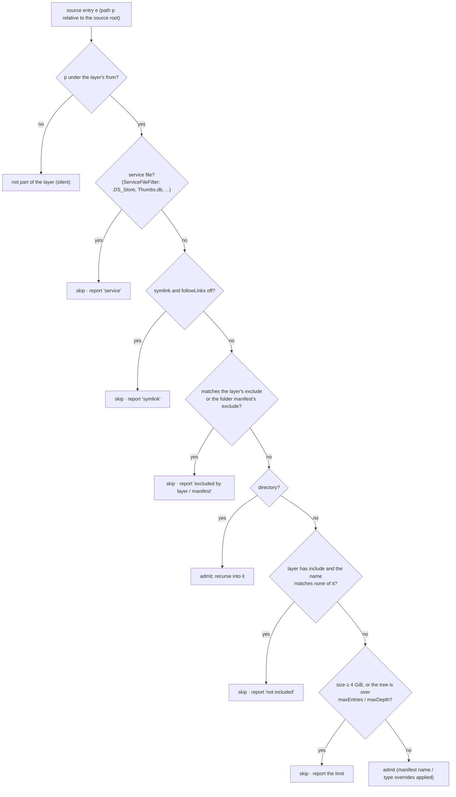
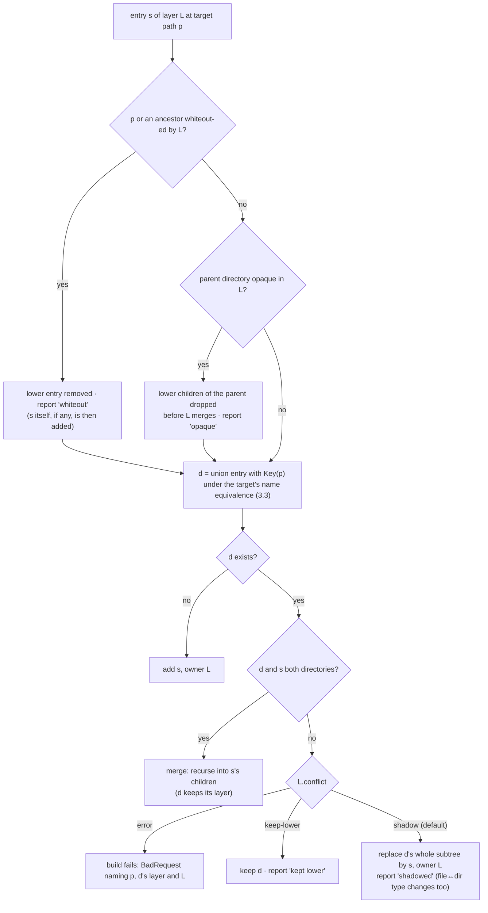
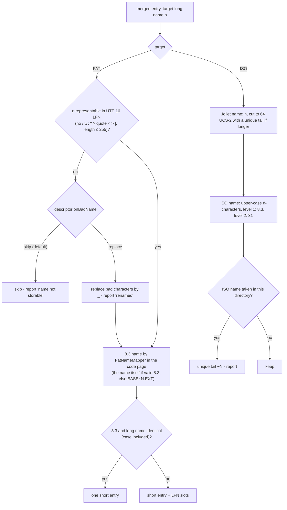
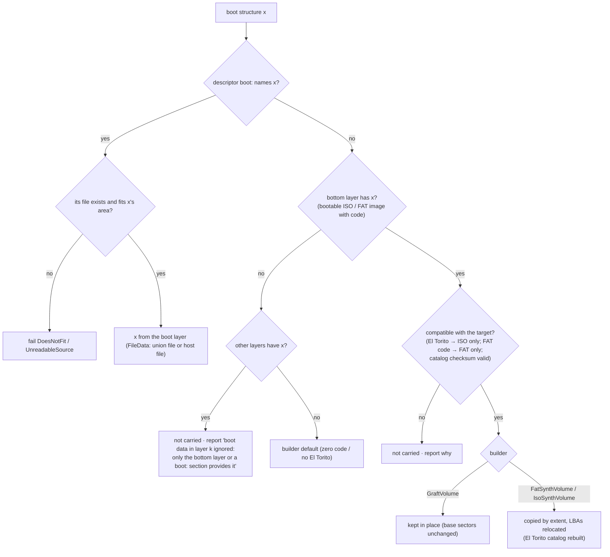
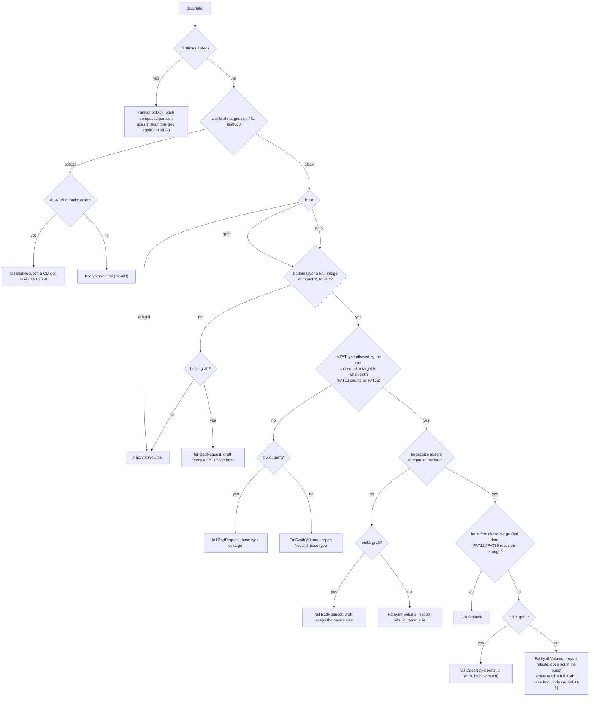

# Multi-source media — technical design

| | |
|---|---|
| **Date** | 2026-10-05 (review round 1: 2026-10-09) |
| **Status** | As built: C0-C11 done and merged; C9 dropped after measuring |
| **Requirements** | [goals-and-requirements.md](goals-and-requirements.md) |
| **Architecture** | [architecture.md](architecture.md) |
| **Analyses** | [fs-compatibility.md](fs-compatibility.md), [flatten-strategies.md](flatten-strategies.md) |
| **Tests and benchmarks** | [test-and-benchmark-plan.md](test-and-benchmark-plan.md), measured: [benchmarks/README.md](benchmarks/README.md) |
| **Phases (as-built records)** | [phases/README.md](phases/README.md) |
| **User docs** | [docs/features/media.md](../../features/media.md#composite-media-several-sources-in-one-disk), recipe [compose-media.md](../../../.recipe/media/compose-media.md) |

## Review round 1 (2026-10-09)

**Status:** the work is done and merged. Every phase C0-C11 landed (C9 measured and dropped; C8c's Qt dialog
awaits the owner's build on macOS / Windows / Linux). This document now says what was built. Where the design
changed, the section says what it is now and links the phase document that holds the as-built record. Section
numbers are unchanged.

What changed in this review:

- **§1** `ComposeDescriptor` as built: the `boot` section, `partitions`, the S4 sidecars (`deleted`, `attributes`),
  `error` / `Ok()`. `order` and `onBadName: replace` are parsed but not built. Paths are `lexically_normal`, and
  `Normalized()` leaves out `writes`.
- **§2** No `IFileTreeSource` interface: three source classes, each with a static `Enumerate` into a `FileTree`.
  `FatImageExpander` reads a graft base lazily (C4b). `SourcePool` keeps a host file as its folder's index plus its
  name (C11). Devices are keyed by canonical path.
- **§3** `UnionTree` / `UnionNode` became `FileTree` / `TreeNode`: 112 bytes, names as strings, no name pool, no
  `layerMask`, with `unexpanded` / `baseCluster` added (C4b). The merge keeps one key per node (C11). There is no
  per-directory `order`.
- **§4** `FatSynthVolume` has no last-hit run cache (`GraftVolume` and `IsoSynthVolume` do). §4.3 (bulk reads) was
  dropped (C9). `IBlockDevice::ZeroRun` (C10a) landed instead.
- **§5** The volume label comes from the descriptor or the builder's default, not from the bottom layer.
  `FatBootPlan` also carries the sectors between the MBR and the partition (`gap`).
- **§6** DT-4 as built (C4), the lazy base (C4b), patch storage, failure kinds, reads past a cut-down image (C7).
- **§7** ISO file data always goes through `ExtentReader`. El Torito entries are `IsoBootImage`.
- **§8** `PartitionedDisk` as built (C7).
- **§9** `ProvenanceMap` became `IComposedLayout` plus `ForEachChangedOwner` over an `IChangeView`. `SectorRole`
  replaced `SectorOwner::Kind`. `SectorOwner` gained `unlisted` / `Known()` (C4b). `ChangeAttributor::Attribute`
  compares before and after.
- **§10** S2 is `SessionDelta`. S3 is `CommitJournal` plus `MediaManager::CommitComposite`, streamed since C8d. S4 is
  `WriteBack` with sidecars and `HostTrash`. The descriptor is never rewritten.
- **§11** Surfaces as built, and the same-source rule as built. New §11.1, session writes: `SessionWriteMap` is
  arenas, a two-level group index and an optional journal written by the shared `JournalIoPool`. `Changes()` became
  `IChangeView`.
- **§12** Measured memory (2026-10-09) next to the design estimate.
- **§13** Files as built.
- **§14** Status and links for C0-C11, C4b, C8d, C9 (dropped), C10a-C10e.
- **§15** The outcome of each risk.

## Contents

1. [Descriptor](#1-descriptor)
2. [Sources](#2-sources-ifiletreesource)
3. [Union tree](#3-union-tree)
4. [Extents and the read hot path](#4-extents-and-the-read-hot-path)
5. [FAT rebuild: `FatSynthVolume`](#5-fat-rebuild-fatsynthvolume)
6. [Graft: `GraftVolume`](#6-graft-graftvolume)
7. [ISO target: `IsoSynthVolume`](#7-iso-target-isosynthvolume)
8. [Partitions: `PartitionedDisk`](#8-partitions-partitioneddisk)
9. [Provenance and attribution](#9-provenance-and-attribution)
10. [Flatten implementation](#10-flatten-implementation)
11. [Media manager integration and surfaces](#11-media-manager-integration-and-surfaces)
12. [Memory budget](#12-memory-budget)
13. [Code placement](#13-code-placement)
14. [Phases](#14-phases)
15. [Risks](#15-risks)

---

## 1. Descriptor

### 1.1 Schema (version 1)

```yaml
# games.ucompose.yaml - every key optional unless marked (required)
version: 1                      # (required)
target:
  kind: block                   # block | optical          (default: the slot's kind)
  fs: auto                      # auto | fat16 | fat32 | iso9660
  build: auto                   # auto | rebuild | graft
  size: 2GiB                    # total volume; omitted = content + free
  free: 256MiB                  # room for guest writes (rebuild; costs nothing, never stored)
  label: GAMES
  codepage: cp866               # cp866 | cp1251 (FAT short names)
  onBadName: skip               # skip | replace: a name the target cannot store (DT-3); replace: not built, skip used
  partition: mbr                # mbr | none   (none = "superfloppy")
  iso: {level: 1, joliet: true, relaxDepth: false}  # optical only
  fixedTime: 2026-01-01T00:00:00Z  # tests / reproducible builds: every timestamp this value
                                # as built: a number of Unix seconds (1767225600); a date string is reported and ignored
layers:                         # bottom first
  - name: base                  # unique; default "layer<N>"
    source: {image: ../sd/nedoos.img, partition: 1, codepage: cp866}
  - name: builds
    source: {folder: ~/work/out}
    mount: /BIN                 # where the layer's root lands (default /)
    from: /                     # subfolder of the source (default /)
    include: ["*.com", "*.$c"]  # wildcards on file names, case-insensitive
    exclude: ["*.bak"]
    order: {/: [boot.$c]}       # per-directory entry order (target paths): parsed, not built
    conflict: shadow            # shadow | keep-lower | error
    opaque: [/BIN/OLD]          # upper directory hides the lower one's contents
    whiteout: [/BIN/broken.com] # hide lower entries
    writable: true              # S4 may write here
    onDelete: keep              # S4: keep | trash | move | delete | ignore (D-4)
    deletedFolder: .deleted     # onDelete: move - relative to the descriptor; <date>/<layer>/<path> inside
  - name: demos
    source: {iso: ~/zx/demos.iso}   # ISO, CUE / BIN or CD CHD: the first data track
    from: /DEMOS
    mount: /DEMOS
boot:                           # boot layer (D-6): wins over the bottom source's boot structures
  eltorito:                     # optical targets
    - {image: /BOOT/boot.img, emulation: floppy, platform: x86}   # target path (a union file) or {host: path}
    - {image: {host: ./efi.img}, emulation: none, loadSegment: 0x07C0, sectors: 4}
  mbrCode: {host: ./mbr.bin}    # FAT targets: bytes 0-445 of LBA 0
  volumeCode: {host: ./vbr.bin} # boot code area of the volume boot sector; BPB fields stay the builder's
  reserved:                     # whole reserved sectors after the boot sector
    - {lba: 1, file: {host: ./dssboot.bin}}   # e.g. the DSS loader at LBA 1-3 (relative to the volume)
writes:
  access: session               # readonly | session
  save: delta                   # save policy for automation (D-7): flat (S1) | delta (S2) | commit (S3) | write-back (S4); the GUI asks, with this preselected
  upper: builds                 # S4 copy-up target (default: topmost writable layer)
  delta: games.ucompose.delta   # S2 file (default: <descriptor file name>.delta)
```

Partitions variant (`layers` and `partitions` are mutually exclusive). As built in C7
([c7-partitions.md](phases/c7-partitions.md) §1): each entry has `name` (default `p1`, `p2`, ...), `type` (the MBR
type byte), and either `source` (passthrough) or `compose` (a composition without `version`). `fs`, `size` and
`label` at the partition's level are shorthands for its `target`.

```yaml
version: 1
target: {kind: block, partition: mbr, size: 4GiB}
partitions:
  - {name: dos, source: {image: dos.img, partition: 1}}            # passthrough; type from the source
  - {name: data, fs: fat32, size: 1GiB, compose: {layers: [{source: {folder: ./data}}]}}
  - {name: tools, fs: fat16, compose: {build: graft, layers: [
        {source: {image: tools.img}}, {source: {folder: ./tools-new}}]}}
```

Sidecars next to the descriptor, written by the machine and never by the user (C8b, C8d): `<descriptor>.whiteout`
(paths the guest deleted, S4 `keep`), `<descriptor>.attributes` (FAT attribute bits, `RHS<TAB>/PATH`),
`<descriptor>.writeback` (the S4 apply journal), `<descriptor>.delta` (S2). The user's YAML is never rewritten.

### 1.2 Normalization rules

| Rule | Detail |
|---|---|
| Sizes | `512`, `64KiB`, `2GiB`, `1.44MB` (decimal); rounded up to whole sectors (`ComposeDescriptor::ParseSize`) |
| Paths | relative to the descriptor's folder; `~` → home. **As built:** stored absolute and `lexically_normal`. Image and ISO sources are keyed in the `SourcePool` by `weakly_canonical` (§2). Target paths are `/`-separated, `.` / `..` resolved, trailing `/` dropped |
| Wildcards | `*`, `?`, `[...]`; matched on the **source** name (before conversion), case-insensitively |
| Defaults | filled into the normalized form. The normalized form (fixed key order, canonical numbers) is what `ContentId` hashes, so formatting differences never change the id. **As built:** `Normalized()` leaves out `writes`, `writable`, `onDelete` and the `.attributes` sidecar; the `.whiteout` sidecar (`deleted`) is in it |
| Errors | unknown keys and bad values → `report` (never abort, NFR-S5). A missing `version`, an empty `layers`, both `layers` and `partitions`, a layer without `source`, or an unknown source kind → `error` (`BadRequest`) |

### 1.3 API

As built (`core/src/emulator/media/composedescriptor.h`; members abridged):

```cpp
struct ComposeSource
{
    enum class Kind : uint8_t { Folder, Image, Iso };
    Kind kind = Kind::Folder;
    std::filesystem::path path;          ///< absolute after normalization
    std::optional<uint32_t> partition;   ///< Image: 1-based MBR partition; none = superfloppy or the first FAT partition
    std::optional<CodePage> codePage;    ///< Image: short names of the source
};

struct ComposeLayer
{
    std::string name;
    ComposeSource source;
    std::string mount = "/";
    std::string from = "/";
    std::vector<std::string> include, exclude, opaque, whiteout;
    ConflictPolicy conflict = ConflictPolicy::Shadow;
    bool writable = false;
    DeletePolicy onDelete = DeletePolicy::Keep;   ///< Keep, Trash, Move, Delete, Ignore
    std::filesystem::path deletedFolder;          ///< Move: default <descriptor dir>/.deleted
};                                                // no `order` member: the key is accepted and ignored

struct ComposeTarget                              // kind, fs, build, size, free, label, codePage, mbr,
{                                                 // fixedTimeUtc, onBadName, isoLevel, joliet, relaxDepth
    ...
};

struct ComposeDescriptor
{
    int version = 0;
    ComposeTarget target;
    std::vector<ComposeLayer> layers;
    bool hasPartitions = false;
    std::vector<ComposePartition> partitions;     ///< name, source | compose (shared_ptr<ComposeDescriptor>), type
    bool hasBoot = false;
    ComposeBoot boot;                             ///< eltorito, mbrCode, volumeCode, reserved (D-6)
    ComposeWrites writes;                         ///< access, save, upper, delta
    std::vector<std::string> deleted;             ///< S4: from <descriptor>.whiteout
    std::vector<std::pair<std::string, uint8_t>> attributes;  ///< C8d: from <descriptor>.attributes
    std::filesystem::path file;                   ///< empty for an inline descriptor
    std::filesystem::path baseDir;
    std::vector<std::string> report;
    std::string error;                            ///< fatal; Ok() = error.empty()

    static ComposeDescriptor Load(const std::filesystem::path& file);
    static ComposeDescriptor Parse(const std::string& text, const std::filesystem::path& baseDir,
                                   const std::string& sourceName);
    std::string Normalized() const;       ///< canonical JSON: ContentId input, `media layers` output
    static bool ParseSize(const std::string& text, uint64_t& bytes);
    static bool IsDescriptorName(const std::string& fileName);  ///< *.ucompose.yaml / .yml / .json
};
```

The design had `ComposeDescriptor::Save` for S4. It was not built: S4 writes sidecars instead (§10).

Parsing uses `rapidyaml` with the throwing error handler, as `FolderManifest` does. JSON is parsed
by the same code (rapidyaml reads JSON).

## 2. Sources: `IFileTreeSource`

**As built (C1, C3, C5):** there is no `IFileTreeSource` interface and no `SourceEntry` / `SourceTree` / name pool.
Each source is a class with a static `Enumerate` that fills a `FileTree` (§3.1) and reports what it left out. The
factory calls the one the layer's `source` names. The data types the design gave are the as-built ones:

```cpp
/// Where a file's bytes are (core/src/emulator/io/storage/compose/filetree.h)
struct FileData
{
    enum class Storage : uint8_t { Zero, HostFile, DeviceExtents };
    Storage storage = Storage::Zero;
    uint16_t source = 0;        ///< DeviceExtents: the pool's device index
    uint32_t hostFile = 0;      ///< HostFile: the pool's host-file index
    uint32_t firstExtent = 0;   ///< DeviceExtents: into the tree's extent table
    uint32_t extentCount = 0;
    uint64_t bytes = 0;
};   // 24 bytes

/// A run of whole sectors of a source device holding consecutive bytes of a file
struct Extent
{
    uint64_t sourceLba = 0;     ///< 512-byte sector on the source device
    uint32_t sectors = 0;
    uint32_t fileSectorStart = 0;   ///< the file's sector index at the start of this extent
};
static_assert(sizeof(Extent) == 16, "an extent is 16 bytes (memory budget, tdd.md §12)");

// HostFolderSource::Enumerate(const FolderSnapshot&, const HostFolderSourceOptions&, SourcePool&, FileTree& out,
//                             std::vector<std::string>* report, std::string* error);
// FatImageSource::Enumerate(uint16_t device, const FatImageSourceOptions&, SourcePool&, FileTree& out,
//                           report, error, uint64_t* identity = nullptr, uint16_t* volume = nullptr);
// IsoImageSource::Enumerate(uint16_t device, const IsoImageSourceOptions&, SourcePool&, FileTree& out,
//                           report, error, uint64_t* identity = nullptr);
```

| Implementation | Enumerate | Extents | Identity |
|---|---|---|---|
| `HostFolderSource` | the factory runs `FolderSnapshot::Scan` (cancel and progress forwarded; it applies the manifest, exclusions, service files, links and size limits); `Enumerate` applies `from`, `include` (files only) and hides dot-names | `HostFile`: an index into the pool's host-file table; offset = file offset | `FolderSnapshot::Identity()` |
| `FatImageSource` | `FatVolumeReader::ListDirectory` recursively from `from`; `exclude` / `include` as for folders; a file with a broken chain is left out with a report line. C4b: `lazy` reads only the root; `FatImageExpander` (`Expand`, `ExpandPath`, `ExpandAll`, `Count`) reads the rest on demand ([c4b-lazy-graft-base.md](phases/c4b-lazy-graft-base.md)) | `FatVolumeReader::ChainExtents(firstCluster, bytes, extents)`: walk the chain through a two-sector FAT window, coalesce adjacent clusters, convert to device LBAs | the volume device's `ContentId()` (the image, or its partition window) mixed with the code page |
| `IsoImageSource` | `Iso9660Reader`: PVD → Joliet SVD if present → directory records; `from`, `include`, `exclude` | one extent per file section (multi-extent files: several); source LBA = block × 4 | the image's `ContentId()` |

**`Iso9660Reader`** is a production class (the source side), written from ECMA-119 independently of
`IsoSynthVolume` (the target side), so each can be tested with the other, as `FatVolumeReader` and `HostFolderFat`
are ([c5-iso.md](phases/c5-iso.md) §9).

**Image partitions.** As built ([c3-image-sources.md](phases/c3-image-sources.md) §9): only an explicit
`partition: n` opens a `SubRangeDevice(device, start, count)` over MBR entry *n* (types `#01 #04 #06 #0B #0C #0E`,
found by `FatVolumeReader::FindPartition`), registered in the pool as `<image key>#partition<n>`. Without `partition`,
a superfloppy or the first FAT partition is read through the reader's volume start, as `FatVolumeReader::Open` always
did.

**`SourcePool`** (`compose/sourcepool.h`), as built:
- **Devices**, opened once and shared by every layer that names them (`AddDevice(device, key)`, `FindDevice(key)`).
  The key of a FAT image is its `weakly_canonical` path, of a CD image `cd:` plus that path, of a partition window
  `<key>#partition<n>`. The code page is not part of the key. Images open through `HddImageFormats::OpenBlock` and
  CD images through `CdImageFormats::Open`, always **read-only**. An interrupted S3 commit is rolled back first
  (`CommitJournal::Recover`). S3 opens the base read-write on its own (§10).
- **Host files** (`AddHostFile(path, size)`): each is kept as its folder's index plus its name, and folders are kept
  once each, as strings (C11: a `std::filesystem::path` per file cost a few hundred bytes;
  [benchmarks/README.md](benchmarks/README.md) §3). `HostPath(i)` and `HostSize(i)` give them back for S4's
  conflict check.
- **The shared LRU of open host streams** (`kMaxOpenFiles` = 8, NFR-M4). A file that shrank or vanished since the
  scan reads short and is zero-filled, with one warning per file (`Warnings()`).
- There is no name pool: names live in the tree's nodes (§3.1).

## 3. Union tree

### 3.1 Node layout

As built (C1), the union is a `FileTree`, the same type as a source tree
([c1-core-and-parity.md](phases/c1-core-and-parity.md) §2):

```cpp
struct TreeNode
{
    std::string name;                 ///< UTF-8, no path
    uint32_t parent = 0;
    std::vector<uint32_t> children;   ///< directories only, in medium order
    FileData data;                    ///< files only
    int64_t mtimeUtc = 0;
    uint16_t layer = 0;               ///< the layer that provided the node (the first for a merged directory)
    uint8_t attributes = 0;           ///< FAT bits from the source (hidden, read-only, system)
    bool isDirectory = false;
    bool unexpanded = false;          ///< C4b: a lazily read base directory whose entries are not in the tree
    uint32_t baseCluster = 0;         ///< C4b: its first cluster in the base image
};   // 112 bytes on x86-64 (libstdc++), plus the name's heap past 15 bytes and a directory's child vector

class FileTree   // nodes in one vector, by index; kRoot = 0; the extent table of every file in the tree
{
    uint32_t Add(uint32_t parent, TreeNode node);
    uint32_t Child(uint32_t dir, std::string_view name) const;
    uint32_t Find(std::string_view path) const;
    std::string PathOf(uint32_t index) const;
    void Detach(uint32_t index);      ///< the node stays in the vector, unreachable
    uint32_t CopySubtree(const FileTree& source, uint32_t from, uint32_t parent, uint16_t layer);
    std::vector<Extent>& Extents();
};
```

The design's 64-byte `UnionNode` (`sourceName` / `targetName` / `shortName` offsets into a name pool, `layerMask`,
`flags`) was not built. Target names (8.3, LFN, ISO, Joliet) are made by the target builder per directory and are
not kept in the tree. A merged directory keeps the layer of its first contributor. Which layers contributed is
reported, not stored.

### 3.2 Merge algorithm


**Decision tree DT-1: is a source entry admitted into its layer?** Applied once per entry while
the source is enumerated, before any merge. As built: for folders, `FolderSnapshot::Scan` applies service files,
links, exclusions (the layer's and the manifest's) and the size limits. `HostFolderSource` then applies `from` and
`include`, and gives dot-names the hidden attribute. The image and ISO sources apply `from`, `exclude` and `include`
themselves. The 4 GiB limit applies to FAT targets only: an optical target takes larger files as multi-extent
([c5-iso.md](phases/c5-iso.md) §9).



Include patterns filter files only; directories are always walked, and a directory left empty by
the filters is kept (the guest sees the mount structure).

As built (`UnionBuilder::Merge`, `compose/unionbuilder.cpp`):

```
UnionBuilder::Merge(layers, key, out):
  keys ← a key per node of out, made at first use and kept (names never change)       # C11
  for layer L in bottom → top:
      for each whiteout w of L: Detach(out, w)                  # report 'whiteout'
      anchor ← EnsurePath(out, L.mount)       # missing dirs owned by L; a file in the way replaced (conflict: error fails)
      MergeDir(anchor, L.tree.root, L)
  SortTree(out)                               # 3.4
then, in the factory: the descriptor's `deleted` paths detached (S4 whiteouts), `attributes` set (C8d)

MergeDir(dst, srcDir, L):
  if dst is unexpanded: fail "merges into a base directory that was not read"         # C4b guard
  if dst's path is in L.opaque and dst has children: detach them (report)
  existing ← hash map keys[child] → child, over dst's children before L               # one layer never merges with itself
  for s in srcDir.children:
      d ← existing[key(s.name)]
      if d == none:            CopySubtree(s, owner L)
      elif d.dir and s.dir:    MergeDir(d, s, L)
      elif L.conflict == error: fail(BadRequest, path)
      elif L.conflict == keep-lower: report(kept lower)
      else:                    Detach(d); CopySubtree(s, owner L); report(shadowed d by L)
```

Cost: O(total source entries) hash operations plus one sort per directory at the end
(O(n log n) total). Memory: the per-directory hash index lives only while that directory merges, plus the key
cache (one string per union node, freed after the merge). Before the cache, every layer re-keyed every directory it
merged into: a 64-layer build of 100 K entries went from 1.8 s to 1.33 s ([benchmarks/README.md](benchmarks/README.md)
§3).

**Decision tree DT-2: one entry of layer L meets the union.** This is `MergeDir`'s inner step, the
merge policy of FR-10…FR-13.




### 3.3 Name equivalence

| Target | `Key(name)` | Notes |
|---|---|---|
| FAT | `UnionBuilder::FatKey`: trailing dots and spaces stripped, then upper case. **As built:** an ASCII name is upper-cased in place, with no UTF-32 round trip (C11, a third of a 64-layer build). Other names are decoded and folded with `UnicodeHelper::ToUpper` | FAT matches long names case-insensitively, so `Readme.txt` ≡ `README.TXT` |
| ISO | `UnionBuilder::ExactKey`: the Joliet name as is (case-sensitive). The ISO L1 / L2 names are made by `IsoSynthVolume` after the merge, collisions getting `~N` tails | Joliet keeps both `a.txt` and `A.TXT`; the L1 names get unique tails |

Entries of one layer are never merged with each other, even when the key folds them together: a case-sensitive host
folder holding `a.txt` and `A.TXT` keeps both, as a one-folder volume always did.

8.3 names are assigned per final directory by the target builder (`FatNameMapper::MapFolder` on
the merged children; a graft passes the kept short names as `taken`), never during the merge. Generated names are
unique within the directory, whatever layer each entry came from.

**Decision tree DT-3: an entry's name on the target** (FR-21), per final directory after the merge. As built,
`onBadName: replace` is reported as not built and the name is skipped
(`CompositeMediumFactory`). ISO details as built: Joliet names are cut to 62 + `;1` for files and 64 for
directories; level 2 allows 31 characters; a name without an extension is recorded as `NAME.;1`
([c5-iso.md](phases/c5-iso.md) §9).




### 3.4 Ordering

Designed: the layer's `order` list for that target path first, then directories, then files, each byte-wise by
target long name. **As built:** `UnionBuilder::SortChildren` puts directories first, then files, each byte-wise by
name (a stable sort). This is the same rule as `FolderSnapshot` and keeps NFR-S1. The `order` key is parsed and
ignored; no phase built it.

## 4. Extents and the read hot path

### 4.1 `ExtentReader`

As built (`compose/extentreader.h`):

```cpp
/// Shared by FatSynthVolume, GraftVolume and IsoSynthVolume: read sector `fileSector` of a file
/// into dst (512 bytes). Zero-pads past EOF. Zero heap allocations (NFR-P3)
class ExtentReader
{
public:
    ExtentReader(SourcePool& pool, const std::vector<Extent>& extents);
    bool ReadFileSector(const FileData& data, uint64_t fileSector, uint8_t* dst);  ///< false: a device read error
    uint64_t Searches() const;   ///< binary searches so far (tests: sequential reads do none)
private:
    const Extent* FindExtent(const FileData& data, uint64_t fileSector);   // last hit or the next one, else binary search
    SourcePool& _pool;
    const std::vector<Extent>& _extents;   // the tree's table
    const FileData* _lastData = nullptr;
    uint32_t _lastExtent = 0;
};
```

```
ReadFileSector(data, s, dst):
  if s * 512 >= data.bytes:            memset(dst, 0, 512); return true
  switch data.storage:
    Zero:          memset(dst, 0, 512)
    HostFile:      pool.ReadHost(data.hostFile, s * 512, dst, min(512, bytes - s*512)); zero tail
    DeviceExtents: e ← FindExtent(data, s)            # O(1) for sequential, O(log k) otherwise
                   pool.Device(data.source).ReadSector(e.sourceLba + (s - e.fileSectorStart), dst)
                   zero the tail if this is the file's last sector (slack, fs-compatibility §4)
```

One read call per target sector, straight into `dst`: **zero intermediate copies** (NFR-P3). `ReadHost` uses the
LRU-of-streams logic taken from `HostFolderFat`, now in `SourcePool`. Measured
([benchmarks/README.md](benchmarks/README.md) C3): 36-44 ns sequential whatever the extent count, 44-128 ns random
from 1 to 4096 extents. `ComposeReadAllocations_Test` checks that no read allocates.

### 4.2 Run table (target side)

As built: `FatSynthVolume` keeps `std::vector<Run>` sorted by `firstCluster`
(`Run {firstCluster, clusters, isDirectory, index}`, 16 bytes; `index` is a tree node for a file, a directory
buffer for a directory) and finds a cluster with `upper_bound`. **The planned last-hit run cache was not added
here.** `GraftVolume` and `IsoSynthVolume` have one (`_lastRun`). The run → `FileData` → extent indirection costs
nothing measurable. NFR-P1: the one-folder composite against `HostFolderFat` is 1.03x sequential, 0.98x random, 0.94x
metadata. C1's own A/B of `HostFolderFat` before and after the refactor came out faster
([c1-core-and-parity.md](phases/c1-core-and-parity.md) §3).

### 4.3 Optional bulk read (phase C9, A/B gated)

**Dropped 2026-10-06** ([c9-bulk-read.md](phases/c9-bulk-read.md)). At the device a bulk read is 14x cheaper, but
that is about 2 % of a guest's per-sector host cost, and only when unpaced. The callers (ATA, SD CMD18, ATAPI) would
need read-ahead buffers. `IBlockDevice` has no `ReadSectors`. The design, for the record:

```cpp
// IBlockDevice
virtual bool ReadSectors(uint64_t lba, uint32_t count, uint8_t* dst)
{
    for (uint32_t i = 0; i < count; ++i)
        if (!ReadSector(lba + i, dst + i * kSectorSize)) return false;
    return true;
}
```

`RawImage` overrides it with one `read` call. The composite overrides it by splitting at run and
extent boundaries and forwarding each piece as one `ReadSectors` to the source. `SessionWriteMap`
splits around changed sectors. Callers: ATA READ MULTIPLE / DMA, SD CMD18, ATAPI READ (10). It only
lands if the A/B shows a gain on bulk reads and no loss on single-sector reads (NFR-P7).

What landed instead (C10a, [c10-sparse-memory.md](phases/c10-sparse-memory.md) §2):
`IBlockDevice::ZeroRun(lba)` says how many sectors from `lba` on are known to read as zeros, without reading them.
`FatSynthVolume`, `GraftVolume`, `SessionWriteMap`, `SubRangeDevice`, `PartitionedDisk`, `SparseMemoryDisk`,
`RawImage` (POSIX `SEEK_DATA`) and the access layers answer it. Exports and the CHD writer skip such runs: a 4 GiB
FAT32 composite holding 1 MiB exports in 12.5 ms instead of 525 ms.

## 5. FAT rebuild: `FatSynthVolume`

`HostFolderFat` used to be folder scan + layout + per-sector synthesis. The split:

| Piece | From | To |
|---|---|---|
| Folder scan | `HostFolderFat::Build` | `FolderSnapshot::Scan` + `HostFolderSource` |
| Names (`FatNameMapper`) | per folder at build | per merged directory at build (same calls) |
| Layout (cluster size choice, FAT sizes, runs, directories bytes) | `HostFolderFat::Build` | `FatSynthVolume::Build(tree, pool, const FatVolumeOptions&, sourceIdentity, description, error, report)`; `BuildToSize(..., bytes, ...)` for `target.size` and `compact` (C6a) |
| Boot sector / FSInfo / MBR / FAT sector formulas | `HostFolderFat` | `FatSynthVolume` (code moved, unchanged) |
| File data | `ReadFile` (host stream) | `ExtentReader` |
| `HostFolderFat` | — | a subclass of `FatSynthVolume`: one `HostFolderSource` layer into a tree, then `FatSynthVolume::Init`; same public API and messages |

**Parity gate (FR-34):** before any composite feature lands, the refactored `HostFolderFat` must
produce byte-identical images for every case in `hostfolderfat_test.cpp` plus a corpus test (hash
of every sector of 12 generated folders: FAT16/32, MBR and superfloppy, CP866/CP1251, deep trees,
4 GiB − 1 sparse file, 65 535 entries). The hashes are recorded from master **before** the
refactor. **As built:** `HostFolderFatParity_Test` holds FNV-1a hashes of 24 corpus volumes recorded on master
(sectors up to `UsedSectorEnd`, every 1021st, the last). The refactor was byte-identical. One later deliberate
exception: the volume label entry carries the folder's time (C4, [c4-graft.md](phases/c4-graft.md) §8). The corpus is
built with a fixed time and is unaffected.

Boot structures (D-6), as built (C5b, C6a): `FatBootPlan` (in `FatVolumeOptions::boot`) carries `mbrCode` (bytes
0-445 of LBA 0), `volumeCode` (the boot sector's code area after the BPB, FAT32's backup too), `reserved` (whole
reserved sectors, volume-relative) and `gap` (non-zero sectors between the MBR and the partition, up to LBA 2047:
the DSS loader at LBA 1-3). They come from the descriptor's `boot` section, else from the bottom FAT image
(`FatBootPlan::FromVolume`). An implicit carry that does not fit is left out with a report line (`bestEffort`). An
explicit boot section that does not fit fails with `DoesNotFit`. Without a plan the output is unchanged (parity).
`GraftVolume` keeps the base's own boot sectors, and a `boot` section patches them through the patch map
([c5-iso.md](phases/c5-iso.md) §10).

**Decision tree DT-5: where each boot structure comes from (D-6).** Run per structure: El Torito
entry list (optical), MBR code, volume boot code, each reserved boot sector (block).




Layout additions over the old `HostFolderFat`:
- `size` (fixed total, `BuildToSize`: a probe without free space, then up to 6 passes converging on the largest
  volume not over `size`) as well as `free`.
- Root directory sized for the merged root (FAT16: rounded up to 16 entries, at least 512).
- Volume label from the descriptor. **As built:** otherwise the builder's default (`UNREAL NG`), not the bottom
  layer's. `compact` (C6a) keeps the merged volume's own label.
- `ZeroRun` (C10a), `OwnerOf` (C6b), and the label's 11 bytes made once at build (C11: a read of the boot sector
  used to allocate).

## 6. Graft: `GraftVolume`

As built: [c4-graft.md](phases/c4-graft.md) (§3 build, §4 read, §8 as built) and
[c4b-lazy-graft-base.md](phases/c4b-lazy-graft-base.md) (the base read lazily).

### 6.1 Build

```
GraftVolume::Build(tree (the union, the base = layer 0), pool, baseDevice, GraftOptions, ...):
  r   ← FatVolumeReader on base (partition)
  free← r.ScanFree()                         # bitmap, 1 bit per cluster; O(FAT sectors) read once
  walk base directories and union directories together (GraftBuilder::Walk):
      a layer-0 union child of the same name   → kept (raw slots copied byte-identically)
      an unexpanded layer-0 directory (C4b)     → kept, not walked
      an upper file with the same FAT key      → replaced in place (same slots; new cluster, size, time); old chain released
      none                                     → removed (whiteout, opaque, base filter, type change); chain released
      union children left over                 → added (8.3 names unique against the kept ones)
  allocate (best fit, else fragments): directory growth, new directories, then files largest first
  for each touched directory d:
      if FAT12 / FAT16 root and slots > rootEntries: fail DoesNotFit("root full"; auto → rebuild)
      re-encode d's clusters (kept slots in base order, then added; '.' and '..' anew)
  patch the changed FAT sectors in every FAT copy; FSInfo free count / next free (FAT32)
  boot section (D-6): patch MBR code, code area, reserved sectors within the base's reserved count
```

Patch storage as built: `std::vector<uint64_t> _patchLba` (sorted) + `std::vector<uint8_t> _patchData` (512 × n),
read-only after the build. Grafted runs: `Run {firstCluster, clusters, fileClusterStart, node}`, sorted by
cluster. Failure kinds for DT-4: `GraftFailure::BaseNotFat`, `DoesNotFit`, `Broken`. `SectorOrigin(lba)` (base, patch,
graft), `PatchLbas()` and `GraftedSectorRuns()` serve the tests and S3.

C4b: when a graft is possible (`build` auto or graft, the bottom layer a FAT image at `/` from `/`, no `include` /
`exclude` on it, `CompositeBuildOptions::lazyBase`), the factory reads the base lazily. It expands only the paths the
upper layers, their whiteouts and opaque paths, the `.whiteout` / `.attributes` sidecars and the boot section reach.
File counts of the rest wait for `CompositeInfo::CompleteCounts()`. Provenance under unread directories is indexed
from the image at the first query (`IndexUnexpanded`). A fallback to a rebuild expands everything first. Measured: a
graft over 20 000 base files in 0.93-1.01 ms instead of 22 ms.

### 6.2 Read

```
ReadSector(lba, dst):
  i ← lower_bound(patchLba, lba);  if hit: memcpy(dst, patchData + i*512); return
  if lba in data region:
      c ← cluster(lba); r ← graftRuns.find(c)          # last-hit, then binary search
      if r: return extentReader.ReadFileSector(tree.node(r.node).data, fileSector(c, lba), dst)
  if lba past the image's end: zeros                  # C7: a cut-down image; SectorCount = max(image, volume end)
  return base.ReadSector(lba, dst)
```

### 6.3 Why graft is the default for image bases

- **Layout preserved:** boot sector, system files and any sector a loader hard-codes stay where
  they were.
- **Build cost independent of base size** (NFR-P6): only the touched directories are re-encoded. Since C4b only
  they are read too. Measured: 1.17 / 1.40 / 3.03 ms at 1 K / 10 K / 100 K base entries (the free-cluster scan
  remains); a rebuild takes 3.7 / 17 / 104 ms.
- **S3 commit** writes exactly the patch + graft runs + guest changes.
- **Cost of a fallback:** if the free space is short or a FAT12 / FAT16 root is full, `auto` rebuilds. The
  report says so, because a rebuild moves every file.

**Decision tree DT-4: which target builder (`build`, FR-30…FR-33).** As built (C4 §2, C5 §5): the base must sit at
`mount: /` taken `from: /`; FAT12 counts as the FAT16 family; a `target.size` other than the base's makes `auto`
rebuild and `graft` fail; `target.free`, `label` and `partition` are ignored by a graft with a report line. An ISO
target on a block slot also fails with `BadRequest`.




## 7. ISO target: `IsoSynthVolume`

As built: [c5-iso.md](phases/c5-iso.md) §9 (C5a) and §10 (C5b).

| Block | Contents |
|---|---|
| 0–15 | system area, zero |
| 16 | Primary Volume Descriptor (ISO L1/L2 names) |
| 17 | Boot Record (`EL TORITO SPECIFICATION`, pointer to the boot catalog) when the merged El Torito list is non-empty (D-6); the following descriptors move up by one |
| 17 / 18 | Supplementary Volume Descriptor (Joliet, escape `%/E`) when `joliet: true` |
| 18 / 19 | Volume Descriptor Set Terminator |
| 19… | path tables: L and M for the PVD, L and M for Joliet |
| … | directory extents (PVD tree), directory extents (Joliet tree) |
| … | boot catalog (one block, synthesized: validation entry with checksum, initial / default entry, section headers and entries copied from the source with the new image LBAs) |
| … | boot images (extents into the source ISO; a boot image that is also a visible file shares its extent) |
| … | file extents, contiguous, in directory order; shared by both trees (same extent LBA) |

- Implements `cd::IFrameSource` (`Read(offset, dst, length)`). `IsoSynthVolume::MakeDisc` builds the `CdImage` over
  it with one Mode 1 data track, so READ TOC, READ (10), READ CD and the `IBlockDevice` view all work unchanged.
  The medium's format is `compose-iso`, read-only; the manager calls `SetCd`.
- File-data reads: block *b* of a file → four 512-byte `ExtentReader` reads into the frame buffer `CdImage` passes.
  **As built:** an ISO source goes through the same path (four sectors of its `CdImage`, which caches the block); the
  planned single 2048-byte read from the source was not needed. Runs: `Run {firstBlock, blocks, fileBlockStart,
  const FileData* data}`, a last-hit index, then a binary search.
- Directory records, path tables and descriptors are generated at build time into one buffer (`_metadata`).
- `level: 1` names: 8.3 d-chars. `level: 2`: 31 chars. Depth > 8 fails with `DoesNotFit` (option
  `relaxDepth: true` for Joliet-only readers).
- Files ≥ 4 GiB: Level 3 multi-extent, written as several directory records (sections of at most
  `kMaxSection` = 4 GiB − 2048; tested with a sparse 4.4 GiB file).
- El Torito (D-6), as built: `Iso9660Reader::ReadBootCatalog` parses the source's catalog into
  `IsoBootEntry {platform, bootable, emulation, loadSegment, systemType, sectorCount, loadBlock, imageBytes}`. The
  target takes `IsoBootImage {entry, unionNode, data}` in `IsoTargetOptions::boot`. A union file's image shares its
  extent (`unionNode`); any other image (a host file, a hidden image of the bottom ISO) is a `FileData` placed after
  the files. Nothing is copied. A `boot.eltorito` list replaces the bottom ISO's catalog. A catalog that fails its
  checksum, or a bootable ISO above the bottom, is reported and not carried. The writer emits one section per run of
  the same platform.
- Dates: every record has the entry's time (or `fixedTime`); the volume's creation and modification dates are
  `fixedTime` or the newest time in the tree, so a rebuild with the same sources gives the same bytes. The volume id
  is `target.label` (default `UNREAL_NG`).

## 8. Partitions: `PartitionedDisk`

As built ([c7-partitions.md](phases/c7-partitions.md) §2, §7):

```cpp
class PartitionedDisk : public IBlockDevice
{
public:
    static constexpr uint64_t kAlign = 2048;   // 1 MiB
    struct Part
    {
        std::string name;
        uint8_t type = 0;                       ///< 0: from fatBits (§3 of c7)
        uint64_t sectors = 0;
        std::shared_ptr<IBlockDevice> device;   ///< its volume at its own LBA 0; may be shorter (zeros after it)
        int fatBits = 0;
        const IComposedLayout* layout = nullptr;  ///< provenance of `device`, and where its sector 0 is in it
        uint64_t layoutOffset = 0;
        uint64_t start = 0;                     ///< set by Build
        bool logical = false;                   ///< set by Build
    };
    static std::unique_ptr<PartitionedDisk> Build(std::vector<Part> parts, std::optional<uint64_t> totalSectors,
                                                  std::string description, std::string* error);
    void SetMbrCode(std::vector<uint8_t> code);   ///< D-6: bytes 0-445 of a source disk's MBR
    static uint8_t FatType(int bits, uint64_t start, uint64_t sectors);
    bool ReadSector(uint64_t lba, uint8_t* dst) override;   // table | child (hidden sectors patched) | zero
    bool WriteSector(uint64_t, const uint8_t*) override { return false; }   // read-only: the session layer above
    uint64_t ZeroRun(uint64_t lba) override;
    const std::vector<Part>& Parts() const;
    const std::vector<uint64_t>& TableSectors() const;   ///< the MBR and every EBR
};
```

- Up to 4 primary partitions. Beyond 4: the first three are primary, the rest logical in an extended partition
  (type `#0F`, the fourth MBR entry) with an EBR chain (each EBR 1 MiB before its partition), synthesized like the
  MBR. The first primary partition is marked active (`#80`).
- Types (`FatType`): FAT16 `#06` (`#04` below 32 MiB, `#0E` when it ends beyond CHS reach), FAT32 `#0B` (`#0C`
  beyond CHS reach), FAT12 `#01`; passthrough keeps the source's type byte.
- A composed child is built with `partition: none` (superfloppy at its own LBA 0). A FAT boot sector (and FAT32's
  backup) read at a partition's start gets its BPB hidden-sectors field set to the partition's start.
- Writes fail: the disk is read-only, like every composite, and guest writes go to the session layer.
- `SubRangeDevice(base, first, count)` is a small `IBlockDevice` for passthrough partitions (bounds-checked offset;
  zeros past the base's end, writes there refused). A graft over an image partition is a `SubRangeDevice` over the
  `GraftVolume` from its `VolumeStart()`, with its layout through `OffsetLayout` (§9).
- MBR code (D-6): `boot.mbrCode`, else the first source image's MBR code; without it the MBR has no code and a disk
  signature from the content id. The Profi BIOS needs the carried code to boot PQ-DOS.

## 9. Provenance and attribution

As built ([c6-provenance-flatten.md](phases/c6-provenance-flatten.md) §7, [c4b-lazy-graft-base.md](phases/c4b-lazy-graft-base.md) §7,
[c10d-session-spill.md](phases/c10d-session-spill.md) §6):

```cpp
// compose/composedlayout.h
enum class SectorRole : uint8_t { PartitionTable, BootArea, VolumeHeader, Fat, Directory, FileData, Free };

struct SectorOwner   // 32 bytes
{
    SectorRole role = SectorRole::Free;
    uint32_t node = FileTree::kNone;   ///< Directory / FileData: the union node (kNone when not known)
    uint16_t layer = 0;
    uint32_t dirCluster = 0;           ///< Directory: its own first cluster; FileData: its parent's; 0 = the root
    uint64_t offset = 0;               ///< byte offset of the sector in the directory or file
    bool patched = false;              ///< graft: re-encoded over the base
    bool unlisted = false;             ///< C4b: a base entry the build never read (no node; layer, dirCluster, offset hold)
    bool HasNode() const;
    bool Known() const;                ///< HasNode() || unlisted
};

class IComposedLayout   // FatSynthVolume, GraftVolume; OffsetLayout for a window (a graft over an image partition)
{
public:
    virtual SectorOwner OwnerOf(uint64_t lba) const = 0;   // O(log n) from the run tables, nothing per sector
    virtual const FileTree& Tree() const = 0;               // T0
    virtual const SourcePool* Pool() const { return nullptr; }
};

void ForEachChangedOwner(const IComposedLayout& layout, const IChangeView& changes,
                         const std::function<void(uint64_t, const SectorOwner&)>& visit);   // LBA order

// compose/changeattributor.h
struct FileChange
{
    enum class Op : uint8_t { Create, Modify, Delete, Rename, Mkdir, Rmdir, Attributes };
    Op op;
    std::string path, oldPath;
    int layer = -1;                    ///< the owner before the change; -1: new, or not known
    uint64_t sizeBefore = 0, sizeAfter = 0;
};

struct ChangeSet
{
    std::vector<FileChange> changes;   ///< in path order
    std::vector<std::string> warnings;
    uint64_t changedSectors = 0;
    uint32_t directoriesRead = 0;
    bool fullScan = false;             ///< no layout: every directory compared
};

class ChangeAttributor
{
public:
    static bool Attribute(IBlockDevice& before, IBlockDevice& after, const IChangeView& changes,
                          const IComposedLayout* layout, ChangeSet& out, std::string* error = nullptr);
};
```

Design changes, now as above: the planned `ProvenanceMap` class became the `IComposedLayout` interface itself plus
the free function `ForEachChangedOwner`. One `OwnerOf` per changed sector is O(log n), so no merge walk is needed.
`SectorOwner::Kind` (with `Base` and `Patch`) became `SectorRole` plus the `patched` flag. `FileChange::sectors` was
dropped. The attributor takes the medium before and after the writes and an `IChangeView` (C10d) in place of a
`SessionWriteMap`.

Attribution follows [flatten-strategies.md](flatten-strategies.md) §2 (DT-8). Only directories named by the evidence
and their ancestors (through the `..` chain) are re-read through `FatVolumeReader`, before and after. A medium
without a layout (not composite, or rebased onto a file) gets a full scan. Lost clusters and cross-links are
warnings. `media changes` runs it through `ListMediumChanges` (`media/mediachanges.{h,cpp}`). On a partitioned disk it
runs per FAT partition, over a `WindowChangeView` and the part's layout, with paths `name:/PATH`. `IsoSynthVolume` has
no layout: an optical composite is read-only.

## 10. Flatten implementation

| Strategy | Code |
|---|---|
| S1 flat | `BlockFormats::Write` (raw, CHD, `.vhd`) through `ExportBlockDevice`, which writes sparse files and skips known-zero runs (C10a). Fixed VHD (C6a): `vhd::Footer` (`io/storage/vhdimage.h`) appended by `AppendVhdFooter` (`media/blockformats.cpp`): cookie `conectix`, features 2, version 1.0, data offset `0xFFFFFFFFFFFFFFFF`, timestamp 0, creator `ung `, original/current size, CHS from `NativeGeometry()` or the VHD algorithm, disk type 2, checksum, UUID from `ContentId`. Dynamic VHD (C10b): option `vhd: dynamic`, `vhd::WriteDynamic`, and `VhdDynamicImage` reads it and writes it in place. [c6-provenance-flatten.md](phases/c6-provenance-flatten.md) §6, [c10-sparse-memory.md](phases/c10-sparse-memory.md) §7 |
| S1 compact | `BlockFormats::Compact`: `FatImageSource` over the medium's stack (borrowed into a `SourcePool`) → one-layer tree → `FatSynthVolume::BuildToSize` (`fs`, `size` from the options; label, volume start and boot structures carried) → `BlockFormats::Write`. An option (`compact`) on `save`, `export` and `flatten --strategy flat`, not a strategy of its own. Refused on a partitioned disk and on FAT12 without `fs` |
| S2 delta | `SessionDelta::Save(path, map, identity)` / `Load(path, map, identity, detail)` (`media/sessiondelta.{h,cpp}`): magic `UNGDELTA` v1, content id, sector count, each layer's identity, runs, 1 MiB zstd chunks, an end marker with an FNV-1a hash; written to `<file>.writing`, then renamed. Streamed since C10d (one chunk in memory). DT-13 restore in `CompositeMediumFactory::Open` |
| S3 commit | `MediaManager::CommitComposite` checks DT-14 (a graft; base raw / HDF / HDI / fixed VHD; not used elsewhere; no attribution warnings unless `force`). It writes the old sectors to `<base>.ujournal` (`CommitJournal::Write`: `UNGJRNL1`, entries, `UNGJEND!` and a hash, synced), writes in LBA order, syncs, then `CommitJournal::Remove`. Recovery on open is `CommitJournal::Recover` (the registry and image layers). C8d: the planned sectors are a merge of the patch LBAs, the grafted runs and `NextChanged`, streamed into the journal with nothing per sector in memory. Afterwards the slot is rebased on the base image; the descriptor is not rewritten. [c8-commit-writeback.md](phases/c8-commit-writeback.md) §5, [c8d-writeback-tails.md](phases/c8d-writeback-tails.md) §4 |
| S4 write-back | `WriteBack::Plan(medium, descriptor, options, plan)` → `WriteBack::Apply` → `WriteBack::Recover` (`media/writeback.{h,cpp}`); `MediaManager::WriteBackComposite` empties the session and rescans. Routing DT-10, deletes DT-11, the conflict gate DT-12 (scanned size and mtime) with `onConflict: refuse / keep-both`. Contents are staged as `.unreal-staging-<n>` next to their targets; the steps are listed in `<descriptor>.writeback` (ending `end`, synced) and replayed on the next insert. Whiteouts go to `<descriptor>.whiteout` and attributes to `<descriptor>.attributes` (C8d); a partitioned disk is planned per composed partition (C8d). The planned `FlattenPlanner` / `WriteBackExecutor` / `HostDeleter` / `ComposeDescriptor::Save` were folded into `WriteBack`, and the descriptor is never rewritten. `Trash` is `HostTrash::Move` (`common/hosttrash.{h,cpp}`): Windows `SHFileOperationW` with `FOF_ALLOWUNDO` (the Recycle Bin), macOS a move into `~/.Trash` (`<volume>/.Trashes/<uid>` on other volumes), Linux / BSD the freedesktop.org Trash spec (`$XDG_DATA_HOME/Trash` + `.trashinfo`, `$topdir/.Trash-$uid` on other devices). **Deviation:** the plan does not probe the trash. A trash move that fails at apply stops the write-back part way, the journal stays, and the next insert retries it. `Move` renames into `<deletedFolder>/<UTC yyyymmdd-hhmmss>/<layer>/<path>` (copy + remove across volumes). [c8-commit-writeback.md](phases/c8-commit-writeback.md) §6, [c8d-writeback-tails.md](phases/c8d-writeback-tails.md) §6 |

Every whole-file write goes through temp + rename, as `BlockFormats` already does. In-place writes (S3, a save into
the medium's own file) are journaled instead.

## 11. Media manager integration and surfaces

| Item | Change |
|---|---|
| `MediaSourceType::Composite` | `path` = the descriptor file. **As built:** an inline descriptor is carried in `MediaSource::inlineBody` (the planned `formatHint = "compose-inline"` was not needed) |
| `MediaFormatRegistry` | `MediaFormatRegistry::Open` routes to `CompositeMediumFactory::Open` a non-empty `inlineBody`, a `Composite` source, or a file named `*.ucompose.yaml` / `.yml` / `.json` (`ComposeDescriptor::IsDescriptorName`). **As built:** by name only, without probing the `version:` key |
| `CompositeMediumFactory` | `Build(descriptor, CompositeBuildOptions, volume, CompositeInfo&)`, `BuildPartitioned`, `Open` (registry entry: session / read-only access, delta restore DT-13, journal options), `FsCandidates` (DT-6), `DeltaIdentityOf`. Formats: `compose-fat16` / `compose-fat32`, `graft-fat12` / `graft-fat16` / `graft-fat32`, `compose-iso`, `compose-mbr`. `TargetValidator` is not a class: its checks are the factory's `Validate` (FR-20) plus the size checks in `FatSynthVolume`. `ContentId` per architecture §9 |
| `CompositeInfo` | descriptor, normalized form, `fs` / `fsName`, `build` (`rebuild` / `graft` / `partitions`), geometry, `contentId`, `files` / `bytes`, `sourceDevices`, `layers` (`CompositeLayerInfo`: kind, path, mount, from, counts, identity, `writable`), `partitions` (C7), `delta`, `writesSave`. C4b: `CompleteCounts()` (const) adds the files under unread graft-base directories at the first call (the `layers` reply), through `countLater` |
| Same-source rule | **As built:** at insert, `MediaManager::CheckInUse` compares the medium's own source key (for a composite, its descriptor) with every other slot; only read-only media share a source. The layer sources are checked against every other slot (as a file or as a layer of a composite) only by S3 (`UsedElsewhere`, FR-52). The planned per-layer check at insert was not built |
| File-system rules | the slot's `fsCompatibility` / `defaultFs` resolve `fs: auto` and refuse a disallowed type, the same code path as folder volumes ([fs-compatibility.md](fs-compatibility.md) §6). Sprinter IDE slots (C2) and Profi IDE slots (C7, after ACC-C4) get `fsCompatibility = {Fat16}`. A partitioned composite carries the first source disk's MBR code |
| Save / export / dispositions | `MediaManager::SaveBlockMedium` dispatches on `Composite` by `SaveOptions::strategy` → `writes.save` → S2 (D-7, DT-9). An eject / swap / insert / rescan disposition follows the same policy (its own `strategy`, else `writes.save`; `discard` drops, `ask` is a delta); a strategy that fails falls back to a delta with a report line unless `strict` (D-8, 2026-10-09). `SaveByPolicyOnRelease` runs it for every dirty composite when the manager goes (the test runner turns it off). `SaveDelta`, `CommitComposite` and `WriteBackComposite` run the strategies. The Qt media panel and the eject / insert dirty prompt open the strategy dialog (C8c: `flattendialog`, `flattenchoice`; plan preview, `writes.save` preselected). `Export` → S1 |
| Rescan | rebuild from fresh sources with the FS the medium was built with; the same content id leaves the medium as it is ("unchanged"); unsaved writes over changed sources need a disposition (DT-16, `RescanOptions`) |
| Model switch (M5) | the descriptor travels with the slot, like a folder source (no composite-specific code in `modelswitch.cpp`; not covered by a test) |
| Config | a slot key takes the descriptor's path: `ide0.master = games.ucompose.yaml` (the registry recognizes it by name; there is no `compose:` prefix) |
| Surfaces | CLI `media compose <descriptor>` (build without insert: report + layout), `media layers <slot>`, `media changes <slot>`, `media flatten <slot> --strategy flat\|delta\|commit\|write-back [path] [--plan] [--force] [--on-conflict refuse\|keep-both]` with the S1 options `--compact --fs --size --vhd`. WebAPI `GET /api/v1/emulator/{id}/media/compose?path=` and `POST /api/v1/emulator/{id}/media/{slot}/{layers\|changes\|flatten}` (the generic verb route); OpenAPI. MCP `media` actions `compose`, `layers`, `changes`, `flatten`. Lua / Python `media_compose`, `media_layers`, `media_changes`, `media_flatten`. The insert option `journal` (C10e) |
| Qt | (C8c) the flatten dialog with the plan preview, Save on a composite opening it, and a Layers... button (layers, partitions, the guest's changes). The planned "Compose…" entry was not built: a descriptor is opened like any file |
| Docs | [docs/features/media.md](../../features/media.md#composite-media-several-sources-in-one-disk), recipe [.recipe/media/compose-media.md](../../../.recipe/media/compose-media.md) |

### 11.1 Session writes (as built: C10d, C10e)

Every composite takes guest writes in a `SessionWriteMap` above it (`io/storage/sessionwritemap.{h,cpp}`). The design
assumed the existing `std::map<lba, 512 bytes>`. It was replaced in two steps:
[c10d-session-spill.md](phases/c10d-session-spill.md) (a memory limit and a spill file, `IChangeView`) and
[c10e-session-journal.md](phases/c10e-session-journal.md) (arenas and a recoverable journal).

- **API.** `SessionWriteMap` is an `IBlockDevice` and an `IChangeView` (`io/storage/changeview.h`:
  `ChangedSectors`, `NextChanged`, `ReadChanged`, `ChangedIn`, `ForEachChange`). `Changes()` is gone. Saves,
  `SessionDelta`, `CommitComposite`, `ListMediumChanges`, `ChangeAttributor` and `ForEachChangedOwner` read the view.
  `MapChangeView` (tests) and `WindowChangeView` (a partition's window) are the other views. `ContentId` is the
  base's id mixed with an XOR of a per-sector hash kept up to date on every write, so nothing is re-read. A write
  that makes a sector equal to the base again drops it.
- **Memory tier.** Arenas of `SessionArenaKiB` (default 1 MiB, 2048 slots), pages from the OS (`mmap` /
  `VirtualAlloc`) freed whole, up to `SessionMemoryLimit` (default 16 MiB per session). A rewrite goes to its slot in
  place; a reverted sector's slot is reused.
- **Index.** One `Group` per 128 sectors (64 KiB): a hot mask, a journal mask, the hot sectors' slot references by
  rank, its journal slot. Groups sit in a two-level table, one leaf of 16384 group pointers per GiB touched.
  `NextChanged` walks masks. A sector can be in both tiers; memory wins on reads.
- **Journal tier.** Past the limit the oldest arena moves to the journal, and any write is in it at most
  `SessionFlushSeconds` (30) later (`Tick`, once a frame from `MediaManager`). The file is `<source>.usession` next
  to the medium (`UNGSESSN` header, 64 KiB + 512-byte slots with an `UNGSLOT!` header, data written before its
  header). The next insert replays it (`journal: replay | discard | off`). Without a place of its own, or with the
  journal off, it is a temp file in `SpillFolder`, unlinked on POSIX. **Default since the master merge
  (2026-10-07): `SessionJournal = off`** (lean unreal-qt defaults, c10e §9): writes past the limit still go to a temp
  file.
- **Threading.** The emulation thread never writes the file. It builds a `JournalBatch` (pointers into an arena now
  in flight, or copies of dirty sectors, at most 1 MiB a frame) and posts it to its `JournalStrand` on the
  process-wide `JournalIoPool` (`io/storage/sessionjournalio.{h,cpp}`; `SessionIoThreads`, default 1; 0 = a quarter
  of the cores, 1 to 4). Finished batches are collected at the next write or tick. A write to a sector of an arena in
  flight goes to a new slot. Reads and writes use positional I/O (`pread` / `pwrite`; `ReadFile` / `WriteFile` with an
  offset). The emulation thread waits only when more than half the limit is in flight (`JournalWaits`).
  `MemoryCeiling()` is at most 1.5 × the limit.
- **Ends.** Save, discard, commit, write-back, eject and swap delete the journal. Only the manager going away with
  a dirty medium keeps it. A journal written over other sources, or damaged, is renamed `.stale` and reported.

## 12. Memory budget

**Design estimate (2026-10-05).** For **100 000** entries (90 000 files, 10 000 directories, average name 20 bytes,
1.2 extents per image file):

| Item | Per unit | Total |
|---|---|---|
| `UnionNode` | 64 B | 6.4 MiB |
| Names (source + target + short) | ~45 B | 4.5 MiB |
| `FileData` | 24 B × 90 000 | 2.1 MiB |
| `Extent` | 16 B × 108 000 | 1.7 MiB |
| Target runs | 24 B × 100 000 | 2.4 MiB |
| FAT directory bytes | 32 B × (1 + ~2 LFN) × 100 000 | 9.2 MiB |
| Merge scratch (largest directory index, freed) | — | < 1 MiB |
| **Total** | | **≈ 26 MiB** (NFR-M2: ≤ 32 MiB) |

**As built** (per unit; `sizeof` on x86-64 gcc 13 / libstdc++):

| Item | Per unit | Notes |
|---|---|---|
| `TreeNode` (§3.1) | 112 B, plus the name's heap past 15 bytes and a directory's child vector (4 B per child) | no name pool; `FileData` (24 B) is inside the node |
| `Extent` | 16 B (`static_assert`) | image and ISO files only |
| `SourcePool` host file | its name, a 4-byte folder index, its size | folders once each, as strings (C11) |
| `FatSynthVolume` run | 16 B | files and directories |
| FAT directory bytes | 32 B per slot (short entry + LFN slots), held for the volume's life | |
| `GraftVolume` | 520 B per patched sector, 16 B per grafted run, 12 B per directory cluster | base and C4b indexes built only at the first provenance query |
| Merge key cache | one string per union node | freed after the merge (C11) |

**Measured** (2026-10-09, [benchmarks/README.md](benchmarks/README.md) C4: the heap the built volume holds, glibc
`mallinfo2`, after the build's temporaries are returned):

| Entries | Rebuild | ISO | Graft (C4b) |
|---|---|---|---|
| 1 000 | 0.3 MiB | 0.4 MiB | 0.0 MiB |
| 10 000 | 3.6 MiB | 4.2 MiB | 0.1 MiB |
| 100 000 | **16.6 MiB** (NFR-M2: ≤ 32 MiB) | 19.6 MiB | 0.2 MiB |

- The first run held 47.6 MiB at 100 K entries: a `std::filesystem::path` per host file. Keeping a folder index plus
  the name brought it to 17.4 MiB, and 16.6 MiB in the final run (C11).
- 64 folder layers of the same 100 K entries hold 42 MiB (was 69 MiB): every layer brings its own 1 000 folders.
- A graft holds next to nothing: the base stays on disk and its unread directories are not in the tree.

Source trees are released after the merge (the union keeps what it needs). The graft patch is
520 B × patched sectors: typically < 1 MiB.

Beyond the volume (C8d, C10):
- **Session writes:** at most `SessionMemoryLimit` (16 MiB) of arenas, up to 1.5 × that while a flush is in flight,
  plus the group index (`IndexBytes()`). The rest is on disk (§11.1). A session no longer grows with the guest's
  writes.
- **Blank media:** `SparseMemoryDisk`, 64 KiB chunks allocated on the first non-zero write, a two-level chunk table:
  a blank 128 GiB card holds about 1 KiB.
- **S3 commit:** nothing per written sector (C8d).
- **S2 delta:** one 1 MiB chunk at a time (C10d).

## 13. Code placement

As built:

| Path | Contents |
|---|---|
| `core/src/emulator/io/storage/compose/` | `filetree.*` (`FileTree`, `TreeNode`, `FileData`, `Extent`), `sourcepool.*`, `extentreader.*`, `hostfoldersource.*`, `fatimagesource.*` (with `FatImageExpander`), `isoimagesource.*`, `unionbuilder.*`, `graftvolume.*`, `composedlayout.h` (`IComposedLayout`, `SectorOwner`, `OffsetLayout`, `ForEachChangedOwner`), `changeattributor.*` |
| `core/src/emulator/io/storage/fat/` | `fatsynthvolume.*` (from `HostFolderFat`, with `FatBootPlan`), `fatvolumereader.*` additions (`ListDirectory`, `ChainExtents`, `ChainClusters`, `ScanFree`, `ReadRawDirectory`, `FindPartition`, a FAT window cache) |
| `core/src/emulator/io/storage/cd/` | `iso9660reader.*`, `isosynthvolume.*` |
| `core/src/emulator/io/storage/` | `partitioneddisk.*`, `subrangedevice.*`, `changeview.h`, `sessionwritemap.*`, `sessionjournalio.*`, `sparsememorydisk.*`, `vhdimage.*` (fixed footer, dynamic VHD), `commitjournal.*` |
| `core/src/emulator/media/` | `composedescriptor.*`, `compositemediumfactory.*`, `blockformats.*` (VHD footer, `Compact`), `sessiondelta.*` (S2), `mediachanges.*` (`ListMediumChanges`), `writeback.*` (S4); `mediamanager.*` (`CommitComposite`, `WriteBackComposite`, `SaveDelta`) |
| `core/src/common/` | `hosttrash.*` (C8d) |
| `core/src/emulator/io/storage/hostfolder/hostfolderfat.*` | a thin subclass of `FatSynthVolume` |
| `core/tests/emulator/io/storage/compose/` etc. | one `*_test.cpp` per source file ([test-and-benchmark-plan.md](test-and-benchmark-plan.md)); composite-level suites in `core/tests/emulator/media/` (`composereadalloc_test.cpp`, `composewriteback_test.cpp`, ...) |
| `core/tests/_helpers/` | `isoimagebuilder.h` (independent ISO writer for tests), `fatsourceimage.h` (FAT test sources on a sparse disk), `fatguest.h` (a writer that changes a FAT volume the way DOS does). The planned `composefixture.h` was not needed |
| `core/benchmarks/emulator/io/` | `compose_benchmark.cpp` (the C1-C8 charts), `composeimage_benchmark.cpp`, `graftvolume_benchmark.cpp`, `isosynth_benchmark.cpp`, `sparsemedia_benchmark.cpp`, `bulkread_benchmark.cpp` (C9's record) |
| `tools/bench/` | `plot-media-compose.py` |
| `unreal-qt/src/media/` | `flattendialog.*`, `core/flattenchoice.*` (C8c) |

Not built as files (folded elsewhere, see §§2, 9, 10): `ifiletreesource.h`, `uniontree.*`, `targetvalidator.*`,
`provenancemap.*`, `flattenplanner.*`, `composedelta.*`, `writebackexecutor.*`, `graftcommit.*`.

File names follow the project rule: no underscores except the `_test.cpp` suffix.

## 14. Phases

Each phase lands with its tests green, `tools/build/build.sh` free of warnings, and
`tools/build/test.sh` passing. Tests are written first (TDD): every phase starts by committing the
failing tests listed for it in [test-and-benchmark-plan.md](test-and-benchmark-plan.md) §3. The as-built record of
each phase is its document in [phases/](phases/README.md).

| Phase | Scope | Exit criteria | Status (2026-10-09) |
|---|---|---|---|
| **C0** | Baseline: corpus hashes of `HostFolderFat` on master; benchmark `BM_HostFolderFatRead` baseline numbers recorded | hashes + numbers committed in the plan's results section | done 2026-10-05: 24 corpus hashes in `HostFolderFatParity_Test`; [c1-core-and-parity.md](phases/c1-core-and-parity.md) |
| **C1** | `SourcePool`, `HostFolderSource`, `UnionTree`, `UnionBuilder` (folders only), `ExtentReader`, `FatSynthVolume`; `HostFolderFat` refactored on top | parity: byte-identical corpus; NFR-P1 A/B within budget | done 2026-10-05; `UnionTree` built as `FileTree`; [c1-core-and-parity.md](phases/c1-core-and-parity.md) |
| **C2** | `ComposeDescriptor`, `TargetValidator`, multi-folder composites, `CompositeMediumFactory`, `MediaSourceType::Composite`, `media compose` / `layers` on every surface; slot FS rules (`fsCompatibility`, Sprinter `{Fat16}`) | ACC-C1, ACC-C2 | done 2026-10-05; `TargetValidator` folded into the factory; [c2-composite-descriptor.md](phases/c2-composite-descriptor.md) |
| **C3** | `FatVolumeReader::ChainExtents` / partitions, `FatImageSource`, `SubRangeDevice`; image layers in rebuild | FAT16 + FAT32 images merged (fs-compatibility S-1, S-2) | done 2026-10-05; [c3-image-sources.md](phases/c3-image-sources.md) |
| **C4** | `GraftVolume` (+ `ScanFree`), `build: auto` | ACC-C3 (read side), S-3, S-4, S-10 fallback | done 2026-10-05; [c4-graft.md](phases/c4-graft.md) |
| **C4b** | (added 2026-10-06) a graft reads only the base directories its upper layers reach; counts and provenance of the rest on demand | build time grows with the upper layers, not the base | done 2026-10-06: 25x faster at 20 000 base files; [c4b-lazy-graft-base.md](phases/c4b-lazy-graft-base.md) |
| **C5** | `Iso9660Reader`, `IsoImageSource`, `IsoSynthVolume`, optical composites | ACC-C5, S-7, S-8 | done 2026-10-05 (C5a ISO, C5b D-6 boot carry-over); the NedoOS half of ACC-C5 is a P2 item in [TODO.md](TODO.md); [c5-iso.md](phases/c5-iso.md) |
| **C6** | `ProvenanceMap`, `ChangeAttributor`, `media changes`; S1 (+ VHD writer, compact), S2 delta | ACC-C3 (attribution), ACC-C6, ACC-C7 | done 2026-10-05 / 06 (C6a S1, C6b attribution, C6c S2); `ProvenanceMap` built as `IComposedLayout`; [c6-provenance-flatten.md](phases/c6-provenance-flatten.md) |
| **C7** | `PartitionedDisk` (MBR + EBR) | ACC-C4, S-5 | done 2026-10-06; Profi IDE slots FAT16 only; [c7-partitions.md](phases/c7-partitions.md) |
| **C8** | S3 base commit, S4 write-back (opt-in), Qt flatten dialog | journal crash tests; conflict tests; round-trip tests | done 2026-10-06 (C8a S3, C8b S4, C8c Qt dialog: code, awaiting the owner's build on macOS / Windows / Linux); [c8-commit-writeback.md](phases/c8-commit-writeback.md) |
| **C8d** | (added 2026-10-06) the tails of C8: attributes sidecar, the host trash, partitioned write-back, a commit without a sector list in memory | each end to end; C8 suites on both session tiers | done 2026-10-06; [c8d-writeback-tails.md](phases/c8d-writeback-tails.md) |
| **C9** | Optional `IBlockDevice::ReadSectors` bulk path | A/B gain on bulk, no loss on single (NFR-P7) or dropped | **Dropped** 2026-10-06: 14x cheaper at the device, about 2 % of a guest's per-sector cost; [phases/c9-bulk-read.md](phases/c9-bulk-read.md) |
| **C10** | Sparse and in-memory images: sparse image files and in-memory disks storing only written / non-zero sectors; images kept in memory where it pays; efficient packing on save / flatten (zero and unchanged runs skipped, sparse output, compact VHD / CHD) | design in phases/; memory and save-time A/B against C6 / C8 | done 2026-10-06: C10a `ZeroRun` + `SparseMemoryDisk`, C10b dynamic VHD, C10c measured (images stay streamed, no `ImageMemoryLimit`); [c10-sparse-memory.md](phases/c10-sparse-memory.md) |
| **C10d** | (added 2026-10-06) session writes bounded in memory, the rest spilled to disk; `IChangeView` replaces `Changes()`; streamed deltas | session memory under the limit for every write pattern; C6-C8 on both tiers | done 2026-10-06 (its in-memory tier replaced by C10e); [c10d-session-spill.md](phases/c10d-session-spill.md) |
| **C10e** | (added 2026-10-06) 1 MiB arenas, a 16 MiB limit, a 30 s flush, a recoverable journal next to the medium, the shared `JournalIoPool` | replay after a crash; no stall on the emulation thread; A/B against C10d | done 2026-10-06; journal off by default since the master merge (2026-10-07, c10e §9); [c10e-session-journal.md](phases/c10e-session-journal.md) |
| **CB / C11** | Benchmarks and charts run across all modes (continuous from C1; final report) | ACC-C8 | done 2026-10-09: every NFR met after the C11 fixes (`SourcePool` host-file storage, the merge's keys, the boot-sector label); [benchmarks/README.md](benchmarks/README.md) |

Dependencies (plan): C1 → C2 → {C3, C5} → C4 (needs C3) → C6 → {C7, C8} → C10. C7 can move ahead of C6 if a
Profi user needs it first. As built, in order: C0 / C1, C2, C3, C4, C5 (2026-10-05); C6, C7, C8, C4b, C8d, C9
(dropped), C10, C10d, C10e (2026-10-06); C11 (2026-10-09). Open items (owner's macOS / Windows check, P2 items, the
library extraction X0-X13) are in [TODO.md](TODO.md).

## 15. Risks

| Risk | Mitigation | Outcome (2026-10-09) |
|---|---|---|
| Refactoring `HostFolderFat` changes bytes that existing SD folder users and TTD recordings depend on | C0 corpus hashes; the parity test blocks C1 | held: byte-identical; one deliberate change (the label entry's time, [c4-graft.md](phases/c4-graft.md) §8) |
| The extra indirection costs > 10% on data reads | last-hit caches; `FileData` inlined into the run for single-extent files (one fewer load); measured A/B before C1 lands | met without inlining: NFR-P1 1.03x sequential, 0.98x random |
| Heavily fragmented FAT sources blow up the extent tables | coalescing; the NFR-M5 budget and report; `--compact` S1 of the source as advice | coalescing in `ChainExtents`; a read stays 42 ns sequential, 128 ns random at 4096 extents |
| Guests that cache directory data mis-see a rescan | rescan is a media change (eject + insert at the frame boundary), as today | as designed; rescan refused while dirty |
| An S4 write-back racing a host editor | snapshot-based conflict check; staging + rename; refuse by default | as designed (DT-12 on size and mtime; `.writeback` journal) |
| An S3 commit interrupted | journal with recovery on open; the commit test kills the writer at every step | `CommitJournal`: tests cover a crash after the journal and part of the write, an unfinished journal and a damaged one (not every step) |
| ISO writer subtleties (path table order, Joliet escape, both-endian fields) | independent `Iso9660Reader` oracle + `IsoImageBuilder` test helper + a third oracle in CI where available (`isoinfo -l` / `7z l`, optional, skipped when absent) | reader + builder oracles built; the third oracle (`isoinfo` / `7z`) was not added |
| Descriptor sprawl (users write absolute machine paths into shared repos) | relative paths by default; the `media compose` report warns about absolute paths | relative paths by default; the absolute-path warning was not built |
| (added) A session holds every guest write in RAM | — | C10d / C10e: bounded (16 MiB arenas, the rest in a journal or temp file) |
