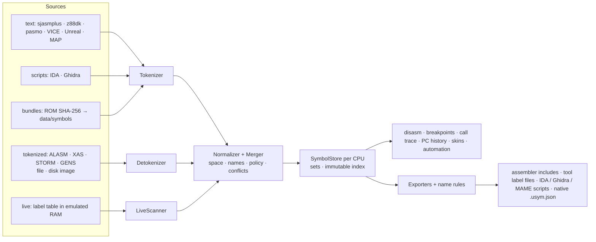

# Symbol exchange: one symbol model, importers and exporters for every source

Symbols (labels) from anywhere, in one model, out to anywhere:

- **in**: cross assemblers (sjasmplus, z88dk, pasmo), other emulators and debuggers (Unreal, VICE), disassemblers
  (IDA, Ghidra), ZX assemblers' **tokenized** sources and label tables (ALASM, XAS, STORM, GENS) from a file, a
  disk image or the **running** emulated machine, and ROM symbol bundles chosen by SHA-256;
- **one model**: name, address space (CPU view, ROM / RAM / cache page, device region, another CPU), kind, size,
  scope, source line, comment, aliases and provenance, in sets with priorities and explicit merge rules;
- **out**: assembler includes, other tools' label files, IDA / Ghidra / MAME scripts, and a lossless native file,
  with each target's name rules applied and every rename reported.

Replaces the file parsing inside `LabelManager` ([label-manager.md](../../emulator/design/debugger/label-manager.md)),
which stays as the facade. Closes the debugger additions' label import E7
([2026-10-04-debugger-additions](../2026-10-04-debugger-additions/TODO.md)).

## Documents

| File | Topic |
|---|---|
| [goals-and-requirements.md](goals-and-requirements.md) | **Start here.** Problem with a worked example, goals, non-goals, proposals for the owner (P-1…P-7), use cases, FR / NFR, acceptance, glossary |
| [architecture.md](architecture.md) | Component view, data model, import workflow, sequences (import, live scan, export, ROM bundle), decision trees DT-1…DT-4, threading, relation to existing code, **code placement** (mermaid flowchart, class, sequence and decision diagrams) |
| [formats.md](formats.md) | Format families (text, script, tokenized, live, native, bundle), lossiness matrix, catalog with detection and phases, examples side by side, name rules per target, the research plan for tokenized ZX assemblers, the native `*.usym.json` file |
| [tdd.md](tdd.md) | Layers and the std-only rule, model structs, index, sources and sinks, `IFormat`, the tokenizer, tokenized decoders, live scanners, normalization and merge, export, bundles manifest, surfaces, memory budget, phases S0-S9 |
| [test-and-benchmark-plan.md](test-and-benchmark-plan.md) | Golden corpus from the real tools, unit tests per file, round trips, fuzzing, live checks, benchmarks and targets |

## In one picture

## Where the code goes

`core/src/debugger/symbols/` (namespace `symbols`): `model/ io/ formats/ live/ bundles/` use only the standard
library, `adapters/` holds every emulator dependency; `LabelManager` stays the facade; `tools/symbols/symconv` is a
command-line converter built from the std-only part; bundles get `data/symbols/manifest.json`. Details:
[architecture.md](architecture.md) §9.

## Status

Design (2026-10-05): proposals P-1…P-7 wait for the owner; no code. See [TODO.md](TODO.md).
