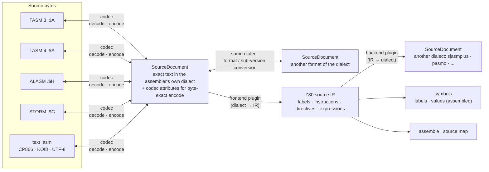

# unreal-asm: cross-assembler source library

A library that reads, writes and converts ZX Spectrum assembler sources in every form they exist in:

1. **Codecs**: one per source format and sub-version (TASM 3, TASM 4, ALASM 4.x / 5.x, STORM, ZX-ASM, XAS, GENS,
   plain text in its encodings). Each decodes the bytes into the exact text that assembler shows, and encodes that
   text back into the same bytes.
2. **Format conversion**: a source moves between formats and sub-versions of the **same dialect** through its text
   (TASM 3 file → TASM 4 file, tokenized ALASM → ALASM text file → tokenized ALASM 5).
3. **Dialect conversion**: separate **plugin modules** turn one assembler's syntax into another's through a common
   intermediate form (ALASM → sjasmplus, TASM → sjasmplus, GENS → pasmo, ...).
4. **Consumers** built on top: [symbols](symbols/README.md) (labels for the debugger, symbol files of other tools),
   assembling, source-level debugging, disk import / export in the emulator.

It lives in `core/src/3rdparty/unreal-asm` (owner decision 2026-10-05), next to `unreal-z80`: standard C++ only, its
own tests and a command-line tool; the emulator uses it through thin adapters.

## Documents

| File | Topic |
|---|---|
| [goals-and-requirements.md](goals-and-requirements.md) | **Start here.** Problem, goals, non-goals, decisions, open questions, use cases, requirements, acceptance, glossary |
| [architecture.md](architecture.md) | Layers, data model (source document, line, IR), the three pipelines (decode / encode, format conversion, dialect conversion), plugin model, consumers, decision trees, emulator integration (mermaid diagrams) |
| [source-formats.md](source-formats.md) | Every source format and sub-version: what is known, from where, how it is detected, what a byte-exact round trip has to keep |
| [research-storm.md](research-storm.md) | STORM 1.0beta … 1.3i: lines walked backwards, implied commands, number descriptors, packed labels, the 42-file corpus (phase A4) |
| [research-zxasm.md](research-zxasm.md) | ZX-ASM / ZAsm 2.4 … 4.20: text buffer with keyword pairs, the editor's rules, version detection, the 372-file corpus (phase A4) |
| [research-xas.md](research-xas.md) | XAS 4.18 … 9.10: a 36-byte header, lines without blanks ended by #0D / #0C / #09, one token table, XAS's packer and row formatter, all 18 sources found (phase A6) |
| [research-zeus.md](research-zeus.md) | ZEUS 1983, GG and PHT / v7.E: numbered tokenized lines ended by `#FF #FF`, the three keyword tables, ZEUS's first-match tokenizer, the ADS 2.0 sources (phase A6) |
| [research-gens.md](research-gens.md) | GENS1 … GENS4 (HiSoft Devpac) and the TR-DOS ports: numbered plain-text lines, the editor's blank-to-TAB compression, the listing's TAB stops, five real sources (phase A6) |
| [research-masm.md](research-masm.md) | MASM 1.0 demo … 3.0: TASM 3's framing (1.x) and the 2.0 / 3.0 stream, the keyword tables per version, the tokenizer's word rules, MASM 1.1's own source (phase A6) |
| [research-alasm.md](research-alasm.md) | ALASM 3.8 … 5.09: the file, lines and keywords from ALASM's own sources, the tables of every version, version detection, the 429-file corpus (phase A3) |
| [research-alasm-to-sjasmplus.md](research-alasm-to-sjasmplus.md) | ALASM → sjasmplus through the IR: the rules, the facts checked in ALASM 5.09 and sjasmplus 1.23, The Link's objects byte-equal (phase A5) |
| [research-tasm-to-sjasmplus.md](research-tasm-to-sjasmplus.md) | TASM 3 / 4.0 / 4.12 → sjasmplus: the rules, the GS 1.04 ROM rebuilt byte for byte, TASM 4.12 checked in the emulator (phase A5b) |
| [research-storm-to-sjasmplus.md](research-storm-to-sjasmplus.md) | STORM 1.3 → sjasmplus: several operands per instruction, postfix operators with priorities, built-in macros; STORM's own source and two programs assembled by STORM 1.3 in the emulator equal (phase A6) |
| [research-zxasm-to-sjasmplus.md](research-zxasm-to-sjasmplus.md) | ZX-ASM → sjasmplus: left to right with postfix functions, macros whose parameters persist, IFUSED libraries, nested PHASE; four programs assembled by ZAsm 3.15 in the emulator equal (phase A6) |
| [research-pasmo-backend.md](research-pasmo-backend.md) | IR → pasmo 0.5: pasmo's priorities, the displacement written out without PHASE, per-assembly EQU / DEFL; the oracle programs and the GS ROM equal through pasmo, 0 differences against sjasmplus on the corpus (phase A6) |
| [research-modern-assemblers.md](research-modern-assemblers.md) | Z80N across the assemblers in use today; frontends for pasmo, z80asm, zasm, FantASM, zmac, rasm, Specasm, Odin, Zeus on the Next, their oracles and what they do not read (phase A9) |
| [research-z88dk-backend.md](research-z88dk-backend.md) | IR → z88dk's z80asm: C's priorities on 32-bit words, a section per ORG, PHASE, the z80asm 2.3 workarounds; the oracle programs equal, 329 corpus sources equal to sjasmplus, the limits listed (phase A6) |
| [research-tasm.md](research-tasm.md) | TASM 3 / 4: the stream, the token table, the canonical tokenizer, what the real TASM 3.2 files show (phase A2) |
| [dialect-conversion.md](dialect-conversion.md) | The intermediate representation, frontend and backend plugins, the construct matrix, what cannot be converted, a worked ALASM → sjasmplus example |
| [prior-art.md](prior-art.md) | Existing converters and tools, local and public, compared; nothing is vendored |
| [tdd.md](tdd.md) | Library layout, namespaces, interfaces (`ISourceCodec`, `IDialectFrontend`, `IDialectBackend`), registry, CLI, emulator adapters, phases |
| [test-and-benchmark-plan.md](test-and-benchmark-plan.md) | Oracles (byte-exact round trips, the original assembler in the emulator, binary equality after conversion), corpus, tests, benchmarks |
| [asm-synchronizer.md](asm-synchronizer.md) | **P2, TDD**: both directions between the host and an assembler running in the emulator: extract its source from RAM (live labels, hints, convert), and inject a host source (sjasmplus → IR → retro backend) into its memory or a snapshot; per-assembler layouts, effort estimate |
| [symbols/](symbols/README.md) | The symbol module: one symbol model, symbol file codecs (sjasmplus, z88dk, VICE, IDA, Ghidra, ...), live label tables, ROM bundles |

## In one picture

## Status

Design (2026-10-05). Decided (D-1…D-12, [goals-and-requirements.md](goals-and-requirements.md) §3): the library and
its place; one codec per format, decode and encode; nothing vendored; TASM 3 / 4 first, every other codec queued;
compiled-in plugins; a neutral IR; TASM → sjasmplus first, sjasmplus the first output target; UTF-8 on the host; the
`zxasm` CLI; the symbol module's P-2…P-7 as recommended (2026-10-09).

Built and on master (A1-A9, review round A0 2026-10-09):

- the codecs of every version of the catalog's formats;
- the IR with frontends for every dialect and the sjasmplus, pasmo and z88dk backends, each conversion checked
  against the bytes the original assembler built;
- the emulator surfaces (`AsmControl`, the disk adapter, the Qt Disk files dialog);
- the symbol module ([symbols/README.md](symbols/README.md#status));
- benchmarks; the user guide [docs/features/unreal-asm.md](../../features/unreal-asm.md).

Next: the [asm-synchronizer](asm-synchronizer.md). Check scripts: `tools/verification/unreal-asm/`. Progress per phase: [TODO.md](TODO.md).
