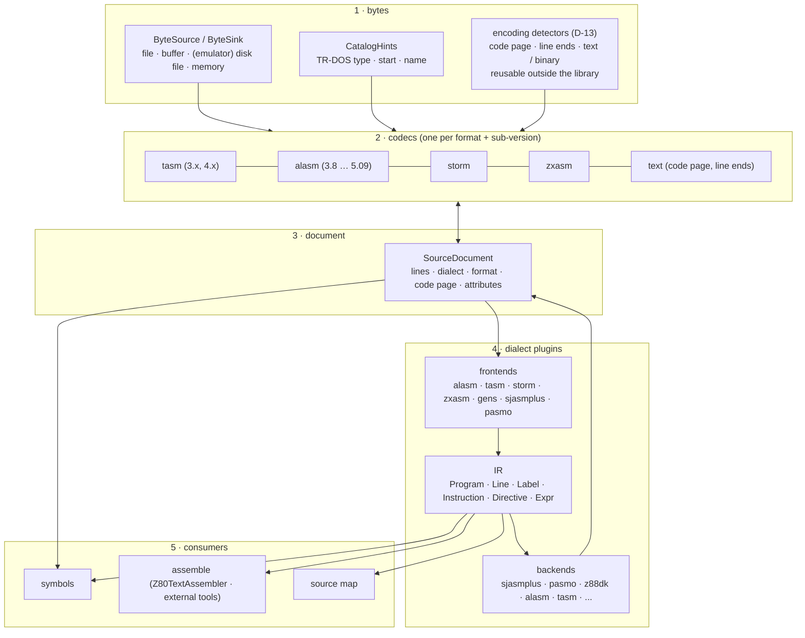
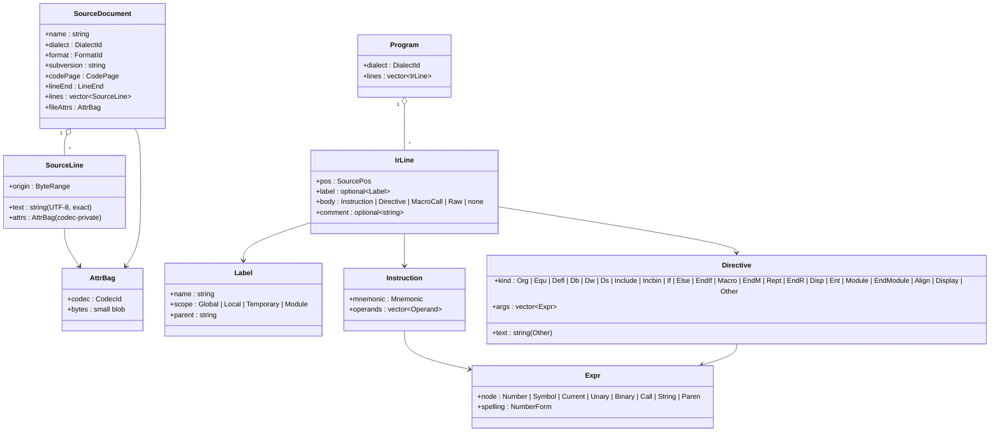
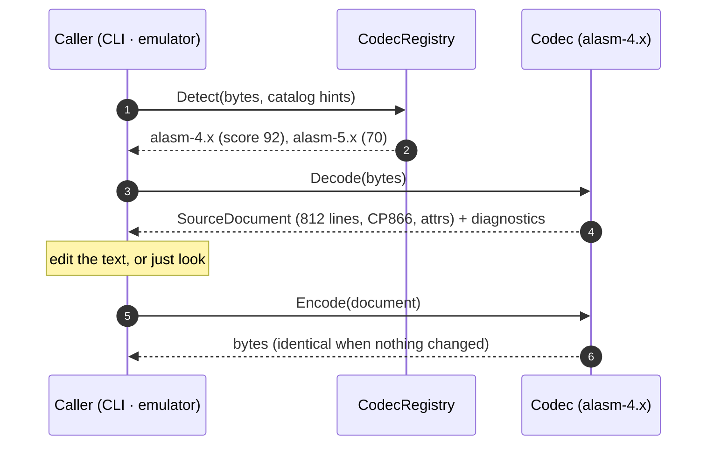
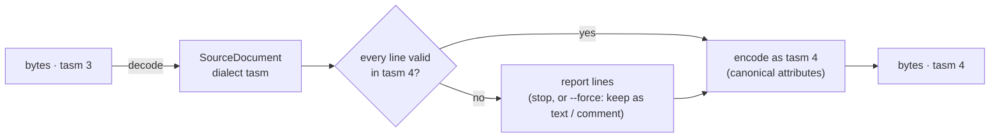
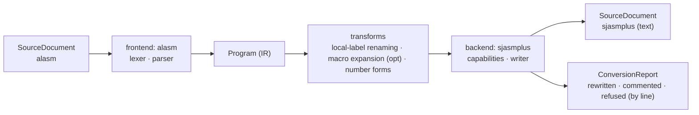
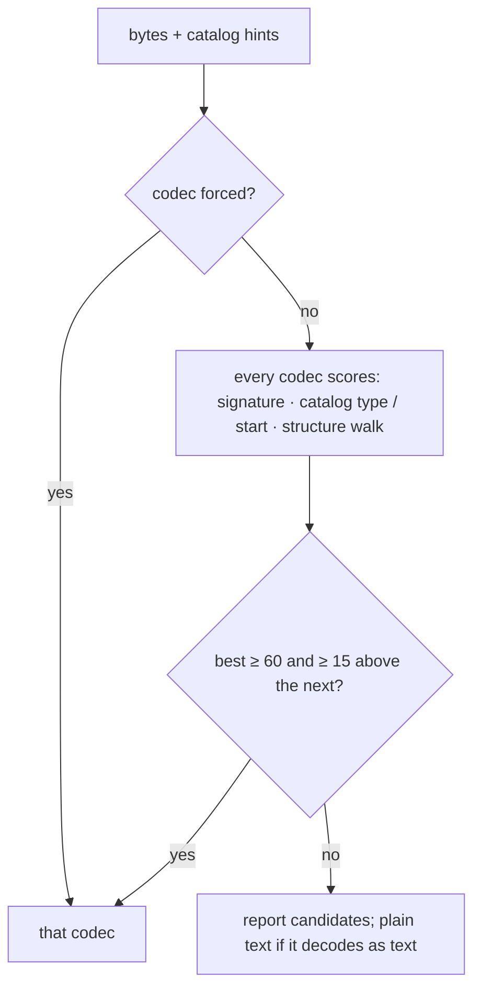
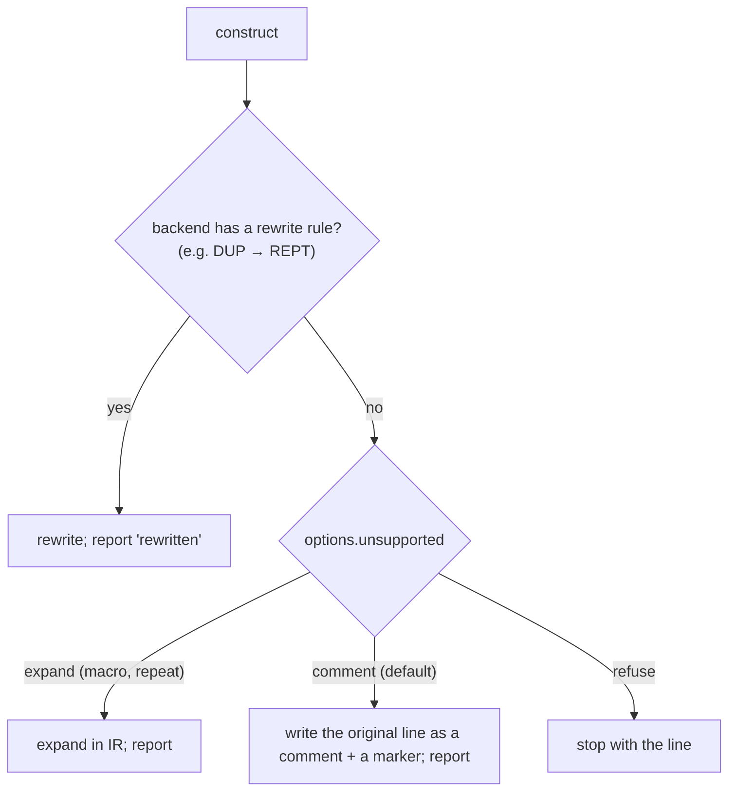
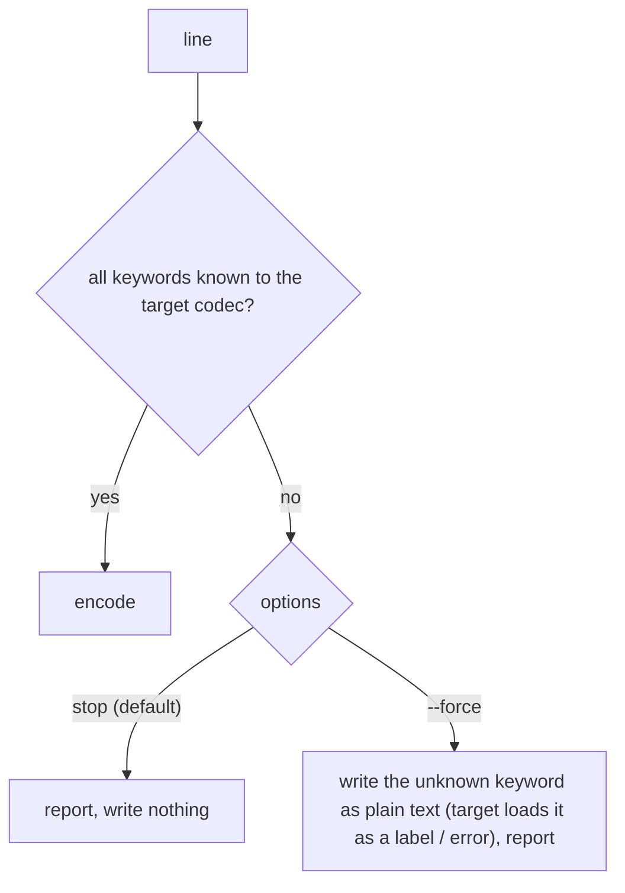
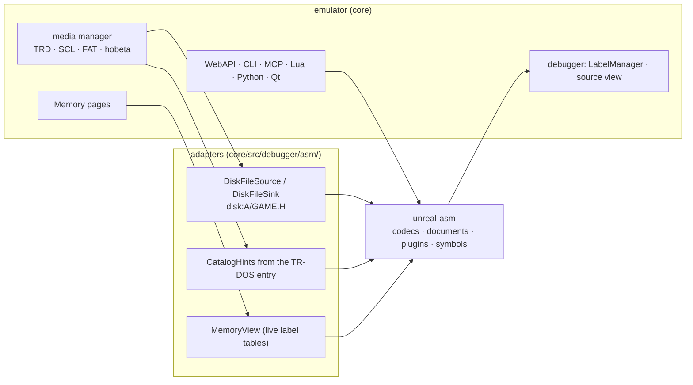

# unreal-asm: architecture

| | |
|---|---|
| **Date** | 2026-10-05 |
| **Status** | Draft for review |
| **Requirements** | [goals-and-requirements.md](goals-and-requirements.md) |
| **Next** | [source-formats.md](source-formats.md), [dialect-conversion.md](dialect-conversion.md), [tdd.md](tdd.md) |

## 1. In one paragraph

A **codec** turns a source file's bytes into a **SourceDocument**: the exact lines the assembler shows, in its own
**dialect**, plus the attributes needed to write the same bytes again. Two documents of the same dialect convert
into each other by re-encoding the text with another codec (**format conversion**). To change the dialect, a
**frontend** plugin parses the document into the **IR** (a dialect-free Z80 source model) and a **backend** plugin
writes the IR in the target dialect (**dialect conversion**). **Consumers** (symbols, assembling, source maps, the
emulator's disk tools) work on documents or on the IR.

## 2. Layers

Rule: layers 1-5 use the standard library only. The emulator's disk images, memory and debugger are reached through
adapters outside the library ([§8](#8-emulator-integration)).

## 3. Data model

**Why two models.** The document is for **lossless** work: decoding and encoding, format conversion, showing the
source as the assembler does. The IR is for **meaning**: converting dialects, extracting symbols, assembling. A
frontend can always fall back to `Raw` for a line it cannot parse, so nothing is dropped silently.

**Attributes.** Everything a format stores that is not text lives in the codec's attribute bag: ALASM's `#FF`
editor flags, whether TASM wrote blanks as a run (`#0A n` / `#01 n`) or literally, ZX-ASM's per-token case and
trailing-space bits, file headers. Encoding with the **same** codec uses them for a byte-exact result; another codec
ignores them and writes its own canonical form.

## 4. Pipeline 1: decode and encode

## 5. Pipeline 2: format conversion (same dialect)

The text decides. A sub-version conversion is "decode with one codec, check the lines against the other, encode
with the other". The check is a light pass of the dialect's lexer (are all keywords known to the target?), not a
full parse, so it works before any frontend exists.

## 6. Pipeline 3: dialect conversion (plugins)

- **Frontends** know one dialect's grammar (directives, label rules, expression syntax, macro syntax) and produce
  IR with source positions.
- **Transforms** are dialect-free IR passes shared by all pairs: rename labels to the target's rules, expand macros
  or repeat blocks when the target lacks them, change number spellings, resolve `$` / `*` current-address forms.
- **Backends** declare what they can write; for the rest the conversion options decide (DT-2).

N frontends and M backends give N × M pairs. Each frontend and each backend is its own module: a new dialect is one
frontend folder and one backend folder ([dialect-conversion.md](dialect-conversion.md)).

## 7. Decision trees

### DT-1: which codec reads these bytes

### DT-2: an IR construct the backend cannot write

### DT-3: a line a format-conversion target cannot hold

## 8. Emulator integration

| Surface (emulator) | Calls |
|---|---|
| WebAPI | `POST /asm/decode`, `/asm/encode`, `/asm/convert`, `GET /asm/formats`, `/asm/dialects`, `POST /asm/detect` (paths: host file, `disk:A/NAME.T`, or base64) |
| CLI | `asm decode / encode / convert / detect / formats / dialects` |
| MCP | tool `asm_source` with those actions |
| Lua, Python | `asm_decode{}`, `asm_encode{}`, `asm_convert{}`, ... |
| Qt | disk browser: "Open as source", "Export as text", "Convert to..."; the debugger's source view |
| standalone | `zxasm` CLI (no emulator) |

## 9. Code placement

`core/src/3rdparty/unreal-asm/` (owner decision D-3); full tree in [tdd.md](tdd.md) §2. The emulator adapters live in
`core/src/debugger/asm/` (and the symbol adapters in `core/src/debugger/symbols/`, [symbols/architecture.md](symbols/architecture.md) §9).
