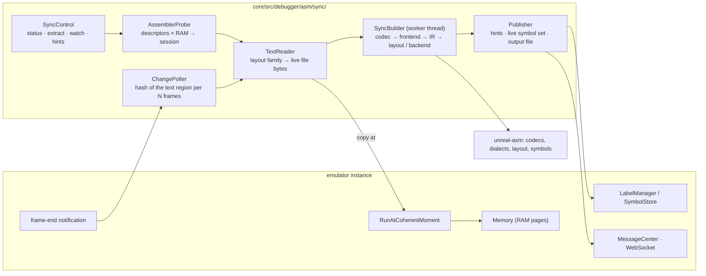
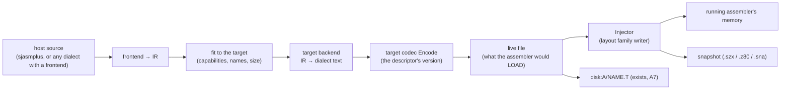

# unreal-asm: asm-synchronizer — TDD

| | |
|---|---|
| **Date** | 2026-10-09 (replaces the "memory bridge" design of 2026-10-05) |
| **Status** | Design, priority **P2** (owner decision, 2026-10-05). No code until the owner gives the go-ahead. The prerequisites exist: codecs (A2-A6), symbols (A8), emulator surfaces (A7) |
| **Builds on** | the source codecs ([source-formats.md](source-formats.md)), the IR and dialect plugins ([dialect-conversion.md](dialect-conversion.md)), `layout.h` (label values without building bytes), the symbol module ([symbols/](symbols/README.md)), `AsmControl` / `diskfiles` (A7), `Emulator::RunAtCoherentMoment` |
| **Effort** | §21: guest → host about 40 working days (first cut 6), host → guest about 60 (first cut 10), both together about 95 with the shared parts counted once |

## 1. Purpose

A user who writes a program **inside the emulator, in a ZX Spectrum assembler** (ALASM, TASM, STORM, XAS, ...) keeps
the source in that assembler's memory. The host cannot see it until the user saves it to a disk image and the host
reads the disk. And a source written on the host (sjasmplus) cannot be continued in the retro assembler until
someone retypes it there. The asm-synchronizer works in both directions:

- **Part A, guest → host** (§1-§12): it keeps a host-side copy of the source in step with the assembler's memory,
  read straight from RAM the way the assembler holds it.
- **Part B, host → guest** (§13-§20): it takes a host source (sjasmplus, or any dialect with a frontend), converts it
  through the IR to the assembler's dialect, encodes it in the assembler's own format and **injects** it into the
  running assembler's memory, or into a snapshot, ready to edit and assemble there.

### 1.1 Use cases

| # | Who / when | What the synchronizer does |
|---|---|---|
| UC-1 | Two hours of typing in ALASM without a save; the user wants the work on the host before the emulator is closed (or after a crash of the guest program) | **Extract**: the current source as text, as the assembler's file (byte-exact, its codec), or converted to sjasmplus / pasmo / z88dk, written to the host |
| UC-2 | A snapshot (.sna / .z80 / .szx) or a TTD recording someone made while working in an assembler; there is no disk with the file | **Extract from a snapshot**: load it paused and extract; no execution needed |
| UC-3 | Debugging the program in the emulator's debugger while editing it in the assembler | **Live labels**: after each pause in typing the source is built on the host, and the debugger shows `call PLAYMUS` instead of `call #8123`, before the user assembles in the guest |
| UC-4 | Typing in the guest editor | **Hints**: the host build reports errors as they appear ("line 120: PLAYMUS not defined", "line 88: JR out of range") in the Qt panel, the WebSocket and MCP |
| UC-5 | Start in the retro assembler, continue in a modern toolchain | **Convert**: the live source to sjasmplus with the A5-A9 backends, kept up to date on the host file (`watch` with an output path) |
| UC-6 | Teaching / streaming: show the source an assembler holds next to the running machine | **Live view**: the decoded text in a read-only panel that follows the guest editor |

### 1.2 Not in scope

- Merging edits made on both sides at once (a three-way merge). One side is the source of truth per operation:
  extract (guest wins) or inject (host wins); an inject over a guest text changed since the last sync asks first.
- PC cross assemblers (ASM80) and the modern cross assemblers of A9: they run on the host, so there is no guest memory.
- Making the guest assembler's own label table authoritative: it is used when it exists (§5.5), but the live labels
  come from the host build.

## 2. Today's manual path (what the synchronizer replaces)

1. Save the source in the guest assembler to the disk in drive A.
2. `asm decode disk:A/NAME.H` (or the Qt "Disk files" dialog) for the text; `asm convert` for another dialect.
3. Assemble in the guest, then `symbols import-live` for its label table.

The synchronizer removes step 1. It also turns steps 2 and 3 into a background loop.

## 3. Terms

| Term | Meaning |
|---|---|
| assembler session | one assembler (name + version) running in one emulator instance |
| descriptor | per assembler and version: how to recognize it in RAM and where its text, pointers, pages and label table are (§6) |
| layout family | the shape of the text in memory; one reader implements each family (§5.2) |
| snapshot of the text | the text's bytes copied at a coherent moment, plus the editor state (cursor line, the line being typed) |
| live file | the text as a file of the assembler's format: what its own SAVE would write, made from the snapshot |
| watch | the synchronizer armed: it polls the text and rebuilds after changes |

## 4. Architecture



| Component | Responsibility |
|---|---|
| `AssemblerProbe` | tries every descriptor's identification rule against the RAM (a string at an address, a code signature, sane pointers); gives the candidates with scores, best first |
| `TextReader` | reads the text with the descriptor's layout family at a coherent moment; joins the parts (a gap buffer), adds the line being typed when the editor keeps it apart, and returns the **live file** (the bytes the assembler's SAVE would write) plus the editor state |
| `ChangePoller` | when watching: at every N-th frame end (default 25 = 0.5 s), hashes the text region of the session (≤ 48 KB, xxHash64, microseconds); a changed hash plus a quiet period (debounce, 500 ms) triggers a read |
| `SyncBuilder` | on a worker thread: live file → codec (`Decode`) → frontend → IR → `layout::Layout` for the label values (no external tool needed); optionally the sjasmplus backend + an external sjasmplus for bytes; a newer snapshot cancels a running build |
| `Publisher` | posts hints (`NC_ASM_SYNC_HINTS`), replaces the symbol set `live:sync:<assembler>`, writes the output file of a watch (text, the assembler's own format, or a converted dialect) |
| `SyncControl` | the one layer every surface calls (the TTDControl / AsmControl pattern): `status`, `probe`, `extract`, `watch`, `unwatch`, `hints` |

### 4.1 Why polling and not a write hook

A write hook on the memory path (like the TTD dirty tracker) would cost every guest write a branch while armed. It
also needs the combined-gate work and an A/B benchmark (performance guidelines). The text region is small, and a
hash of 16-48 KB every 0.5 s is far below 0.1 % of a frame. The poller runs on the frame-end notification only while
a watch is armed, so with the synchronizer off it costs nothing. The memory path does not change at all.

### 4.2 Threads and coherence

- The copy of the text runs inside `RunAtCoherentMoment` (paused, stopped, or between two frames): one `memcpy` per
  region, then the emulation goes on. Everything else runs off the emulation thread.
- The worker owns the snapshot; a newer snapshot cancels the build by a generation counter.
- Publishing the symbol set goes through `LabelManager` (its own locking); the WebSocket event through MessageCenter.

### 4.3 As built (Y0-Y1, 2026-10-09)

**Where it lives** (owner decision, 2026-10-09). The synchronizer is a subproject of unreal-asm, and the emulator
only adapts it:

| Part | Place | What |
|---|---|---|
| readers | `unrealasm/sync/reader.h`, `src/sync/reader.cpp` | descriptors, probe, the three layout families (Y0) |
| session | `unrealasm/sync/session.h`, `src/sync/session.cpp` | `SyncSession`: Tick (who is there, the text, a change by the hash of the live file), TakeBuild (after the quiet period), Build (codec → sjasmplus conversion → layout → labels and hints). Standard library only, no threads, no clock: the caller gives the time |
| adapter | `core/src/debugger/asm/sync/asmsyncservice.h` | `AsmSyncService`, one per instance, owned by `DebugManager`: the worker thread, the coherent copy, publishing |
| surface | `core/src/debugger/asm/sync/synccontrol.h` | `SyncControl` behind AsmControl's `sync-*` verbs: WebAPI, CLI, MCP, Lua, Python |

**What differs from the drawing above.**

- **No frame-end subscription.** The worker wakes every `interval` ms (default 250), so the quiet period is the
  same in turbo. The thread exists only while a watch is on.
- **What is copied.** A look copies the pages the CPU sees plus the text's page (at most five 16 KB pages), every page
  while no assembler is known yet. It does not copy the text region alone.
- **What counts as a change.** The hash (FNV-1a) is of the live file, so the cursor and the screen do not count as a
  change.
- **No cancellation.** The build runs on the same worker, after the look that found the text quiet. A change made
  during a build is seen at the next look, so nothing needs cancelling.
- **Locking.** `LabelManager` has no lock of its own. The worker publishes the way the WebAPI threads import, by
  replacing the set `live:sync:<assembler>` at priority 900000: above every loaded file, below `user`.
- **Notifications.** The MessageCenter topic is `NC_ASM_SYNC` (payload `AsmSyncPayload`). The WebSocket topic
  `asm_sync` carries `asm_sync_found`, `asm_sync_changed`, `asm_sync_built`, `asm_sync_lost` and `asm_sync_ambiguous`.
- **Hints on the source's lines.** The sjasmplus backend now records, for every line it writes, the source line it
  came from (`SourceLine::origin`). `SymbolsFromProject` uses that to report the layout's messages on the source's
  lines, so `symconv source` and `import-source` gain it too.

## 5. Generic algorithms

### 5.1 Page ids

Assemblers name their pages in their own way. Each descriptor declares a `PageIdRule` to turn the stored id into a
physical RAM page of the current machine:

| Rule | Used by | Translation |
|---|---|---|
| `Port7FFD` | ALASM (its memory driver ids: low 3 bits = port `#7FFD` bits 0-2, bits 6-7 = the 512K / 1024K extension of the driver) | Pentagon 128: `id & 7`; Pentagon 512: `(id & 7) | ((id >> 3) & 0x18)` per the driver in use (128KDRV, PENTDRV, P1MBDRV ... from the assembler's disk); the translation table is taken from the driver the assembler loaded (identified by its bytes) |
| `MappedAtC000` | TASM 4.12, XAS (text in the page that is mapped at `#C000` while the editor runs) | the page the machine maps at `#C000` at the coherent moment (`Memory::GetRAMPageForBank(3)`) |
| `Fixed` | 48K assemblers (GENS, ZEUS, Laser Genius, Prometheus, Primus, PASM) | CPU addresses, no paging |

### 5.2 Layout families

| Family | Shape | Readers' work | Assemblers |
|---|---|---|---|
| `FileImage` | the page holds the file as the assembler saves it: header + lines; the length in a header field | copy `[base, base + header + length)` | ALASM 4.4x / 5.x (verified), XAS (from its research), STORM (from its source) |
| `GapBuffer` | the text before the cursor from the start to the gap start, the text after it from the gap end to the top; the line being edited in a line buffer | copy both parts, encode the current line with the codec from the line buffer, join; add the end record the file has | TASM 4.12 (verified) |
| `Linear` | one contiguous buffer from a start to an end pointer, with or without an end marker | copy `[start, end)` + the file's end marker | ZX-ASM (file = buffer), MASM (catalog start = text address), GENS (text + `00 00`), Laser Genius (`#7F2E` to `(#A973)` + `FF FF`), ZEUS / Primus, Prometheus, PASM (to be confirmed) |

The live file is exactly what the codec reads. So `Decode` works unchanged. The byte-exact check (live file ==
the file the assembler writes on SAVE) is the acceptance test of every descriptor (§10).

### 5.3 The line being typed

Most editors keep the line under the cursor apart until Enter (ALASM: `IX+#0C` bit 0; TASM 4.12: the line buffer near
`#928A`). The descriptor says how:

- `NotInText`: the extract is the text without the unconfirmed change, and the status says "1 line being edited". ALASM.
- `InLineBuffer`: the line buffer holds the line as text (or tokens); the reader encodes it with the codec and puts
  it at the gap. TASM 4.12.
- `InPlace`: the editor edits the text itself (XAS, from its research).

### 5.4 Projects

A source that `INCLUDE`s others needs them for a build. They are taken from the guest's own state first, then the
disk:

1. Other texts in memory: ALASM keeps one text per page (each with its header and name); XAS / ZAsm likewise.
2. The disk in the drive the assembler uses: `diskfiles` (A7) reads `NAME.T` by the INCLUDE's name (the name rules of
   each frontend, as `zxasm convert` resolves them).
3. A host folder named in the watch (`--project dir`): the converted files of a project already on the host.

Binaries (`INCBIN`) come from the disk the same way. A missing part is a hint, and the build goes on as far as it can.

### 5.5 Labels

- The **live symbol set** `live:sync:<assembler>` is replaced after every successful build. Its priority is just above
  the files, below the user set (`SymbolStore` rules, A8).
- The guest's own table (ALASM, XAS; `symbols/live.h`) is used when the guest has assembled more recently than the
  last host build (a generation flag in the descriptor: ALASM `IX+#2E` bit 7 "compiled"). This is optional, and the
  host build wins when both exist.

### 5.6 Failure states

| State | Meaning | Surfaces show |
|---|---|---|
| `none` | no known assembler in RAM | the probe's best guesses below the threshold |
| `ambiguous` | two candidates score alike (two assemblers in memory) | the candidates; the user picks one (`probe` → `watch --assembler`) |
| `partial` | the text decodes, the build fails | hints; the last good labels stay |
| `inconsistent` | pointers out of range (the guest is mid-update, or not that version) | re-read at the next frame; after 3 failures, `none` |

## 6. The descriptor

```cpp
struct SyncDescriptor
{
    std::string id;                 // "alasm-5.0x", "tasm-4.12" ...
    std::string codec, version;     // the unreal-asm codec and subversion of the live file
    std::vector<Signature> identify;   // bytes / strings at addresses (page + offset or CPU address), all must match
    PageIdRule pages;
    LayoutFamily family;
    // FileImage: where the page id lives, the base, the length field, its header size
    // GapBuffer: the four pointers, the line buffer, the end record
    // Linear: start / end pointers (or fixed start), end marker
    LayoutParams params;
    TypingRule typing;              // NotInText / InLineBuffer / InPlace, and where the flag or buffer is
    std::optional<LabelTableRef> labels;   // the guest's table (symbols/live.h scanner id)
    std::vector<IncludeRule> project;      // where other texts live (pages, names)
};
```

Descriptors are **data** (a table in `sync/descriptors.cpp`) plus a small hook when a family needs one: the TASM
line buffer decoder. Every descriptor has a golden RAM dump in the test data (§10).

## 7. Per assembler and version

Each section gives what is known (verified live, read in the assembler's own source, or inferred from its file
format) and what an implementation needs: research (R7), reader, tests. The day counts are summed in §12.

### 7.1 ALASM 5.07-5.09 (and the ZX Evolution 5.09 build)

| | |
|---|---|
| **Knowledge** | **verified live** (2026-10-09) and in ALASM 5.09's own sources (`Al50.H`, `Vars.H`) |
| identification | `ALASM v5.09` at `#97C5` (page 2). The copy at `#BE00` is a screen line buffer the editor overwrites, so it does not identify (Y0, 2026-10-09; the research note said `#BE06`) |
| pages | `Port7FFD` (its driver ids: `#C6` = the text in the 512K build; `SRCstart EQU #26` in the 1024K build) |
| family | `FileImage`. The page id of the current text is at `IX+#0D` = `#80CC` (`IX = #80BF`). The page from `#C000` holds the file: `T_NAME` `#C000`, `T_SIZE` `#C021` (the length after the 64-byte header), `T_STR` `#C023` (current line address), `T_OPT` `#C027` (changed), `T_SURE` `#C028`. The live file is `#C000 .. #C040 + word(#C021)` with `T_OPT` written as 0, as SAVE writes it (Y0: SNAKE loaded, typing and edited were byte-identical to ALASM's own saves) |
| typing | `NotInText`: `IX+#0C` bit 0 = the current line is modified; Enter writes it |
| project | one text per page: a scan of the RAM pages for headers with the signature at `+#28` gives every text in memory with its name; `IX+#0A` = the page INCLUDE loads into |
| labels | page 3 (`#43` / `#C3`), `alasm-table` scanner; `IX+#2E` bit 7 = compiled |
| **Work** | reader (shared `FileImage`), driver id table, golden dumps (fibo, an edited text, a 512K session), project scan: **1.5 d** |

### 7.2 ALASM 5.0 and 5.05

| | |
|---|---|
| **Knowledge** | inferred, not checked: the same file format as 5.07-5.09; 5.05's own sources are in the collection (`alasm/wdc/alasm505.zip`) and can confirm the variables |
| **Work** | confirm `#80CC`, the identification string's address (5.05's title differs) and the header: **0.5 d** |

### 7.3 ALASM 4.4x and 4.5 (4.43-4.46, 4.5)

| | |
|---|---|
| **Knowledge** | **verified live** for 4.44 (text page id `#06` at `#80CC`, AL444nfo byte-identical loaded and edited, `ALASM v4.44` at `#9E7E`; `#BE00` is overwritten in the editor as in 5.09); 4.46's source (`AL446SRC`, `Al44.H`) has the same `sysvars` at `#80BF` and the same `T_*` fields. The title's address differs per build: every further version needs its dump |
| differences | 4.4x label table ends at `#3F7F` (5.x `#3DFF`); 4.5 keeps its table in page 6 |
| **Work** | descriptor rows for 4.43, 4.45, 4.46, 4.5, a 4.5 dump: **0.5 d** |

### 7.4 ALASM 3.8c, 4.2, 4.42

| | |
|---|---|
| **Knowledge** | unknown in memory; the file format is the same family (header with the signature at `+#28`) |
| research | find `sysvars` (search the code page for the text page id after loading two texts in two pages); 4.2's ALM loader crashes on a Pentagon (TODO), so 4.2 may stay out |
| **Work** | **1 d** (3.8c, 4.42; 4.2 only if it starts) |

### 7.5 TASM 4.12

| | |
|---|---|
| **Knowledge** | **verified live** (2026-10-09, SNAKE) |
| identification | `TASM128>` at `#9CDD` and `Import TASM3.0 source file: ` at `#A394` (4.0 has no import) |
| pages | lower part in page 2 (`#8000` window); upper part `MappedAtC000` (page 6 on a Pentagon 128) |
| family | `GapBuffer`: `#8F59` text start (`#A6EE`), `#8F5B` top (`#FFFF`, exclusive), `#8F5D` gap start, `#8F5F` gap end. Lines are records `n`, `n` bytes, `n`. `#94D9` counts the lines (the cursor's line included), `#94CE` is the cursor's line |
| typing | `InLineBuffer`: in the editor the cursor's line is only in the line buffer, 128 bytes of blank-padded text at `#928A` (`#930A` holds a packed copy that lags). Whether the editor holds it: the records before and after the gap add up to `#94D9` (the command line: Quit put it back and moved the gap to the end) or to one less (the editor). The reader encodes the buffer with the `tasm` codec (4.12, CP866) and puts it at the gap. No flag in memory tells the modes apart; this count does (checked on four dumps: top, middle, typing, command line) |
| end | the file's `FF FF` end record is added by SAVE: the reader appends it (the bytes at the gap start are no guide: after Enter on the last line they can read `FF FF` in the editor too) |
| caveat | Edit leaves a stale copy of the file at the text start; only the pointers count |
| **Work** | identification, the line buffer's exact address and length, the gap reader, golden dumps (cursor at the top, in the middle, at the end, mid-typing): **1.5 d** |

### 7.6 TASM 4.0 and 4.4

| | |
|---|---|
| **Knowledge** | unknown; their files share 4.12's format family (`[n] body [n]` records, `FF FF`), so a gap buffer is likely |
| research | the same edit-and-diff session as 4.12; find the pointers by the text start's value |
| **Work** | **1 d** |

### 7.7 TASM 3.x and 2.0

| | |
|---|---|
| **Knowledge** | unknown; 2.0 is plain text with editor tabs; 3.x tokenized |
| **Work** | **1.5 d** (both) |

### 7.8 STORM 1.2 / 1.3 (1.0 beta)

| | |
|---|---|
| **Knowledge** | from STORM's own source (`MAIN`): in memory `#C000` the end pointer, `#C002` the name, `#C00A` an `#FF` sentinel, the text from `#C00B` (1.0 beta: no name field, `#C003`); lines `[body][length]` walked backwards |
| research | which page holds `#C000` while STORM runs (it unpacks to `#6F19`-`#BFFF`); confirm live |
| family | `FileImage`-like: `[#C00B, (#C000))` |
| **Work** | **1 d** |

### 7.9 ZX-ASM 3.0 / 3.01 / 3.10, ZX ASM Lite 1.07, ZAsm 3.15-4.20

| | |
|---|---|
| **Knowledge** | the file is "the editor's text buffer as is" (no header, no end marker); the buffer's address and pointers unknown; ZAsm 3.2x and later want 512K and keep several texts |
| research | two sessions (3.10, 4.20 on a Pentagon 512); start / end pointers by the edit-and-diff method; the text list of ZAsm |
| family | `Linear` |
| **Work** | **2 d** (three generations) |

### 7.10 ZX-ASM 2.4-2.6

| | |
|---|---|
| **Knowledge** | text with blank runs, saved type `C` at `#A135`-`#A1DF` / `#2020`: the start field is probably the buffer's address |
| **Work** | **0.5 d** |

### 7.11 XAS 4.18, 5.05, 7.43 / 7.447, 9.07m, 9.10

| | |
|---|---|
| **Knowledge** | from XAS's research: "the text is loaded as it is at `#C000` and edited in place there". The header holds a 29-byte title, the cursor line address at +29 (`#C023` = the first line), editor state at +31 (bit 7 of byte 34 = changed), the start sentinel `#01` at +35, the lines, and `#00` at the end. The token tables and routines per version are known (research-xas.md §2) |
| identification | the title of a new text per version (`XAS by Max Petrov (HPM) 3.091` ...) is in the code; a code signature at the line packer's address per version |
| pages | `MappedAtC000` (the page XAS maps; 7.447 keeps labels in page 6, on a Pentagon 512 in page 14) |
| family | `FileImage` from `#C000` to the `#00` end |
| typing | `InPlace` (to be confirmed) |
| **Work** | five versions share the reader; identification per version, golden dumps: **1.5 d** |

### 7.12 MASM 1.0 demo, 1.1, 1.3, 2.0, 3.0

| | |
|---|---|
| **Knowledge** | the catalog start of a saved file is the text address of the build (1.1 / 1.3: 38667 `#970B`; 2.0: 38106; 3.0: 37155; demo 37178); the file ends with `FF` (not counted); at run time MMM1 (3.0) sits in page 2 and a working copy of the assembler in page 1 at `#C000` |
| research | the end pointer (edit-and-diff); 2.0 / 3.0 are packed (read after they unpacked) |
| family | `Linear` from the known start |
| **Work** | **1.5 d** |

### 7.13 GENS 3 / GENS 4 (and GENS4B on TR-DOS)

| | |
|---|---|
| **Knowledge** | the text ends with `00 00`; GENS4 started its code after its text and symbol table at `#8B87` in one session and `#CFBB` in another, so the text sits **below** the code at an address set at start-up (`Buffer size?`, the `C` command); the editor rewrites the line buffer on Enter (research-gens.md) |
| research | the text start / end pointers in GENS3 and GENS4 (48K), GENS4B |
| family | `Linear` + `00 00` |
| **Work** | **1.5 d** |

### 7.14 ZEUS 1983, GG, 1.1 (PHT), v7.E; Zeus Plus 2.16, Zeus Pro 2.01

| | |
|---|---|
| **Knowledge** | the file is line records with a line number and `00` ends, `FF FF` at the end; the text's address in memory not yet known; six programs share the 1983 table (A6 variants) |
| research | the text start / end per program (48K and the 128K PHT shell) |
| family | `Linear` |
| **Work** | **2 d** (six programs, two layouts expected) |

### 7.15 Primus Assembler 2.9

| | |
|---|---|
| **Knowledge** | the text buffer starts at 33364 (`#8254`, its files' start); ZEUS 1983's records with DISK for DISP and Russian letters at `#EB`-`#FF` |
| research | the end pointer |
| **Work** | **0.5 d** |

### 7.16 Laser Genius 1.04 (Beta)

| | |
|---|---|
| **Knowledge** | paragraphs from the address STATS calls `file` (`#7F2E` in 1.04 Beta), then `FF FF`; the end in `(#A973)` without the hash extensions and `(#ADA1)` with them loaded (the Phoenix typing helper of A6 uses both) |
| family | `Linear`: `[#7F2E, (end))` + `FF FF`; the end pointer chosen by the hash extensions' presence (a signature) |
| **Work** | **1 d** (the two configurations, Phoenix statements in the build) |

### 7.17 PROMETHEUS

| | |
|---|---|
| **Knowledge** | records and the label table of its saves are known (research-prometheus.md); the memory layout is not |
| research | the text and table pointers (48K; tape loading works) |
| **Work** | **1 d** |

### 7.18 Power Assembler (PASM 3.0)

| | |
|---|---|
| **Knowledge** | a text format; the object code goes to page 4 at `#E000` while PASM runs; the text's place is unknown |
| research | the text pointers (ZAP / ITXT behavior known from A6) |
| **Work** | **1 d** |

### 7.19 Not covered

ASM80 and the A9 cross assemblers (they run on the host). STS, a monitor, keeps no source. ALASM 2.x, TASM 5.5, MASM 2.0
syntax and XAS USEL / MAKE stay blocked as in the TODO; a descriptor can come later without a design change.

## 8. Surfaces

All of them go through `SyncControl` (`core/src/debugger/asm/sync/synccontrol.h`), which uses the same reply shape as
AsmControl.

| Surface | Calls |
|---|---|
| WebAPI | `GET /emulator/{id}/asm/sync` (status: assembler, version, family, text location, lines, typing state, last build, hints count); `POST /asm/sync/probe`; `POST /asm/sync/extract {as: text \| file \| dialect, to?, output?}`; `POST /asm/sync/watch {assembler?, output?, as?, to?, project?, interval?}`; `DELETE /asm/sync/watch`; `GET /asm/sync/hints`; WebSocket events `asm_sync_changed`, `asm_sync_built {ok, hints}` |
| CLI | `asm sync status \| probe \| extract [--as text\|file\|dialect] [--to d] [--output f] \| watch [...] \| unwatch \| hints` |
| MCP | `asm_source` actions `sync_status`, `sync_probe`, `sync_extract`, `sync_watch`, `sync_unwatch`, `sync_hints` |
| Lua / Python | `asm_sync_status()`, `asm_sync_extract{...}`, `asm_sync_watch{...}` ... |
| Qt | a "Live source" dock: the decoded text (read-only, the guest's cursor line highlighted), hints in the margin, the status line (assembler, version, built / failed, labels count), buttons Extract..., Convert..., Watch on / off |

## 9. Performance and safety

| Item | Budget / rule |
|---|---|
| synchronizer off | zero: no hook, no notification subscription |
| watch armed | one hash of the text region per 25 frames (≤ 48 KB: ~10 µs); a read (≤ 48 KB `memcpy`) only after a change and the quiet period |
| host build | worker thread; ALASM → IR → layout of a 6 K-line source ≈ 30 ms at the measured A9 speeds |
| guest memory | never written; reads only at coherent moments; TTD recordings and replays unaffected (reads are not recorded events) |
| several instances | one synchronizer per instance (videowall: off by default) |

## 10. Tests

| Kind | What |
|---|---|
| golden RAM dumps | per descriptor: the pages a session needs, saved after scripted sessions (like `symbols/live` dumps), with the file the assembler saved at the same moment; `TextReader` must give the saved file byte for byte |
| reader unit tests | each family on its dumps: cursor at the top / middle / end, a line being typed, an empty text, a full page |
| probe tests | every dump identifies as its descriptor and no other; a dump of plain BASIC identifies as `none` |
| integration (core-tests) | an emulator with a dumped session loaded (`Memory` pages written directly, no guest execution): extract, watch with a changed page, the symbol set published, hints on a broken line |
| live checks | the automation scripts (`tools/verification/unreal-asm/emulator/`) drive each assembler, type a line, and compare the synchronizer's live file with the guest's SAVE |
| surfaces | AsmControl-style unit tests of `SyncControl`; MCP routing; a Qt widget test of the dock |

## 11. Phases

Status: **Y0 built (2026-10-09)**:

- the library part is `unrealasm/sync/reader.h` (descriptors, probe, the three readers), tested on golden dumps
  (`testdata/sync`, made by `tools/verification/unreal-asm/emulator/sync-dumps.py`);
- the emulator part is `SyncControl` (`core/src/debugger/asm/sync/synccontrol.h`), reached through AsmControl's
  `sync-*` verbs;
- surfaces: WebAPI `GET /asm/sync`, `POST /asm/sync/probe` / `extract`; CLI `asm sync`; MCP `asm_source` `sync_*`;
- descriptors: ALASM 5.09, ALASM 4.44, TASM 4.12. The other versions of §7.2 / §7.3 need their dumps, because the title
  address differs per build.

Status: **Y1 built (2026-10-09)** (§4.3):

- the watch: `sync-watch`, `sync-unwatch`, `sync-hints`;
- WebAPI `POST` / `DELETE /asm/sync/watch`, `GET /asm/sync/hints`;
- CLI `asm sync watch` / `unwatch` / `hints`;
- MCP `sync_watch` / `sync_unwatch` / `sync_hints`;
- Lua and Python `asm_sync_*`;
- WebSocket topic `asm_sync`.

Checked live on TASM 4.12: a line typed at the end, `MYLBL CALL nowhere`, appeared as the label `mylbl` after the next
build. The hint `unknown symbol NOWHERE` pointed at its line (105).

| Phase | Work | Ends with |
|---|---|---|
| Y0 | Descriptor model, probe, the three readers, `SyncControl` `status` / `probe` / `extract`, ALASM 5.x / 4.4x and TASM 4.12, WebAPI + CLI + MCP | UC-1 / UC-2 for ALASM and TASM 4.12 |
| Y1 | Poller, debounce, worker build, hints, live symbol set; Lua / Python | UC-3 / UC-4 / UC-5 for those |
| Y2 | Qt "Live source" dock | UC-6 |
| Y3 | 128K assemblers: XAS, STORM, ZX-ASM / ZAsm, MASM, TASM 4.0 / 4.4 / 3.x / 2.0, ALASM 3.8c / 4.42 / 5.0 / 5.05 | descriptors with dumps |
| Y4 | 48K assemblers: GENS, ZEUS family, Primus, Laser Genius, PROMETHEUS, PASM | descriptors with dumps |
| Y5 | Projects: other texts in memory, INCLUDE from the disk / a host folder | multi-file builds |

## 12. Effort (part A)

Working days for one developer who knows the codebase (the pace of A7 / A8 here), research included. Each estimate
covers the code, the golden dumps, the tests, the docs and the live check.

| Block | Days |
|---|---|
| Framework: descriptor model, probe, `PageIdRule`s, three readers, coherent copy, `SyncControl` | 3 |
| Poller + debounce + worker build + cancellation + hints + live symbol set | 3 |
| Surfaces: WebAPI + OpenAPI + WebSocket events, CLI, MCP, Lua, Python, recipe | 2 |
| Qt "Live source" dock | 2 |
| Projects (other texts in memory, INCLUDE from the disk / a host folder) | 2 |
| **Framework subtotal** | **12** |
| ALASM 5.07-5.09 (7.1) | 1.5 |
| ALASM 5.0 / 5.05 (7.2) | 0.5 |
| ALASM 4.4x / 4.5 (7.3) | 0.5 |
| ALASM 3.8c / 4.2 / 4.42 (7.4) | 1 |
| TASM 4.12 (7.5) | 1.5 |
| TASM 4.0 / 4.4 (7.6) | 1 |
| TASM 3.x / 2.0 (7.7) | 1.5 |
| STORM (7.8) | 1 |
| ZX-ASM 3.x / Lite / ZAsm (7.9) | 2 |
| ZX-ASM 2.x (7.10) | 0.5 |
| XAS, five versions (7.11) | 1.5 |
| MASM (7.12) | 1.5 |
| GENS 3 / 4 / 4B (7.13) | 1.5 |
| ZEUS family (7.14) | 2 |
| Primus (7.15) | 0.5 |
| Laser Genius (7.16) | 1 |
| PROMETHEUS (7.17) | 1 |
| PASM (7.18) | 1 |
| **Assemblers subtotal** | **21** |
| Contingency (unknown layouts are the risk: ~20 % of the total) | 7 |
| **Total (part A)** | **≈ 40** |

**First useful cut (Y0 for ALASM 5.x / 4.4x + TASM 4.12, extract only, WebAPI / CLI / MCP): about 6 days.** Add the
watch, hints and live labels (Y1) for those two and it is about 10 days. Each further assembler adds the days of its
section.

The risks:
- A layout unlike the three families (a compressed text, a linked list of lines). It would need a fourth reader (+1-2 d).
- Programs that are packed or relocate themselves (MASM 2.0 / 3.0, STORM, XAS); they are read after they unpack.
- Memory drivers of the 512K / 1024K builds: the id → page table per driver.


# Part B: host → guest

## 13. Use cases

| # | Who / when | What happens |
|---|---|---|
| UR-1 | A project kept in sjasmplus on the host; the author wants to continue in ALASM inside the emulator (the authentic toolchain, a demo party rule, teaching) | **Inject**: sjasmplus → IR → ALASM → the ALASM text in the running ALASM's memory, the editor showing it |
| UR-2 | Proving that a converted source really builds in the original assembler | **Round trip**: inject, let the guest assemble (scripted keys), compare its bytes with sjasmplus' output. This is the A5-A9 oracle check, without a disk in between |
| UR-3 | A ready-to-run snapshot for a course or a release: the assembler loaded with the program's source | **Inject into a snapshot**: into an existing one, or a new one made from the assembler's idle template |
| UR-4 | Editing on the host, assembling in the guest | **Push watch**: the host file is watched; each save is converted and injected (with the guest's own changes checked first) |
| UR-5 | Moving a source between two retro assemblers (ALASM → TASM) | **Convert + inject**: any dialect with a frontend as the source, any with a backend as the target |

Not in scope: injecting while the guest assembler is assembling or saving (refused, §16.2); assemblers without a
backend (they get one first, §15).

## 14. Pipeline



- The frontends exist for every dialect (A5-A9). The **sjasmplus frontend** reads the constructs the backends write
  and the common ones of hand-written projects. Real projects may also use STRUCT, MODULE, Lua, DEVICE / SAVEBIN and
  similar: §15.3 covers them.
- The **target backends are new** for the retro dialects. Today the backends are sjasmplus, pasmo and z88dk. pasmo
  and z88dk share `classicbackend` with a target table, and the retro backends follow that pattern (§15).
- The codecs encode every dialect byte-exact (A2-A6), so the live file is the assembler's own format.
- The **Injector** is the inverse of part A's `TextReader`, one writer per layout family (§16).

## 15. Target backends (IR → retro dialect)

### 15.1 Shared core: `retrobackend`

The retro dialects differ from sjasmplus along a small number of axes. `retrobackend` takes a per-dialect table and
does the work once:

| Axis | Retro dialects | Strategy |
|---|---|---|
| expression order | left to right without priorities (TASM, GENS, ZEUS, XAS, MASM, PROMETHEUS, PASM), ALASM's own order, C-like (Laser Genius) | parenthesize where the target has parentheses. Where it has none (GENS), reorder, or fold to a number with the layout (`layout::Layout` gives every value) and keep the original as a comment |
| word size / sign | 16-bit, signed (GENS) or unsigned | masks and folding as the pasmo backend does (`expressionBits`, `unsignedArithmetic`) |
| names | length (GENS 6, XAS 7, ZEUS / Primus 6-ish), character set, case, reserved words (register and mnemonic names) | a collision-free renaming table (the symbol module's DT-3 name rules), reported and written as a comment header |
| local labels | dot / `@` / none | prefix with the parent label |
| macros | none (GENS3, ZEUS 1983), positional (ALASM `\0`, TASM `\0`), by value (GENS4 MAC) | expand at the call when the target cannot express them |
| repetition | DUP / REPT → none in most | unroll (warning above a size limit) |
| conditionals | IF / ELSE / ENDIF variants, one block level (XAS) | map, or evaluate with the layout and keep the taken branch |
| DISP / PHASE | ALASM DISP, ZEUS DISP-as-offset, none | map, or write the displacement out (as for pasmo) |
| data | DB / DEFB / DM / DEFM forms, string escapes, `DUP` items | map; split long lines |
| INCLUDE / INCBIN | per dialect, with name limits (TR-DOS 8+1) | map, with names fitted to the disk |
| line length / text size | ALASM 16 K per text page, XAS a page, TASM the gap buffer's free space, 48K assemblers' free RAM | split into several texts joined by the target's INCLUDE (ALASM: one text per page), or refuse with the size needed |
| tokens | the codec tokenizes on Encode | nothing in the backend; Encode reports text it cannot tokenize |

Every loss is a diagnostic with the source line: folded expressions, expanded macros, renamed names, unrolled
loops, split texts.

### 15.2 Per dialect

| Target | What is particular | Oracle (the guest assembles the injected text; bytes equal sjasmplus') | Days |
|---|---|---|---|
| ALASM 3.8-5.09 | its own expression order and `\0` macros; DISP; `?` defined; one text per page (16 K): split by INCLUDE; version keyword differences (IF / IF0, UNTIL) through the codec version | ALASM 5.09 (`assemble-in-emulator.py alasm509`; 4.44 starts the same way) | 3 |
| TASM 2.0, 3.x, 4.0 / 4.4 / 4.12 | `.PAGE`, `DEFMAC` with `\0`, `.LOCAL` (4.12); 2.0 plain text | TASM 4.12 (script exists) | 3 |
| STORM 1.2 / 1.3 | packed labels (the codec), STORM's expressions, `INCB` | STORM 1.3 (script exists) | 2.5 |
| ZX-ASM 3.x / ZAsm, 2.x | ZAsm keywords by version; 2.x plain | ZAsm 3.15 (script exists) | 2.5 |
| XAS 4.18-9.10 | 7-character names, `!ASSM` / `!CONT` one block level, postfix `&L &H` | XAS 7.447 / 4.18 (scripts exist) | 3 |
| MASM 1.x / 3.0 | MAC (3.0), no macros (1.x) | MASM 1.1 (script exists) | 2.5 |
| GENS 3 / 4 | 6-character names, no parentheses, signed 16-bit, `*F` includes | GENS4 (script exists) | 3 |
| ZEUS family + Primus | 1983 table; DISP as an offset; v7.E `*` `/` | ZEUS 1983 / 1.1 / v7.E (scripts exist) | 3 |
| Laser Genius | paragraph numbers, C-like expressions, `COND` | Laser Genius 1.04 (the A6 typing helper, to be moved into `tools/verification`) | 2.5 |
| PROMETHEUS | its record format, left to right | PROMETHEUS (A6 probe path) | 2 |
| PASM 3.0 | `+ - * /` only, no `&` / `|`, `$` limits (research) | PASM 3.0 (the A6 session script, to be moved into `tools/verification`) | 2 |
| **Subtotal** | | | **29** |

### 15.3 Source side

| Work | Days |
|---|---|
| `retrobackend` core: the axes above, the renaming table, folding with the layout, text splitting, diagnostics | 4 |
| sjasmplus frontend coverage of real projects: STRUCT, MODULE, DEVICE / SLOT / PAGE, SAVEBIN / SAVESNA (dropped with a note), a Lua block (refused with the line), `DEFINE` | 3 |

## 16. Injector

### 16.1 Writers per layout family

The writer is the inverse of the part A reader, with the same descriptor fields.

| Family | Write |
|---|---|
| `FileImage` (ALASM, XAS, STORM) | the live file into the text page from its base. Then the header fields: ALASM `T_SIZE` = length - 64, `T_STR` = `#C040` (the first line), `T_OPT` = changed, the name at `T_NAME`; `IX+#0D` (`#80CC`) = the page's id. The rest of the page is zeroed. Another page for each split text (§15.1) |
| `GapBuffer` (TASM 4.12) | the text as after a fresh Edit: the whole text in the upper part at `top - length`, gap start = text start, gap end = `top - length` + the first line's record, the first line into the line buffer. The line buffer's form needs research (part of 7.5) |
| `Linear` (the others) | the text from the start, the end pointer = start + length, the end marker; refused when it passes the assembler's limit (the next region's start) |

After the write the editor's screen still shows the old text. The descriptor gives a **refresh**: an editor command
that redraws (for ALASM, a cursor key or the "Edit" command typed into its command line), sent through the keyboard
injection (A7 surfaces use it already).

### 16.2 Preconditions and safety

- Only on an explicit request (or an armed push watch). Never while the guest assembler is assembling, saving or
  loading: the descriptor's "idle" rule (the PC in the editor's key-wait loop, or a state flag such as ALASM
  `IX+#2E` / `IX+#34`) must hold at the coherent moment. Otherwise the request is refused with the reason.
- A guest text changed since the last sync (part A's hash) is not overwritten without `force`. The old text is kept
  on the host (`.bak` live file) for an undo.
- The write is a TTD **tool edit** (`BeginToolEdit` / `EndToolEdit`, like the debugger's memory and sector edits), so
  recordings stay replayable.
- The size limit is checked before anything is written; a partial write never happens.

### 16.3 Snapshots

| Mode | How |
|---|---|
| into an existing snapshot | load it into a hidden paused instance (no execution), identify the assembler (part A probe), inject, save in the same format through the snapshot pipeline |
| from a template | per descriptor, an **idle template snapshot**: the assembler started from its disk by the automation scripts and stopped in its editor with an empty text. `inject --template alasm-5.09 --snapshot out.szx` loads the template, injects and saves; or keeps the instance running (`--run`) |
| templates themselves | made once by a script per assembler (`tools/verification/unreal-asm/emulator/make-template.py`), stored as test data with the descriptor; the assembler binaries come from the collection's disks |

## 17. Surfaces (part B)

| Surface | Calls |
|---|---|
| WebAPI | `POST /emulator/{id}/asm/sync/inject {path \| data + name \| text, from?, assembler?, version?, force?, refresh?}`; `POST /asm/sync/inject-snapshot {source, snapshot?, template?, output, format?}`; `POST /asm/sync/push-watch {path, ...}` / `DELETE`; `GET /asm/sync/templates` |
| CLI | `asm sync inject <file> [--from d] [--assembler a] [--force]`, `asm sync inject-snapshot <file> --template a --output x.szx`, `asm sync push-watch <file>`, `asm sync templates` |
| MCP | `asm_source` actions `sync_inject`, `sync_inject_snapshot`, `sync_push_watch`, `sync_templates` |
| Lua / Python | `asm_sync_inject{...}` ... |
| Qt | the "Live source" dock gets Inject... (a host file, the target assembler, the conversion report) and Push watch on / off |

## 18. Tests (part B)

| Kind | What |
|---|---|
| backend round trip | for each target: sjasmplus → IR → target → (target frontend) → IR → sjasmplus assembles to the same bytes as the original; on the A5-A9 corpora and constructs files |
| guest oracle | for each target: inject, the guest assembles (scripted, existing `assemble-in-emulator.py` steps without the disk), bytes equal sjasmplus'. This is the acceptance test of each backend and injector |
| injector unit tests | on the part A golden dumps: inject, then read back with the part A reader: the live file comes back byte for byte; the header fields as the assembler sets them on LOAD (compared with a dump taken after a real LOAD of the same file) |
| preconditions | busy states refused (a dump taken mid-assembly), a changed guest text refused without `force` |
| snapshots | inject into each template, save, load in a fresh instance, extract: the same text |

## 19. Phases (part B)

| Phase | Work |
|---|---|
| Z0 | `retrobackend` core + ALASM backend + the `FileImage` writer for ALASM + inject on WebAPI / CLI / MCP; the ALASM oracle |
| Z1 | Snapshots: into an existing one, ALASM template |
| Z2 | Push watch, the Qt dock's Inject |
| Z3 | Backends + writers + templates: TASM, XAS, STORM, ZX-ASM, MASM |
| Z4 | 48K targets: GENS, ZEUS family, Primus, Laser Genius, PROMETHEUS, PASM |
| Z5 | sjasmplus frontend coverage of real projects (§15.3, second row) |

## 20. Effort (part B)

| Block | Days |
|---|---|
| `retrobackend` core (§15.3) | 4 |
| Target backends, eleven dialect families with their oracles (§15.2) | 29 |
| sjasmplus frontend coverage of real projects (§15.3) | 3 |
| Injector: three family writers, refresh, preconditions, undo, TTD tool edit | 3 |
| Per-assembler injection: idle rule, header fields, refresh keys, a template each (24 programs × ~0.3) | 7 |
| Snapshots: into an existing one, templates and their script | 3 |
| Surfaces (WebAPI / OpenAPI, CLI, MCP, Lua, Python) | 2 |
| Qt: Inject and Push watch in the dock | 1.5 |
| Contingency (backends meet dialect corners; injecting may need more editor state than reading) | 8 |
| **Total (part B)** | **≈ 60** |

**First useful cut (Z0 + Z1 for ALASM): about 10 days**: sjasmplus source → ALASM in a running ALASM or in a
snapshot, checked by ALASM assembling it.

## 21. Effort, both directions

| | Days |
|---|---|
| Part A (guest → host), §12 | 40 |
| Part B (host → guest), §20 | 60 |
| Shared, counted twice above: descriptors and research (part B's per-assembler injection reuses part A's), `SyncControl`, the Qt dock frame, surfaces plumbing | −5 |
| **Both** | **≈ 95** |

| First cuts | Days |
|---|---|
| ALASM both ways (extract + inject, memory and snapshot), WebAPI / CLI / MCP | ≈ 14 |
| + TASM 4.12 both ways | ≈ 20 |
| + watch / push watch, hints, live labels, Qt dock for those two | ≈ 27 |
