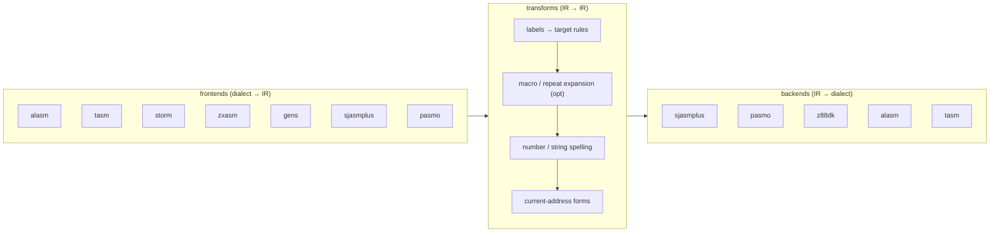

# unreal-asm: dialect conversion

| | |
|---|---|
| **Date** | 2026-10-05 |
| **Status** | Draft; every dialect fact marked **verify** is confirmed from the assembler's manual and a probe source before its plugin is written |
| **Order** | after the codecs (decision D-4) |

## 1. Why an IR

Converting ALASM to sjasmplus, TASM to sjasmplus, STORM to pasmo and so on directly needs one converter per pair.
With a common **intermediate representation** each dialect needs one **frontend** (dialect → IR) and one **backend**
(IR → dialect); every pair then works. Shared passes (label renaming, macro expansion, number spelling) are written
once, on the IR.

## 2. The IR

The IR is **neutral** (decision D-7): it is designed from every dialect of the catalog at once and copies no
dialect's spelling. Directive kinds, label scopes, number forms and expression operators are the union of what the
dialects have; what only one dialect has gets its own node kind (or `Other` with the dialect named) rather than
being forced into another dialect's construct. The construct matrix (§4) is filled for **all** dialects before the
IR node set is frozen (phase A5).

A `Program` is a list of `IrLine`s; each keeps its source position.

| Node | Holds | Example (any dialect) |
|---|---|---|
| `Label` | name, scope (global / local / temporary / module), parent for locals | `PLAY`, `.loop`, `1` (temporary) |
| `Instruction` | mnemonic (a closed Z80 set, incl. undocumented `SLI` / `SLL`, `IXH` / `IXL` / `LX` / `HX` forms normalized), operands | `LD A,(IX+5)` |
| `Operand` | register, register pair, indirect, indexed with displacement, condition, immediate `Expr` | `(IX+OFFS)` |
| `Directive` | normalized kind + args: `Org`, `Equ`, `Defl` (redefinable), `Db`, `Dw`, `Ds` (with fill), `Include`, `Incbin`, `If` / `Else` / `EndIf`, `Macro` / `EndM`, `Rept` / `EndR`, `Disp` / `Ent` (assemble for another address), `Module` / `EndModule`, `Align`, `Display` (print at assembly), `End`, `Other` (kept by name) | `ORG #8000`, `DEFB 1,2,"AB"` |
| `MacroCall` | name, argument texts | `PUSHALL` |
| `Expr` | tree: number (value + **spelling**: `#C000`, `$C000`, `0xC000`, `C000h`, `%1010`, `'A'`), symbol, current address, unary, binary (with the dialect's operator), function (`HIGH`, `LOW`), string, parentheses | `(TABLE+2)*256` |
| `Comment` | text, position (own line / end of line) | `; plays one frame` |
| `Raw` | the original line text when the frontend cannot parse it | — |

Operators with different precedence between dialects are parsed into the tree by the **frontend's** precedence and
written by the **backend** with parentheses where the target's precedence would differ.

## 3. Plugins



A plugin is a folder with its grammar / writer and its tests, registered in one table (open question Q-2 proposes
compiled-in modules). A backend declares **capabilities**: which IR nodes and directive kinds it writes, its label
rules (characters, length, local syntax, case), its number spellings, its reserved words.

## 4. Construct matrix (to be filled from each dialect's research)

`●` native, `R` by a rewrite rule, `X` by expansion, `–` not expressible (comment / refuse), `?` to verify.

| Construct | sjasmplus | pasmo | z88dk | ALASM | TASM | STORM | ZX-ASM | GENS |
|---|---|---|---|---|---|---|---|---|
| global labels | ● | ● | ● | ● | ● | ● | ● | ● |
| local labels | ● (`.name`) | ? | ? | ? | ? | ? | ? | ? |
| temporary labels | ● (`1`, `1B` / `1F`) | ? | ? | ? | ? | ? | ? | ? |
| `EQU` / `DEFL` | ● / ● | ● / ? | ? | ● / ? | ● / ? | ? | ? | ● / ? |
| `DB` / `DW` / `DS` | ● | ● | ● | ● | ● (`defb`, `defw`, `defs`, `db`, `dw`, `ds` in L1's table) | ? | ? | ● |
| `INCLUDE` / `INCBIN` | ● / ● | ● / ● | ? | ● / ● | ● / ● (L1) | ? | ? | ? |
| conditionals | ● | ● | ● | ● | ? | ? | ? | ? |
| macros | ● | ● | ● | ● | TASM 4 (`DEFMAC` / `ENDMAC`, P1) | ? | ? | ? |
| repeat blocks | ● (`DUP` / `REPT`) | ● (`REPT`) | ? | ● (`DUP` / `EDUP`, L8) | ? | ? | ? | ? |
| assemble for another address | ● (`DISP` / `ENT`) | ? | ? | ● (`DISP`, L8) | ● (`PHASE` / `UNPHASE`, L1) | ? | ? | ? |
| modules / name spaces | ● | – | ? | ? | – | – | – | – |
| print at assembly | ● (`DISPLAY`) | ? | ? | ● (`DISPLAY`, L8) | TASM 4 (`DISPLAY`, P1) | ? | ? | ? |
| undocumented instructions | ● | ● | ● | ● (`LX` / `HX` forms) | ● (`lx`, `hx`, `ly`, `hy`, `sli`, L1) | ? | ? | ? |

The `?` cells are filled by the research of each dialect (the probe source of [source-formats.md](source-formats.md)
§3 shows what the assembler accepts and what binary it builds).

## 5. Worked example (illustrative; real spellings come from the ALASM research)

An ALASM fragment, decoded:

```text
        ORG #8000
PLAY    LD HL,TABLE
.loop   LD A,(HL)
        INC HL
        DJNZ .loop
        DUP 4
        NOP
        EDUP
        DISPLAY "end: ",$
TABLE   DB 1,2,3
```

Into IR (simplified): `Org(#8000)`; `Label PLAY` + `LD HL,TABLE`; `Label .loop (parent PLAY)` + `LD A,(HL)`; ...;
`Rept(4){NOP}`; `Display("end: ", Current)`; `Label TABLE` + `Db(1,2,3)`.

Out of the sjasmplus backend: the same lines with sjasmplus spellings (`DUP 4` / `EDUP` are native there, the local
label keeps its `.` form, numbers keep `#8000` unless the option asks for `0x8000`). Out of a backend without repeat
blocks the `DUP` is expanded into four `NOP` lines and the report says so.

**The test** for this pair: ALASM in the emulator assembles the original → binary A; sjasmplus assembles the
converted text → binary B; A == B.

## 6. What cannot be converted, and how it is reported

| Case | Default | Options |
|---|---|---|
| a directive the target lacks and no rule covers | the line as a comment + `; unreal-asm: not converted (<kind>)`, reported | `--unsupported refuse` / `expand` |
| macro systems that differ (argument syntax, local labels in macros) | expand the macro at its call sites when the target cannot express it | `--macros keep` (write as is, report) |
| expressions the target evaluates differently (precedence, 16-bit vs 32-bit) | parentheses added; a value check by assembling both (test) | — |
| a line the frontend could not parse (`Raw`) | copied as a comment, reported | `--raw keep` |
| a label invalid in the target | renamed by the target's rules (collision-free), rename list in the report and the file header | — |
