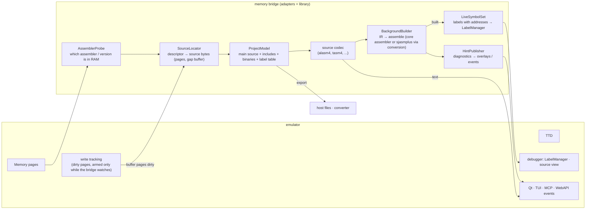
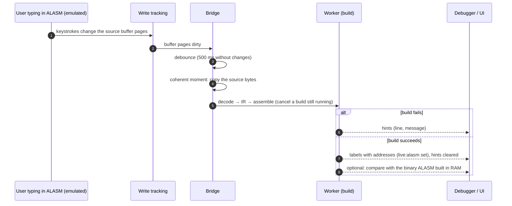
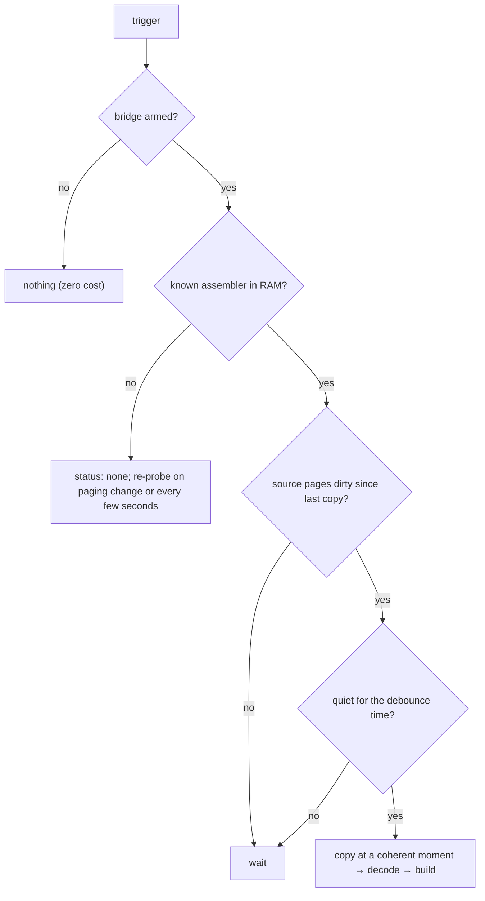

# unreal-asm: memory bridge (sources straight from the emulated machine) — design, P2

| | |
|---|---|
| **Date** | 2026-10-05 |
| **Status** | Design only, priority **P2** (owner, 2026-10-05): no code until the codecs (A2-A4) and symbols (A8) exist |
| **Builds on** | the source codecs ([source-formats.md](source-formats.md)), the IR and dialect plugins ([dialect-conversion.md](dialect-conversion.md)), the symbol module ([symbols/](symbols/README.md)), the emulator's memory, TTD and debugger |

## 1. The idea in one example

A user types a program in **ALASM** running inside the emulated Spectrum. Without saving anything to a disk:

1. The bridge recognizes "ALASM 4.4 is running, its source is in RAM page 1 from `#C000` to `#E7A3`, its label table
   in page 6".
2. It reads the source from memory, decodes it with the `alasm4` codec, and shows it in the emulator as text, or
   writes `game.alasm.asm` / converts it to sjasmplus on the host.
3. In the background it builds the project on the host (the core assembler or sjasmplus after conversion) after
   every pause in typing, and shows hints: `line 120: label PLAYMUS not defined`, `line 88: JR out of range`.
4. When the build succeeds, the debugger gets **every label with its address in real time**, even before the user
   assembles in ALASM.

## 2. Why it is possible

Each assembler keeps its source in RAM in the **same tokenized form** it writes to disk (or a close one) and manages
that memory in a fixed way: a start pointer, an end (or length) pointer, the bank(s) it pages in for long sources, a
label table with a known layout (for ALASM and XAS already documented: [prior-art.md](prior-art.md) P7). So "knowing
the memory management of each assembler" means a small per-assembler, per-version **memory descriptor**:

| Field | Example (to be researched; illustrative) |
|---|---|
| identification | a code signature at a known address of the assembler's code, the version string in its RAM |
| source buffer | where the start / end pointers live (system variables of the assembler), which page holds the text, how a long source spans pages |
| label table | its page, start rule and entry layout (P7 for ALASM / XAS), valid only after an assembly pass |
| project parts | included files and binaries the assembler keeps in memory or names (INCLUDE / INCBIN), the current file of a multi-file project |
| editing state | the cursor line, a "modified" flag, a buffer gap (an editor with a gap buffer keeps text in two parts) |

Descriptors are research products (a new research step R7 per assembler in [source-formats.md](source-formats.md)
§3): run the assembler in the emulator, type a known source, find the pointers by diffing RAM (TTD records the
session), confirm on a second version.

## 3. Components

- **AssemblerProbe** scores every known descriptor against the RAM (code signatures, version string, sane pointers);
  the best above a threshold wins, otherwise "no known assembler".
- **SourceLocator** reads the pointers, copies the source bytes at a coherent moment (paused, or between two frames:
  `Emulator::RunAtCoherentMoment`), joins a gap buffer, and hands the bytes to the codec.
- **ProjectModel** collects the parts of a project: included sources (in RAM or on the current disk through the
  media manager), binaries for `INCBIN`, the assembler's own label table when it has assembled.
- **BackgroundBuilder** runs on a worker thread: frontend → IR → assemble (the core's `Z80TextAssembler`, or the
  sjasmplus backend + an external sjasmplus when configured), with the project's ORG / DISP so addresses match.
- **HintPublisher** turns diagnostics into events (`asm_hint {line, message, severity}`) and debugger overlays.
- **LiveSymbolSet** publishes the build's labels as a symbol set `live:<assembler>` (the symbol module's merge rules,
  [symbols/architecture.md](symbols/architecture.md) DT-2), replaced on every successful build.

## 4. The live loop

## 5. Decision tree: when to extract

## 6. Constraints

| Constraint | How |
|---|---|
| **No cost when off** | write tracking of the buffer pages is armed only while the bridge watches, through the existing gated paths (performance guideline "combined gate"); A/B benchmark when it is built |
| **Read-only** | the bridge never writes guest memory; TTD recordings and replays are unaffected (reads at coherent moments) |
| **Partial states** | a source mid-edit may not decode or build: hints say so; the last good labels stay until a new build succeeds |
| **Versions** | one descriptor per assembler version; an unknown version is reported, never guessed |
| **Several assemblers / instances** | the probe reports all candidates; the user picks one; each emulator instance has its own bridge |
| **Host builds** | the worker thread never blocks the emulation; a newer change cancels a running build |

## 7. Surfaces (when built)

| Surface | Calls |
|---|---|
| WebAPI | `GET /asm/live` (status: assembler, version, source location, last build), `POST /asm/live/extract {to: text \| codec \| dialect, path}`, `POST /asm/live/watch {enabled}`; events `asm_hint`, `asm_built` on the WebSocket |
| MCP | `asm_source` actions `live_status`, `live_extract`, `live_watch` |
| CLI, Lua, Python | `asm live ...`, `asm_live_*` |
| Qt | a "Live source" panel: the decoded source, hints in the margin, build status; labels in the debugger |

## 8. Phases (P2, after A2-A4 and A8)

| Phase | Work |
|---|---|
| B0 | Research R7: memory descriptors for TASM 4, ALASM 4 / 5 (sessions recorded with TTD) |
| B1 | AssemblerProbe + SourceLocator + one-shot extract (to text / codec / dialect) on every surface |
| B2 | ProjectModel: includes, binaries, the assembler's label table |
| B3 | Write tracking (gated, A/B) + debounce + live re-extract |
| B4 | BackgroundBuilder + hints |
| B5 | LiveSymbolSet: real-time labels in the debugger |
| B6 | More assemblers (STORM, ZX-ASM, XAS, ...) as their codecs and descriptors arrive |
