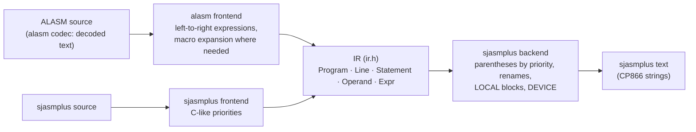

# unreal-asm: ALASM → sjasmplus (phase A5)

| | |
|---|---|
| **Date** | 2026-10-05 |
| **Code** | IR `include/unrealasm/ir.h`, plugins `src/dialects/` (`alasm` frontend, `sjasmplus` frontend and backend), `Convert` / `ConvertProject` in `include/unrealasm/dialect.h`, `zxasm convert` |
| **Oracles** | the binaries ALASM built: The Link's objects on `testdata/machines/pentagon1024sl/TheLink.trd`, and a constructs sample assembled by ALASM 5.09 in the emulator |
| **Result** | 18 of 19 The Link objects byte-equal (the 19th was built from an older version of its source); the constructs sample byte-equal; 513 sources from 21 disks convert, 508 of them come back unchanged through the sjasmplus frontend + backend |

## 1. Example first

An ALASM fragment and what `zxasm convert --to sjasmplus` writes:

```text
        LD A,1+2*3              LD A,(1+2)*3            ; ALASM computes left to right
        LD HL,'table            LD HL,high table
        LD BC,#1234<4           LD BC,+(((#1234&#FFFF)<<4|(#1234&#FFFF)>>>(16-4))&#FFFF)
        DW 0-2/2                DW (0-2&#FFFF)/(2&#FFFF) ; 16-bit unsigned: #7FFF
        IF0 ?debug              IF exist debug
iy      EQU 7                   L_iy    EQU 7            ; a label, not the register
        LD IY,iy                LD IY,L_iy
        EXA                     EX AF,AF'
        LD L,0,H,1              LD L,0
                                LD H,1
```

The file `testdata/dialects/alasm-sjasmplus/constructs.alasm.txt` has every construct of this page; its sjasmplus
form (`constructs.sjasmplus.asm`) assembles to `constructs.bin`, the 67 bytes ALASM 5.09 built from the original.

## 2. How the conversion is built



- **Expressions** are trees. The frontend reads its assembler's rules (ALASM: left to right, no priorities; sjasmplus:
  C-like priorities); the backend writes parentheses wherever the target's priorities would read the tree
  differently.
- **Program-level arithmetic**: `Program::expressionBits = 16` and `unsignedArithmetic` tell the backend that the
  source computed in 16-bit unsigned words; sjasmplus computes in 32-bit signed, so division gets `&#FFFF` masks and
  ALASM's rotations are spelled out.
- **A project**: `ConvertProject` converts all sources of a disk together: an `INCLUDE` wildcard resolves to the last
  matching name (as ALASM does), macros defined in one file are known in the others (for the number of arguments).
  `zxasm convert disk.trd --to sjasmplus -o dir` also extracts the files `INCBIN` names.

## 3. ALASM facts the conversion relies on

From ALASM 5.07's help (`AL50HELP`, on the [ALASMENG](http://alonecoder.nedopc.com/zx/ALASMENG.rar) disk) and checked
in the emulator where marked.

| Fact | Conversion |
|---|---|
| Expressions run left to right, 16-bit unsigned | parentheses by tree; `/` masked to 16 bits |
| `'x` / `.x` high / low byte, `!` xor, `<` / `>` rotate a 16-bit word, postfix `~` inverts the result so far | `high` / `low`, `^`, the rotation formula, `~(...)` |
| `?label` is 0 when the label is defined, `#FFFF` when not | `IF exist x` / `IF !exist x`; inside an expression `((!exist x)*#FFFF)` |
| An instruction operand starting with `(` is memory up to the matching `)`; the rest is ignored (**emulator**: `LD DE,(65536-46)*98/256` assembles as `LD DE,(#FFD2)`, the line is shown as a warning) | the same, with a warning |
| Keywords are capitals; a lower-case `iy`, `b`, `hl` is a label | labels named like registers or conditions get `L_` (also when defined in another file) |
| `LOCAL` / `ENDL`: labels inside are invisible outside, except `@name` (the `@` is part of the name, **emulator**: `JP shared` does not find `@shared`) and labels used outside the block | block labels get `__L<n>`; inside a macro sjasmplus' `.name`; `@name` stays (sjasmplus reads it as the global label) |
| Macros: `\0`…`\9`; `\P` returns parameter 0 and shifts the numbering, `\R` restores it; `\C` is the symbol at the parameter pointer, `\N` moves it, `\S<c>` the text up to `<c>` (help, "MACRO") | named parameters `_arg0`…; a macro that glues a parameter to a name or uses `\P \R \C \N \S` is expanded at its calls |
| A call may give fewer arguments than the macro uses | empty arguments added (sjasmplus needs them all) |
| `IF0`, `IFN`; `DUP` / `EDUP`; `REPEAT` / `UNTIL0` (`UNTIL`) | `IF`; `DUP` / `EDUP`; a `WHILE` loop with a counter |
| `DS n,a,b`: n times the pattern `a,b` (**emulator**: 8 bytes for `DS 4,#AA,#55`) | `DUP n` / `DB a,b` / `EDUP` |
| `INCBIN "name",size` | `INCBIN "name",0,size` |
| `ORG addr,page` and `{addr}` reads need memory pages | `DEVICE ZXSPECTRUM4096` added (ALASM's page numbers follow its memory driver: checked per project) |
| `EXA`, `EXD`, `JZ` / `JNZ` / `JC` / `JNC`, `INF`, several operand groups on one line (`LD L,0,H,1`) | `EX AF,AF'`, `EX DE,HL`, `JR cc`, `IN F,(C)`, one instruction each |

## 4. sjasmplus facts the backend relies on

Checked with sjasmplus 1.23.1 (documentation and probe sources):

| Fact | Consequence |
|---|---|
| `IFDEF` / `IFNDEF` see `DEFINE`s only, not labels | ALASM's `?label` becomes `exist label` |
| Macros are looked up before directives and instructions, case-sensitively (`MACRO dB`: `dB 5` calls it, `DB 5` is the directive) | the frontend does the same; ALASM's lower-case `dB` macros keep working |
| An instruction operand wholly in parentheses is memory; `+(...)` is a value | a value that prints wholly parenthesized gets `+` |
| `high`, `low`, `and`, `or`, `mod`, `exist`, register and condition names are reserved whatever their case | labels with such names are renamed |
| `=` defines a redefinable symbol (`DEFL`) | ALASM's `label=expr` stays `label=expr` |

## 5. Oracle results

| Project | Main source | Objects (from its `SAVEOBJ` table) | Byte-equal |
|---|---|---|---|
| The Link | GSTUNNE4 | TUNNELZX, TUNNELGS | 2 / 2 |
| | GSROTAT7 | ROTATEZX, ROTPREGS, ROTATEGS | 3 / 3 |
| | GSMULBA3 | MULBARZX, MULBARGS | 2 / 2 |
| | GSRBAR24 | ROTBARZX, ROBPREGS, ROTBARGS | 3 / 3 |
| | TEX28 | TEXZX, TEXGS | 2 / 2 |
| | baba4 | BABAZX, BABAGS | 2 / 2 |
| | baba5 | BABAZX, BABAGS | 1 / 2: the disk's BABAGS was built from baba4 |
| | hedge12 | HEDGEZX1, HEDGEZX2, HEDGEGS | 3 / 3 |
| constructs sample | constructs | 67 bytes at `#6000` assembled by ALASM 5.09 in the emulator | equal |

The GSTUNNE4 unit (source, the files it includes, the files it `INCBIN`s, ALASM's two objects) is part of the
library's test data (`testdata/dialects/thelink`); with `UNREAL_ASM_SJASMPLUS` set, `unreal-asm-tests` assembles
the converted unit and the constructs sample and compares them with ALASM's bytes.

Bugs the oracle found on the way (all fixed): `?label` written as `IFDEF` (sjasmplus never took the branch:
HEDGEGS 22 bytes short of labels); `\P` / `\R` not implemented (the last polygon of every KPOL took the wrong
parameter); a value wholly in parentheses read as memory; signed division; register-named labels.

## 6. Round trip through the sjasmplus frontend

Every converted source goes through the sjasmplus frontend and backend again; the text must stay the same. Of 513
sources from 21 disks (the ALASM releases, Alone Coder's ACE, PT3 and CON sources, The Link, the testdata disks),
508 do. The 5 others are not conversion errors:

- `alcfg4_4` (3 copies) and `acemsg01` call a lower-case macro (`dB`, `dm`) defined in another file; converting the
  file alone, the sjasmplus frontend cannot know it is a macro and reads the directive. `ConvertProject` knows it.
- `AL444nfo` is a help text kept as an ALASM source, not a program.

## 7. Limits and open items

| Item | Note |
|---|---|
| TASM frontend | D-9 named TASM → sjasmplus as the first pair; ALASM came first because The Link gives binaries to compare with. TASM is the next frontend (A5b) |
| Column of comments | the IR keeps no columns: comments are written from column 32 |
| `?label` before the definition | ALASM is one pass: `?x` before `x` is defined says "not defined"; sjasmplus' `exist` sees the whole source |
| `@name` and `name` both defined | ALASM keeps them apart, sjasmplus reads `@name` as `name` |
| ALASM's `DISPLAY` output | ALASM 5.09 printed `#004A end:` … `#004D` for `DISPLAY "end: ",/H,$` where sjasmplus prints `end: 0x603C`; not explained yet (no effect on the code) |
| Labels and IR | the IR node set is the union of ALASM and sjasmplus; the TASM, STORM and ZX-ASM frontends may add node kinds (D-7) |
