# Symbol exchange: architecture

| | |
|---|---|
| **Date** | 2026-10-05 |
| **Status** | Draft for review |
| **Requirements** | [goals-and-requirements.md](goals-and-requirements.md) |
| **Next** | [formats.md](formats.md), [tdd.md](tdd.md) |

## 1. In one paragraph

Bytes come from a **source** (a host file, a file inside a disk image, an upload, the emulated memory, a bundle).
A **detector** asks every registered **format** how well it recognizes them. The chosen format's **importer**
turns them into **records**: text formats through the shared **tokenizer**, tokenized ZX formats through their
**detokenizer**, live label tables through a **scanner**. A **normalizer** binds each record to an address space
and checks its name; a **merger** puts the records into a **set** of the **symbol store** by the merge policy.
Consumers (disassembler, breakpoints, call trace, PC history, debugger skins, automation) read the store's
immutable **index**. An **exporter** goes the other way: a filtered view of the store, the target's **name rules**,
then the target's writer.

## 2. Component view

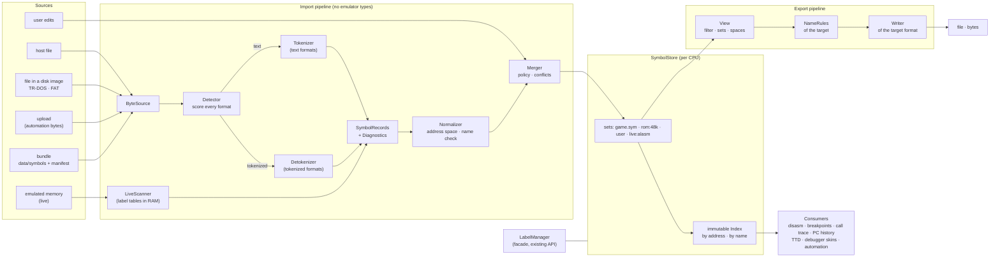

Everything inside "Import pipeline", "Store" and "Export pipeline" uses only the standard library. The emulator is
reached through three adapters ([§9](#9-code-placement)): a byte source for files inside disk images, a memory view
for live scans, and the `LabelManager` facade with the CPU's paging for page-aware lookup.

## 3. Data model

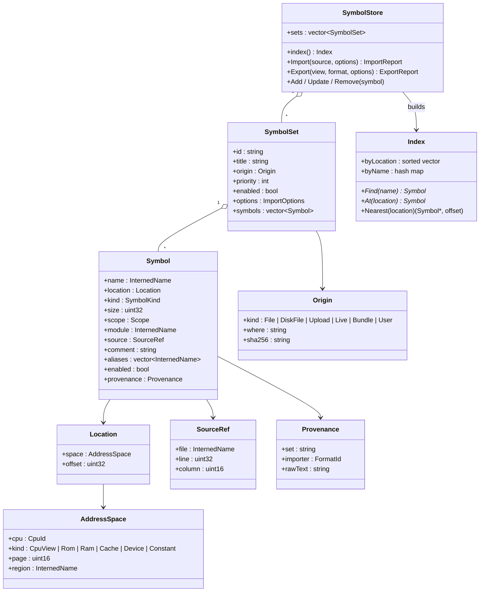

### 3.1 Address spaces, with examples

| Space | Written | Example | Meaning |
|---|---|---|---|
| CPU view | `cpu:main` | `PRINT_SCR = cpu:#0DAF` | whatever page window 0 shows: a symbol valid in any page |
| ROM page | `rom2` | `TRDOS_ENTRY = rom2:#3D2F` | ROM page 2 at offset `#3D2F`, wherever it is mapped |
| RAM page | `ram3` | `PLAYMUS = ram3:#0000` | RAM page 3, offset 0; at `#C000` when page 3 is in window 3 |
| Cache page | `cache0` | | ZX-Evo / TS-Conf cache RAM |
| Device region | `vram`, `cram`, `eeprom` | `PEN_PAPER5 = vram:#17F0` | memory a device owns (`DeviceMemory`) |
| Constant | `const` | `SCREEN_LEN = const:6912` | a number, not a place (an `EQU` used as a size) |
| Another CPU | `cpu:gs`, `gs.rom0` | `GS_PLAY = gs.rom0:#0123` | the General Sound card's CPU and memory |

A **CPU-view lookup** (the disassembler at `#C010`) first asks the machine which page window 3 shows (say RAM 3),
then looks up `ram3:#0010`, then `cpu:#C010`. Page symbols win over CPU-view symbols at the same place.

### 3.2 Kinds and scopes

| Kind | From | Example |
|---|---|---|
| `code` | a label on an instruction | `PLAYMUS` |
| `data` | a label on `DB` / `DW` / `DS` | `SCORE` |
| `const` | `EQU` / `=` of a number | `LINES EQU 24` |
| `port` | a port number (I/O map) | `AY_REG = port:#FFFD` |
| `entry` | a documented entry point (ROM maps) | `START` |
| `local` | a local label (`.loop`, `@1`, `1$`) | `PLAYMUS.loop` |

A `local` symbol keeps its parent (`scope.parent = PLAYMUS`), so exporters can write it in the target's own local
syntax or fold it to `PLAYMUS_loop`.

## 4. Import workflow

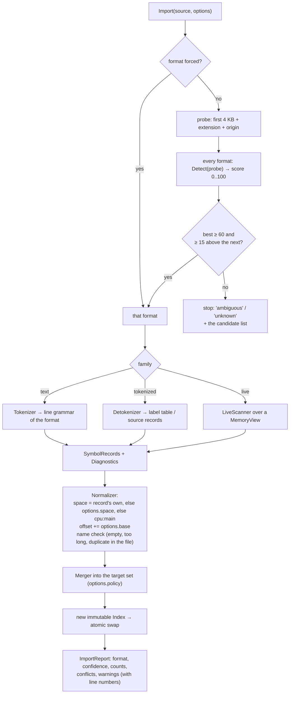

## 5. Sequences

### 5.1 Import a file

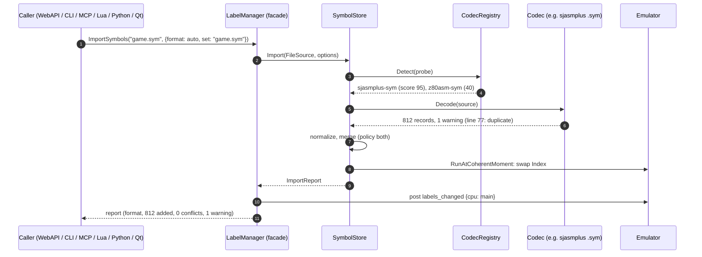

The index swap runs at a coherent moment (`Emulator::RunAtCoherentMoment`), so the emulation thread never sees a
half-built index; the parsing itself runs on the caller's thread.

### 5.2 Live scan of an assembler's label table

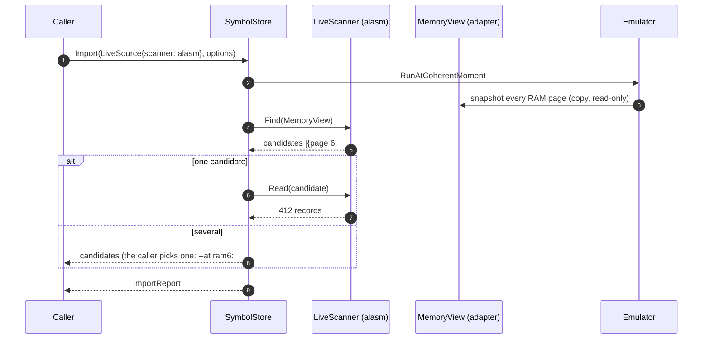

### 5.3 Export to another tool

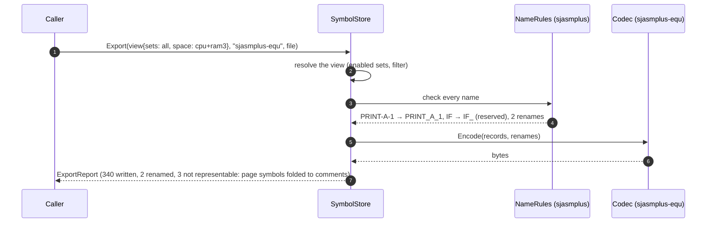

### 5.4 ROM bundle at machine start

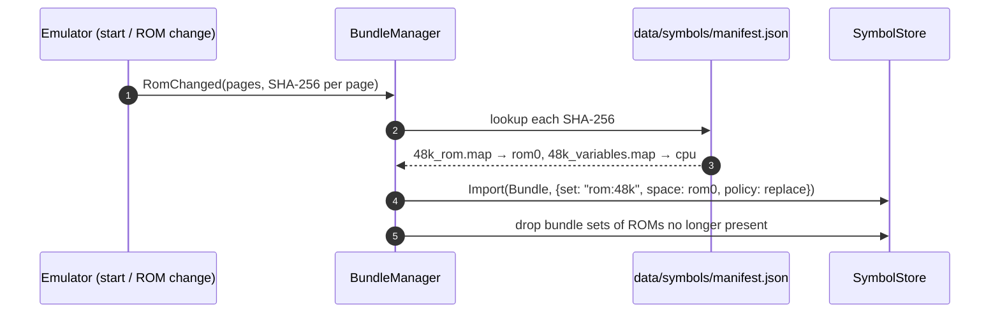

## 6. Decision trees

### DT-1: which address space a record gets

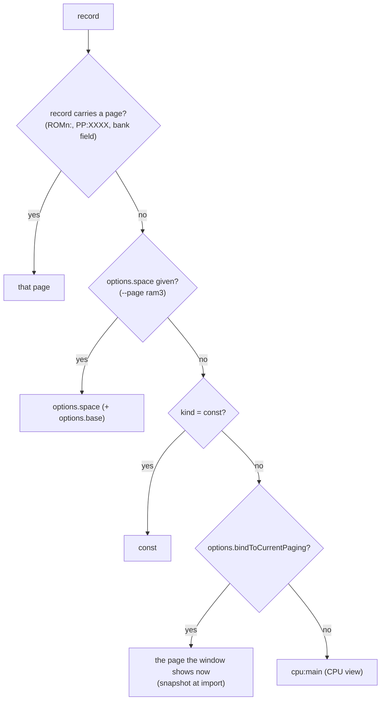

### DT-2: merge one record into a set

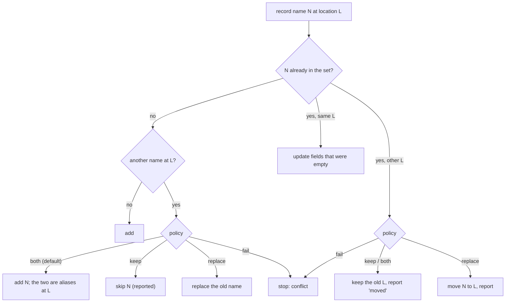

### DT-3: a name the export target cannot take

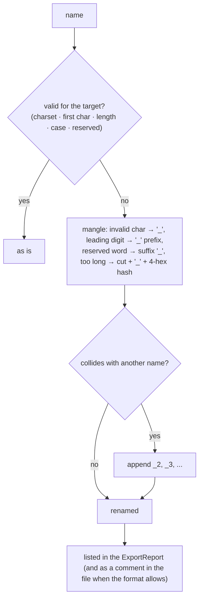

### DT-4: a symbol the export format cannot hold

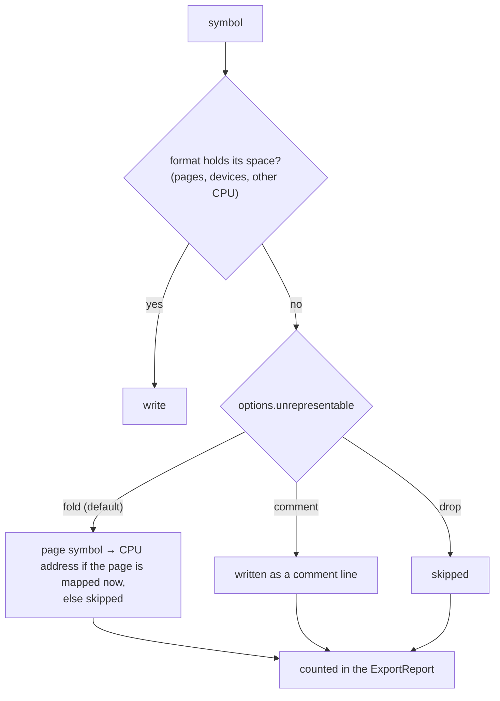

## 7. Threading

- Parsing, detection and export run on the **caller's thread** (an automation worker, the Qt thread).
- The store is changed under a mutex; each change builds a new immutable `Index` and publishes it with an atomic
  `shared_ptr` swap at a coherent moment. Readers (the disassembler on the emulation thread, automation threads)
  take the current pointer and never lock.
- A live scan copies the RAM pages it needs at a coherent moment and scans the copy on the caller's thread.

## 8. Relation to existing code

| Existing | Becomes |
|---|---|
| `LabelManager` (`core/src/debugger/labels/`) | facade over the per-CPU `SymbolStore`; `Label` is a view of `Symbol`; `LoadLabels` = `Import(format: auto)`; `SaveLabels` = `Export` |
| `LabelManager::ParseMapFile / ParseSymFile / ParseViceSymFile / ParseSJASMSymFile / ParseZ88DKSymFile` | five formats in the registry (same behavior, golden tests from today's parser output) |
| `ListingParser` (sjasmplus `.lst`) | stays the source-line map; its labels become the `sjasmplus-lst` importer; later a `SourceMap` beside the store |
| `data/symbols/*.map`, `data/symbols/sprinter/*.map` | bundles listed in `data/symbols/manifest.json` with their ROM hashes |
| GS firmware profiles (`symbol_file`) | a bundle in the `gs` CPU's store |
| MCP `manage_symbols`, WebAPI `/labels`, CLI `labels` / `symbols load`, Lua / Python `load_labels` | unchanged; new `import` / `export` / `formats` / `sets` beside them |
| Qt `LabelEditor` | gets Import... / Export... with a format list, a set list and the conflict report |

## 9. Code placement

The symbol module is one module of the [unreal-asm](../README.md) library (owner decision 2026-10-05: the library
lives in `core/src/3rdparty/unreal-asm`, next to `unreal-z80`). The library's layout is in
[../tdd.md](../tdd.md) §2; the symbol part:

```text
core/src/3rdparty/unreal-asm/
├── include/unrealasm/symbols/              # public headers of the module
└── src/symbols/                            # namespace unrealasm::symbols, std only
    ├── model/        symbol.h, symbolset, symbolstore, symbolindex, nameinterner, mergepolicy
    ├── codecs/       one folder per symbol file format, decode + encode (D-1):
    │   ├── native/  unrealmap/  simplesym/  unreall/  vice/  sjasm/  sjasmplus/  z88dk/  pasmo/  cspect/
    │   └── script/   ida/  ghidra/  mame/
    ├── fromsource/   labels from a decoded source (any source codec of the library) + optional assembling
    ├── live/         label-table scanners over a MemoryView (ALASM, XAS, STS), sharing table decoders with the
    │                 source codecs of the same assembler
    └── bundles/      data/symbols/manifest.json by SHA-256

core/src/debugger/symbols/                  # the emulator side (adapters, the only part that knows the emulator)
├── emulatormemoryview.cpp                  # MemoryView over Memory pages (coherent moment)
├── diskfilesource.cpp                      # ByteSource over a file in a TR-DOS / FAT image
├── pagingresolver.cpp                      # which page a window shows (CPU-view lookup)
└── bundlemanager.cpp                       # ROM change -> bundle sets

core/src/debugger/labels/labelmanager.*     # facade (kept)
data/symbols/manifest.json                  # bundles
```

Tokenized ZX formats are **not** in this module any more: they are the library's **source codecs**
([../source-formats.md](../source-formats.md)). The symbol module takes labels from any decoded source
(`fromsource/`), so every assembler the library can read gives symbols without a symbol-specific decoder.
