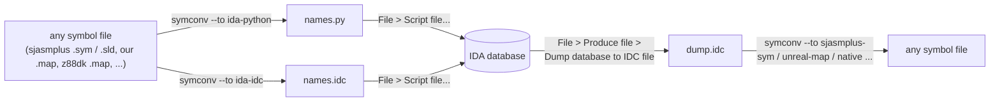

# IDA and the symbol module: names in, names out

| | |
|---|---|
| **Date** | 2026-10-06 |
| **Codecs** | `ida-idc`, `ida-python` (`core/src/3rdparty/unreal-asm/src/symbols/codecs/script/`) |
| **Tool** | `symconv` (`core/src/3rdparty/unreal-asm/tools/symconv/`, built with the library: `<build>/bin/symconv`) |
| **Checked with** | IDA Professional 9.2 (`idat`, headless), a 64K Z80 image; the target is IDA 9.3+ (not installed yet: re-check when it is) |
| **Tests** | `unreal-asm-tests` `ScriptCodecs_Test` (`IdaScripts`, `IdaOwnDatabaseDump`), golden files in `testdata/symbols/ida/` |

## 1. In one picture



## 2. Names into IDA

1. Write the script from any symbol file `symconv` reads (`symconv formats` lists them):

   ```bash
   symconv game.sld --to ida-python -o game-names.py      # IDAPython
   symconv game.sld --to ida-idc    -o game-names.idc     # IDC (works without Python)
   ```

   The script sets every name with `set_name(ea, "name", SN_NOWARN)` and every comment with `set_cmt(ea, "text", 0)`:

   ```c
   // Symbols written by unreal-ng
   #include <idc.idc>

   static main()
   {
       set_name(0x8000, "start", SN_NOWARN);
       set_cmt(0x8000, "entry point", 0);
       set_name(0x8003, "start.loop", SN_NOWARN);
   }
   ```

2. In IDA: **File > Script file...** (Alt+F7) and pick the script. The names and comments appear at once.

Things to know:

| Situation | What happens |
|---|---|
| An address outside every segment (a ROM name when only the program was loaded) | IDA cannot name it; `SN_NOWARN` keeps it quiet. Load the whole 64K (section 4) to name everything |
| A page symbol (`ram3:#0010`) | IDA has one 16-bit address space here: the name goes to the CPU address of its window (`#C010`). `symconv --pages drop` leaves page symbols out, `--pages comment` lists them as comments at the top of the script |
| Two names at one address (pages 1 and 3 both at `#C000`) | IDA keeps one name per address: the later one wins. `symconv` warns: `two names at 0xC000: paged3 replaces paged1 in IDA` |
| A name IDA does not take (`PRINT-A-1`) | Renamed by IDA's rules (letters, digits, `_ @ $ ? .`, not starting with a digit, at most 511 bytes): `PRINT_A_1`; every rename is reported and listed as a comment at the top of the script |

## 3. Names out of IDA

1. In IDA: **File > Produce file > Dump database to IDC file...**. IDA writes the whole database as a script; its
   names are `set_name(...)` lines among the segment and type statements.
2. Read it with `symconv`; the format is detected (`#include <idc.idc>` and the `set_name` calls):

   ```bash
   symconv dump.idc --to sjasmplus-sym -o names.sym    # or --to unreal-map, native, ...
   ```

`symconv` also reads scripts written by hand or by older IDA versions: `MakeName`, `MakeNameEx`, `MakeComm`,
`MakeRptCmt`, `ida_name.set_name`, `idc.set_name`, with either quote and C escapes.

## 4. Loading a ZX program into IDA

| What | In the GUI | `idat` option |
|---|---|---|
| Processor | Processor type: **Zilog 80 [z80]** | `-pz80` |
| A raw binary at an address | Loading segment = address / 16 (`#8000` -> `0x800`) | `-b0x800` |
| Every address nameable | load a 64K image (a memory dump, a snapshot's RAM) at segment 0 | `-b0` |

## 5. Headless use (scripts, checks)

`idat` (in `<IDA>.app/Contents/MacOS/`) runs a script without a window. `-A` is autonomous mode, `-c` creates a new
database, `-S` names the script to run, `-L` the log file:

```bash
UNREAL_IDA_SCRIPT=$PWD/game-names.py UNREAL_IDA_OUT=$PWD/names.txt \
  "<IDA>.app/Contents/MacOS/idat" -A -c -pz80 -b0 -L ida.log -S"$PWD/wrapper.py" mem64k.bin
```

The wrapper runs the symbol script, then writes back what the database holds and quits; this is how the codecs were
checked:

```python
# Runs a symbol script written by symconv, then dumps the database's names
import os, idc, idautils, ida_expr, ida_auto
ida_auto.auto_wait()
script = os.environ["UNREAL_IDA_SCRIPT"]
if script.endswith(".py"):
    exec(open(script).read())
else:
    ida_expr.compile_idc_file(script)                    # IDA 9: in ida_expr, not idc
    ida_expr.eval_idc_expr(None, idc.BADADDR, "main()")
with open(os.environ["UNREAL_IDA_OUT"], "w") as out:
    for ea, name in idautils.Names():
        out.write("%04X %s %s\n" % (ea, name, idc.get_cmt(ea, 0) or ""))
idc.qexit(0)
```

IDA's own IDC dump, headless: `ida_loader.gen_file(ida_loader.OFILE_IDC, fp.get_fp(), 0, idc.BADADDR, 0)` with an
`ida_fpro.qfile_t` opened for writing.

### 5.1 When IDAPython does not start

The log says `failed to load Python runtime: skipping IDAPython plugin` when the Python library IDA was set up with
is gone (Homebrew replaced `python@3.14` 3.14.6 with 3.14.7). Point IDA at the installed one with the tool that ships
with it; the setting is per user (`~/.idapro/ida.reg`) and shared by every IDA version:

```bash
"<IDA>.app/Contents/MacOS/idapyswitch" -s <the Python framework's "Python" library, e.g. ...Versions/3.14/Python>
```

`.idc` scripts work without Python.

## 6. What was checked (2026-10-06, IDA 9.2)

| Check | Result |
|---|---|
| `ida-python` and `ida-idc` scripts of the sjasmplus golden source (SLD, 11 names) on a 64K image | 10 names land (two share `#C000`, one name per address) |
| A script with comments that hold quotes and commas | names and comments land as written |
| IDA's own IDC dump of that database, read by `ida-idc` | all 10 names (`testdata/symbols/ida/labels-dump.idc`) |

Re-run these checks with IDA 9.3 when it is installed.
