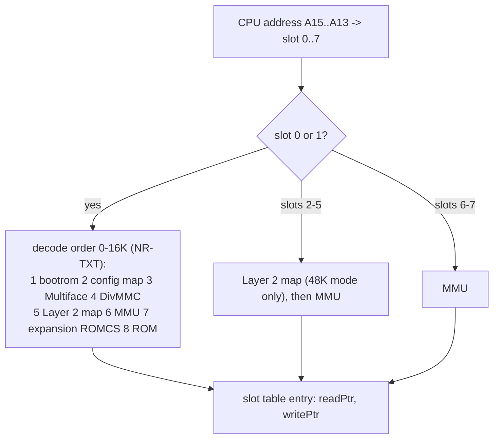
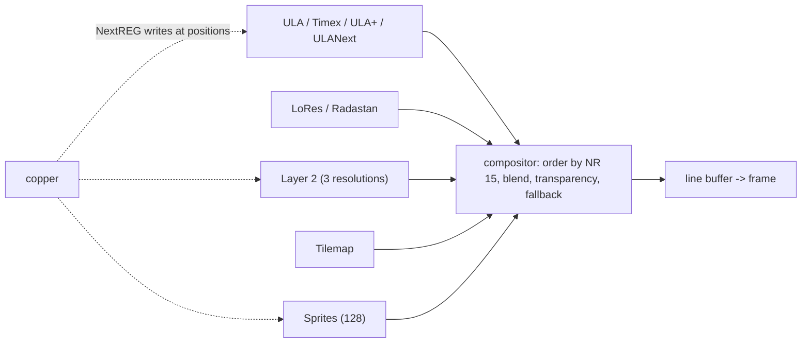

# ZX Spectrum Next: core design (memory, NextREG, ports, layers)

**Date:** 2026-10-07 · part of [README.md](README.md) · see [design.md](design.md) for the decisions D1-D14

Facts are marked with the source key of [research-sources.md](research-sources.md). Items marked **N-read**
are not asserted here: the phase named reads the source and writes the exact rule into the test table first.

## 1. Physical memory

The Next has an SRAM array; the first 256K is the system area (the ROM images that `TBBLUE.FW` copies in, the DivMMC
ROM, the Multiface ROM, the alternate ROM, the keymap scratch), the rest is RAM the programs see as pages 0 to 223
(NR-TXT: "Pages range from 0 to 223 on a fully expanded Next"; wiki: unexpanded 768K = 256K system + 512K RAM,
expanded 2 MB = 256K + 1792K, and the NEX header's "768k or 1792k" requirement field).

| Decision | Rule |
|:--|:--|
| Array | one 2 MB array inside the `RAM` region of `Memory` (128 16K pages; the region holds 256), so TTD's physical-page tracking and the debugger's page views work unchanged |
| Layout | offset 0..256K = system area, 256K.. = RAM in MMU page order. The system-area internal layout (where the 64K personality ROM, the DivMMC ROM and RAM banks, the MF ROM and the alt ROM sit) is fixed by the VHDL memory map ([research-fpga-vhdl.md](research-fpga-vhdl.md) section 7: ROM 64K at `#000000`, DivMMC ROM `#010000`, Multiface `#014000`, alt ROMs `#018000` / `#01C000`, DivMMC RAM `#020000`, Spectrum RAM from `#040000`) and agrees with jnext's bypass study (`FUTURE-NEXTZXOS-BYPASS-TBBLUE-FW.md`): the 64K ROM at 8K pages 0-7, DivMMC ROM at page 8, Multiface ROM at page 10. **N-read (N2):** DivMMC RAM and alt ROM pages |
| Smaller RAM | `NextBoard::ramKb` (1024K Issue-2 class) limits MMU page numbers; reads of unpopulated pages return `#FF`, writes are dropped (MAME/jnext behavior to be confirmed, Q4) |
| ROM protection | the system area is writable only in configuration mode (NR `#03` bits 2:0 = 0) or through the config-mapping register NR `#04`; afterwards ROM slots are read-only (wiki Boot Sequence: "TBBLUE write-protects ROM areas") |

## 2. The MMU and the slot table

The CPU sees eight 8K slots. For each slot the machine keeps a **resolved pair of pointers**: where a read
goes and where a write goes (null write = dropped, a special value = a Layer 2 or Multiface write hook).



| Item | Rule |
|:--|:--|
| Rebuild | `RebuildSlots()` after: any NR `#50`-`#57`, `#7FFD` / `#DFFD` / `#1FFD`, NR `#8E`, `#123B`, NR `#12` / `#13`, NR `#04`, `#E3`, DivMMC automap enter / leave, Multiface enter / leave, NR `#8C` (alt ROM), NR `#03` (bootrom off), NR `#80` (ROMCS), reset. Naive: rebuild all eight entries; measure before narrowing |
| MMU value 255 | the slot shows the ROM, 8K from the active ROM selection (below); page 255 in slot 2-7 is also ROM per the register text |
| 128K / +3 ports | `#7FFD` / `#DFFD` / `#1FFD` do not hold their own state beyond the latches; they write the MMU slot values the way NR `#8E` describes ("writes ... as if by port write"): slots 6/7 = the 16K bank pair, slots 0/1 = ROM (value 255) with the ROM selection from `#7FFD` bit 4 and `#1FFD` bit 2; a write sets slots 0/1 to ROM and 6/7 to the bank (NR-TXT, port text) |
| All-RAM (+3 special) | the four rows of the table in NR-TXT set slots 0-7 to RAM banks; leaving special mode restores slots 2-5 to banks 5 and 2 |
| Pentagon timing | `#7FFD` bits 7:6 extend the bank in Pentagon-512 mode; `#DFFD` bit 7 turns it on; locked bit semantics as in NR-TXT |
| ROM selection | 64K ROM area at 8K pages 0-7 split in four 16K ROMs (128K editor, 128K syntax checker, +3DOS, 48K BASIC) chosen by `{#1FFD bit 2, #7FFD bit 4}`; in 48K machine type only ROM 3; alt ROM (NR `#8C`) replaces reads or only writes; ROM0/ROM1 locks |
| Layer 2 mapping | `#123B`: map type 7:6, read bit 2, write bit 0, shadow bit 3; mapped banks start at NR `#12` / `#13` plus the `#123B` bank offset; overlays by access type; out-of-range reads give unspecified data (we return `#FF`) |
| Contention | the slot table entries carry a contended flag computed from the MMU page when the mapping changes: 48K timing page `#0A/#0B` only, 128K timing odd 16K banks (pages with bit 1 set), +3 timing banks 4-7 (page bit 3), pages `>= #10` never; the hook reads the flag only at 3.5 MHz. Rules and the delay window: [research-fpga-vhdl.md](research-fpga-vhdl.md) section 2 |
| Video reads | the ULA, LoRes, Layer 2, tilemap and sprite engines read RAM by physical bank, not through the slot table (the fixed banks 5/7, NR `#12`/`#13`, `#6E`/`#6F` bases in bank 5) |

Why a table and a separate memory interface: the shared `Memory` has four 16K windows hard-wired into the fast
interfaces (`_bank_read[4]`), which is right for the other machines. The Next gets its own memory interface
(like the contended and overlay interfaces that `Core::SelectMemoryInterface` already selects), so no other
machine's read or write path gains a branch.

## 3. The NextREG space

One table, built from [research-nextreg-and-ports.md](research-nextreg-and-ports.md):

```cpp
struct NextRegDef {
    uint8_t number;
    const char* name;
    uint8_t softReset, hardReset;      // values after each reset kind (see NR-TXT: "soft reset = x")
    bool copperWritable;               // below #80 only
    uint8_t (*read)(NextState&);       // null = stored byte
    void (*write)(NextState&, uint8_t);
};
```

| Rule | Detail |
|:--|:--|
| Select / data | `#243B` stores the selected number, `#253B` reads or writes through the table; both are internal ports gated by NR `#82`-`#85` |
| `NEXTREG` opcodes | call the same write function with the register number from the instruction and **do not** change the select latch (R12) |
| Copper | calls the same write function for numbers below `#80`; the copper cannot reach `#80` and above |
| Write side effects | a handler returns whether the slot table, the video latches, the sound mixer or the CPU speed must be refreshed; the caller does the refresh after the handler (one place) |
| Reset | `Reset(kind)` walks the table: hard reset sets `hardReset` for every register, soft reset sets `softReset` for registers that have one; the 32-bit port enables (`#82`-`#89`) have the bit-31 rule (soft or hard according to bit 31) |
| Configuration mode | NR `#03` bits 2:0 = 0 at power-on; config-only registers (`#04`, `#10`, `#11`, machine type) ignore writes otherwise; a write to NR `#03` with a nonzero machine type leaves config mode (jnext bypass study: `0xB3` for +3 mode) |
| Unknown register | read returns 0 and logs once per register (MAME does the same); writes are dropped |
| Report | `next_regs` lists number, name, value and a "differs from reset" mark (section 12 of [design-automation.md](design-automation.md)) |

## 4. The port decoder

One table from `ports.txt`: each row is `(mask, value, read/write, internal-enable bit, handler)`. The decoder
tests a row only when its enable bit in the internal-enable word (NR `#82`-`#85`) is set and, when the
expansion bus is on, ANDs it with the expansion word (NR `#86`-`#89`) per NR-TXT.

| Item | Rule |
|:--|:--|
| Precedence | rows are ordered; `#DFFD` before the AY, `#F1` and `#F9` before `XXFD` (NR-TXT notes). Where one port address serves several devices (`#1F`: Kempston joystick 1 read, DAC A write, Multiface 1 disable), reads and writes pick different rows; if both a Multiface and a joystick answer a read, **N-read (N2)** the VHDL |
| Machine type | rows for `#7FFD` "+3 only" variants and the AY `#BFFD` read-back depend on NR `#03` machine timing / type (the file says "readable on +3 only") |
| Floating bus | `#FF` with NR `#08` bit 2 clear returns the floating bus; `+3 floating bus` row `0000 XXXX XXXX XX01` (read) |
| Port-trace hooks | the decoder reports each access to the existing port-trace and breakpoint machinery the way other decoders do |
| Expansion propagate | NR `#8A`: ports `#FE`, `#7FFD`, `#DFFD`, `#1FFD`, `#FF` can be propagated to the bus for slot cards; this only calls the slot system's port claim table, no new mechanism |
| Test aid | `PortDecoderNext::Describe(port, isRead)` returns the row, device and enable bit; `ports.txt` rows become test cases (tdd-plan section 3) |

## 5. Reset and power-on

Hard reset (power-on, F1, NR `#02` bit 1) sets config mode and enables the bootrom overlay; soft reset (F4, NR `#02`
bit 0) keeps RAM and the port-enable words whose bit 31 says so. After the firmware writes NR `#03`, the machine
is in the chosen personality. The first CPU fetch at power-on is from the bootrom at `#0000`
([design-boot-and-firmware.md](design-boot-and-firmware.md)).

## 6. Video layers: the model



The renderer composes **one scanline at a time** from the latched register state (D7). The latch is the existing
`VideoWriteLog` idea: a register write at a given T inside a line takes effect from the next pixel group, naive
first = from the next line; the half-line copper effects (border stripes, split scroll) tighten this in N7 by
splitting the line at the write position. The output frame is 320x256 plus border like jnext's ("320x256: 48
left/right border + 256 display ..."), with the HR modes at 640 wide; frame buffer sizing for Qt follows the
Sprinter's R-mode precedent (`R_736_288` there) and is chosen in N6.

### 6.1 ULA

| Mode | Rule |
|:--|:--|
| Standard | bank 5 or shadow bank 7 (`#7FFD` bit 3 / NR `#69` bit 6); attributes; flash; border |
| Timex (`#FF`) | screen 1 at `#6000`; hi-colour (32x192 attributes at `#6000`); hi-res 512x192 monochrome with the colour from bits 5:3 (the eight pairs in NR-TXT); disabled frame interrupt bit 6; readable only if NR `#08` bit 2 |
| ULA+ | `#BF3B` / `#FF3B`, the 64 palette entries live at ULA palette indices 192..255; `#BF3B` group 01 mode register enables |
| ULANext | NR `#42` mask of attribute bits that are ink (1,3,7,15,31,63,127,255); ink from palette base 0, paper and border from base 128; 255 = all ink with paper/border from the fallback colour NR `#4A` |
| Scroll, clip | NR `#26`/`#27`, `#68` bit 2 half-pixel scroll, clip window NR `#1A`; ULA disable NR `#68` bit 7 |

### 6.2 LoRes, Layer 2, tilemap, sprites

| Layer | Rule (register facts from NR-TXT) | Read next |
|:--|:--|:--|
| LoRes | 128x96, 8-bit colour (128x96 = 12288 bytes, held in the ULA screen banks; layout N-read), or Radastan 128x96x4 (NR `#6A` bit 5); scroll NR `#32`/`#33` in half-pixels; palette offset NR `#6A` | N-read (N6): byte layout |
| Layer 2 | 256x192x8 (48K, 3 banks), 320x256x8 (5 banks), 640x256x4 (5 banks); active bank NR `#12`, shadow NR `#13`; scroll NR `#16`/`#17`/`#71`; clip NR `#18`; palette offset NR `#70` bits 3:0; priority-colour bit in the second byte of palette writes | N-read (N6): pixel addressing (the 320 and 640 modes' byte order) from MAME `specnext_layer2.cpp` `do_draw` and the wiki Layer 2 page |
| Tilemap | 40x32 or 80x32 cells of 8x8; map base NR `#6E` and definitions NR `#6F` in bank 5 (byte MSB, 256-byte steps); each cell has a tile byte and an attribute byte (palette offset, X/Y mirror, rotate, ULA-over, bit 8 of the tile in 512-tile mode); control NR `#6B`: enable, 80 columns, no attribute byte (uses NR `#6C`), palette select, text mode, 512 tiles, force on top; scroll NR `#2F`-`#31`; clip NR `#1B` (X doubled); transparency index NR `#4C` | N-read (N7): tile pixel format (4-bit) and text mode (1-bit) |
| Sprites | 128 sprites, patterns 16x16 at 8 bits (256 B) or 4 bits (128 B) in a 16K pattern RAM; attributes written through port `#57` or NR `#35`-`#39` / `#75`-`#79`; pattern bytes through `#5B`; `#303B` selects the sprite and the pattern (bit 7 = half pattern); status read gives collision and overtime flags and clears them; transparency NR `#4B`; clip NR `#19`; over-border bit and priority NR `#15`; scale, rotate, mirror and relative/composite sprites per the wiki | N-read (N7): the attribute byte bit layout from the wiki Sprites page and MAME `specnext_sprites.cpp` |

### 6.3 Palettes

Eight 256-entry palettes of 9-bit colour (ULA, Layer 2, sprites, tilemap, each with a first and second set).
NR `#43` bits 6:4 select the palette for index/value access; bits 3:1 select the active set per layer;
auto-increment unless bit 7. NR `#41` writes 8-bit RRRGGGBB (blue LSB = OR of the two blue bits); NR `#44`
takes two writes for the 9th bit and the Layer 2 priority bit. The renderer keeps the palettes as 16-bit
`RGB333` arrays and converts once per frame to the output format (a lookup, naive).

### 6.4 Compositor

NR `#15` bits 4:2 give six orders (SLU, LSU, SUL, LUS, USL, ULS) and two blend modes that mix the ULA/tilemap and
Layer 2 colours "clamped to [0,7]" (modes 6 and 7, NR `#68` bits 6:5 choose the blend source). Global
transparency NR `#14` applies to Layer 2, ULA and LoRes; sprites use NR `#4B`, tilemap NR `#4C`. A Layer 2
priority colour moves Layer 2 above all layers. If every layer is transparent the fallback colour NR `#4A`
shows. Stencil mode (NR `#68` bit 0): with both ULA and tilemap enabled, the result is the AND of both colours
unless either is transparent. The exact blend formulas are **N-read (N7)** from jnext's
`TASK-COMPOSITOR-NR68-BLEND-PLAN.md` / `LAYER-COMPOSITION-RESOLUTION.md` and MAME's draw code, with the VHDL
as the arbiter.

### 6.5 Copper

2K bytes of instruction RAM (1024 16-bit instructions), loaded by NR `#60` (8-bit, auto-increment) or NR `#63`
(16-bit pairs, MSB first), addressed by NR `#61` / `#62` bits 2:0. Instructions (MAME header): WAIT = bit 15 set,
bits 14:9 the horizontal position in units of 8, bits 8:0 the line; MOVE = bit 15 clear, bits 14:8 the register,
bits 7:0 the value; NOP = MOVE 0,0; HALT = WAIT `#FFFF`. NR `#62` bits 7:6 give four start modes (stop; start
from 0 and loop; start from the last point and loop; start from 0 and restart at raster (0,0)); writing the same
mode again does not restart. The copper runs in the video clock domain: the machine keeps its next event time
(like MAME's timer), executes MOVEs when the beam reaches the WAIT, and the NR `#64` offset shifts the line count.
The copper's writes go through the same register write function, so a MOVE into NR `#50` rebuilds the slot table
mid-line.

## 7. What is reused from other machines

| Piece | Reuse |
|:--|:--|
| Screen base class, frame buffer, border/line log | `Screen` / `VideoWriteLog` as used by `ScreenTSConf` and `ScreenSprinter` |
| `IInterruptSource` | TSConf / Sprinter |
| RTC core | not DS12887; the DS1307 is new and small ([design-peripherals.md](design-peripherals.md)) |
| AY chips | the existing AY chips through the TurboSound path in `core/src/emulator/sound/` (the state report in `devicestate.cpp` already has a three-chip "ZX Next (triple AY-3-8912)" description; whether the sound manager can host three chips today is checked in N4) |
| Kempston mouse, joystick state | the core Kempston mouse (TTD id 7) |
| Disk-free machine: no FDC | the +3 FDC traps NR `#D8`-`#DA` let NextZXOS emulate DSK images; implemented in N9 |
