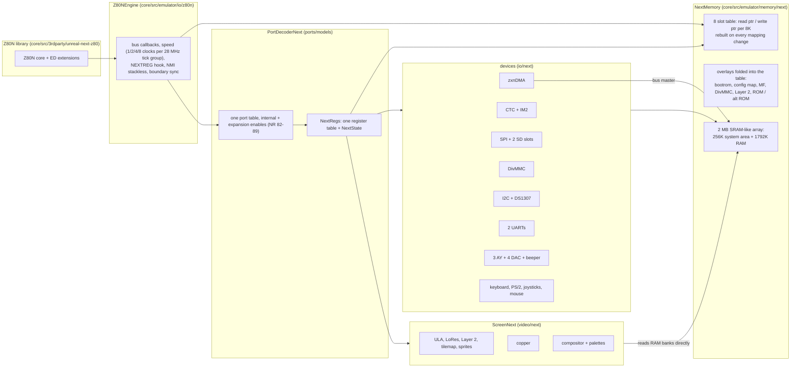

# ZX Spectrum Next: architecture and decisions

**Date:** 2026-10-07 · part of [README.md](README.md) · requirements in [requirements.md](requirements.md)

Detail documents: [design-core.md](design-core.md), [design-cpu.md](design-cpu.md),
[design-peripherals.md](design-peripherals.md), [design-video-timing.md](design-video-timing.md),
[design-boot-and-firmware.md](design-boot-and-firmware.md), [design-media-and-snapshots.md](design-media-and-snapshots.md),
[design-ttd.md](design-ttd.md), [design-automation.md](design-automation.md).

## 1. The machine in one picture

## 2. Where it plugs in (registration checklist)

Taken from how `PROFI3` and `SPRINTER` were registered; paths are in the current tree.

| Place | Change |
|:--|:--|
| `core/src/emulator/config.h` model table | row exists (`NEXT`, `MM_NEXT`, 2048, `RAM_2048`); `creatable` becomes true when the two conditions in the comment at line ~211 hold: a port decoder in `portdecoder.cpp` and a ROM / memory rule |
| `core/src/emulator/ports/portdecoder.cpp` | `MM_NEXT` in the factory switch (~line 145 and the two other model switches at ~212, ~788) returning `PortDecoderNext` |
| `core/src/emulator/video/videocontroller.cpp` | `MM_NEXT` in `CreateScreen` returns `ScreenNext` |
| `core/src/emulator/config.cpp` | the per-model frame / line setup (the TSConf and Sprinter cases at ~1805): `MM_NEXT` takes its frame length from the board timing, not from `intstart` / `intlen` |
| `core/src/emulator/memory/rom.cpp` | role names and the firmware-area loading rule; `[ROM] NEXT=` is the bootrom, not a 64K system ROM (see [roms.md](roms.md)) |
| `core/src/emulator/memory/` | `NextMemory` and its memory interface, selected by `Core::SelectMemoryInterface` only for `MM_NEXT` |
| `core/src/emulator/cpu/z80.h` | no change: `ICpuEngine` and `SetEngine` exist (Sprinter's Z84C15) |
| `data/configs/next/unreal.ini` | new, from `data/configs/sprinter/unreal.ini` |
| TTD | `core/src/debugger/ttd/next/ttdnext.*`; ids appended to `PeripheralId` ([design-ttd.md](design-ttd.md)); the two `MM_NEXT` cases of `PortJournalUnsupportedReason` stay |
| Automation | [design-automation.md](design-automation.md) |
| `AGENTS.md`, `.recipe/machines/next.md`, MCP resource `unreal://machine/next`, `docs/` pages | each phase |

## 3. Decisions

| # | Decision | Why | Alternative rejected |
|:--|:--|:--|:--|
| D1 | Emulate the FPGA core and run the real bootrom, `TBBLUE.FW` and NextZXOS from the card. A direct-boot path (NEX, snapshots, a "bare" 48K/128K/+3 ROM start) is a second, smaller path | the card holds the whole system; software expects the register state the firmware leaves; jnext shows the full chain works and its bypass study lists the exact writes | an HLE of the firmware only: needs a copy of the firmware's decisions, and breaks the day a firmware changes |
| D2 | The Z80N is a vendored library, `core/src/3rdparty/unreal-next-z80/`, forked from unreal-z80 0.5.0 like `z84c15`, driven through `ICpuEngine` | the base Z80 and every other machine stay untouched and cost-free; the same pattern is proven by the Sprinter ([z84c15 design](../2026-10-01-z84c15-cpu-library/design.md)) | patching `core/src/emulator/cpu/z80.cpp` (a test per instruction for every machine); intercepting opcodes outside the CPU as jnext did (register round-trips) |
| D3 | Board variants are a `NextBoard` struct selected by `[NEXT] Board=` | the `ProfiBoard` pattern; variants change a few observable values only ([research-variants.md](research-variants.md)) | a model enum entry per issue |
| D4 | One NextREG table: number, name, reset values, read handler, write handler, copper-visible flag | the same table drives the machine, the `nextreg` report, the debugger and the tests | handlers scattered in a switch with a separate documentation list |
| D5 | All machine state lives in one plain struct `NextState` (arrays and integers, no pointers) that `TTD` and snapshots copy | restore is a memcpy plus a rebuild of derived data (`OnTtdStateLoaded`) | per-device state classes each with their own serializer, until a device needs its own |
| D6 | Memory is a flat 2 MB array and an 8-entry slot table of read/write pointers, rebuilt whenever the mapping changes (MMU write, paging port, Layer 2 / DivMMC / MF / bootrom bit). A new `MemoryInterface` for the Next is selected only on this model | the hot path for other machines is not touched (interface selection exists for contention and overlays); a table rebuild is simple and a few dozen stores per mapping change | adding eight windows to `Memory` (touches every machine); a pointer-chasing decode per access |
| D7 | The video renderer is per scanline and naive: at the end of each line it composes the layers from the register values latched for that line | correct for copper-driven raster effects; `VideoWriteLog` and per-line snapshots exist on master ([PLAN rows #42](../PLAN.md)); measure before any caching | per-pixel cycle-exact fetch emulation from the first day; a frame-level renderer that breaks the copper |
| D8 | Time base: the machine counts in 28 MHz ticks; the CPU's T-state is `8 >> speed` ticks (3.5 MHz = 8 ticks); the frame length in ticks is fixed per machine timing; the existing `hw_turbo_ratio` hook carries the speed | a single time base makes the copper, DMA, CTC and video agree at any speed | per-device T-state rescaling |
| D9 | The zxnDMA is a bus agent that steals the CPU: while it transfers, the CPU is not stepped; the DMA runs inside the step loop's "machine step" hook | the Sprinter accelerator is the precedent (`kStepWorkMachineStep`); no thread | a second thread |
| D10 | Interrupts use `IInterruptSource` (as TSConf and the Sprinter do): the machine owns INT and the vector; pulse mode and hardware IM2 mode are both inside it | exists, tested | the legacy fixed window |
| D11 | SD cards, DivMMC and SPI follow the storage-manager design: slots `sd.next0`, `sd.next1`, `SdCardSpi`, `HostFolderFat`, the DivMMC framework ([storage survey](../2026-09-28-storage-controllers-survey/zx-next.md)) | already designed and reviewed; no Next-specific change to the media manager | a Next-only SD stack |
| D12 | Names: new classes and files have no underscores (`PortDecoderNext` in `portdecodernext.h`, `ScreenNext`, `NextMemory`); tests are `*_test.cpp`. Existing neighbors use `portdecoder_profi.h`; the new file does not copy that | AGENTS.md naming rule | copying the neighbor's style |
| D13 | Hot-path discipline: the only shared files touched are the registration switches (once per model creation). Anything that would add a test per instruction or per memory access to shared code needs an A/B benchmark first ([performance guidelines](../../guidelines/performance-guidelines.md)) | G3 | - |
| D14 | Phases end in a shippable milestone with automation parity and a verified recipe ([phases.md](phases.md)); no phase leaves the model half-creatable | repository policy | one big branch |

## 4. File layout (planned)

| Path | Content |
|:--|:--|
| `core/src/3rdparty/unreal-next-z80/` | the Z80N library (C API prefix `Z80n`), README listing local changes against unreal-z80 |
| `core/src/emulator/io/z80n/z80nengine.{h,cpp}` | adapter to `ICpuEngine` |
| `core/src/emulator/ports/models/portdecodernext.{h,cpp}`, `nextboard.{h,cpp}`, `nextregs.{h,cpp}`, `nextstate.h` | decoder, board profile, register table, state |
| `core/src/emulator/memory/next/nextmemory.{h,cpp}` | memory, slot table, overlays |
| `core/src/emulator/video/next/screennext.{h,cpp}`, `nextlayers.cpp`, `nextsprites.cpp`, `nexttilemap.cpp`, `nextcopper.cpp`, `nextpalette.cpp` | video |
| `core/src/emulator/io/next/nextdma.cpp`, `nextctc.cpp`, `nextim2.cpp`, `nextspi.cpp`, `nextdivmmc.cpp`, `nextuart.cpp`, `nexti2c.cpp`, `nextmultiface.cpp`, `nextinput.cpp`, `nextaudio.cpp` | devices |
| `core/src/loaders/snapshot/loadernex.{h,cpp}` | NEX loader into the snapshot image |
| `core/src/debugger/ttd/next/ttdnext.{h,cpp}` | serializers |
| `core/tests/emulator/machines/next/` | tests ([tdd-plan.md](tdd-plan.md)) |
| `tools/machines/next/` | table extractors and the NEX / SD helper scripts (if any) |
| `data/configs/next/unreal.ini`, `data/rom/next/` | config and the firmware set ([roms.md](roms.md)) |
