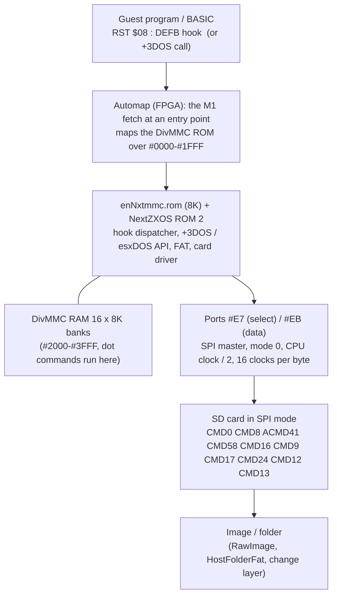

# ZX Spectrum Next: how esxDOS works, how the card is read, how we test it

**Date:** 2026-10-08 · part of [README.md](README.md) · facts read in the FPGA VHDL and the shipped ROM images
([research-fpga-vhdl.md](research-fpga-vhdl.md) sections 19-20), the `tbblue` firmware sources and the NextZXOS
API document (`NextZXOS_and_esxDOS_APIs`, updated 2023-05-24). The two ROM images (`enNxtmmc.rom`, `enNextZX.rom`)
were disassembled for this note; the listings stay outside the repository.
Related existing documents: [DivIDE / DivMMC / esxDOS survey](../2026-09-28-storage-controllers-survey/divide-divmmc-esxdos.md),
[Next SD integration](../2026-09-28-storage-manager/integration-next.md).

## 1. What "esxDOS" is on the Next (read this first)

There is no single "esxDOS" box. Four things carry the name or the job:

| Piece | What it is | Where it lives | Open source? |
|:--|:--|:--|:--|
| **DivMMC hardware** | an 8K ROM window, 16 x 8K RAM banks, the `#E3` register, the *automap* trap, the SPI port to the SD card | inside the FPGA core (`device/divmmc.vhd`, `zxnext.vhd`) | yes (GPL) |
| **`enNxtmmc.rom`** | the 8K ROM that the DivMMC maps at `#0000-#1FFF`: NextZXOS's own DivMMC firmware (it uses the Z80N `NEXTREG` instruction), holds the `RST $08` gateway, the card block driver and the glue to the OS | SD card, `/machines/next/`, loaded into SRAM by `TBBLUE.FW` (`RAMPAGE_ROMDIVMMC`) | binary only in the distribution |
| **NextZXOS** | the operating system: the +3DOS / IDEDOS API in ROM 2 (the *card driver, FAT code and the SD init sequence are in this ROM page*), the esxDOS-compatible API on top, NextBASIC, the browser, dot commands | `enNextZX.rom` (64K = four 16K ROMs) and `/nextzxos/*` | binary only |
| **original esxDOS 0.8.x** | the classic closed-source firmware, optionally installed by the user (`esxmmc.bin` in `/machines/next`, `/sys`, `/bin` on the card) for the Spectrum personalities | the user's card | closed, **not in any source we have** |

Consequences for the emulator:

1. **We emulate the hardware, never the file API.** The guest code (NextZXOS or esxDOS) parses the FAT, handles file
   handles, long names and dot commands. What we provide is: memory paging with the automap, the SPI bytes, and an SD
   card that answers like a real one.
2. The CSpect / ZEsarUX "esxDOS handler" mode (the emulator itself implements `RST $08` against a host folder, no
   NextZXOS) is a **different product**: it can never boot the real firmware. It is out of scope as the main path
   (open question in section 9).
3. The card is a **block device**. The host-folder-as-card idea of the storage manager (`HostFolderFat`, FAT16
   default) is how a folder boots the real firmware: the guest reads sectors that we synthesize.

## 1a. Do esxDOS sources exist? (checked 2026-10-08)

| What | Source available? | Notes |
|:--|:--|:--|
| esxDOS 0.7.x, 0.8.x (all releases, `esxmmc.bin` / `esxide.bin`, `ESXDOS.SYS`, the dot commands) | **No.** Binaries only from esxdos.org; no public repository holds the sources | the same holds for its predecessor FATware (the GitHub repository `fatware/fatware` is empty) |
| NextZXOS (`enNxtmmc.rom`, `enNextZX.rom`, `/nextzxos`) | **No** (binaries in the distribution; the system's source is not published) | disassembled for this project into [`docs/disasm/rom/next/`](../../disasm/rom/next/README.md) |
| The DivMMC hardware | Yes: the original board by Mario Prato ([mprato/DivMMC](https://github.com/mprato/DivMMC): VHDL, schematic), and the Next's own VHDL | the hardware side is fully open |
| An open esxDOS-compatible operating system | **UnoDOS 3** ([source-solutions/unodos3](https://github.com/source-solutions/unodos3), also [nagydani/unodos3](https://github.com/nagydani/unodos3)), GPLv3, Z80 assembly: kernel with `RST $08` hook API, FAT, SPI / SD (`src/14_spi.asm`, `19_fat_high.asm`), dot-command-like commands; local clones in the emulator sources | **Handle with care:** the repository has one commit, and parts (for example `14_spi.asm`) read like a disassembly whose data tables are decoded as instructions with machine-written comments; hook numbers are not guaranteed to equal esxDOS's. Useful as a *second, independent guest* for the DivMMC / SPI / SD tests (it must boot on our DivMMC with `unodos.rom`), not as a specification |

So the esxDOS truth for the emulator is the **hardware** (VHDL) plus what the shipped ROMs do, which is why the ROM
disassembly is part of the work. The original esxDOS stays a "provisioned closed binary" test input (open question E3).

## 2. The whole chain in one picture

The boot (before NextZXOS exists) uses the same SPI path from another program: the **boot ROM** in the FPGA, with its
own tiny FAT reader ([research-fpga-vhdl.md](research-fpga-vhdl.md) section 14).

## 3. The DivMMC hardware, exactly

### 3.1 Register `#E3` and the memory it shows

| Bit | Meaning | Rule read in the VHDL |
|:--|:--|:--|
| 7 CONMEM | map the DivMMC in now | writable freely; also `NMI` handling checks it |
| 6 MAPRAM | RAM bank 3 replaces the ROM half | **sticky**: a write can only set it (`reg(6) <= do(6) or reg(6)`); cleared by a reset or by writing NR `#09` bit 3 = 1 |
| 3:0 | RAM bank for `#2000-#3FFF` (16 x 8K = 128K) | bits 5:4 read as 0 |
| reset | `#00` | |

When the DivMMC is *mapped* (CONMEM = 1, or the automap latch is set) and the port is enabled (NR `#82-#85` bit):

| CPU address | MAPRAM = 0 | MAPRAM = 1 |
|:--|:--|:--|
| `#0000-#1FFF` | DivMMC ROM (8K at physical `#010000`), read-only | RAM **bank 3**, read-only |
| `#2000-#3FFF` | RAM bank `e3(3:0)`, read / write (read-only while that bank is 3 and MAPRAM = 1) | same |

In the memory decode order of `#0000-#3FFF` the DivMMC beats Layer 2 mapping, the MMU and the ROM; only the boot ROM and
the Multiface are above it ([research-fpga-vhdl.md](research-fpga-vhdl.md) section 3).

### 3.2 The automap (the trap)

The entry points are data in four NextREGs, so the table in the emulator is data too:

| NextREG | Role | Reset |
|:--|:--|:--|
| `#B8` | enable for the eight RST addresses `#0000, 08, 10, ... 38` (bit n = address `n * 8`) | `#83` = `#0000`, `#0008`, `#0038` |
| `#B9` | "valid": 1 = this entry always, 0 = only while **ROM 3 (48K BASIC) is paged** | `#01` = `#0000` always; `#0008`, `#0038` only with ROM 3 |
| `#BA` | timing: 1 = **instant** (the opcode fetched at the entry already comes from the DivMMC), 0 = **delayed** (mapped after that fetch) | `#00` all delayed |
| `#BB` | extras: bit 7 `#3Dxx` (instant, ROM 3: the TR-DOS entry), bit 6 *map out* on `#1FF8-#1FFF`, bit 5 `#056A`, bit 4 `#04D7`, bit 3 `#0562`, bit 2 `#04C6` (tape traps, delayed, ROM 3), bit 1 `#0066` NMI instant, bit 0 `#0066` NMI delayed | `#CD` = `#3Dxx`, off-area, `#0562`, `#04C6`, NMI delayed |

Mechanics (from `divmmc.vhd` and the decode in `zxnext.vhd`):

- Entry decode looks at the **CPU address bus during an M1 cycle**; the "valid" and "ROM 3" conditions use which ROM
  the current mapping shows at `#0000`. The ROM-3-only entries need the plain ROM path to be active at `#0000` (no Layer 2, boot ROM, Multiface or expansion
  ROMCS override) and the **48K BASIC ROM (ROM 3, or the alternate 48K ROM) selected** (`sram_divmmc_automap_rom3_en`).
- *Instant* entries set the map in the same fetch (the opcode comes from the DivMMC); *delayed* ones set a `hold`
  latch that takes effect from the **next** instruction. The latch (`automap_held`) stays until: a fetch in the
  off-area `#1FF8-#1FFF` (delayed off), a reset, the port being disabled, the automap being disabled (NR `#0A` bit 4
  = 0), or a `RETN` seen on the bus (not while the Multiface is active).
- NMI: the DivMMC button (hotkey F10, or NR `#02` written by software) sets `button_nmi`; the NMI is issued
  to the CPU; the `#0066` fetch maps the DivMMC; `button_nmi` clears when the automap holds, at `RETN`, or on reset.
  The Multiface has priority when both ask.

### 3.3 A worked example: `RST $08` from a BASIC USR program

1. The program does `RST $08 : DEFB $9A` (F_OPEN). The CPU pushes the return address and fetches the opcode at `#0008`.
2. Reset values: `#0008` is valid only with ROM 3, which is paged (standard BASIC ROM at the bottom of memory, as
   NextZXOS requires); timing is *delayed*. The opcode at `#0008` comes from the BASIC ROM (`RST 8` in 48K BASIC is the
   error restart, unused here), and `automap_hold` is set.
3. From the next M1 the DivMMC ROM answers at `#0000-#1FFF` and its code at `#0009` and on runs: it reads the hook byte
   from the return address, saves state, may switch to the DivMMC RAM stack and uses `NEXTREG` to map OS pages.
4. The code does its work (looks at open handles, walks the FAT through the card driver) and returns through the
   off-area `#1FF8` fetch (map out) to the program.

### 3.4 What the DivMMC ROM itself needs from the CPU

The shipped `enNxtmmc.rom` uses `NEXTREG n,A` (`ED 92 nn`) and `PUSH nnnn` (`ED 8A`) in its first few hundred bytes
(MMU slot changes). **The Z80N must therefore be right before any card read works** (phase N1 before N9).

## 4. The SPI port and the SD card protocol

### 4.1 The two ports

| Port | Behavior |
|:--|:--|
| `#E7` write | chip select register, active low: bit 0 SD card 0, bit 1 card 1, bit 2/3 Pi SPI, bit 7 FPGA flash (only in config mode or after a power-on reset). Writing `xxxxxx10` (card 0) stores `111111 & not swap & swap`, `xxxxxx01` (card 1) stores `111111 & swap & not swap`, with the **swap bit NR `#0A` bit 5**; `#FB` and `#F7` select the Pi lines; `#7F` selects the flash only in config mode; anything else deselects all (`#FF`). esxDOS may write garbage in the upper bits, so only these patterns select. |
| `#EB` write | starts a transfer of the written byte (MSB first), 16 CPU clocks long |
| `#EB` read | returns the byte received by the *previous* transfer and **starts a new transfer sending `#FF`** (Z-Controller style) |
| timing | SPI clock = CPU clock / 2 (so the card sees 1.75 / 3.5 / 7 / 14 MHz); a transfer is 16 CPU clocks at any speed. **A new access that begins before the previous byte finished is ignored** (`spi_begin` needs "idle or last state"); the CPU is *not* held for it (only the DMA waits, `dma_wait_n = z80_wait_n and spi_wait_n`). That is why the shipped code puts one 4-T instruction (`LD A,H`) between consecutive `OUT (C),A`: 12 + 4 = 16 clocks. |

The emulator rule (section 8): record the CPU clock of the last transfer start; an access earlier than 16 clocks after it
does nothing (a read returns the old byte) and counts a `spiTooFast` diagnostic so a developer can see why a guest
loses bytes.

### 4.2 The SD-in-SPI-mode conversation the guest holds

Disassembled from NextZXOS ROM 2 (`enNextZX.rom`, ROM page 2 offsets `#18DC-#1A68`) and `enNxtmmc.rom`
(`#1F15-#1FDD`). Response bytes read with `IN A,(#EB)`. The command frame is 6 bytes `#40|cmd, arg(4), crc`.

| Step | Guest sends | Card answers | Notes |
|:--|:--|:--|:--|
| select | `OUT (#E7),#FE` (card 0) | | then one dummy `IN (#EB)` to clock |
| wait for ready | polls `IN` up to `#32 * 256` times until the byte is not `#FF` | | `sub_1925` |
| stop any stream | `CMD12` (`#4C`) | R1b busy | clears a half-finished multi-block read |
| reset | `CMD0` (`#40`, arg 0, **CRC `#95`**) | R1 = `#01` (idle) | the card must be in SPI mode after this |
| voltage check | `CMD8` (`#48`, arg `#000001AA`, **CRC `#87`**) | R7: R1, then 4 bytes echoing `#000001AA`; an old card answers `illegal command` (`#05` bit 2 set), then the SDSC path | loop up to `#78 * 256` times |
| init | `CMD55` (`#77`) then `ACMD41` (`#69`, arg bit 30 = HCS = `#40000000` if CMD8 succeeded) | R1 = `#01` while initializing, `#00` when ready | looped until `#00` |
| capacity class | `CMD58` (`#7A`) | R3: R1 + OCR 4 bytes; **bit 30 (CCS)** `= 1` for SDHC | the code takes `OCR[0] & #C0` |
| block size | `CMD16` (`#50`, arg `#200`), only when not SDHC | R1 | |
| size | `CMD9` (`#49`) | R1, token `#FE`, 16 bytes CSD + CRC | capacity decode (`sub_1904`) |
| read sector | `CMD17` (`#51`, arg = sector, or byte address on SDSC) | R1 = `#00`, polls for token `#FE`, then 512 bytes with two `INIR`, 2 CRC bytes | up to 10 token polls (`sub_1933`) |
| write sector | `CMD24` (`#58`) | R1 = `#00`; guest sends token `#FE`, 512 bytes (`OTIR` x 2), 2 dummy CRC bytes `#FF #FF` | data response `xxx00101` = accepted (`and #1F` = 5) |
| after a write | polls until the busy byte is not `#00`, then `CMD13` (`#4D`) | R2 (2 bytes): zero = ok | the second byte checked with `and #23` |
| deselect | `OUT (#E7),#FF` and two dummy reads | | every routine ends so |
| streaming | the API's `DISK_STRMSTART` sends `CMD18`; the caller reads sectors straight with `IN`; `DISK_STRMEND` sends `CMD12` | | for audio / video playback |

Addressing: for an SDSC card the sector number is converted to a byte address (`<< 9`, the code at `#18C0`:
`bit 1,(ix+16)` = block-addressed card, otherwise the sector number is shifted) before it goes into the command.

The existing `SdCardSpi` (core/src/emulator/io/sdcard, used by NeoGS and ZX-Evo) already implements **every command above**
(CMD0 with CRC check, CMD8 R7 echo, CMD55 + ACMD41 with an idle-count, CMD58 with CCS for SDHC, CMD16, CMD9 / CMD10, CMD13,
CMD17, CMD18, CMD24, CMD25, CMD12) and SDSC / SDHC modes, so the SD side needs **no new card model**; the work is the
port decode and the slot.

### 4.3 Who reads the FAT

Three FAT drivers meet the same card ([integration-next.md](../2026-09-28-storage-manager/integration-next.md) section 2):
the boot ROM loader (FAT16 / FAT32 by name, MBR entry 0 only), `TBBLUE.FW` (FatFs, no long names, FAT type by cluster
count) and NextZXOS (FAT16 / FAT32, long names, every partition, drive letters from `C:`). All of them run **on the
emulated Z80 against our sectors**. A host folder presented as a card therefore has to satisfy the strictest one:
MBR with the partition in entry 0, 8.3 names generated, FAT16 by default or FAT32 with at least 65 526 clusters, and it
must accept writes (the first boot writes `config.ini`; NextZXOS writes `.CFG` files and swap data).

## 5. The API the guest sees (what the tests drive)

The esxDOS-compatible API is `RST $08 : DEFB hook`, `IX` (or `HL` in a dot command) for parameters, carry set for an
error, 32 error codes (`esx_ok` 0 ... `esx_edevicebusy` 31, e.g. 5 no such file, 6 I/O error, 9 drive full, 18 exists).
The hooks, by group (NextZXOS document, page 37):

| Group | Hooks |
|:--|:--|
| low-level | `DISK_FILEMAP` `$85` (card address map of a file, 6-byte entries: 4 address + 2 sector count), `DISK_STRMSTART` `$86`, `DISK_STRMEND` `$87` |
| misc | `M_DOSVERSION` `$88`, `M_GETSETDRV` `$89`, `M_TAPEIN` `$8B`, `M_TAPEOUT` `$8C`, `M_GETHANDLE` `$8D`, `M_GETDATE` `$8E`, `M_EXECCMD` `$8F`, `M_AUTOLOAD` `$90`, `M_SETCAPS` `$91`, `M_DRVAPI` `$92`, `M_GETERR` `$93`, `M_P3DOS` `$94`, `M_ERRH` `$95` |
| files | `F_OPEN` `$9A`, `F_CLOSE` `$9B`, `F_SYNC` `$9C`, `F_READ` `$9D`, `F_WRITE` `$9E`, `F_SEEK` `$9F`, `F_FGETPOS` `$A0`, `F_FSTAT` `$A1`, `F_FTRUNCATE` `$A2` |
| directories | `F_OPENDIR` `$A3`, `F_READDIR` `$A4`, `F_TELLDIR` `$A5`, `F_SEEKDIR` `$A6`, `F_REWINDDIR` `$A7`, `F_GETCWD` `$A8`, `F_CHDIR` `$A9`, `F_MKDIR` `$AA`, `F_RMDIR` `$AB` |
| by name | `F_STAT` `$AC`, `F_UNLINK` `$AD`, `F_TRUNCATE` `$AE`, `F_CHMOD` `$AF`, `F_RENAME` `$B0`, `F_GETFREE` `$B1` |

**Dot commands** are programs of at most 8K loaded at `$2000` in DivMMC RAM and run there (first 8K only; the file stays
open for more); they exit with `RST $20` (HL = continuation address) or return with carry set and `A` = error. Four
installable drivers (512 bytes each) live in DivMMC RAM; the Multiface replacement uses the NMI path.

The +3DOS-compatible API (`DOS_OPEN` `$0106`, `IDE_SECTOR_READ` `$00AC`, `IDE_BANK` `$01BD`, `IDE_MOUNT` `$01D2`, ...) is
called through ROM 2 and sits on the same driver; `IDE_SECTOR_READ` / `WRITE` are the entry points that finally call
the SPI routines of section 4.2. Both APIs are "thin layers on a lower-level API not exposed to the user".

## 6. The start-to-finish boot, with what the emulator must supply

| # | What happens | Emulator part | If it is wrong, the symptom |
|:--|:--|:--|:--|
| 1 | boot ROM runs at `#0000` (config mode) | boot ROM image, `bootrom_en`, Z80N | black screen |
| 2 | its loader: `OUT #E7`, CMD0 / CMD8 / ACMD41 / CMD58, reads MBR, finds the FAT | SPI + SD card + a card the loader accepts | "Error initializing SD card" / "Error mounting SD card" |
| 3 | opens `TBBLUE.FW`, copies the module to `#6000`, `JP #6000` | FAT16 / FAT32 content | "Error opening TBBLUE.FW file" |
| 4 | firmware reads `config.ini`, loads ROMs through NR `#04`, sets NR `#05-#0A`, `#82-#85`, NR `#03`, soft reset | NextREG model; SRAM write mapping in config mode | personality ROM missing, wrong machine |
| 5 | NextZXOS ROM starts, sets up IM2, mounts the card with the sequence of 4.2 (this time through ROM 2) | automap for `RST $08`, DivMMC RAM, SD | "no card", drive letters missing |
| 6 | `autoexec.1st` / `AUTOEXEC.BAS`, browser, dot commands | the whole API of section 5 | commands fail with an esxDOS error |
| 7 | first boot writes `config.ini` (video test) | write support, change layer | the video test loops |

## 7. Plan of work (where it lands in the phases)

| Phase of [phases.md](phases.md) | Deliverable of this article |
|:--|:--|
| N1 (Z80N) | the DivMMC ROM's `NEXTREG` / `PUSH nn` run (library test) |
| N3 (NextREG table) | NR `#09` bit 3, `#0A`, `#B8-#BB`, `#82-#85` with reset values; `#E3` and `#E7`/`#EB` decode in the port table |
| N9 (boot and firmware) | `NextDivMmc` (paging + automap, chained M1 hook), `NextSpi`, slots `sd.next0` / `sd.next1`, swap, boot ROM, bare personality and firmware boot |
| N10 (media) | `HostFolderFat` boot, folder as card, change layer / export, hot swap of a card (`IDE_MOUNT`) |
| N11 (snapshots) | TTD blob `NextDivMmc` (`#E3`, automap latch, button, SPI shift state, select), SD protocol state |
| shared with PLAN #63 | the generic DivMMC / DivIDE project ([survey](../2026-09-28-storage-controllers-survey/divide-divmmc-esxdos.md)): on the Next the "8K windows in `Memory`" blocker does **not** apply, because the Next's own 8 x 8K slot table already has the granularity; the device is written once as `DivMmcPaging` with a "slot table" back end for the Next and the `Memory` back end for classic machines |

Components (names follow the naming rules, no underscores):

| Component | Responsibility | Notes |
|:--|:--|:--|
| `NextDivMmc` | `#E3`, mapping decision, automap latch, entry-point table from NR `#B8-#BB`, NMI button, RETN reset | pure logic with a `MapState` result consumed by the slot-table rebuild; table-driven from the VHDL rules |
| `NextSpi` | `#E7` select decode with swap, `#EB` exchange, 16-clock rule, per-card `SdCardSpi` | reuses `SdCardSpi` unchanged; select bits for the Pi and the flash are decoded and ignored (the flash write path stays closed) |
| slots | `sd.next0`, `sd.next1`, `required` on the first | media manager unchanged |
| `NextBootRom` | the 8K boot ROM, extracted from the VHDL by `tools/machines/next/fpga-extract/extract-bootrom.py`; the image is committed as `data/rom/next/nextboot.rom` (owner decision 2026-10-08) | `bootrom_en` rule |
| M1 hook chain | the automap needs the previous-M1 decision; the machine already has `machineM1Hook`: the Next installs one observer that serves the DivMMC, the Multiface and the stackless NMI | the shared-code isolation rule: the hook interface is generic |

## 8. How we test it

Principle: **tests run the real guest code paths wherever the provisioned set allows, and everything else as small guest programs
we wrote ourselves.** The full distribution is too big for the repository; tests that need it skip with a message when it is
not provisioned (as the Sprinter and Profi ROM tests do).

### 8.1 Layers

| Layer | What is tested | How | Needs firmware? |
|:--|:--|:--|:--|
| L0 SPI and select | `#E7` decode (`#FE`, `#FD`, `#FB`, `#F7`, `#7F` only in config mode, garbage deselects), swap bit, `#EB` write / read / back-to-back, the 16-clock rule, the byte returned by a read is the previous one, a read sends `#FF` | unit tests on `NextSpi` with a fake card that records MOSI and plays MISO | no |
| L1 SD protocol | every command of 4.2 against `SdCardSpi` through `NextSpi` with a golden transcript (the byte-exact conversation of the shipped init sequence, written down from the disassembly): CMD0 `#95`, CMD8 `#87`, ACMD41 loop, CMD58 SDHC / SDSC, CMD16, CMD9 capacity, CMD17, CMD24 + status, CMD12 during streaming | table-driven transcript tests | no |
| L2 DivMMC paging | the truth table of 3.1 for `(CONMEM, MAPRAM, automap, bank)` x `(address, read / write)` incl. bank 3 write protect, MAPRAM sticky, NR `#09` clears it, port disabled; physical page numbers (`#010000`, `#020000 + bank * 8K`) | unit tests generated from a table that mirrors `divmmc.vhd` | no |
| L3 automap timing | with M1 sequences: a fetch at `#0000` (valid always), `#0008` with and without ROM 3, `#0038`, delayed vs instant (BA bits), `#3Dxx` instant, `#04C6` / `#0562` delayed with ROM 3, off-area `#1FF8`, `RETN` clearing the latch, NMI button path with and without the Multiface, "previous M1" semantics (the byte fetched at the entry comes from the old mapping for delayed entries) | unit tests on `NextDivMmc` + the slot table | no |
| L4 guest driver | a ~150-byte Z80 routine **written by us** (assembled in the test with `unreal-asm`, mode ZXN) that performs the sequence of 4.2 over the ports, reads sector 0 of a synthetic image, compares to the image, writes a sector and reads it back, runs the streaming read; it also deliberately violates the 16-clock spacing | bare personality, no firmware, under 50 ms | no |
| L5 boot ROM + loader | boot ROM extracted from the VHDL runs against a folder card (`TBBLUE.FW` and `machines/next` present): the loader reaches `JP #6000` (breakpoint on `#6000`), `config.ini` is found | needs the boot ROM (extracted from the repo's VHDL checkout by the tool) and the SD tree | the SD tree |
| L6 firmware boot | `TBBLUE.FW` + NextZXOS from the distribution folder boots to the NextZXOS screen (OCR of the text), `.ls` in a dot command shows the folder, `LOAD "x"`, F_OPEN / F_READ of a known file, a write and a read back | `HostFolderFat` card, TTD recording on, OCR with the screen text tools, wait with `TestWait`, `EnableTurboMode()` | yes (provisioned) |
| L7 API conformance | a small set of our own test programs (dot commands at `$2000`, assembled by us) that call each esxDOS hook of section 5 on a known folder and write results to the screen; screen text compared to a golden file | as L6 | yes |
| L8 cross-check | the same card image booted in ZEsarUX, MAME (`specnext`, `specnext_sd` software list) and jnext; the screens compared once by hand, the OCR text pinned | manual + recorded in `TODO.md` | yes |

### 8.2 Test data

- Synthetic cards are built in the test by `HostFolderFat` from a folder the test writes into
  `TestPathHelper::GetUniqueTestScratchPath()`; a raw image variant uses a 16 MB file of known sector content (sector `n`
  filled with a pattern of `n`).
- The firmware / OS set (the distribution tree, hundreds of MB) is found through an environment variable naming a folder
  (documented in `docs/emulator/environment-variables.md` when added); small items (the ROM images, the extracted boot ROM)
  live in the repository with the listings ([docs/disasm/rom/next](../../disasm/rom/next/README.md)).
- The boot ROM bytes are extracted from the FPGA sources (GPL) by a script; the expected MD5 of the current image is
  recorded in the test (`8c4f0c1b...` for the repository state read here).

### 8.3 What a failure shows

Each layer's tests print the guest-visible symptom first (section 6 table), then the layer below: an "Error mounting SD
card" is first a card-init transcript diff (L1), then a select decode (L0). The SPI diagnostic counter (`spiTooFast`) and
a transcript log of the last 64 bytes of each exchange are exposed in the `next_spi` report (CLI, WebAPI, MCP, Lua,
Python, Qt), as the automation-parity rule requires.

### 8.4 Time travel

SPI reads are port reads (`IN`), so the TTD journal captures them. The Next is still refused for sealed replay because of the
DMA ([design-ttd.md](design-ttd.md)); until that changes, the SD state needs a checkpoint blob: `#E3`, the automap latch and
button, the SPI shift state and the 16-clock timer, the `#E7` register, and the card's state machine (mode, pending bytes,
write buffer, ACMD41 counter) plus the change layer reference for written sectors. Each recorded session starts before the
run under test.

## 9. Open questions

| # | Question | Recommendation |
|:--|:--|:--|
| E1 | Offer a host-side "esxDOS handler" (no firmware, like CSpect's folder mode)? | **Decided (owner 2026-10-08): yes, as a separate optional mode in a late phase**, after the real firmware chain works (L6); it will be a second implementation of the API, so it gets its own conformance tests against the L7 programs |
| E2 | The 16-clock rule: drop the late byte exactly as the FPGA does, or be forgiving? | **Default taken:** exactly as the FPGA (a byte begun before the previous one ended is dropped; counter + warning in the report) |
| E3 | Original esxDOS 0.8.x on the Spectrum personalities: its ROM is closed and not in any collection we hold | **Default taken:** hardware path supported; the original esxDOS ROM is a user-provided input, tests skip without it |
| E4 | `DISK_FILEMAP` / streaming consumers read the card at full speed through `IN`: do we need a fast path? | **Default taken:** no fast path; measure the real streaming player first |
| E5 | Two cards: a guest that selects both lines | **Default taken:** as the FPGA: both selects low selects neither |
| E6 | The `enNxtmmc.rom` image is loaded from the card by `TBBLUE.FW` at boot; the **bare personality** needs a DivMMC ROM to be useful for esxDOS tests | **Default taken:** the bare personality loads whatever the provisioned set names; without it the DivMMC is RAM-only (L2-L4 still run) |
