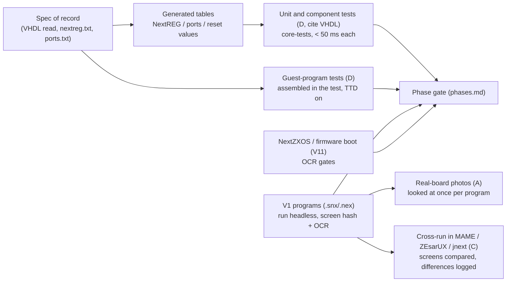

# ZX Spectrum Next: the verification program

**Date:** 2026-10-08 · part of [README.md](README.md) · answers the owner's request to collect the public Next test suites
and put them into one program. Phase tests of [tdd-plan.md](tdd-plan.md) say *what each phase checks*; this
document says *what evidence we trust, where it comes from, and in which order it is used*.

## 1. Principle: three grades of evidence

| Grade | Meaning | Examples | How we use it |
|:--|:--|:--|:--|
| **A. Real hardware** | a person ran the program on a real board and photographed or recorded the result | the board photos in ZXSpectrumNextTests (core 2.00.24, 3.00.5, 3.1.5, 3.01.5) | the final word. A conflict with a lower grade is settled in favor of A, and the lower-grade source gets a note |
| **B. FPGA source** | behavior read in the VHDL of the core (the machine's description) | [research-fpga-vhdl.md](research-fpga-vhdl.md), `nextreg.txt`, `ports.txt` | the specification of record; every pinned number in our tests cites a file and a construct |
| **C. Other emulators and their suites** | another implementation's behavior | MAME `specnext`, ZEsarUX `tbblue.c`, CSpect (binary only), jnext and its VHDL-derived tests | cross-check only. Agreement of two independent emulators with the VHDL is a strong signal; disagreement is an investigation item, never a spec |

An "own" grade D covers tests we write ourselves (guest programs, golden transcripts): they pin the grade A / B facts
so they stay true. Every test file carries a header line `Source: A|B|C|D, <reference>`.

## 2. The catalog

| # | Collection | What it holds | Grade | License / provisioning | Used in |
|:--|:--|:--|:--|:--|:--|
| V1 | [MrKWatkins/ZXSpectrumNextTests](https://github.com/MrKWatkins/ZXSpectrumNextTests) (clone in the emulator sources, commit `98bb90c`; origin Ped7g, earlier fork [Threetwosevensixseven/ZXSpectrumNextTests](https://github.com/Threetwosevensixseven/ZXSpectrumNextTests)) | about 30 programs with source and **prebuilt `.snx`/`.sna`/`.tap`** and **real-board photos**: NextReg defaults, Z80N, Z80N cycle counts (`Z80Nc2`), Copper, DMA, Layer 2 (colours, port, scroll), layer mixing (hi-col, hi-res, lo-res), lighten / darken, NextReg `#69`, sprites (big, relative, 4-bit, scanline delay, transparency), timing (8K bank change, scanline reading + interrupt), ULA (border transparency, palette changes), classic Z80 flag / interrupt tests | A (photos) | prebuilt `.snx` binaries are provisioned by an environment variable (a clone of the repository is enough) | N1-N8, N11 |
| V2 | `sjasmplus` tests `tests/z80n/` ([z00m128/sjasmplus](https://github.com/z00m128/sjasmplus), local clone) | `z80n_cover100.asm`, `op_zx_spectrum_next_2_00_26.asm` + `.bin`/`.lst`, `op_cspect_emulator`, `op_next_syntax`: **every Z80N mnemonic with its encoding** | B/C (assembler authors checked against the FPGA / CSpect) | BSD-style | N1 (opcode encodings), `unreal-asm` ZXN mode |
| V3 | **jnext test suite** ([jorgegv/jnext](https://github.com/jorgegv/jnext), `test/`, `doc/testing/*TEST-PLAN-DESIGN.md`, local clone) | several thousand tests "derived exclusively from the FPGA VHDL" with a **traceability matrix** to VHDL lines: Z80N CPU (85, plus FUSE Z80 1 356), copper, MMU, NextREG, CTC + interrupts, Layer 2, LoRes, tilemap, sprites, compositor, ULA, floating bus, video timing, contention, I/O port dispatch, audio, UART / I2C, DivMMC + SPI, SD card, Multiface, NMI; plus the `00regression` runs of `.nex` / `.tap` programs and `demo/` programs (contention test, floating-bus test, layer 2 modes, sprite anchor / scaling, stencil, tilemap, DAC / AY demos) | B/C | GPLv3 | we read the *plans and expected values* as an independent derivation of the same VHDL; a test case becomes ours only by being rewritten against our API with its own VHDL citation (no copying of source) |
| V4 | MAME `specnext` ([mamedev/mame](https://github.com/mamedev/mame), `src/mame/sinclair/next`) | the reference emulator; software lists `specnext_sd`; no suite of its own | C | GPL / BSD | run the same V1 programs as a screenshot cross-check |
| V5 | ZEsarUX ([chernandezba/zesarux](https://github.com/chernandezba/zesarux)) | `src/tests/tbblue_mmu.sh`, a ready 64 MB `tbblue.mmc`, the fast-boot mode, many `.nex` / `.sna` programs in the distribution | C | GPL | cross-check, `tbblue_mmu` as a case source |
| V6 | CSpect (closed source, binary) | the de-facto development emulator; V1 photos include its runs | C | freeware, no source | screenshots in V1 only |
| V7 | Base Z80 suites already in the project and the fork's own | ZEXALL / ZEXDOC, z80test, FUSE tests (`z80test`, `ZEXALL` clones in the emulator sources), unreal-z80's suites | A for the Z80 core in real chips, B for the Next's T80 core only where V1 `Z80Nc2` / the classic V1 programs agree | free | N1: run on the fork, results identical to unreal-z80's except the recorded T80 differences |
| V8 | Other implementations of the same VHDL: MiSTer ports ([MiSTer-devel/ZXNext_MISTer](https://github.com/MiSTer-devel/ZXNext_MISTer), [benitoss/ZXNext_Mister](https://github.com/benitoss/ZXNext_Mister)), [jattree/NextTang](https://github.com/jattree/NextTang), [mdovey/zxnexys](https://github.com/mdovey/zxnexys) | the core on other boards; NextTang has Python test benches (`tests/test_cpu_executes_bootrom.py`, `test_core_ram.py`, ...) and a bring-up checklist | B-adjacent | various | reading only: a place to check how a porter solved a core corner (bootrom, SRAM timing); no test is imported |
| V9 | Ped7g's [ZXSpectrumNextMisc](https://github.com/ped7g/ZXSpectrumNextMisc) and [SpecBong](https://github.com/ped7g/SpecBong) | small hardware-aware programs (`Z80_ISA_tools`, 512-colour display, nexload, dot commands, a tutorial program using Layer 2 + sprites) | C | various | smoke programs for N6-N7 and the NEX loader |
| V10 | Next software in the wild: the `demo/` and `00regression` programs of jnext, [jarikomppa/specnext](https://github.com/jarikomppa/specnext), [stefanbylund](https://github.com/stefanbylund) layer 2 / sprite / tilemap libraries with examples, [benbaker76](https://github.com/benbaker76) zxnext samples, [ncot-technology](https://github.com/ncot-technology) copper / sprite examples, [em00k](https://github.com/em00k) | real programs that stress layers, copper, DMA, sprites, tilemap, audio | C | various | "does it look right" suite: a list of NEX / TAP files with an expected OCR text or a perceptual hash after N frames; each one added when its phase is done |
| V11 | The NextZXOS distribution (`sn-complete`; the `tbblue` repository holds the same tree, the Next License allows copying the whole) | the real boot chain, NextBASIC, dot commands | A (it is the product) | cannot be sold, parts have their own license | N9: L6 and L7 of [esxdos-and-sd.md](esxdos-and-sd.md) |
| V12 | FPGA-side repositories ([ZX_Spectrum_Next_FPGA](https://gitlab.com/SpectrumNext/ZX_Spectrum_Next_FPGA), [tbblue firmware](https://gitlab.com/thesmog358/tbblue)) | `nextreg.txt`, `ports.txt`, changelog, boot ROM, firmware | B | GPL / Next License | the table generator for the NextREG and port tables (a tool reads `nextreg.txt` and checks our table row by row) |
| V13 | Own: guest programs and golden transcripts | the SPI / SD transcript, DivMMC truth table, automap timing, `LDIRSCALE` pin, stackless NMI, copper modes | D | ours | everywhere |

**Not found (searched 2026-10-08):** a public conformance suite beyond V1 and V3; no hardware-verified Layer 2 / sprite pixel
dumps (only photographs); no public tests for the DMA state machine other than V1 `DMA` and `ZilogDMA` and V3's plan. Looking
further needs real-board time (section 6).

## 3. How the suites become one program

Rules:

1. **Table generator first.** `tools/machines/next/checktables.py` reads `nextreg.txt` and `ports.txt` (V12) and fails when
   our NextREG / port table differs in register number, read / write flag or reset value. A new core release changes the
   source text; the diff is the work list.
2. **Traceability.** A test that pins a behavior has `// VHDL: <file> <construct>` in a comment (a search term, not a line
   number, so it survives a new core). A `docs` script lists every table row without a test and every test without a
   source: the coverage view jnext keeps as its traceability matrix; here it is generated from the headers.
3. **Screen programs (V1, V9, V10)** run headless under TTD: start recording, run N frames, then (a) hash the frame (perceptual
   hash, tolerance recorded), (b) OCR the text parts, (c) read named memory cells the test writes its verdict into. The expected
   hash is created **after** a person compares the screen with the real-board photo (grade A) once and writes the
   comparison into the test's `README` row. A later hash change fails the test and asks for a new comparison.
4. **Cross-run.** The same program is run in MAME and ZEsarUX (and jnext) by a script and the screenshots are stored in
   scratch (never in the repository); a disagreement with our screen is a row in `TODO.md`, resolved by the grade order.
5. **Provisioning.** Binaries (V1 `.snx`, V10, V11, firmware, ROMs) are found through environment variables listed in
   `docs/emulator/environment-variables.md`; a missing set makes the test skip with the variable's name, as the Sprinter and
   Profi firmware tests do. Large collections are not copied into the repository; small original test sources we wrote are.
6. **Two-stage use of jnext's plans.** First read its test-plan documents and expected values as an independent derivation of
   the VHDL, tabulate where it and our research differ (an open item per difference), then write our own tests. Never
   port its code.

## 4. Order of use (what each phase must pass before it closes)

| Phase | Programs and checks |
|:--|:--|
| N0 | table generator green; research sections cross-checked against jnext's plan documents (differences listed) |
| N1 | V2 encodings (every Z80N mnemonic assembled and decoded identical); V7 suites on the fork; V1 `Z80N` and `Z80Nc2` programs (screen all green) and the classic Z80 V1 programs (block-instruction flags, interrupt skip, CCF/SCF) |
| N2-N3 | V1 `NextReg_defaults` (every register: survival and default), V1 timing programs (8K bank change with and without contention, scanline reading and interrupt), V3's timing and contention plans as cross-check |
| N4-N5 | audio: golden spectrum comparison against a reference rendering (not "non-silent"), jnext's audio plan values; V1 interrupt program; CTC programs from V10 |
| N6-N7 | V1 Layer 2 (colours, port, scroll), layer mixing (3 programs), lighten / darken, `#69`, ULA transparency / palette, sprites (5 programs), copper; V3 compositor and sprite plans; V10 libraries' examples |
| N8 | V1 `DMA`, `DmaInteractive` (classic machine), `ZilogDMA`; V3 DMA plan |
| N9 | boot chain of [esxdos-and-sd.md](esxdos-and-sd.md): L4-L8; the ZEsarUX `tbblue.mmc` as a second card image for the loader |
| N10 | input and bus: V3 input / Multiface / NMI plans; V10 joystick and mouse programs |
| N11 | NEX / SNX loaders against V10 sets; TTD seek across V1 programs |
| N12 | the Qt panels and variants; issue / board differences: only what V1 photos show per core version |

## 5. Recording and reporting

Every run of the program leaves one table (`scratch/next-verification/<date>/report.md`) with: row id, program, grade of the
reference, result (pass, fail, skip, differs-from-C), our hash, the reference hash or photo name, duration. The summary line
goes into the phase's `DONE` entry. A skipped row names its missing provision.

## 6. What needs real hardware (an owner decision)

We have no board. Grade A evidence is the V1 photographs. Where a behavior has none (DMA exact cycle counts at 28 MHz, sprite
line budget, SRAM wait at 28 MHz, Layer 2 at the edges, contention in +3 timing) the options are: ask a Next owner to run a
small program and send a photo or a log (cheap, we write the program), accept the VHDL as the evidence (what this plan does
by default), or both. **Answered (Q13, 2026-10-08):** a board will be available at some point. The programs are packaged as the autonomous POC
[2026-10-08-zx-next-hardware-poc](../2026-10-08-zx-next-hardware-poc/README.md) (four `.nex` files, instructions, predicted values);
until it has run, the VHDL grade B stands.
