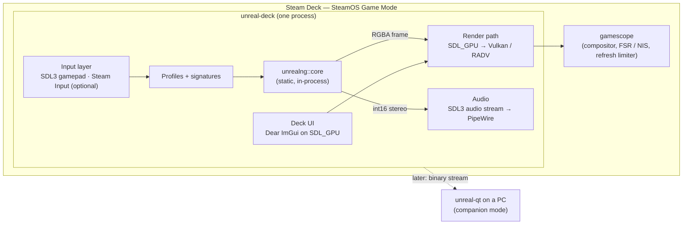

# unreal-deck: a native Steam Deck front-end for unreal-ng

A separate front-end to the unreal-ng core, built for the Steam Deck (SteamOS Game Mode, gamescope,
1280×800, no keyboard): a fast native render path, controller-first UI, per-game control profiles
found by signature, Spectrum-style on-screen keyboard, instant suspend / resume, a media library,
and later a media hub and a debugger companion for a desktop instance.

## Documents

| File | Topic |
|---|---|
| [goals-and-requirements.md](goals-and-requirements.md) | **Start here.** Problem, market check, goals, non-goals, personas, use cases, functional and non-functional requirements, phases, acceptance, open questions |
| [ux.md](ux.md) | Screens and navigation: library shelf, game card, in-game, quick menu, radial menu, on-screen keyboards, mapping editor, suspend / resume, media hub, companion; button map; ASCII mock-ups |
| [architecture.md](architecture.md) | Process and threads, component view, input stack, profile store and signature detection, persistence, power events, packaging (mermaid component, thread and sequence diagrams) |
| [rendering.md](rendering.md) | The fastest native render path: SDL3 GPU on Vulkan / RADV, display-locked emulation, present modes, latency budget, scaling and CRT pass, UI overlay, 50 Hz panel |
| [input-and-profiles.md](input-and-profiles.md) | Deck controls → ZX targets (keys, Kempston, Sinclair, cursor, mouse), SDL3 and Steam Input backends, profile schema, signature detection, heuristics |
| [integration.md](integration.md) | Where the code goes in this repository, CMake, which core APIs are used, the small core changes needed, reuse of other in-progress designs, build and release |
| [companion-and-media.md](companion-and-media.md) | Later phases: music and video hubs, demoparty live mode with reference TTD tracks, debugger companion, widget dashboards, the binary stream protocol |
| [poc-plan.md](poc-plan.md) | Proof-of-concept list P-1…P-25: question, what to build, pass criterion, what it de-risks, size; gates and order |
| [references.md](references.md) | Valve / Steamworks / Steam Deck / Steam Linux Runtime / gamescope / SDL3 / Dear ImGui / scene databases, with what each one is used for |

## In one picture

## Status

Design (2026-10-08). No code. Source: a design discussion with the owner (Russian, informal),
turned into requirements here; claims from that discussion were checked against the code and the
vendor documentation, and corrected where they were wrong (see
[goals-and-requirements.md §11](goals-and-requirements.md#11-corrections-to-the-source-discussion)).
