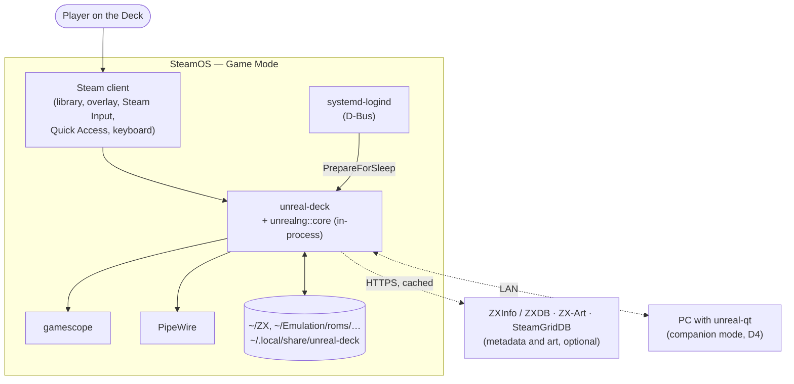
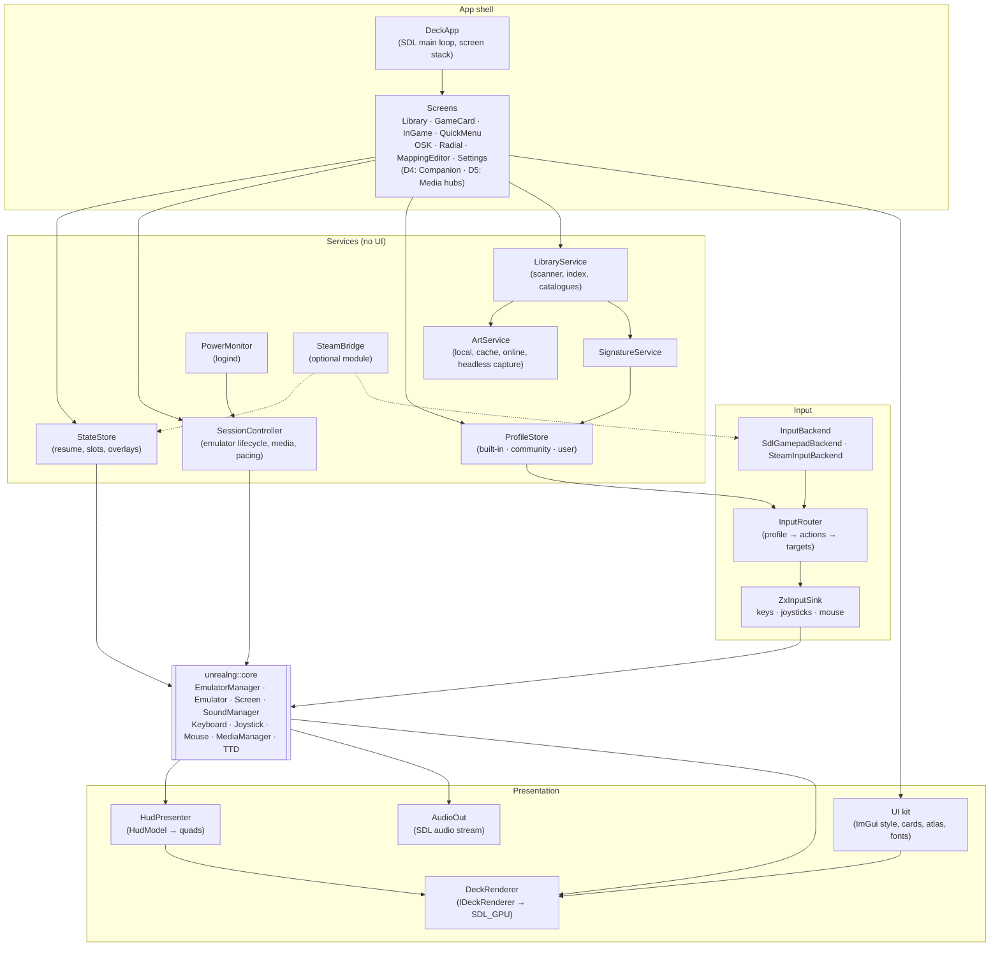
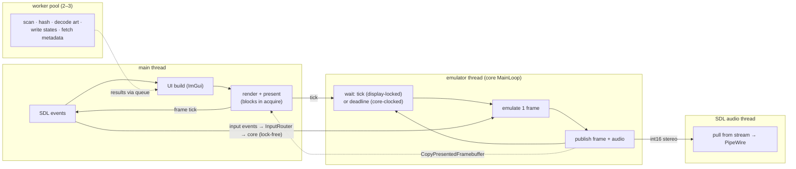
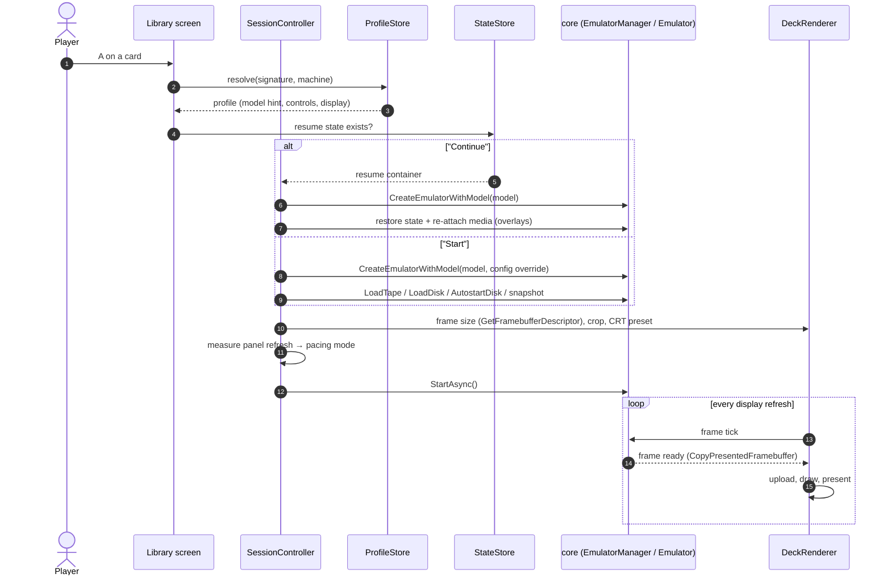
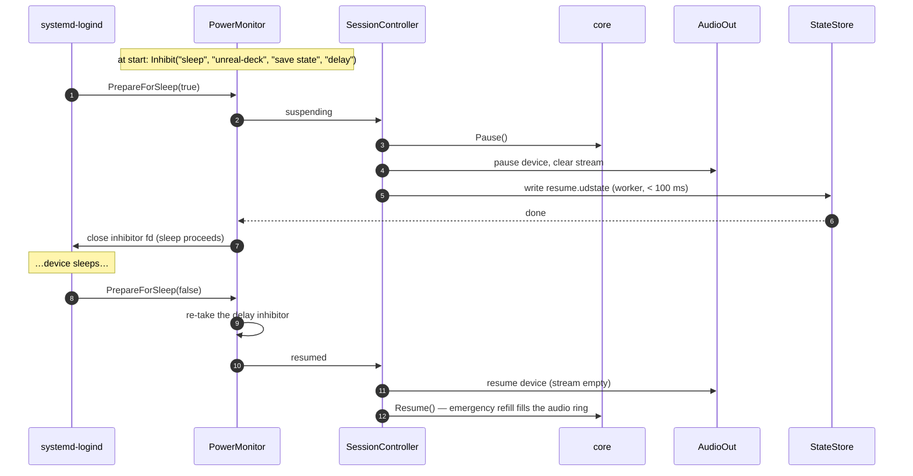

# unreal-deck: high-level architecture

| | |
|---|---|
| **Date** | 2026-10-08 |
| **Status** | Design, for review |
| **Requirements** | [goals-and-requirements.md](goals-and-requirements.md) |
| **Details** | [rendering.md](rendering.md) · [input-and-profiles.md](input-and-profiles.md) · [integration.md](integration.md) |

## Contents

- [1. Context](#1-context)
- [2. Why not Qt, why SDL3](#2-why-not-qt-why-sdl3)
- [3. Components](#3-components)
- [4. Threads](#4-threads)
- [5. Starting a game](#5-starting-a-game)
- [6. Persistence](#6-persistence)
- [7. Suspend, resume and exit](#7-suspend-resume-and-exit)
- [8. Steam integration](#8-steam-integration)
- [9. Failure handling](#9-failure-handling)

## 1. Context



The player path is one process. The core is the static library `unrealng::core`, linked in
exactly as `unreal-qt` and `unreal-videowall` link it. Network use is optional and cached: the
app is fully usable offline, which is a Deck review criterion.

## 2. Why not Qt, why SDL3

| | Qt 6 (as `unreal-qt`) | SDL3 + SDL_GPU + Dear ImGui |
|---|---|---|
| Controller | Qt 6 has no gamepad module in our build (`tdd-kempston-joystick.md` J9) | first-class: HIDAPI Deck driver, trackpads, gyro, back buttons, rumble, Steam handle |
| Render path control | QOpenGLWindow / RHI, Qt's own loop | explicit acquire, present mode, frames in flight ([rendering.md §2](rendering.md#2-api-choice)) |
| Runtime size | ~60–100 MB of Qt libraries in the Flatpak / runtime | SDL3 is in steamrt4 and the freedesktop runtime; ImGui is compiled in |
| 10-foot UI | Widgets are mouse-first; QML would be a second UI code base | immediate-mode UI with gamepad navigation, custom-drawn at Deck sizes |
| Shared code with desktop | everything | the core plus the front-end-neutral libraries of [integration.md §3](integration.md#3-shared-libraries) |

The Qt app stays the desktop and debugger front-end. The Deck front-end is small, because
everything that is not presentation lives in the core or in shared libraries.

## 3. Components



| Component | Responsibility | Built from |
|---|---|---|
| `DeckApp` | SDL init, the event loop, the screen stack (push / pop, B = back), global hotkeys | SDL3 |
| Screens | one class per screen; immediate-mode UI; no business logic | ImGui + UI kit |
| `DeckRenderer` | frame upload, the scale / CRT draw, the UI pass, present, frame tick | SDL_GPU ([rendering.md](rendering.md)) |
| `AudioOut` | SDL audio stream fed by the core's audio callback; reports occupancy to DRC | SDL3 audio |
| `InputBackend` | raw Deck controls → normalized `ControlEvent` (button, axis, touch, gyro) | SDL3 gamepad; Steam Input when available |
| `InputRouter` | applies the active profile: controls → actions (ZX key, joystick bit, mouse delta, app action), with layers, chords, turbo, dead-zones | shared `deckinput` library |
| `ZxInputSink` | writes to the core: `MC_KEY_PRESSED/RELEASED`, `Joystick::Press/Release`, `MC_MOUSE_MOVE/BUTTON/WHEEL` | core APIs ([integration.md §2](integration.md#2-core-apis-used)) |
| `LibraryService` | folder scan, an incremental index (SQLite), shelves, search, TR-DOS / tape catalogues | core loaders, `TrdosCatalog`, `TapeCatalog` |
| `SignatureService` | content signatures per media type ([input-and-profiles.md §4](input-and-profiles.md#4-signatures)) | shared `swsignature` library |
| `ArtService` | finds or fetches covers and screenshots; renders a title screen headless when none exists | core headless instance, `CopyPresentedFramebuffer` |
| `ProfileStore` | merges built-in, community and user profiles; resolves by signature, then machine, then global | JSON |
| `SessionController` | creates / destroys the emulator, picks the model, loads media, selects the pacing mode, owns the frame tick | `EmulatorManager`, `Emulator` |
| `StateStore` | resume states, slots, thumbnails, guest-write overlays | core snapshot / TTD serializers, media layer |
| `PowerMonitor` | logind `PrepareForSleep` with a sleep delay inhibitor | libdbus (as SDL itself uses it) |
| `SteamBridge` | Steam Input, the floating keyboard, Cloud, Timeline, Rich Presence | optional run-time module ([§8](#8-steam-integration)) |

## 4. Threads



- **Main thread.** SDL wants events, windows and (in practice) GPU submission on one thread.
  Input is routed on this thread straight into the core's lock-free entry points
  (`Joystick::Press` is atomic; key and mouse events go through the MessageCenter queue). This
  happens right before the frame tick, so the next emulated frame sees it.
- **Emulator thread.** The core's own `MainLoop`, unchanged except for the external tick
  ([integration.md §4](integration.md#4-core-changes)). Audio is produced here and pushed into the
  SDL stream (`SDL_PutAudioStreamData`). Stream occupancy is the DRC's occupancy cell.
- **Workers** never touch the running emulator. The art service's headless captures use a
  **separate** core instance with video mode `M_NUL` plus a frame copy, running in turbo.
- No UI thread blocks on I/O. Everything slow returns through a completion queue that is drained
  once per frame.

## 5. Starting a game



One emulator instance runs at a time in player mode. A game switch saves the resume state, then
destroys and re-creates the instance. A model change cannot be done in place cheaply, and a fresh
instance guarantees no state leaks between games.

## 6. Persistence

XDG paths. A Flatpak build maps them under `~/.var/app/<id>/`.

```
~/.config/unreal-deck/
    settings.json              app settings (display, audio, library folders, online on/off)
    profiles/user/*.json       user control profiles (one per signature or machine)
~/.local/share/unreal-deck/
    library.sqlite             index: path, size, mtime, type, signature, title, machine, flags
    states/<signature>/
        resume.udstate         written on quit / switch / suspend / every 60 s
        slot-1..8.udstate
    overlays/<signature>/      guest writes to disks (media layer change layer)
    replays/*.ttd              TTD sessions (D3)
~/.cache/unreal-deck/
    art/<signature>/{cover,title,snap}.webp
    meta/                      cached ZXInfo / ZX-Art responses
```

### Resume container (`.udstate`)

unreal-ng has no single "everything" snapshot format. SZX covers the classic machines but not
every model and not the media state. The `.ttd` session file is lossless, but it holds a whole
recording. The proposal ([goals Q-2](goals-and-requirements.md#12-open-questions)):

| Entry (zip via miniz, already in the core) | Content |
|---|---|
| `manifest.json` | format version, model, ROM set, core version, signature, created, frame counter, play time |
| `machine.bin` | **full machine state as one TTD v2 checkpoint** (device table + memory regions, `core/src/debugger/ttd/engine/ttddevicetable.*`, `ttdregion*`). It covers every device by construction, because rewind must be exact. Today a checkpoint only exists inside a session; a standalone save / load of one checkpoint is a core addition ([integration.md §4](integration.md#4-core-changes)). |
| `machine.szx` | the same state as SZX when the model supports it: a portable fallback that other emulators can read |
| `media.json` | slots → library paths + content hashes, tape position, motor, disk head positions, overlay ids |
| `thumb.webp` | 320×200 "Deck fit" frame for the card |

Restore order: model → `machine.bin` (or SZX) → media re-attached with overlays → audio flushed →
run. Writing happens on a worker from a copy taken at a frame boundary, so the emulator pauses
for one frame at most (NFR-7).

## 7. Suspend, resume and exit



- The process stays in RAM across sleep, so the state on resume is exact. The file write only
  protects against the battery running flat while asleep.
- Audio is restarted **before** emulation. The core's emergency refill then fills the ring
  without a click, and DRC settles within a second.
- **Exit** (B from the library, Steam "Exit game", `SIGTERM` from Steam): write the resume state,
  then `ShutdownAllEmulators`. Steam gives a game a few seconds after `SIGTERM`, which is enough.
- **Focus loss** (Steam button, Quick Access): no pause by default. A setting enables pause on
  focus loss.

## 8. Steam integration

The app must work **with no Steam at all**: Flatpak, a non-Steam shortcut, desktop Linux, macOS
in development. Steam features are an optional layer.

| Feature | Without Steamworks (always) | With Steamworks (AppID build, D3) |
|---|---|---|
| Controls | SDL3 HIDAPI: every Deck control, gyro, trackpads, back buttons, rumble. The non-Steam shortcut needs Steam Input set to off or "Gamepad" for this game | Steam Input action sets; the user can also rebind in Steam's own UI; glyphs |
| Host text input | own OSK (host text mode) | `ShowFloatingGamepadTextInput` (Verified criterion) |
| Deck detection | VID / PID of the built-in controller, DMI board name | `IsSteamRunningOnSteamDeck` |
| Saves sync | — | Auto-Cloud on `~/.local/share/unreal-deck/states` and `profiles/user` |
| Timeline | — | `AddInstantaneousTimelineEvent` on rewind, slot save, demo part; `SetTimelineGameMode` |
| Presence | — | `SetRichPresence("steam_display", …)`: game, machine |
| "Add to Steam" | write the shortcut to `shortcuts.vdf` + art to `grid/` (Steam must be restarted to see it; the app says so) | same |

**Licensing ([goals Q-1](goals-and-requirements.md#12-open-questions)).** unreal-ng is
GPL-3.0, and `libsteam_api` is proprietary. The design keeps every Steamworks call inside one
optional module, `libunreal-deck-steam.so`, behind a small C interface (`deck_steam_init`,
`deck_steam_input_poll`, `deck_steam_show_keyboard`, `deck_steam_timeline_event`, …). The module
loads `libsteam_api.so` with `SteamAPI_InitFlat()`. Whether that, or a GPL linking exception,
is needed is a licensing decision to make before D3. Nothing in D0–D2 depends on it.

## 9. Failure handling

| Failure | Handling |
|---|---|
| Unknown or broken file | The scanner marks it; the card shows "Cannot load" with the loader's message (`LastSnapshotReport`, loader errors). Nothing is created. |
| Model lacks a ROM | Machine profile screen lists missing ROMs; the game is not started. |
| Emulator crash (in-process) | The app dies. Steam restarts nothing. On the next start the last periodic resume state (≤ 60 s old) is offered, plus a crash note. Core crashes are bugs to fix, not to hide behind a second process. |
| Audio device lost (dock / undock, Bluetooth) | SDL device-removed event → re-open the default device; DRC re-converges. |
| Display change (dock to TV) | New window size → re-layout, recompute crop and scale, re-measure refresh → pacing mode. |
| Network down | Online features grey out; cached metadata and art still work. |
