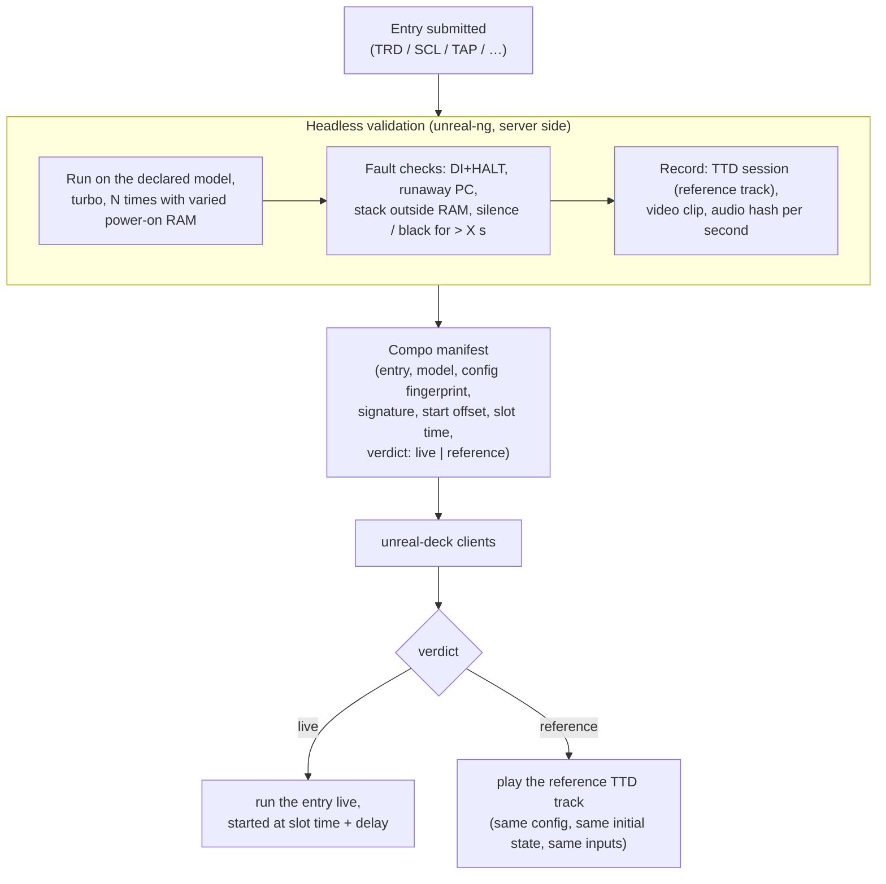

# unreal-deck: media hubs, demoparty mode and debugger companion (phases D4–D6)

| | |
|---|---|
| **Date** | 2026-10-08 |
| **Status** | Concept, for review. Detailed design comes after D1 ships |
| **Requirements** | UC-10…UC-12 in [goals-and-requirements.md](goals-and-requirements.md) |

## Contents

- [1. Music hub (D5)](#1-music-hub-d5)
- [2. Video hub and slideshow (D5)](#2-video-hub-and-slideshow-d5)
- [3. Demoparty live mode (D6)](#3-demoparty-live-mode-d6)
- [4. The companion protocol](#4-the-companion-protocol)
- [5. Debugger companion (D4)](#5-debugger-companion-d4)
- [6. Dashboards](#6-dashboards)
- [7. Distributed runs](#7-distributed-runs)
- [8. Acceptance](#8-acceptance)

## 1. Music hub (D5)

A Spotify-style player for chip music on every sound device the core emulates: AY / YM,
TurboSound, TurboSound FM, SAA1099, General Sound, NeoGS, Covox / SounDrive, MoonSound, beeper.

```
┌──────────────────────────────────────────────────────────────────────────────┐
│ ♫ MUSIC   ◀L1  Playlists · Artists · Devices · Demo parts · ZX-Art  R1▶   🔍 │
├────────────────────────┬─────────────────────────────────────────────────────┤
│ ┌────────────────────┐ │  Track:  (title)                                    │
│ │  art / demo frame  │ │  Author: (author)                                   │
│ │                    │ │  Device: Pentagon 128 · TurboSound (2× AY)          │
│ └────────────────────┘ │  02:14 ━━━━━━━━━━━━━━━━●──────────────── 04:32      │
│                        │   ⏮   ⏯   ⏭   🔀   🔁        Ⓛ4 −10 s   Ⓡ4 +10 s     │
├────────────────────────┴─────────────────────────────────────────────────────┤
│ AY1  A ▁▃▆█▆▃  B ▂▅▇▅▂  C ▁▁▃▁▁   AY2  A ▆█▆▃▁  B ▃▅▃▁▁  C ▁▂▁▁▁   [mute: Ⓐ]  │
│ R0–R13 07 01 2C 00 F0 01 1F 38 0F 0E 10 …    envelope ⟋⟍⟋⟍   noise ░          │
├──────────────────────────────────────────────────────────────────────────────┤
│ 1. (module)         .pt3   AY             3:12                               │
│ 2. (module)         .mod   General Sound  5:01                               │
│ 3. ★ (demo part)    state  Pentagon + TS  1:45   ← plays the demo's own code  │
└──────────────────────────────────────────────────────────────────────────────┘
```

| Topic | Design |
|---|---|
| **Playback engines** | (1) **Emulated**: the module and its tracker's player routine are loaded into a small headless machine image that runs the Z80 player on the real chip emulation. This is the most authentic engine, and it works for every device. (2) **Library**: ZXTune (GPL-3.0, compatible) for breadth of formats, where no player image exists. The engine is chosen per format, emulated first. |
| **Demo parts** | A playlist entry can be a **machine state** (the resume container of [architecture.md §6](architecture.md#6-persistence)) captured at a moment in a demo. Playing it restores the state and runs the demo's own code, video optional. These are the "UNS jumps" of the source discussion, built on C-2. |
| **Playlists** | JSON: entries of `{kind: module|state|ttd-range, ref, device, start, end, title}`; mixes across devices are allowed; gapless where the engine allows. |
| **Visualisation** | per-channel levels and AY / SAA register view from the core's sound chip state (`AYLogAnalyzer` and the chip's registers), an oscilloscope from the mixed output, channel mute / solo (needs a per-channel mute in the core's mixer, which is a small addition). |
| **Sources** | the library folders; ZX-Art music (metadata + downloads the site permits); a scene's own playlists as files. |
| **Power** | the screen dims after 30 s; emulation only (no video rendering) while dimmed. |

## 2. Video hub and slideshow (D5)

| Feature | Design |
|---|---|
| **Slideshow** | ZX-Art pictures (SCR, Gigascreen, multicolour, ULA+, TS-Conf, ATM) are shown **through the core's video modes**: the picture is loaded into a machine's video memory and rendered by the real renderer, with ZX DLSS de-flicker for Gigascreen and the CRT pass. It is not a decoded PNG. |
| **Demos** | Demos from the library or a party archive, with the same card UI as games; "watch" mode hides all chrome. |
| **Replays** | TTD sessions (`.ttd`) play like videos: timeline, scrub, speed. You can take over control at any moment ("take over" ends playback and starts live emulation from that point). |
| **Export** | the core's `RecordingManager` (ffmpeg on Linux) records a clip to share. |

## 3. Demoparty live mode (D6)

The idea: watch a compo **locally**, in sync with the party's stream (or with a set delay),
with no video compression, at the true frame rate, and with exact sound. Unstable entries are
replaced by a deterministic reference.



| Topic | Design |
|---|---|
| **Why a reference track removes variability** | The emulator is deterministic. A demo that behaves differently between runs does so because of its inputs: power-on RAM contents, disk timing, model or config differences, the moment a key was pressed. A TTD session pins all of these: the config fingerprint (`ttdconfigfingerprint`), the initial state, and the input / media journal. So playing it reproduces the validated run exactly, while still running the emulation, so the CRT pass, scaling and inspection all work. |
| **Sync** | The manifest gives each slot a wall-clock start time (UTC). Clients use the system clock (NTP-synced on SteamOS) plus the user's delay (default 15 min, to match typical stream latency). A client that starts late seeks into the reference track, or fast-forwards a live entry in turbo, to catch up. |
| **Distribution** | Static files (manifest + entries + reference tracks) on the party's or the project's server, fetched ahead of time; nothing streams during the compo. Release follows the party's rules. Entries are usually published after the compo; the mode then plays "as shown". |
| **Validation service** | A headless runner built from the core (no front-end), run in CI or on a server. This is the same runner that renders title screens for the library's art. |

## 4. The companion protocol

The Deck as a second screen for `unreal-qt` (or a headless instance) on a PC. The data model and
command set are those of the [debugger model protocol](../2026-09-28-debugger-model/protocol.md);
this section only adds a binary channel for high-rate data.

| Channel | Transport | Content |
|---|---|---|
| Control | existing WebAPI (REST, port 8090) + WebSocket `/api/v1/websocket` (JSON events) | commands, settings, run control, breakpoints, discovery |
| **Stream** (new) | WebSocket **binary** frames on the same server (one connection, no new port) | subscribed high-rate topics, below |

| Stream topic | Payload | Raw rate | Sent rate (estimate) |
|---|---|---|---|
| `frame` | changed 8×8 cells of the indexed framebuffer (4–8 bpp) + palette; zstd | 352×288 RGBA × 50 = 20 MB/s | 50–500 KB/s depending on the picture |
| `screens` | both ZX screen pages (6912 B each), XOR delta + zstd | 690 KB/s | 5–50 KB/s |
| `gigascreen` | frame A / B pairs (indexed) | 2 × `frame` | 2 × `frame` |
| `memory-heat` | per-256-byte page read / write / execute counters, 4 Hz | — | 4 × 3 KB/s (128K machine) |
| `sound-regs` | AY / SAA / … registers per frame | 50 × 32 B | 2 KB/s |
| `ttd-timeline` | frame markers (INT, port writes by class, page switches, bookmarks), on change | — | small |

- **Subscriptions.** A client receives only the topics of the widgets on its screen. Each topic
  has a rate cap.
- **Encoding.** Little-endian tagged records: `{u16 topic, u16 version, u32 seq, u32 len, payload}`.
  This is the same style as the TTD container, and it needs no new serialization dependency. zstd
  is already in the core.
- **Why not UDP / QUIC first.** The LAN data rates above are tiny. A WebSocket on the existing
  Drogon server needs no new port, firewall rule or discovery. Move to UDP only if measurement
  shows head-of-line blocking hurting the `frame` topic.
- **Discovery.** The existing WebAPI instance list. mDNS announcement is a later convenience.

## 5. Debugger companion (D4)

| Widget | Shows / does | Core source |
|---|---|---|
| **TTD scrubber** | touch timeline with markers; drag = seek the PC instance; L4 / R4 = stash two points and diff them (registers, memory) | `TimeTravelManager` (seek, bookmarks), `/ttd/*` |
| **Two screen pages** | page 5 and page 7 side by side, live, with the active one marked | `screens` topic |
| **Gigascreen phases** | frame A, frame B, blend, and the ZX DLSS result; phase / INT alignment | `gigascreen` topic, `zxdlss` |
| **Beam pick** | tap a point of the frame (border included) → run the PC instance until the beam reaches it | `RunUntilScanline` + a T-state target (small core addition) |
| **Sound channels** | per-chip registers and levels; mute / solo on the PC instance | `sound-regs`; per-channel mute (see §1) |
| **Memory heat map** | 128 KB – 4 MB as a grid: execute / read / write intensity | `MemoryAccessTracker` |
| **Remote machine** | model switch, ROM set, features, turbo, reset, NMI | WebAPI |
| **Auto-trace runner** | run scenarios at chosen speeds (1×, 4×, turbo) with trace capture | WebAPI + analyzers |
| **Video-wall control** | assign demos / scenarios to `unreal-videowall` tiles, trigger synchronized starts | WebAPI of the wall's instances |
| **Shader desk** | live sliders for the CRT preset on the PC (or wall) | WebAPI, `crtprofiles` |

## 6. Dashboards

- A **workspace** is a named grid layout of widgets: `{name, grid: 12×8, widgets: [{type, x, y, w, h, config}]}`, saved as JSON next to the profiles.
- Presets: *Player*, *Gigascreen artist*, *TTD debug*, *Sound*, *Demoparty*.
- On the Deck, workspaces switch with L1 / R1 in companion mode. Widgets snap to the grid; touch
  drag to move or resize; the D-pad moves focus.
- The same widget definitions are meant to be reusable by `unreal-qt` docks later
  ([debugger family](../2026-09-28-debugger-family/workbench-framework.md)).

## 7. Distributed runs

ZX-Poly runs four instances in lockstep on one host
([quad-instance architecture](../2026-09-27-zxpoly/quad-instance-architecture.md)). The same
principle works across machines, because the emulation is deterministic:

| Mode | How | Use |
|---|---|---|
| **Mirror** | Deck and PC start from the same machine state (C-2) with the same config fingerprint; only **inputs** travel (TTD frame-input records); each side renders locally | full-quality local picture on the Deck with almost no traffic; divergence detected by comparing the core's frame digest every second |
| **Look-ahead** | the Deck runs a branch N frames ahead from a PC checkpoint | preview "what happens if" without disturbing the PC run; related to the [look-ahead manager](../2026-09-27-lookahead-manager/design.md) |
| **Offload** | the PC emulates; the Deck only displays (`frame` topic) | heavy machines or debugging sessions where the PC has the tools |
| Linked machines (two Spectrums over a link) | — | not planned |

## 8. Acceptance

| Phase | Accepted when |
|-------|---------------|
| D4 | On a LAN, the Deck shows the TTD scrubber, two screen pages and the Gigascreen phases of a running `unreal-qt` instance with < 100 ms seek-to-picture latency; stream traffic < 1 MB/s for a 128K demo. |
| D5 | A playlist mixing a PT3 module, a GS module and a demo-part state plays gaplessly. The register view follows the music. A ZX-Art Gigascreen picture is shown de-flickered. |
| D6 | A 10-entry test compo runs on three Decks in sync (start skew < 100 ms). One entry marked "reference" plays its TTD track identically on all three (frame digests match). |
