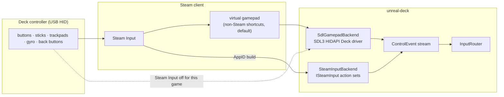
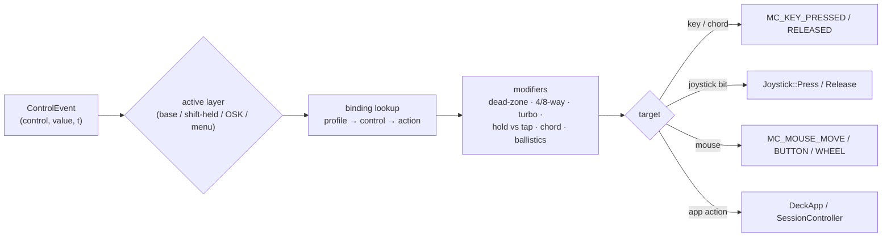

# unreal-deck: input, profiles and signatures

| | |
|---|---|
| **Date** | 2026-10-08 |
| **Status** | Design, for review |
| **Requirements** | FR-30…FR-36, UC-2, UC-7 in [goals-and-requirements.md](goals-and-requirements.md) |

## Contents

- [1. Controls and targets](#1-controls-and-targets)
- [2. Two back-ends](#2-two-back-ends)
- [3. Routing: control → action → ZX target](#3-routing-control--action--zx-target)
- [4. Signatures](#4-signatures)
- [5. Heuristic auto profile](#5-heuristic-auto-profile)
- [6. Profile format](#6-profile-format)
- [7. Default bindings](#7-default-bindings)
- [8. Haptics](#8-haptics)

## 1. Controls and targets

**Deck controls** (inputs): D-pad · A B X Y · L1 R1 · L2 R2 (analog) · left / right stick
(analog, click, capacitive touch) · left / right trackpad (x / y, touch, pressure click) · gyro +
accelerometer · L4 L5 R4 R5 · View · Menu. **Steam** and **Quick Access** belong to the system.

**ZX targets** (outputs):

| Target | How it reaches the core | Exists today |
|---|---|---|
| ZX key / chord (e.g. CAPS+1 = EDIT) | `MC_KEY_PRESSED` / `MC_KEY_RELEASED` with `KeyboardEvent(ZXKeysEnum, …)`; `ZXKEY_EXT_*` composites | yes (`core/src/emulator/io/keyboard/keyboard.h`) |
| Kempston joystick: up / down / left / right / fire / fire 2–3 | `Joystick::Press(mask)` / `Release(mask)` (atomic; D0–D7) | yes (`core/src/emulator/io/joystick/joystick.h`) |
| Sinclair 1 (6 7 8 9 0), Sinclair 2 (1 2 3 4 5), Cursor / Protek (5 6 7 8 0) | key maps on top of the key target; no hardware | yes, as keys |
| Fuller (port `#7F`) | a new joystick type in the core | no ([integration.md §4](integration.md#4-core-changes)) |
| Kempston mouse: Δx, Δy, buttons, wheel | `MC_MOUSE_MOVE` / `MC_MOUSE_BUTTON` / `MC_MOUSE_WHEEL`, `mousedeltaaccumulator.h` | yes |
| App action | OSK, radial menu, quick menu, rewind, fast-forward, turbo, screenshot, slot save / load, swap disk, NMI, reset | front-end |

## 2. Two back-ends

Both produce the same `ControlEvent` stream, so the router and profiles do not depend on the
back-end.



### 2.1 SDL3 back-end (always available)

- SDL3's HIDAPI Deck driver (`SDL_HINT_JOYSTICK_HIDAPI_STEAMDECK`) exposes every control: the back
  buttons, both trackpads (`SDL_GetGamepadTouchpadFinger`), and gyro / accelerometer
  (`SDL_SetGamepadSensorEnabled`). SDL3 has no Deck-specific `SDL_GamepadType` (only
  `SDL_GAMEPAD_TYPE_STEAM`), so the Deck is recognised by VID / PID.
- **Steam Input in front.** A non-Steam shortcut normally gets Steam Input's virtual gamepad.
  Steam hides the physical device from SDL, and the trackpads and gyro then arrive as whatever the
  Steam layout makes of them (often a mouse). The back-end detects this case (only a virtual pad,
  no touchpads reported) and:
  1. works in *compatible mode*: sticks, D-pad and buttons only, trackpads read as SDL mouse
     events;
  2. shows a one-time hint: *"For trackpads, gyro and back buttons: Steam → Controller settings →
     Steam Input: Off for unreal-deck"*.
- On desktop Linux, macOS and Windows the same back-end drives any SDL gamepad (Xbox, DualSense,
  Switch Pro). DualSense touchpad and gyro then work as well.

### 2.2 Steam Input back-end (AppID build, D3)

Used when the optional Steam module loads ([architecture.md §8](architecture.md#8-steam-integration)).
The action manifest (IGA file, shipped with the app through `SetInputActionManifestFilePath`)
declares **generic** actions only. Per-game ZX meaning stays in our profiles, so Steam's binding UI
and our profiles compose instead of competing:

| Action set / layer | Digital actions | Analog actions |
|---|---|---|
| `InGame` | `Up Down Left Right Fire Fire2 Fire3`, `Btn1…Btn8`, `Keyboard`, `Radial`, `QuickMenu`, `Rewind`, `FastForward`, `Turbo` | `Pointer` (`absolute_mouse`), `Stick` (`joystick_move`), `Gyro` (`absolute_mouse`) |
| layer `MouseMode` | `MouseL MouseR MouseM` | `Pointer` |
| `Menu` | `Up Down Left Right Accept Back Tab Prev Next Options` | `Scroll` |
| `Keyboard` | `Accept Back Shift Symbol Space Enter Delete` | `CursorL`, `CursorR` (trackpads, absolute) |

`InputRouter` maps `Btn1…Btn8` and the directions to ZX targets per game. The default IGA bindings
match [§7](#7-default-bindings), so the Verified criterion "default config reaches all content"
holds without user setup.

## 3. Routing: control → action → ZX target



- **Layers.** One button can be a *shift* (e.g. hold L5 = layer "keys": the face buttons become
  1 2 3 4). There is a menu layer, and the OSK layer captures everything while the keyboard is open.
- **Sticks.** Digital with a dead-zone (default 0.35) and 4-way or 8-way sectors. 4-way stops a
  diagonal from pressing two keys in games that hate that. A stick can also drive the mouse with
  an acceleration curve.
- **Trackpads.** Relative mouse with ballistics and inertia (trackball), absolute (OSK cursors),
  a radial menu (touch → show, slide → highlight, click / release → choose), or a D-pad (four
  zones).
- **Gyro.** Mouse while a chosen button is held, or while a thumb rests on the right stick
  (capacitive). It is never on unconditionally.
- **Chords and macros.** One control can type a key sequence (e.g. `J`, `"`, `"`, ENTER = `LOAD ""`
  in 48K BASIC). Each key is held for one frame plus one frame of release, so the ROM's keyboard
  scan sees every key.
- **Timing.** Events are routed on the main thread right before the frame tick, so every input
  lands in the next emulated frame ([architecture.md §4](architecture.md#4-threads)).

## 4. Signatures

Requirement: recognise a title even if the file was re-packed (TAP ↔ TZX, TRD ↔ SCL), renamed,
or written to (saved games on a disk). Whole-file CRC, as RetroArch uses, fails all three.

| Media | Signature | Robust to |
|---|---|---|
| any | **exact**: SHA-256 of the file. MD5 / SHA-1 as needed for external lookups (ZXInfo `/filecheck/{hash}`, RetroAchievements rules) | nothing; fastest path |
| TAP, TZX, PZX | **content**: SHA-256 over the concatenated *data payloads* of data blocks, in order. Excluded: TZX text, archive-info, pause, group and timing parameters, and the flag / checksum bytes. Per-block hashes kept for partial matches | TAP ↔ TZX conversion, re-mastered pauses, added info blocks |
| TRD, SCL, FDI, UDI, TD0 with TR-DOS | **file set**: for each catalogue entry, `(name, ext, start, length)` + SHA-256 of the file's data from its sectors (`TrdosCatalog`); signature = SHA-256 of the sorted entry hashes; plus the set itself for fuzzy matching | TRD ↔ SCL, sector layout changes, disk label |
| same, after saves | **fuzzy**: Jaccard similarity of the entry-hash sets ≥ 0.8 with no *code* file missing | high-score files and saves added to the disk |
| SNA, Z80, SZX | **memory**: SHA-256 over 256-byte pages of RAM outside the screen (`#4000–#5AFF`) and the stack page; a match needs ≥ 90 % of pages equal | snapshots of the same game taken at different moments (best effort) |
| SPG, ZXP | exact only | — |
| ROM pages (machine profiles) | `SignatureCache` (already in the core) | — |

Lookup order: exact → content / file set → fuzzy → heuristic ([§5](#5-heuristic-auto-profile)).
Signatures are computed once by the scanner, on a worker, and stored in the library index. A
1 MB TZX takes about 2 ms.

The algorithms are front-end neutral and belong in a small shared library (`swsignature`). The
metadata manager's "library index: signature → packs"
([2026-09-27-metadata-manager](../2026-09-27-metadata-manager/design.md)) and zx-meta-db
([concept](../2026-09-28-zx-meta-db/concept.md)) key on the same signatures.

## 5. Heuristic auto profile

For unknown software, the router starts with a neutral profile (D-pad = Kempston *and* QAOP+Space
at the same time) and watches the guest's port reads through the core's monitored ports
(`MonitoredPort` / `AccessStats` in `core/src/emulator/memory/memoryaccesstracker.h`). The watch runs
from the end of loading for up to 30 s of play, or until the evidence is decisive:

| Evidence (IN reads per frame, smoothed) | Decision |
|---|---|
| port with `A5 = 0` (`#1F`, `#DF`, …) read every frame, and the value used in a branch | Kempston |
| half-row `#EFFE` (keys 6–0) dominant | Sinclair 1 / Cursor (decide by which bits are tested: 6 7 8 9 0 vs 5 6 7 8 0, where 5 is on `#F7FE`) |
| half-row `#F7FE` (keys 1–5) dominant | Sinclair 2 |
| `#FBFE` + `#FDFE` + `#DFFE` + `#7FFE` (Q, A, O / P, space) | QAOP + space / M |
| `#FADF` / `#FBDF` / `#FFDF` | Kempston mouse: right trackpad → mouse |
| all half-rows read in a loop (text input) | suggest the OSK (toast: "This program wants the keyboard. View = keyboard") |

The decision is shown as a toast with **Keep** (saves a user profile under the signature) and
**Change** (opens the mapping editor). A **learn mode** handles "redefine keys" menus: press a Deck
control, then the ZX key on the OSK, and repeat.

## 6. Profile format

JSON, one file per profile, merged field by field: built-in ⊂ community ⊂ user.

```json
{
  "schema": 1,
  "id": "user/elite-1985",
  "match": {
    "signatures": ["tape:sha256:5e1c…", "trdset:sha256:a9f0…"],
    "title": "Elite",
    "zxdb_id": 1648
  },
  "machine": { "model": "ZX128", "fast_tape": true },
  "controls": {
    "dpad":          { "target": "joystick", "type": "kempston" },
    "left_stick":    { "target": "joystick", "type": "kempston", "deadzone": 0.3, "ways": 8 },
    "a":             { "target": "joystick", "button": "fire" },
    "b":             { "target": "key", "key": "SPACE" },
    "x":             { "target": "key", "key": "J" },
    "y":             { "target": "key", "key": "H" },
    "l1":            { "target": "key", "key": "F" },
    "r1":            { "target": "key", "key": "T" },
    "right_trackpad": { "target": "mouse", "sensitivity": 1.4, "inertia": true },
    "left_trackpad": { "target": "radial", "menu": "elite" },
    "l4":            { "target": "app", "action": "rewind" },
    "r4":            { "target": "app", "action": "fast_forward" },
    "l5":            { "target": "layer", "layer": "keys" }
  },
  "layers": {
    "keys": { "a": { "target": "key", "key": "1" }, "b": { "target": "key", "key": "2" } }
  },
  "radial": {
    "elite": [
      { "label": "Launch",      "keys": ["F1"] },
      { "label": "Galaxy map",  "keys": ["CAPS", "7"] },
      { "label": "Hyperspace",  "keys": ["H"] },
      { "label": "Dock comp.",  "keys": ["C"] }
    ]
  },
  "display": { "crop": "deck-fit", "crt": "pvm-light" }
}
```

(The keys above illustrate the format and are not checked against the game.)

Storage: built-in profiles are compiled in. Community profiles live in `data/deck/profiles/*.json`
in this repository, reviewed by PR (goals Q-3), and are optionally shared through Steam Workshop
in an AppID build. User profiles go to `~/.config/unreal-deck/profiles/user/`.

## 7. Default bindings

The global default, used before any profile applies. Every function is reachable, as the Verified
criterion requires:

```
          L2: Fire 2           ┌───────────────── Deck ─────────────────┐          R2: Fire
          L1: SYMBOL SHIFT     │                                        │     R1: CAPS SHIFT
                               │   [View]=Keyboard        [Menu]=Quick  │
   ┌──────┐                    │                                        │                ┌──────┐
   │ L-pad│ radial menu        │                                        │ mouse / cursor │ R-pad│
   └──────┘ (LOAD"" RUN CAT …) │                                        │                └──────┘
   L-stick: Kempston           │                                        │   Y: ENTER  X: SPACE
   D-pad:   Kempston           │                                        │   B: BREAK  A: Fire
                               │                                        │   R-stick: QAOP (alt)
   L4: Rewind   L5: shift layer└────────────────────────────────────────┘  R4: Fast-fwd  R5: Turbo
```

| Context | A | B | X | Y | View | Menu |
|---|---|---|---|---|---|---|
| Library | open / start | back | favourite | options | search | settings |
| In game | profile | profile | profile | profile | OSK | quick menu |
| OSK | press key | close | SPACE | ENTER | close | — |
| Quick menu | choose | back to game | — | — | — | close |

## 8. Haptics

| Event | Effect | API |
|---|---|---|
| OSK key press | short click on the trackpad under the cursor | `SDL_RumbleGamepad` (low / high frequency pair, 15 ms); `TriggerSimpleHapticEvent` in the AppID build |
| Radial sector change | tick | same |
| Tape loading (optional) | low buzz following the tape's EAR level, 10 ms granularity | same |
| Rewind active | soft pulse each second | same |

Haptics are off when "Reduce vibration" is set in the app's settings.
