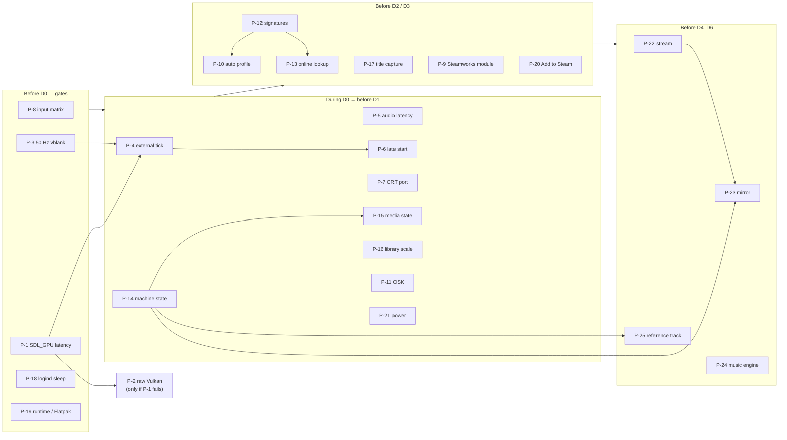

# unreal-deck: proof-of-concept plan

| | |
|---|---|
| **Date** | 2026-10-08 |
| **Status** | Plan, for review. No POC started |
| **Related** | [goals-and-requirements.md](goals-and-requirements.md) · [rendering.md §10](rendering.md#10-measurements-to-take) · [integration.md §4](integration.md#4-core-changes) |

Each POC answers one question that the design takes for granted, before the phase that depends
on it. A POC is throw-away code. Its result is one row in [§3](#3-results), with a verdict:
**confirmed**, **changed the design** (the affected document is updated), or **blocked**.

**Location.** All experiments live under [`tools/poc/023-steamdeck-client/`](../../../tools/poc/),
one subdirectory per experiment, named `pNN-<name>/` (for example `p01-sdl-gpu-latency/`). Each
has its own `README.md` with the goal, how to build and run it, and the measurements.
`tools/poc/023-steamdeck-client/README.md` indexes every experiment with its status, and the
global `tools/poc/README.md` lists the folder. The code is built with `BUILD_POC=ON`. Core changes
needed by a POC (C-1, C-2, C-4) are made on the POC branch, not on master, until they pass.

## Contents

- [1. POC list](#1-poc-list)
- [2. Order](#2-order)
- [3. Results](#3-results)

## 1. POC list

**Gate** marks a POC whose failure changes the architecture, not just a parameter.

### Render, pacing, audio

| ID | Question / goal | What to build | Measure · pass criterion | De-risks | Size |
|----|-----------------|---------------|--------------------------|----------|------|
| **P-1** (gate) | Does SDL3 + SDL_GPU give us the latency and pacing control we need on the Deck under gamescope? | Minimal SDL3 app: core linked, 128K running, `CopyPresentedFramebuffer` into a mapped transfer buffer (`cycle=true`), one blit draw, VSYNC present, frames in flight 1 vs 2. A border-flip test program driven by a Deck button | Input → photon with a 240 fps camera, 30 samples per configuration · **pass: median ≤ 40 ms at a 50 Hz panel**; CPU host < 1 ms, GPU < 2 ms per frame | G-1, NFR-1, [rendering.md §2](rendering.md#2-api-choice)–§3 | M |
| P-2 | If P-1 misses: does raw Vulkan with `VK_KHR_present_wait` / `present_id` win enough to justify a second backend? | The same app on raw Vulkan, with present-wait-based late start | Same as P-1 · **pass: ≥ 8 ms median gain**, otherwise stay on SDL_GPU | rendering.md §2 option B | M |
| **P-3** (gate) | Does gamescope actually deliver vblanks at the panel refresh set in Quick Access (50 / 49 Hz on LCD and OLED), and can the app measure it reliably? | Log present timestamps; change the refresh slider and the frame limiter while running; dock to an external display | Measured interval vs the setting, detection time after a change, behaviour with the limiter on · **pass: interval within ±0.1 %, change detected < 1 s** | [rendering.md §4](rendering.md#4-frame-pacing-50-hz-machines-on-a-6090-hz-panel) display-locked mode | S |
| **P-4** (gate) | Does an external frame tick in `MainLoop` (C-1) keep DRC, emergency refill, turbo and TTD working? | Branch with `PacingMode::External` + `SignalFrameTick()`; the P-1 app drives the tick from vblank | 10 min runs at 50 Hz with 128K (+0.04 %) and at 49 Hz with Pentagon (+0.35 %): audio underruns, DRC trim, repeated / dropped frames · **pass: 0 underruns, 0 repeats, trim within ±0.5 %** | C-1, NFR-2 | M |
| P-5 | How low can the audio latency be with an SDL3 audio stream to PipeWire on SteamOS, with no crackle? | `AudioOut`: `SetAudioCallback` → `SDL_PutAudioStreamData`; occupancy from `SDL_GetAudioStreamQueued`; try 256 / 512 / 1024 quantum (`PIPEWIRE_LATENCY`) | Underruns per hour, end-to-end audio latency (loopback mic), A/V offset with present delay 0 / 1 · **pass: ≤ 15 ms audio, A/V within ±10 ms, 0 underruns/h** | NFR-1 audio part, C-6 | S |
| P-6 | Does the late-start ("frame delay") trick give the expected gain, and is it stable for slow machines (TS-Conf, Sprinter)? | Late tick = `refresh − (moving max of frame time + margin)` in the P-4 build | Latency vs P-4, missed vblanks per 10 min for 128K, TS-Conf demo, Sprinter · **pass: ≥ 10 ms gain, < 1 miss / 10 min** | [rendering.md §4](rendering.md#4-frame-pacing-50-hz-machines-on-a-6090-hz-panel) | S |
| P-7 | Can the existing CRT shader be ported to one SDL_GPU fragment shader through SDL_shadercross, and what does it cost? | HLSL port of the `devicescreen_gl.cpp` CRT + one `crtprofiles` preset; offline SPIR-V / MSL | GPU time at 1280×800 on the Deck; visual diff against `unreal-qt` · **pass: < 0.2 ms, presets look the same** | [rendering.md §6](rendering.md#6-scaling-and-the-crt-pass) | S |

### Input

| ID | Question / goal | What to build | Measure · pass criterion | De-risks | Size |
|----|-----------------|---------------|--------------------------|----------|------|
| **P-8** (gate) | What does an SDL3 app see on the Deck as a **non-Steam shortcut**, with Steam Input on (default) and off: back buttons, both trackpads, pad pressure / click, gyro, capacitive stick touch, rumble on trackpads? | Input inspector app: lists gamepads, types, VID / PID, touchpads, sensors; logs every event with a timestamp; tries `SDL_RumbleGamepad` | Matrix: control × (Steam Input on / off / Flatpak) → available? latency? · **pass: Steam Input off exposes all controls; on gives a usable fallback** | [input-and-profiles.md §2.1](input-and-profiles.md#21-sdl3-back-end-always-available), compatible-mode detection | S |
| P-9 | Do Steam Input action sets work for us: shipped manifest (`SetInputActionManifestFilePath`), layers, `TriggerSimpleHapticEvent`, `ShowFloatingGamepadTextInput`, with Steamworks loaded **only** from a separate module via `SteamAPI_InitFlat()`? | Optional module `libunreal-deck-steam.so` with the C interface of [architecture.md §8](architecture.md#8-steam-integration); run under the Spacewar test AppID (480) | Everything works with the main binary having no link to `libsteam_api` (`ldd`, `nm`) · **pass: all four features work; main binary clean** | Q-1 architecture, D3 | M |
| P-10 | Does the heuristic auto profile pick the right scheme? | Port-read counters (C-4 prototype) + the classifier of [input-and-profiles.md §5](input-and-profiles.md#5-heuristic-auto-profile); run headless in turbo over a corpus | Accuracy on 100 games with known controls (Kempston / Sinclair / cursor / QAOP / mouse / keyboard-only) · **pass: ≥ 85 % correct, 0 % "unusable" picks** | FR-34, UC-2 | M |
| P-11 | Is typing on the dual-trackpad OSK fast and accurate, and can the ROM cursor mode (K / L / C / E / G) be read reliably? | OSK prototype in ImGui; mode from the system variables for 48K, 128K, +2A / +3 and Pentagon ROMs | Words per minute typing `10 PRINT "HELLO"` + `LOAD ""` by 3 users; mode detection correctness across ROMs · **pass: ≥ 15 wpm, mode correct on every listed ROM** | FR-35, UC-3 | S |

### Library, signatures, state

| ID | Question / goal | What to build | Measure · pass criterion | De-risks | Size |
|----|-----------------|---------------|--------------------------|----------|------|
| **P-12** (gate) | Do the signatures recognise titles across TAP ↔ TZX, TRD ↔ SCL, renames and saved-to disks, without false matches? | `swsignature` prototype (tape payload, TR-DOS file set, fuzzy Jaccard, memory) + a CLI over a collection | Recall on pairs known to be the same title; false-match rate across the whole corpus; speed · **pass: recall ≥ 95 % (re-pack / rename), ≥ 80 % (saved-to disks), false matches < 0.1 %, ≥ 2000 files/s** | [input-and-profiles.md §4](input-and-profiles.md#4-signatures), FR-33 | M |
| P-13 | Can lookups by hash use ZXInfo (`/filecheck/{hash}`) and ZX-Art for titles and art, and with which hash types, rate limits and terms? | Small client + cache; run over the P-12 corpus | Hit rate, latency, terms of use · **pass: documented hash type and limits; hit rate measured** | FR-12, online metadata | S |
| **P-14** (gate) | Can one complete machine state be saved and loaded outside a TTD session (C-2), for every model, fast enough? | Branch: standalone save / load of one TTD v2 checkpoint (device table + memory regions) | Round trip: run N frames after load, compare the frame digest with the uninterrupted run; size and time for 48K, 128K, Pentagon, ATM, ZX-Evo, TS-Conf, Sprinter, ZX-Poly · **pass: digests equal for every model; < 50 ms 128K, < 300 ms TS-Conf / Sprinter** | C-2, FR-41, NFR-7, the resume container | L |
| P-15 | Can the media state (C-3) be re-attached so that a game continues mid-load (tape at block 5, disk with dirty sectors in an overlay)? | Extend P-14 with the media description and re-attach | Tape position, motor and disk overlay restored exactly; continue loading finishes identically · **pass: identical result vs the uninterrupted run** | C-3, FR-41, FR-44 | M |
| P-16 | Does the 10-foot library scale: 10 000 cards, cover streaming, gamepad navigation feel? | ImGui library screen on SQLite index, LRU texture atlas, worker decode | Scroll fps, worst frame time, memory, cold start with cached index · **pass: 60 fps, worst frame < 16 ms, cold start < 1.5 s** | NFR-3, NFR-4 | M |
| P-17 | When should a headless run grab a "title screen" for cards without art, and how fast is a full collection pass? | Headless runner (`M_NUL` + turbo): heuristics (first frame after loading with > N distinct attributes, or at T seconds) | Share of useful captures on 200 titles (judged by eye), titles per minute · **pass: ≥ 80 % useful, ≥ 100 titles/min on the Deck** | FR-12, ArtService | S |

### System integration and packaging

| ID | Question / goal | What to build | Measure · pass criterion | De-risks | Size |
|----|-----------------|---------------|--------------------------|----------|------|
| **P-18** (gate) | Does a logind **delay** inhibitor work for a game in SteamOS Game Mode, and does the process get `PrepareForSleep(true)` before Steam freezes it? | `PowerMonitor` prototype with libdbus; log timestamps; press Power repeatedly, sleep for 8 h, also on low battery | Signal received? Time available before sleep; audio restart without click after wake · **pass: signal every time, ≥ 100 ms granted, no click** | FR-40, NFR-6, [architecture.md §7](architecture.md#7-suspend-resume-and-exit) | S |
| P-19 | Does the binary built in the steamrt4 SDK container run as a non-Steam shortcut and under SLR on the Deck, and as a Flatpak? Which SDL3 version does each runtime bring? | Build `unreal-deck` POC in `registry.gitlab.steamos.cloud/steamrt/steamrt4/sdk`; Flatpak manifest on `org.freedesktop.Platform` | Starts in Game Mode in each packaging; `ldd` shows runtime-only libs; SDL3 version ≥ 3.2 · **pass: all three run, no host-library leaks** | NFR-9, [integration.md §7](integration.md#7-build-test-and-release) | M |
| P-20 | Can "Add to Steam" write `shortcuts.vdf` safely while Steam is running in Game Mode? What happens to the entry after a Steam restart? | Writer following steam-rom-manager's format; art into `grid/` | Entry survives / is overwritten; launch options honoured; art shown · **pass: a documented safe procedure, or the feature is dropped** | FR-15 | S |
| P-21 | What is the real power draw? | The P-1 / P-4 build plus library screen | Battery W from the SteamOS overlay: idle library, 128K game, TS-Conf demo, 50 vs 60 Hz, CRT on / off · **pass: ≤ 1 W above idle desktop for a 128K game** | NFR-5 | S |

### Later phases (D4–D6)

| ID | Question / goal | What to build | Measure · pass criterion | De-risks | Size |
|----|-----------------|---------------|--------------------------|----------|------|
| P-22 | Is a binary WebSocket channel on the existing Drogon server enough for the companion streams over Wi-Fi? | `frame` (indexed, cell deltas, zstd) and `screens` topics; Deck client showing them | Bandwidth and picture latency for a 128K demo, a TS-Conf demo; Wi-Fi 5 vs 6 · **pass: < 1 MB/s for 128K, < 100 ms latency, no stalls** | [companion-and-media.md §4](companion-and-media.md#4-the-companion-protocol), D4 | M |
| P-23 | Is mirror mode deterministic across hosts (Deck x86-64 vs Mac arm64): same state + same input journal → same frames? | Two instances from one state (P-14), input records over the network, digest compare each second | Divergence over 30 min with a game and a demo · **pass: zero divergence** | [companion-and-media.md §7](companion-and-media.md#7-distributed-runs) | M |
| P-24 | Emulated player vs ZXTune for the music hub: authenticity, format coverage, effort | PT3 and STC players as Z80 routines in a headless image; ZXTune linked for comparison | Output compared (spectrum / waveform), formats covered, CPU per track · **pass: choose the engine per format with data** | [companion-and-media.md §1](companion-and-media.md#1-music-hub-d5) | M |
| P-25 | Does a reference TTD track replay identically on several clients, and can a late client seek into it in sync? | Record a demo headless; play on three clients from a manifest with a wall-clock start | Frame digests equal; start skew; catch-up time · **pass: digests equal, skew < 100 ms** | [companion-and-media.md §3](companion-and-media.md#3-demoparty-live-mode-d6), D6 | M |

## 2. Order

The first five (P-8, P-1, P-3, P-18, P-19) need only a Deck and a few days. They show whether
the core assumptions hold: raw controls, render latency, 50 Hz panel, sleep hook and packaging.
After them, the D0 skeleton is the P-1 code cleaned up.

## 3. Results

| ID | Date | Verdict | Numbers | Design change |
|----|------|---------|---------|---------------|
| — | — | — | — | — |
