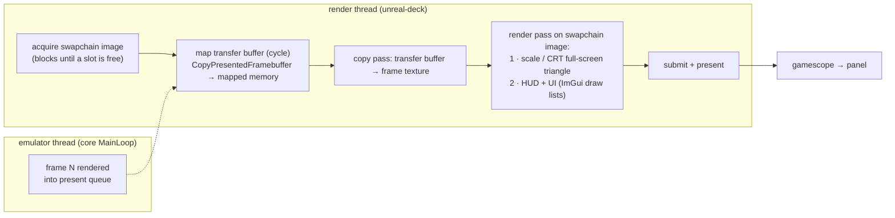
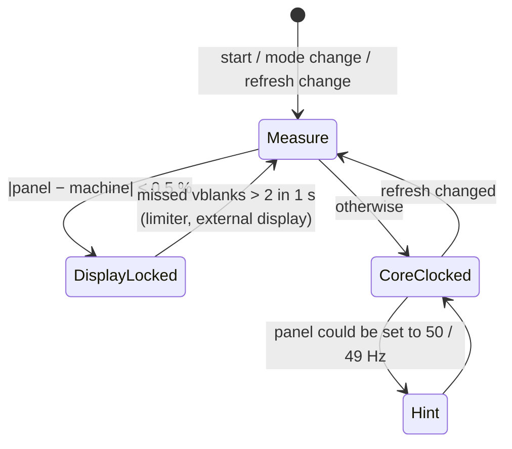

# unreal-deck: the render path

| | |
|---|---|
| **Date** | 2026-10-08 |
| **Status** | Design, for review |
| **Requirements** | [goals-and-requirements.md](goals-and-requirements.md) (G-1, NFR-1, NFR-2, NFR-5) |

The owner's decision is to build **the fastest and most native render path**. This document chooses
the API, the pacing model and the frame pipeline, and gives the latency budget each choice has to
meet.

## Contents

- [1. Constraints](#1-constraints)
- [2. API choice](#2-api-choice)
- [3. Frame pipeline](#3-frame-pipeline)
- [4. Frame pacing: 50 Hz machines on a 60/90 Hz panel](#4-frame-pacing-50-hz-machines-on-a-6090-hz-panel)
- [5. Latency budget](#5-latency-budget)
- [6. Scaling and the CRT pass](#6-scaling-and-the-crt-pass)
- [7. UI overlay](#7-ui-overlay)
- [8. Gamescope specifics](#8-gamescope-specifics)
- [9. Power](#9-power)
- [10. Measurements to take](#10-measurements-to-take)

## 1. Constraints

| Fact | Source |
|---|---|
| The core produces one RGBA8888 frame per emulated frame. The byte order is R, G, B, A. Sizes are 352×288 for ZX / Pentagon / Scorpion / Profi, 384×304 for P384, 720×288 for TS-Conf (360 dots, 2 px per dot), 320 or 640×288 for ATM, and 2× for the ZX-Poly composed frame. | `Screen::GetFramebufferDescriptor`, `core/src/emulator/video/screen.h` |
| `Screen::CopyPresentedFramebuffer(dst, size)` returns a tear-free frame from any thread, out of a 4-slot present queue. It is delayed by `_presentDelayFrames` (default 2) to match the audio latency of the Qt host. | `screen.h` |
| `NC_VIDEO_FRAME_REFRESH` is posted on the emulator thread after each frame. `NC_VIDEO_MODE_CHANGED` is posted when the size changes. | `core/src/emulator/mainloop.cpp`, `platform.h` |
| The core paces itself with an absolute-deadline frame clock (`config.frame_duration_us`, Pentagon 20 480 µs ≈ 48.83 Hz, 128K ≈ 50.02 Hz). Audio drift is absorbed by DRC (±0.5 % resampling). | `mainloop.cpp`, `SoundManager::updateDrcControl` |
| Deck LCD: 1280×800, 40–60 Hz. Deck OLED: 1280×800, 45–90 Hz. Neither panel has VRR. | Valve hardware pages ([references.md](references.md#steam-deck-hardware-and-os)) |
| Game Mode runs every app under gamescope, which composites or scans out directly, can upscale with FSR / NIS, and has a frame limiter in the Quick Access menu. | gamescope README |

The data is tiny: a 352×288 RGBA frame is 405 KB, so ≈ 20 MB/s at 50 Hz. Speed comes from not
adding latency (queues, extra copies, an extra process, compositor passes), not from bandwidth.

## 2. API choice

| Option | Latency control | Code size | Portability | Verdict |
|---|---|---|---|---|
| **A. SDL3 + SDL_GPU** (Vulkan on Linux / Deck, Metal on macOS, D3D12 on Windows) | present mode (VSYNC / MAILBOX / IMMEDIATE), frames in flight (`SDL_SetGPUAllowedFramesInFlight`), explicit acquire (`SDL_WaitAndAcquireGPUSwapchainTexture`), mapped transfer buffers with cycling | small: one copy pass + one render pass | every development host, so the front-end is built and tested on the owner's Mac | **Chosen** |
| B. Raw Vulkan 1.3 | everything in A, plus `VK_KHR_present_wait` / `present_id` for exact present timing | ~3× A, plus a Metal path for macOS development | Linux / Windows only | Keep as a later backend **only if** the measurements in §10 show A missing NFR-1 because of the missing present-wait |
| C. OpenGL via SDL3 | swap interval only; no frames-in-flight control; driver-dependent queueing | small | everywhere | Rejected: less pacing control than A for the same code |
| D. Qt (RHI / QOpenGLWindow) | as C or A, behind Qt's own loop | large runtime | everywhere | Rejected: see [architecture.md §2](architecture.md#2-why-not-qt-why-sdl3) |

Why SDL_GPU and not "SDL for the window, Vulkan by hand": SDL_GPU is a thin layer over Vulkan
with the parts we need (swapchain, present modes, transfer buffers, one pipeline). The shader
toolchain is offline SPIR-V / MSL / DXIL through SDL_shadercross, so there is no runtime shader
compilation and no pipeline stutter. Option B stays possible because the renderer sits behind a
small `IDeckRenderer` interface (upload frame, draw, present).

## 3. Frame pipeline

One command buffer per display refresh, with no extra intermediate copy:



- **Zero extra copies.** `CopyPresentedFramebuffer` writes straight into the mapped GPU transfer
  buffer. With `cycle = true`, SDL hands out a fresh buffer when the GPU is still reading the
  previous one, so there is no stall.
- **One texture per frame size.** It is re-created on `NC_VIDEO_MODE_CHANGED` only. The format is
  `R8G8B8A8_UNORM`, which matches the core's byte order without swizzling. The sRGB view is chosen
  by the CRT pass.
- **One draw** for the picture (a full-screen triangle, nearest or sharp-bilinear sampling, the
  optional CRT maths in the same fragment shader), then the UI in the same render pass. No
  off-screen target unless a multi-pass CRT preset is selected.
- **Frames in flight = 1** in display-locked mode (lowest latency), 2 in core-clocked mode
  (smoother under load).
- **Present delay = 0.** The Qt host keeps `_presentDelayFrames = 2` because its audio buffer is
  long. The Deck host keeps the audio buffer short (§5) and sets the delay to 0 or 1 through the
  existing `Screen::SetPresentDelayFrames`.

## 4. Frame pacing: 50 Hz machines on a 60/90 Hz panel

A 50 Hz picture on a 60 Hz panel shows every fifth frame twice: visible judder in every scroller.
The Deck can do better than a desktop, because both panels accept 50 Hz (LCD 40–60, OLED 45–90).

Two pacing modes, chosen automatically:

| Mode | When | How | Result |
|---|---|---|---|
| **Display-locked** (default) | panel refresh within ±0.5 % of the machine frame rate (128K at 50 Hz: 0.04 %; Pentagon 48.83 Hz at 49 Hz: 0.35 %) | the render thread signals a **frame tick** at each vblank; the core's MainLoop waits for the tick instead of its own deadline; DRC resamples audio by the small rate difference | exactly one emulated frame per refresh, with no judder and no tearing; audio pitch error ≤ 0.5 % (DRC's existing trim range) |
| **Core-clocked** (fallback) | any other refresh (60, 90, external display, the user's frame limiter active) | the core keeps its own deadline clock; the render thread presents the newest frame per vblank (MAILBOX if available, else FIFO with the newest-frame pick) | correct speed and pitch; a frame is repeated when the rates beat (50 on 60: every 5th frame) |



The app cannot change the panel refresh itself in Game Mode. The Quick Access performance panel
can, and Steam remembers it per game. The app measures the real vblank interval. When it runs
core-clocked and the panel could be at the machine rate, it shows a one-time hint:
*"Set Refresh Rate to 50 Hz in Quick Access → Performance for perfectly smooth scrolling"*
(49 Hz for Pentagon-timed machines). On an external display with VRR, core-clocked with IMMEDIATE /
FIFO-relaxed already gives the right result. The display adapts to the core.

**Late start (optional, measured in D1).** In display-locked mode the tick does not have to fire at
the vblank. It can fire `refresh − (emulation time + upload + margin)` later, and input is sampled
just before. This removes most of a refresh from the latency (RetroArch calls this "frame delay").
A 128K frame takes ≈ 0.5 ms to emulate on Zen 2, so the margin can be large. TS-Conf and Sprinter
frames are slower, so the margin adapts from a moving maximum of the measured frame time.

## 5. Latency budget

Button → first changed pixel, 50 Hz panel, display-locked, for a test program that reads the
joystick every frame and changes the border colour (the game's own polling is excluded):

| Stage | Without late start | With late start |
|---|---|---|
| Controller → SDL event (HIDAPI Deck driver; Steam Input in between when enabled) | ≤ 4 ms | ≤ 4 ms |
| Wait for the next frame tick (input sampled at the tick) | 0–20 ms (avg 10) | 0–20 ms (avg 10) |
| Emulate one frame (128K) | ≈ 0.5 ms | ≈ 0.5 ms |
| Upload + draw | < 0.5 ms | < 0.5 ms |
| Wait for vblank | ≈ 19 ms | ≈ 3 ms |
| gamescope (direct scan-out of a single fullscreen surface: 0; composited: up to 1 refresh) | 0–20 ms | 0–20 ms |
| Scan-out to the changed line | 0–20 ms (border top: ≈ 2 ms) | same |
| **Typical total** | ≈ 35 ms | **≈ 20 ms** |

Audio: an SDL3 audio stream to PipeWire with a 256–512 frame quantum at 48 kHz (5–11 ms), plus
1 emulated frame of buffering. Video presented with delay 0 then stays within ±10 ms of the audio.

## 6. Scaling and the CRT pass

1280×800 is a good fit for the Spectrum:

| Crop | Source | Scale | On screen | Notes |
|---|---|---|---|---|
| **Deck fit** (default) | 320×200 (paper + 32 px left / right, 4 px top / bottom) | **4×** integer | **1280×800, exactly fills the panel** | border effects at the sides are visible; top / bottom ones are cut |
| Paper only | 256×192 | 4× integer | 1024×768, centred | |
| Full frame | 352×288 | 2× integer | 704×576 | the whole border, small |
| Full frame, fit | 352×288 | 2.78× sharp-bilinear | 978×800 | integer pre-scale ×3 then linear down (sharp-bilinear) |
| TS-Conf | 360×288 visible (stored 720×288) | 2.78× fit | 1000×800 | horizontal 2:1 storage handled in the shader |
| ATM 640×288 | 640×288 | 2× horizontal / 2.78× vertical | 1280×800 | non-square; aspect corrected |

```
┌────────────────────────────── 1280 ──────────────────────────────┐
│░░░░░░░░░░░░░░░░░░░░░░░░ 4 px border × 4 ░░░░░░░░░░░░░░░░░░░░░░░░░│
│░░┌──────────────────────────── 1024 ───────────────────────────┐░│
│░░│                                                              │░│ 800
│░░│              256×192 paper × 4  (pixel-exact)                │░│
│░░│                                                              │░│
│░░└──────────────────────────────────────────────────────────────┘░│
│░░░░░ 32 px border × 4 = 128 px each side ░░░░░░░░░░░░░░░░░░░░░░░░░│
└──────────────────────────────────────────────────────────────────┘
                     "Deck fit": 320×200 → 1280×800
```

- The crop and scale are uniforms of the one draw. Changing them costs nothing.
- **CRT pass.** The CRT shader in `unreal-qt/src/emulator/devicescreen_gl.cpp` (and
  `data/shaders/megatron.glsl`) is ported to a single SDL_GPU fragment shader. It is written
  once in HLSL or GLSL and compiled offline to SPIR-V / MSL / DXIL with SDL_shadercross. Presets are
  shared with `crtprofiles`, so the Deck and the desktop look the same. Target cost: < 0.2 ms at
  1280×800 on the Deck GPU.
- **Gigascreen / flicker modes.** These go through the core's temporal effects (ZX DLSS de-flicker,
  `core/src/emulator/video/zxdlss/`). The front-end only shows the result.
- **HDR (OLED).** SDR composition by default. An HDR10 swapchain
  (`SDL_GPU_SWAPCHAINCOMPOSITION_HDR10_ST2084`) for CRT phosphor glow is a later option, not D1.

## 7. UI overlay

- Dear ImGui with the SDL3 platform back-end and the SDL_GPU renderer back-end. UI draw lists are
  appended to the same render pass after the picture, so there is no second pass.
- In-game with no overlay open, ImGui is not run at all. The frame is one copy and one draw.
- Covers and thumbnails are decoded on a worker thread (stb_image / libpng / libjpeg-turbo),
  uploaded through transfer buffers into an LRU texture atlas, and shown when they are ready. The
  library never blocks on I/O.
- Fonts are baked at two sizes (FreeType) for the 1280×800 panel, with a ZX ROM font for Spectrum
  styling (the OSK, the radial menu).
- The HUD (tape counter, disk activity, toasts) uses the client-neutral `HudModel` from the HUD
  design ([2026-09-07-hud-layer](../2026-09-07-hud-layer/design.md)), drawn by a Deck presenter.

## 8. Gamescope specifics

| Topic | Behaviour |
|---|---|
| Window | One borderless fullscreen window at the size gamescope reports (1280×800 on the panel; larger when docked). The app never sets a mode. |
| X11 or Wayland | SDL3 picks what gamescope offers (Xwayland by default in Game Mode). The render path does not depend on it. |
| Upscaling | gamescope's FSR / NIS / integer scaling stays under user control in Quick Access. We already render at native size, so it is a no-op unless the user forces a lower internal resolution. |
| Frame limiter | If the user caps FPS in Quick Access, vblank pacing breaks. §4 detects the missed ticks and falls back to core-clocked. |
| Overlays | The Steam overlay and Quick Access are composited by gamescope on their own planes. The app does not draw under them and does not pause for them (it pauses on focus loss only if the user opts in). |

## 9. Power

- No busy loops. The render thread blocks in swapchain acquire, and the emulator thread blocks on the
  tick (display-locked) or on `WaitUntilPrecise` (core-clocked).
- In the library with nothing animating, the UI redraws on input or worker events only. Smooth
  scrolling animations run at the panel rate and stop when they settle.
- Expected load for a 128K game: CPU ≈ 3 % of one core for emulation plus < 1 % for the host, and
  GPU < 2 ms per frame. This keeps the APU in its lowest power states (NFR-5).

## 10. Measurements to take

| ID | Measurement | Tool |
|----|-------------|------|
| M-1 | Input → photon, display-locked vs core-clocked, with and without late start | 240 fps phone camera on a border-flip test program; a photodiode if available |
| M-2 | Frame-time histogram (CPU emulate, CPU host, GPU) | built-in perf HUD; MangoHud |
| M-3 | Repeated / dropped frames over 10 min at 50 Hz and 60 Hz | present timestamps logged by the render thread |
| M-4 | Audio drift and DRC trim in display-locked mode | the core's DRC telemetry |
| M-5 | Power draw, idle library, 128K game, TS-Conf demo | SteamOS performance overlay (battery W) |
| M-6 | If M-1 misses NFR-1: the same with a raw-Vulkan prototype using `VK_KHR_present_wait` | `tools/poc/` |
