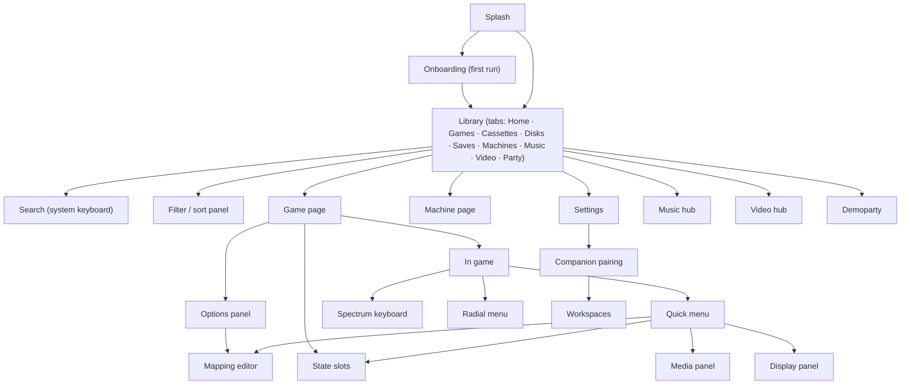

# unreal-deck: UX design brief (for the UX design agent)

| | |
|---|---|
| **Date** | 2026-10-08 |
| **Status** | Brief, ready to hand over |
| **Audience** | the UX design agent that will produce the interactive prototype |
| **Deliverable** | an interactive, controller-driven prototype of the whole app plus the design artefacts in [§12](#12-deliverables) |
| **Source documents** | [goals-and-requirements.md](goals-and-requirements.md) (FR / UC / NFR ids), [ux.md](ux.md) (first sketches), [input-and-profiles.md](input-and-profiles.md), [companion-and-media.md](companion-and-media.md), [references.md](references.md) |

This brief is self-contained. Where it repeats the design documents, it does so on purpose, so the
design agent does not have to reconstruct intent from them. Ids such as FR-22 or UC-4 refer to
[goals-and-requirements.md](goals-and-requirements.md). Where this brief and the older sketches in
[ux.md](ux.md) disagree, this brief wins. The design agent may also propose better solutions than
the sketches, as long as every requirement below is still met.

## Contents

- [1. What you are designing](#1-what-you-are-designing)
- [2. Device and platform constraints](#2-device-and-platform-constraints)
- [3. Steam Deck guidelines and style: what "compliant" means here](#3-steam-deck-guidelines-and-style-what-compliant-means-here)
- [4. Personas](#4-personas)
- [5. Feature inventory (everything must be covered)](#5-feature-inventory-everything-must-be-covered)
- [6. User flows to prototype](#6-user-flows-to-prototype)
- [7. Screen specifications](#7-screen-specifications)
- [8. Interaction model](#8-interaction-model)
- [9. Visual language](#9-visual-language)
- [10. Content and mock data](#10-content-and-mock-data)
- [11. States, errors and edge cases](#11-states-errors-and-edge-cases)
- [12. Deliverables](#12-deliverables)
- [13. Prototype technical specification](#13-prototype-technical-specification)
- [14. Acceptance checklist](#14-acceptance-checklist)
- [15. Out of scope and don'ts](#15-out-of-scope-and-donts)
- [16. Questions the designer must answer in the hand-back](#16-questions-the-designer-must-answer-in-the-hand-back)

## 1. What you are designing

**unreal-deck** is a native Steam Deck front-end for the unreal-ng ZX Spectrum emulator. It covers the
48K, 128K, Pentagon, Scorpion, Profi, ATM, ZX-Evo, TS-Conf, Sprinter and ZX-Poly machines. It runs
fullscreen in SteamOS Game Mode and is launched from the Steam library like any game.

The problem it solves: a ZX Spectrum is a **keyboard computer** with thousands of programs that each
use their own controls. The Deck has **no keyboard**. It has a D-pad, ABXY, two sticks, two
trackpads, a gyro, triggers and four back buttons. The app has to make that gap disappear:

- a 10-foot library with the right controls chosen per game automatically;
- a Spectrum on-screen keyboard that makes typing `LOAD ""` easy;
- sleep / resume that never loses a game;
- later, a music hub, a video / demoscene hub, a demoparty live mode, and a debugger companion that
  turns the Deck into a second screen for the desktop emulator.

**Product principles** (from [ux.md §1](ux.md#1-principles)). Every screen is judged against them:

| # | Principle |
|---|-----------|
| U-1 | **A = do, B = back, everywhere.** No dead ends. B always leaves. |
| U-2 | **Two presses to play.** Launch, A on the highlighted card (the last game), A on Continue. |
| U-3 | **The game owns the screen.** In game, no chrome. Only transient, fading indicators. |
| U-4 | **Physical-media metaphors, used sparingly.** Tapes look like tapes and disks like disks, because the medium decides what you can do with it (rewind a tape, swap a disk). |
| U-5 | **Nothing is lost.** Quit, sleep and game switch keep state without asking. Destructive actions need a hold-to-confirm. |
| U-6 | **Readable at arm's length** on a 7" 1280×800 panel. |
| U-7 | **Touch is a shortcut, never a requirement.** Everything works with the controls alone. |

## 2. Device and platform constraints

| Topic | Constraint |
|---|---|
| Screen | 1280×800 (16:10). LCD model: 7", about 216 ppi. OLED model: 7.4", HDR. Design at 1280×800 logical pixels. |
| Docked | 1920×1080 or 3840×2160 at 16:9 on a TV. Layouts must reflow to 16:9 and scale up (UI scale 1.0 / 1.5 / 2.0). The prototype must show the 1920×1080 variant of the Library and In-game screens. |
| Viewing distance | handheld 30–40 cm; TV 2–3 m |
| Input | D-pad, A B X Y, L1 R1, analog L2 R2, two sticks (click + capacitive touch), two square trackpads (position, pressure click, haptics), gyro, back buttons L4 L5 R4 R5, View (⧉), Menu (☰), touchscreen |
| **Reserved by SteamOS** | **Steam** button and **Quick Access (…)** button: never assign, never show as app actions. The Steam overlay and the Quick Access panel draw over the app; nothing important may sit where the Quick Access panel slides in (right edge) when it matters. |
| Compositor | gamescope, fullscreen, no window chrome, no mouse cursor unless a trackpad is in mouse mode |
| Performance budget | the UI must be implementable in Dear ImGui with a GPU texture atlas: rectangles, rounded rectangles, images, text, simple gradients and shadows, alpha. Avoid effects that need full-screen blur or heavy compositing in the core screens; an optional, subtle backdrop blur behind overlays is acceptable. |
| Animation budget | 60 fps in menus. In game the picture is paced to the machine (50 Hz), so overlays animate at the panel rate. |
| Offline | everything works offline. Online features (metadata, art, ZX-Art, party feeds) degrade gracefully. |

## 3. Steam Deck guidelines and style: what "compliant" means here

### 3.1 Valve's requirements (Steam Deck compatibility review)

The prototype must satisfy these. They are the "Verified" criteria from
[Steam Deck and Steam Machine Compatibility Review](https://partner.steamgames.com/doc/steamhardware/compat)
and [Getting your game ready for Steam Deck](https://partner.steamgames.com/doc/steamhardware/recommendations).
Re-read both pages before designing: Valve updates them, and they win over this summary.

| # | Requirement | How it applies to this app |
|---|---|---|
| V-1 | The **default controller configuration** gives access to all content and functions. | Every screen and every feature is reachable with D-pad / sticks + face buttons + bumpers. No feature may require the touchscreen, a trackpad or a back button. Those are accelerators only. |
| V-2 | **On-screen glyphs match the Deck's controls** (no Xbox / PlayStation / keyboard glyphs on the Deck). | Use Deck glyphs everywhere: A B X Y, L1 R1 L2 R2, L4 L5 R4 R5, ⧉ View, ☰ Menu, trackpads, sticks, D-pad directions. Provide the glyph set (§12). On a desktop with another pad the app would swap glyphs, but that is not part of this prototype. |
| V-3 | **Text entry** uses an on-screen keyboard. On Steam, that means the Steamworks keyboard API. | Host text (search, file and profile names) opens the **system keyboard**. Prototype it as a mock of the SteamOS floating keyboard. The Spectrum OSK is guest input and part of the game experience. Keep the two visually distinct. |
| V-4 | **Text is legible** at 1280×800. Valve's criterion: no on-screen text smaller than 9 px tall. | Our floor is stricter: **12 px minimum** for any text, **16 px** body text, 20–24 px titles. Spectrum-flavoured text in the ROM font is at least 2× scale (16 px). |
| V-5 | **Default resolution** is the native 1280×800, with no setting needed. | No resolution or launcher dialogs. The app opens straight into its library. |
| V-6 | **No launcher that needs a mouse.** | The app *is* the launcher and is controller-first. |
| V-7 | Works **offline**; **suspend / resume** is seamless. | §6 flows F-4 and F-5. |

### 3.2 Steam Game Mode conventions to follow

These are the conventions of SteamOS Game Mode (the Steam Deck UI). Users already know them, so match
them unless there is a strong reason not to. Before finalising, verify each against a current SteamOS
build or official Valve screenshots.

| # | Convention | Our use |
|---|---|---|
| S-1 | **A** confirms / opens, **B** goes back / closes. | Everywhere (U-1). |
| S-2 | **L1 / R1** switch tabs or sections in a horizontal tab bar. | Library tabs, settings categories, quick-menu sections, hub sections. |
| S-3 | **Menu (☰)** opens options for the focused item or screen; **View (⧉)** is the secondary / "view" action. | Library: Menu = settings, View = search. Game card: Menu = options. In game: Menu = quick menu, View = Spectrum keyboard. |
| S-4 | A **footer hint bar** lists the buttons that do something on this screen, with glyphs, right-aligned, only the 2–5 relevant ones. | Every screen except in-game. |
| S-5 | **Focus is always visible**: a clear highlight or outline on the focused element, and on cards a slight scale-up. There is always exactly one focused element. | §8.1. |
| S-6 | **Side panels** slide in from the right for contextual menus (like Quick Access); full-screen pages for deep content. | Quick menu, options, filters as right-side panels. |
| S-7 | **Toasts** are short, non-modal, auto-dismissing, and never steal focus. | Auto-profile notice, state saved, disk swapped, refresh hint. |
| S-8 | **Dark theme**, high contrast, big rounded cards with art, horizontal shelves of cards. | Library, hubs. |
| S-9 | Holding a button to confirm destructive actions shows a progress ring on the glyph. | Overwrite a slot, write back to a disk image, delete a profile, reset the machine. |
| S-10 | **Steam and Quick Access** belong to the system; the app never covers or replaces them. | Our quick menu lives on ☰, not on "…". |

### 3.3 Our own design language on top

Steam-like structure and behaviour; **ZX Spectrum identity** in accents, typography and small
details, never in a way that hurts legibility:

- the Spectrum's bright colours as accents: bright cyan, bright yellow, bright red, bright green,
  bright magenta, on a near-black base;
- the **ZX ROM font** only for Spectrum things (OSK key caps, radial labels, BASIC-ish badges, the
  compact keyboard), never for body text;
- the rainbow stripe of the Spectrum 128K / +2 as a subtle brand motif (app icon, splash, the edge of
  the active tab), not as decoration everywhere;
- physical media cues: cassette shells, 3.5" / 5.25" disk labels, microdrive / IDE / SD icons, with
  real labels from the files.

## 4. Personas

| Persona | Context | Must-have experience |
|---|---|---|
| **Player** (most users) | Steam Deck owner, nostalgic or curious, not an emulator expert | Pick a game by its cover, play with sensible controls immediately, sleep the Deck mid-game, continue the next day. Never sees a file dialog. |
| **Collector** | Has thousands of TAP / TZX / TRD / SCL files, cares about versions | Fast browsing of huge shelves, filters, what is inside a disk, favourites, correct titles and art. |
| **Scener** | Demoscene and chip-music fan | Music player for every sound chip, demo playback, a demoparty "watch live" mode. |
| **Developer** | Writes Spectrum software on a PC with unreal-ng desktop | The Deck as a second screen: time-travel scrubber, two screen pages, Gigascreen phases, remote machine control. |

## 5. Feature inventory (everything must be covered)

Every row must appear in the prototype: as a working interaction, or at least as a reachable screen
with realistic content. The phase column is the delivery order of the real product. **The prototype
covers all phases**: D1 features fully interactive, D2–D6 features at least navigable with
representative states.

### 5.1 Shell and system

| ID | Feature | Phase | Req |
|----|---------|-------|-----|
| X-1 | Launch from Steam straight into the Library (no splash longer than 1 s, no launcher) | D1 | FR-1, V-5 |
| X-2 | Launch straight into a game from a per-game Steam shortcut (deep link) | D1 | FR-2 |
| X-3 | First-run onboarding: library folders, controller note (Steam Input), display refresh note, online metadata on / off | D1 | — |
| X-4 | Global footer hint bar and focus model on every screen | D1 | S-4, S-5 |
| X-5 | Toast system (non-modal notices) | D1 | S-7 |
| X-6 | System keyboard (mock of the SteamOS floating keyboard) for host text | D1 | V-3 |
| X-7 | Refresh-rate hint ("Set 50 Hz in Quick Access → Performance for smooth scrolling"), shown once, dismissible, with "don't show again" | D1 | [rendering.md §4](rendering.md#4-frame-pacing-50-hz-machines-on-a-6090-hz-panel) |
| X-8 | Docked / TV layout (16:9, UI scale) | D1 | §2 |
| X-9 | Exit app (from the Library: B on the root, with a confirm only if something is still being written) | D1 | — |

### 5.2 Library

| ID | Feature | Phase | Req |
|----|---------|-------|-----|
| L-1 | Shelves (horizontal rows of cards): Continue, Recently played, Favourites, Recently added, per-machine shelves | D1 | FR-11 |
| L-2 | Tabs on L1 / R1: Home, Games, Cassettes, Disks, Saves, Machines | D1 | FR-11 |
| L-3 | Card types: game (cover art), bare tape (cassette with label), bare disk (disk with TR-DOS label), machine profile (machine photo), save state (thumbnail) | D1 | FR-12, FR-14 |
| L-4 | Card metadata: title, year, publisher, machine badge, play time, "Continue" badge, favourite star, controls-profile badge (built-in / community / user / auto) | D1 | FR-12 |
| L-5 | Filter panel (right side): machine, genre, year range, source folder, has-profile, favourites only; sort (title, year, recently played, recently added) | D1 | FR-11 |
| L-6 | Search via the system keyboard, live results grid | D1 | FR-11 |
| L-7 | Alphabet scrub for long lists: right trackpad slide or holding L2 / R2 = page jump, with a big letter bubble | D1 | — |
| L-8 | Background scanning indicator (progress, files found, can be paused) | D1 | FR-10 |
| L-9 | Art states: real cover, generated title-screen capture, placeholder (stylised by media type) | D1 | FR-12 |
| L-10 | Favourite toggle (X on a card) | D1 | — |
| L-11 | Grid view of a whole tab (Y toggles shelf / grid) for collectors | D1 | — |
| L-12 | Duplicate / version grouping: one card per title, versions in its detail page | D2 | FR-33 |

### 5.3 Game detail ("card page")

| ID | Feature | Phase | Req |
|----|---------|-------|-----|
| G-1 | Hero layout: art, title, year, publisher, machine, signature status (recognised / unknown), profile source | D1 | FR-12 |
| G-2 | Primary actions: **Continue** (if a resume state exists, with thumbnail and age), **Start fresh** | D1 | FR-41, UC-5 |
| G-3 | Save-state slots strip (8 slots, thumbnails, date, play time; empty slots) | D1 | FR-42 |
| G-4 | Tape contents (block list) for tapes; **TR-DOS catalogue** for disks with per-file run; Boot; Insert in drive B: | D1 | FR-13, UC-6 |
| G-5 | Multi-disk sets: disk tabs, "insert disk 2 in B:" | D1 | UC-6 |
| G-6 | Controls summary (which Deck control does what in this game) and "Edit controls" | D1 / D2 | FR-30 |
| G-7 | Options panel (Menu): machine (model, ROM set, memory), display preset, sound, controls profile, **Add to Steam** (D3), properties (file path, signature, size, format), remove from library | D1 / D3 | FR-14, FR-15 |
| G-8 | Versions / alternative files of the same title | D2 | L-12 |
| G-9 | Replays (TTD sessions) of this game, with duration and date | D3 | FR-43 |
| G-10 | Online info (description, screenshots, links) when metadata is available | D2 | — |

### 5.4 Machines

| ID | Feature | Phase | Req |
|----|---------|-------|-----|
| M-1 | Machine profiles list (Pentagon 128, ZX 128 +2, TS-Conf with SD card, ZX-Evo with HDD, Sprinter with CD…) | D1 | FR-14 |
| M-2 | Machine detail: model, ROMs (present / missing), memory, sound devices (AY / TurboSound / GS / SAA / Covox / MoonSound …), storage (HDD / SD / CD images with free space), boot medium | D1 | FR-14 |
| M-3 | Missing-ROM state with an explanation and where to put the files | D1 | [architecture.md §9](architecture.md#9-failure-handling) |
| M-4 | "Boot this machine" (no game), e.g. to use TR-DOS or an OS from the HDD | D1 | — |

### 5.5 In game

| ID | Feature | Phase | Req |
|----|---------|-------|-----|
| I-1 | Clean picture, crops: **Deck fit** (320×200 ×4 = exactly 1280×800), paper only, full frame, fit-to-screen | D1 | FR-23 |
| I-2 | HUD (fading): tape counter and loading bar, disk activity LED (drive letter), turbo indicator, rewind indicator, toasts | D1 | U-3 |
| I-3 | Auto-profile toast for unknown games: "Detected Kempston joystick: D-pad = Kempston" with **Keep** / **Change** | D2 | FR-34, UC-2 |
| I-4 | "Program wants the keyboard" hint (View = keyboard) | D2 | FR-34 |
| I-5 | Wake-from-sleep "Press A to continue" overlay (1 s, configurable) | D1 | UC-4 |
| I-6 | Fast-forward (hold R4) and turbo (R5) indicators | D1 / D3 | FR-30 |
| I-7 | Rewind (hold L4): the picture runs backwards, with a timeline strip at the bottom; release to play on | D3 | FR-43, UC-8 |

### 5.6 Quick menu (☰ in game)

| ID | Feature | Phase | Req |
|----|---------|-------|-----|
| Q-1 | Resume; the game keeps running behind the panel unless "pause when menu is open" is set | D1 | FR-22 |
| Q-2 | Save state → slot picker (hold A to overwrite); Load state → slot picker | D1 | FR-42 |
| Q-3 | **Media**: tape (play, stop, rewind, block list with jump), disks A–D (eject, insert from library, swap set disk), "write back changes to the image" (hold A), "export modified disk" | D1 | FR-44 |
| Q-4 | **Controls**: current profile summary, edit, learn a key, switch profile, reset to default | D1 / D2 | FR-30…36 |
| Q-5 | **Display**: crop, integer / fit, CRT preset (off / light / PVM / TV) with live preview, Gigascreen de-flicker, performance HUD | D1 | FR-23 |
| Q-6 | **Sound**: master and per-device volume, stereo mode (ABC / ACB / mono), haptics on / off | D1 | FR-24 |
| Q-7 | **Machine**: soft reset, hard reset (hold A), NMI / Magic button, turbo, machine info | D1 | FR-22 |
| Q-8 | **Replays** (D3): start / stop recording, save replay | D3 | FR-43, UC-9 |
| Q-9 | Quit to library (no confirmation, state is kept) | D1 | U-5 |

### 5.7 Keyboards and radial menu

| ID | Feature | Phase | Req |
|----|---------|-------|-----|
| K-1 | **Spectrum 48K OSK**: rubber-key layout with full legends (keyword, symbol, E-mode words above and below) | D1 | FR-35, UC-3 |
| K-2 | **Dual-trackpad cursors**: the left pad drives a cursor on the left half, the right pad on the right half; pad click presses, with a haptic tick | D1 | FR-35 |
| K-3 | D-pad + A single cursor; touchscreen taps | D1 | U-7 |
| K-4 | Sticky CAPS SHIFT (R1) and SYMBOL SHIFT (L1): tap = one key, double tap = lock | D1 | FR-35 |
| K-5 | **Mode-aware legends**: highlight the legend the next press produces (K / L / C / E / G cursor mode) | D1 | FR-35 |
| K-6 | 128K / +2 layout (extra keys, full-word editor) | D1 | FR-35 |
| K-7 | Compact layout (4 rows, ZX ROM font, attribute-coloured caps, 30 % of the height) | D1 | FR-35 |
| K-8 | The game picture stays visible above the keyboard (re-cropped, not covered) | D1 | — |
| K-9 | **Radial menu** on the left trackpad or a held button: up to 8 sectors (`LOAD ""`, RUN, CAT, BREAK, NMI, RESET, SAVE, OSK by default); per-game items (game commands, disk swap) | D2 | FR-36 |
| K-10 | Typing macros (one control types `LOAD ""` + ENTER) shown as chips in the radial / quick menu | D2 | FR-30 |

### 5.8 Controls and profiles

| ID | Feature | Phase | Req |
|----|---------|-------|-----|
| C-1 | **Mapping editor**: Deck diagram; **press any physical control to select it**; right pane with that control's options | D2 | FR-30…31, UC-7 |
| C-2 | Targets: ZX key / chord, Kempston / Sinclair 1 / Sinclair 2 / Cursor / Fuller direction or fire, Kempston mouse (axes, buttons, wheel), app action (OSK, radial, quick menu, rewind, fast-forward, turbo, screenshot, slot save / load, disk swap, NMI) | D2 | FR-30 |
| C-3 | Per-control-type options: buttons (key, chord, turbo / autofire, hold vs tap); sticks (joystick 4 / 8-way, dead-zone, keys, mouse); trackpads (mouse with sensitivity and inertia, 4-zone joystick, keys, radial, OSK cursor); gyro (mouse, activation button) | D2 | FR-31 |
| C-4 | **Layers**: a held button switches to a second mapping layer (e.g. L5 = number keys) | D2 | [input-and-profiles.md §3](input-and-profiles.md#3-routing-control--action--zx-target) |
| C-5 | **Learn mode**: press a Deck control, then a ZX key on the OSK; repeat (for "redefine keys" menus) | D2 | FR-34 |
| C-6 | **Test mode**: 5 s of play with an overlay showing what each press sends | D2 | — |
| C-7 | Save scope: this game (by signature) / this machine / global default; profile source badges (built-in / community / user / auto) | D2 | FR-32 |
| C-8 | Profile list and switcher, reset to community / built-in | D2 | FR-32 |

### 5.9 Settings

| ID | Feature | Phase | Req |
|----|---------|-------|-----|
| ST-1 | Library: folders (add / remove / rescan), scan on start, show hidden formats | D1 | FR-10 |
| ST-2 | Display: default crop, CRT preset, integer scaling, UI scale (docked), perf HUD | D1 | FR-23 |
| ST-3 | Audio: volume, latency mode (low / safe), haptics intensity, UI sounds | D1 | FR-24 |
| ST-4 | Controls: global default profile, stick dead-zones, trackpad sensitivity, haptics, "reduce vibration" | D1 / D2 | — |
| ST-5 | Behaviour: pause when the quick menu is open, pause on focus loss, "Press A to continue" after wake (0 / 1 / 2 s), autosave interval | D1 | — |
| ST-6 | Online: metadata and art on / off, sources (ZXInfo, ZX-Art, SteamGridDB), clear cache | D2 | — |
| ST-7 | Accessibility: larger text, high-contrast focus, reduce motion, colour-blind-safe accents, hold-to-confirm duration | D1 | — |
| ST-8 | About: version, licences, credits, ROM notices | D1 | — |

### 5.10 Later phases (navigable, representative)

| ID | Feature | Phase | Req |
|----|---------|-------|-----|
| MH-1 | **Music hub**: tabs (Playlists, Artists, Devices, Demo parts, ZX-Art); now-playing with art; transport; per-chip channel meters and register view; channel mute / solo; playlist editing; mixed sources (module file, demo-part state) | D5 | UC-10 |
| MH-2 | Screen-dim "listening" mode with minimal now-playing | D5 | [companion-and-media.md §1](companion-and-media.md#1-music-hub-d5) |
| VH-1 | **Video hub**: demos shelf, replays shelf, ZX-Art slideshow (Gigascreen pictures shown through the emulator), "watch" mode with no chrome, "take over" a replay | D5 | [companion-and-media.md §2](companion-and-media.md#2-video-hub-and-slideshow-d5) |
| PT-1 | **Demoparty live mode**: party list, compo schedule, countdown, delay setting (default 15 min), now-showing entry with its "live / reference track" badge, catch-up when late | D6 | UC-11 |
| CM-1 | **Companion mode**: pair with a PC (LAN discovery list, code confirm), connection status, latency indicator | D4 | UC-12 |
| CM-2 | Companion **workspaces**: grid dashboards of widgets, switched with L1 / R1; presets *Player*, *Gigascreen artist*, *TTD debug*, *Sound*, *Demoparty* | D4 | [companion-and-media.md §6](companion-and-media.md#6-dashboards) |
| CM-3 | Companion **widgets**: TTD touch scrubber (markers, two stash points, diff), two screen pages side by side, Gigascreen phase A / B / blend, beam pick (tap a point → run to it), sound channels mute / solo, memory heat map, remote machine panel, video-wall control, CRT shader desk | D4 | [companion-and-media.md §5](companion-and-media.md#5-debugger-companion-d4) |
| CM-4 | Widget layout editing: add, move, resize, remove on the grid (touch and controller) | D4 | — |

## 6. User flows to prototype

Each flow must be walkable end to end in the prototype with the controller alone. Steps list the
expected presses. The number of presses is part of the acceptance (§14).

| ID | Flow | Steps (controller) | Success |
|----|------|--------------------|---------|
| F-1 | **First launch** | splash (≤ 1 s) → onboarding: add folder `~/ZX` (A), online metadata on / off (A), controller note (A) → scanning starts → Library with the scan indicator | ≤ 6 presses to the Library |
| F-2 | **Play the last game** | Library (Continue shelf focused) → A → Game page (Continue focused) → A → in game | 2 presses (U-2) |
| F-3 | **Find and start a game** | R1 to Games → View (search) → type "eli" on the system keyboard → results → A → Start fresh → in game; the auto-profile toast appears for an unknown title | ≤ 10 presses plus typing |
| F-4 | **Sleep mid-game and wake** | in game → Power → (device sleeps, the prototype simulates it) → wake → "Press A to continue" overlay → A → game | no state loss, ≤ 1 press |
| F-5 | **Quit and continue later** | in game → ☰ → Quit to library → the card shows Continue with a new thumbnail → A → A → in game | the resume thumbnail matches the moment of exit |
| F-6 | **Type `LOAD ""` in 48K BASIC** | in game (48K BASIC, K cursor) → View (OSK) → J (shows LOAD in K mode) → SYMBOL+P twice (`""`) → ENTER → B closes the OSK | ≤ 8 presses with trackpads, ≤ 15 with the D-pad |
| F-7 | **Run a file from a TR-DOS disk** | Disks tab → disk card → A → catalogue focused → choose file → A (Run) → in game | the catalogue is visible without extra presses |
| F-8 | **Swap to disk 2** | in game → ☰ → Media → Drive A: → Insert → set disk 2 → A → toast "Disk 2 in A:" → B | ≤ 6 presses |
| F-9 | **Save and load a state** | ☰ → Save state → slot 3 (A) → B → … → ☰ → Load state → slot 3 → A | overwrite needs a hold |
| F-10 | **Fix controls for an unknown game** | auto-profile toast → Change → mapping editor → press A on the Deck (selects A) → target: ZX key → SPACE → B → Save for this game | ≤ 10 presses |
| F-11 | **Learn keys for a "redefine keys" menu** | ☰ → Controls → Learn → press R2 → OSK: choose `M` → press L2 → `Z` … → Done | each pair = 2 actions |
| F-12 | **Change display** | ☰ → Display → crop: Deck fit ↔ full frame (live preview) → CRT preset (live preview) → B | the preview updates under the panel |
| F-13 | **Rewind a mistake** (D3) | in game → hold L4 → the timeline strip appears, the picture runs backwards → release → play continues | — |
| F-14 | **Add a game to Steam** (D3) | Game page → ☰ Options → Add to Steam → confirm with art preview → toast "Restart Steam to see it" | — |
| F-15 | **Machine without ROMs** | Machines → TS-Conf → missing-ROM state → explanation → B | no dead end |
| F-16 | **Music hub** (D5) | Library → tab Music (or a hub entry) → playlist → A plays → mute channel B of AY 1 → B (music keeps playing) | — |
| F-17 | **Watch a demoparty** (D6) | Party → Chaos Constructions 2026 → ZX demo compo → "Watch with 15 min delay" → countdown → entry plays, badge "reference track" | — |
| F-18 | **Pair as companion** (D4) | Settings → Companion → choose PC from the list → confirm the code → workspace *TTD debug* → scrub the timeline with a finger | — |
| F-19 | **Docked to a TV** | the same Library and In-game screens at 1920×1080 with UI scale 1.5 | layout reflows, nothing is cut |

## 7. Screen specifications

For each screen, the prototype must implement the listed regions, the focus order and the button map.
The layouts are a starting point: the designer may improve them but must keep the content and the
behaviour. Mock-ups of the earlier sketches are in [ux.md](ux.md).

### 7.1 Screen map

### 7.2 Per-screen specification

| Screen | Purpose | Regions | Focus start | Buttons |
|---|---|---|---|---|
| **Library** | browse and start | tab bar (top), shelves (vertical stack of horizontal rows), footer hints, scan indicator (top right), clock / battery are **not** drawn (SteamOS shows them in its overlay) | the first card of the first non-empty shelf (Continue if any) | A open · X favourite · Y shelf / grid · View search · ☰ settings · L1 / R1 tabs · L2 / R2 page jump · B exit (root) |
| **Search** | find by title | query field (system keyboard), results grid, recent searches | the query field | A open · B close · X clear |
| **Filter panel** | narrow the current tab | right side panel, grouped toggles and ranges, Apply / Reset | the first group | A toggle · Y reset · B apply and close |
| **Game page** | decide what to do with one title | hero (art left, metadata right), primary actions, slots strip, contents (tape blocks or TR-DOS catalogue), controls summary, more (versions, replays, info) | **Continue** if present, else **Start** | A act · X state slots · Y controls · ☰ options · B back |
| **Options panel** | per-title settings | right side panel: Machine, Display, Sound, Controls, Add to Steam, Properties, Remove | the first entry | A open · B close |
| **Machine page** | inspect / boot a machine | machine photo, specs, ROM status, storage list, sound devices, Boot | Boot (or the missing-ROM explanation) | A act · ☰ edit · B back |
| **In game** | play | the picture (crop per setting), the fading HUD layer, toasts bottom-left | — (the game has the input) | per profile; ☰ quick menu · View OSK · L4 rewind (D3) · R4 fast-forward |
| **Quick menu** | everything during play | right side panel ~35 % width, header (title, machine, paused / running), sections list, the game dimmed but visible on the left | Resume | A choose · B back / close · L1 / R1 sections · ☰ close |
| **Media panel** | tapes and disks | tape deck (counter, blocks, transport), drives A–D (label, write-protect, dirty marker), insert from library | the active medium | A act · X eject · Y write back (hold) · B back |
| **Display panel** | picture settings with live preview | crop selector, scaling, CRT preset carousel, de-flicker, perf HUD | the crop selector | left / right change · A toggle · B back |
| **Spectrum keyboard** | type into the guest | the picture (top, re-cropped), the keyboard (bottom), the mode indicator (K / L / C / E / G), shift locks, the two cursor dots | the key under the left cursor | trackpads = cursors · pad click = press · A press (D-pad cursor) · L1 SYMBOL · R1 CAPS · X SPACE · Y ENTER · B close |
| **Radial menu** | quick commands | ring of up to 8 sectors centred on the left half, labels in the ROM font, highlighted sector, centre = cancel | none (the touch position) | slide = highlight · click or lift = choose · B cancel |
| **Mapping editor** | edit the profile | the Deck diagram (left), the options for the selected control (right), the layer selector, the save-scope chooser | the last edited control | any physical control = select it · A choose · X test · Y reset · L1 / R1 layer · B back (asks to save if changed) |
| **State slots** | save / load | 8 large thumbnails with date, play time, machine; an empty slot shows "+" | the newest slot (load) / the first empty (save) | A load / save (hold to overwrite) · X delete (hold) · B back |
| **Settings** | app settings | category list (left), options (right) | the first category | L1 / R1 categories · A change · B back |
| **Music hub** | listen | tabs, now-playing card, transport, channel meters, playlist | now playing | A play / pause · L2 / R2 previous / next · X mute focused channel · Y add to playlist · B back |
| **Video hub** | watch | shelves of demos / replays / slideshows, the watch view | the first item | A watch · Y slideshow settings · B back |
| **Demoparty** | follow a party | party list, compo timeline, delay control, countdown, now-showing card with badge | the next compo | A watch · Y delay · B back |
| **Companion** | second screen | connection header, workspace tabs, widget grid | the first widget | L1 / R1 workspaces · A interact · ☰ edit layout · B disconnect (confirm) |

## 8. Interaction model

### 8.1 Focus and navigation

- Exactly one focused element at all times. The focus never lands on a disabled element, and it
  never leaves the screen.
- **D-pad and left stick** move focus by spatial proximity in shelves and grids, and by order in lists.
  On a shelf, left / right moves within the row and up / down moves between rows, keeping the
  horizontal position as close as possible.
- Repeat: first repeat after 300 ms, then 80 ms, accelerating to 40 ms after 1 s.
- **Right stick** scrolls long content (catalogues, descriptions, playlists) without moving the focus.
- Returning to a screen restores the previous focus and scroll position.
- Shelves scroll so that the focused card stays fully visible, with at least one card of context on
  either side.

### 8.2 Feedback

| Event | Visual | Haptic | Sound (optional, setting) |
|---|---|---|---|
| Focus move | focus ring moves, card scales to 1.06–1.08, 120–150 ms ease-out | light tick on the right trackpad (setting, default off) | soft click |
| Confirm (A) | press state 80 ms | short pulse | confirm |
| Back (B) | panel slides out | — | back |
| Hold-to-confirm | progress ring on the glyph, 800 ms (setting) | rising pulse, final tap | — |
| OSK key press | key cap depresses, legend flashes | click on the pad under that cursor | optional rubber-key sound |
| Radial sector change | sector highlight | tick | — |
| Error | inline message + shake (reduce-motion: no shake) | double buzz | error |

### 8.3 Touch

All touch targets are at least 64×64 px (about 7.5 mm on the LCD Deck), with at least 8 px between
targets. Tap = A on the touched element. Swipe on shelves scrolls them. In game, touch is off unless
the profile maps it. The OSK and the radial menu accept touch.

### 8.4 Motion

Panels slide in 180 ms (ease-out) from the right; pages cross-fade 150 ms. Nothing animates during
gameplay except HUD fades and toasts. Reduce-motion replaces slides with fades and removes scale-up.

### 8.5 Text input

Host text uses the system keyboard mock (it must look like SteamOS's floating keyboard and be
clearly separate from the Spectrum OSK). The Spectrum OSK never edits host text.

## 9. Visual language

**Proposed tokens.** The designer refines them and returns the final set:

| Token | Value (proposal) | Use |
|---|---|---|
| `bg/base` | #0F1216 | app background |
| `bg/raised` | #1A1F26 | cards, panels |
| `bg/overlay` | rgba(10, 12, 16, 0.85) | side panels over the game |
| `text/primary` | #FFFFFF | titles, focused text |
| `text/secondary` | #B8C0CC | metadata |
| `text/disabled` | #6B7480 | — |
| `accent/focus` | ZX bright cyan #00FFFF, softened for UI (e.g. #3FD8F0) | focus ring, selection |
| `accent/action` | ZX bright yellow (softened) | primary action highlight |
| `accent/danger` | ZX bright red (softened) | destructive actions, errors |
| `accent/ok` | ZX bright green (softened) | success toasts, ROM present |
| `brand/rainbow` | red → yellow → green → cyan stripe | brand motif only |
| Radius | cards 10 px, panels 14 px, chips 999 px | — |
| Spacing | 4 px grid; screen margins 32 px (handheld), 64 px (TV) | — |
| Type | UI sans (Inter or Noto Sans; Steam's own UI font is proprietary, do not use it); ZX ROM font for Spectrum elements | — |
| Type scale | 12 / 14 / 16 / 20 / 24 / 32 px; ROM font at 16 / 24 px (2× / 3×) | — |
| Glyphs | Deck button glyphs, 24 px in hints, 32 px in dialogs | — |

Contrast: body text ≥ 7:1 on its background, secondary ≥ 4.5:1, the focus ring ≥ 3:1 against both
the card and the background. Colour is never the only signal: pair it with an icon or a label.

## 10. Content and mock data

Use realistic data so that density problems are visible:

- **Library:** at least 60 titles across all card types, machines and states. Include some 4000-item
  shelves (generated) to test scrolling and the alphabet scrub. Mix real Spectrum titles (titles and
  years only, as public facts) with fictional ones.
- **Cover art:** do **not** embed copyrighted cover scans in the prototype. Use generated placeholder
  covers in a consistent style: title in the ROM font, a rainbow stripe, a machine badge. Title-screen
  captures are plain 256×192 pixel-art placeholders.
- **Catalogues:** a TR-DOS catalogue with 8–30 files (`boot    B`, `game    C`, `scr     C`,
  `hiscore C` …), a tape with 3–12 blocks (Program / Bytes / headerless).
- **In-game picture:** a static 352×288 placeholder frame (border + paper), animated subtly (e.g. a
  moving sprite) so that the HUD fade and the overlays can be judged over motion.
- **Music:** 20 tracks across devices (AY, TurboSound, General Sound, SAA, beeper) with fake channel
  meter animation.
- **Companion:** synthetic timeline markers, two screen pages, a heat map pattern.

## 11. States, errors and edge cases

| Situation | Required design |
|---|---|
| Empty library (no folders) | an empty state with "Add a folder" as the focused action |
| Scanning in progress | the shelves fill progressively; a non-blocking indicator |
| Unsupported or broken file | its card shows "Can't load" with the reason in the options panel; it can be removed from the library |
| Unknown game (no metadata) | cleaned file name, placeholder art, "unrecognised" badge, auto profile |
| Missing ROM | Machine page explanation; a game needing that machine shows a warning on Start |
| Offline | online-only items dimmed with "offline" labels; nothing blocks |
| Very long titles | two lines, then ellipsis; the full title on the game page |
| Writing state on quit / sleep | a tiny "saving" indicator; never a modal |
| Low battery while asleep | on wake, if the state was restored from the periodic save: a toast "Restored from 1 min ago" |
| Controller disconnected (docked with an external pad) | a toast and pause; glyphs switch when a different pad is used (not prototyped) |
| Steam Input still on (non-Steam shortcut) | a one-time hint explaining how to enable trackpads, gyro and back buttons |
| Demoparty entry failed validation | "reference track" badge with a tooltip explaining what it means |
| Companion connection lost | the workspace greys out, auto-reconnects, has a manual retry |

## 12. Deliverables

1. **Interactive prototype** (spec in §13) covering every feature of §5 and every flow of §6.
2. **Screen board**: a PNG of every screen and every significant state at 1280×800, plus the Library
   and In-game screens at 1920×1080.
3. **Flow map**: the screen map with the flows of §6 overlaid, as a mermaid or SVG diagram.
4. **Component sheet**: cards (all types and states), shelves, tab bar, footer hints, side panel,
   list rows, toggles, sliders, carousels, toasts, hold-to-confirm, slot tile, catalogue row, OSK key,
   radial sector, Deck diagram, channel meter, widget frame.
5. **Glyph set**: Deck button glyphs (SVG) for every control named in this brief.
6. **Tokens**: final colours, type scale, spacing, radii, motion as a JSON file.
7. **Annotations**: per screen, the focus order, the button map, and which ImGui constructs it
   needs. Flag anything that would be expensive in ImGui.
8. **Hand-back note** answering §16 and listing every deviation from this brief, with reasons.

Place everything under `docs/inprogress/2026-10-08-steamdeck-client/ux-prototype/`, with the prototype
in its own folder and an `index.html` entry point.

## 13. Prototype technical specification

| Topic | Specification |
|---|---|
| Form | a static web app: HTML + CSS + TypeScript (or plain JS), no backend, no network access at run time, opens from `index.html` in Chromium / Firefox and in the Steam Deck's desktop-mode browser |
| Viewport | a fixed 1280×800 stage, scaled to fit the browser window with letterboxing; a toggle for the 1920×1080 (16:9, UI scale 1.5) docked variant |
| Controller | the **Gamepad API** (standard mapping: 0 A, 1 B, 2 X, 3 Y, 4 L1, 5 R1, 6 L2, 7 R2, 8 View, 9 Menu, 10 / 11 stick clicks, 12–15 D-pad, axes 0–3 sticks). Back buttons and trackpads are not in the standard mapping: emulate them with the keyboard (below) and with on-screen debug buttons |
| Keyboard emulation | arrows = D-pad · Enter = A · Esc / Backspace = B · X = X · Y = Y · Q / E = L1 / R1 · 1 / 3 = L2 / R2 · Tab = ☰ Menu · \` = ⧉ View · F1–F4 = L4 L5 R4 R5 · mouse drag in the lower-left / lower-right quadrants = left / right trackpad, mouse button = pad click · P = simulate Power (sleep / wake) |
| Touch | pointer events with 64 px targets |
| Haptics | when the Gamepad API exposes vibration (`vibrationActuator`), fire the haptic events of §8.2; otherwise show a small "haptic" flash in a debug corner |
| Debug overlay | toggle with F12: the current screen id, focused element id, last input, and a dropdown to jump to any screen or state of §11 |
| State | in-memory mock store seeded from JSON files in `ux-prototype/data/`; a "reset prototype" action |
| Performance | 60 fps on the Steam Deck's browser; no layout thrash; images from a sprite / atlas where possible |
| Accessibility | the settings of ST-7 must actually work in the prototype (text size, reduce motion, focus contrast) |
| Code | readable, componentised, no external CDN; a vendored framework is allowed if small (Preact / Lit / Svelte). Licence: GPL-3.0 compatible |

## 14. Acceptance checklist

The design is accepted when all of these hold. The designer self-checks before hand-back.

| # | Check |
|---|---|
| A-1 | Every feature id of §5 is reachable, and its row in the hand-back note links to the screen or state that shows it. |
| A-2 | Every flow of §6 works end to end with a gamepad alone, within its press budget. |
| A-3 | Every screen works with the keyboard emulation alone. Every screen's touch targets are ≥ 64 px. |
| A-4 | V-1…V-7 hold: no feature needs touch, a trackpad or a back button; only Deck glyphs; the system keyboard for host text; no text below 12 px at 1280×800. |
| A-5 | S-1…S-10 hold, or a deviation is justified in the hand-back note. |
| A-6 | B leaves every screen and every panel; no dead end exists. This is checked with a scripted walk through the debug screen list. |
| A-7 | Every screen has its empty, loading and error states where §11 applies. |
| A-8 | In game, nothing persistent is drawn over the picture. The HUD fades within 2 s of the last change. |
| A-9 | The 1920×1080 docked variant of the Library and In-game screens reflows without clipping. |
| A-10 | The tokens JSON, the glyph SVGs and the component sheet match what the prototype renders. |
| A-11 | Nothing in the prototype requires an effect ImGui cannot draw at 60 fps on the Deck; any optional effect is marked as such. |

## 15. Out of scope and don'ts

- Do not design the emulator's debugger for the desktop (that is `unreal-qt`). Only the Deck
  companion widgets of CM-1…CM-4.
- Do not use the Steam, Quick Access or power buttons for app actions, and do not draw imitations of
  the SteamOS overlay as part of the app.
- Do not use Steam's proprietary fonts, logos or icons, or any game cover scans.
- No mouse-cursor-driven UI, no hover-only affordances, no right-click menus.
- No modal dialog for things that can be undone. Use toasts plus undo, or hold-to-confirm.
- No settings that change the resolution, and no launcher window.
- Do not invent emulation features that are not in §5. Propose them separately in the hand-back note.

## 16. Questions the designer must answer in the hand-back

1. Shelves or grid as the default Library view for collections of more than 1000 items: which, and why?
2. Where do Music, Video and Party live: Library tabs, or a separate top-level hub switcher? Show both,
   recommend one.
3. Should the quick menu pause the game by default?
4. The Spectrum OSK: the 48K rubber layout as the default for 128K software too, or auto-switch by
   machine?
5. How is the profile source (built-in / community / user / auto) communicated without clutter?
6. How does the app teach the dual-trackpad OSK and the radial menu on first use without a tutorial
   wall?
7. Docked mode: keep the same layouts scaled, or switch to a TV-specific layout?
8. Which haptic and sound feedback should be on by default?
