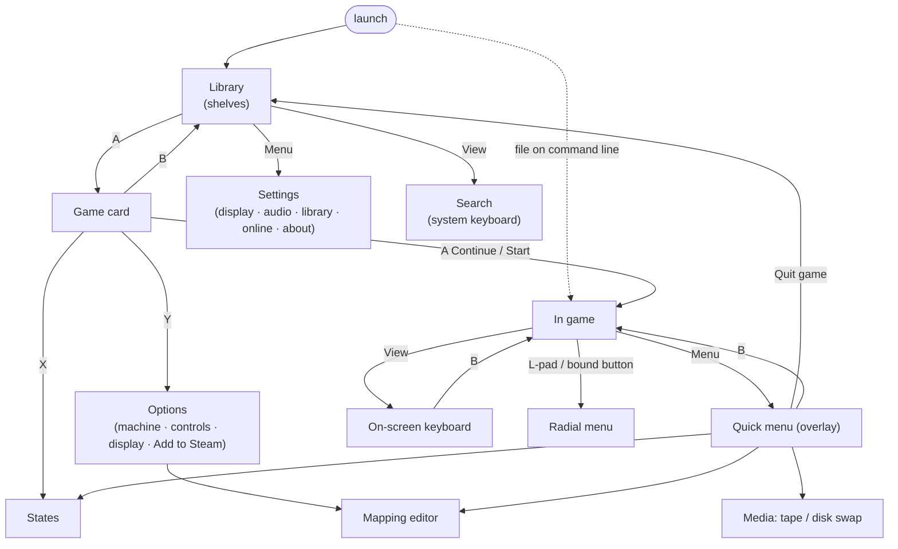
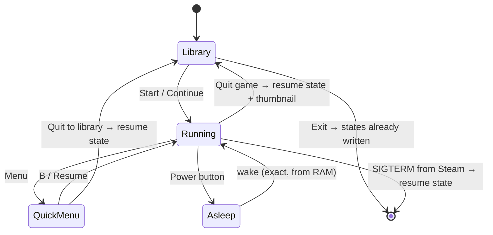

# unreal-deck: UX

| | |
|---|---|
| **Date** | 2026-10-08 |
| **Status** | Design, for review |
| **Requirements** | [goals-and-requirements.md](goals-and-requirements.md) |
| **Superseded for design work by** | [ux-design-brief.md](ux-design-brief.md) (the brief wins where they differ; this file keeps the first sketches) |

Mock-ups are drawn on a 1280×800 grid (1 character ≈ 16 px). They show layout and hierarchy, not
final art.

## Contents

- [1. Principles](#1-principles)
- [2. Navigation map](#2-navigation-map)
- [3. Library](#3-library)
- [4. Game card](#4-game-card)
- [5. In game and the quick menu](#5-in-game-and-the-quick-menu)
- [6. On-screen keyboards](#6-on-screen-keyboards)
- [7. Radial menu](#7-radial-menu)
- [8. Mapping editor](#8-mapping-editor)
- [9. Continue, suspend and states](#9-continue-suspend-and-states)
- [10. Deck Verified checklist](#10-deck-verified-checklist)
- [11. Visual style](#11-visual-style)

## 1. Principles

| # | Principle |
|---|-----------|
| U-1 | **A = do, B = back, everywhere.** Never a dead end; never a screen B does not leave. |
| U-2 | **Two presses to play.** From launch: A on the highlighted card (the last played), A on "Continue". |
| U-3 | **The game owns the screen.** In game there is no chrome. The HUD shows only transient toasts and the tape / disk activity, and fades. |
| U-4 | **Physical media metaphors, used sparingly.** Cassettes look like cassettes and disks like disks, because the format decides what you can do (rewind a tape, swap a disk). Not as decoration. |
| U-5 | **Nothing is lost.** Quit, sleep, game switch: state is kept without asking. Destructive actions (overwrite a slot, write back to a disk image) confirm with a hold-A. |
| U-6 | **Readable at arm's length.** Body text 16 px, labels ≥ 12 px, never below Valve's 9 px floor. |
| U-7 | **Touch is a shortcut.** Every touch target is also reachable with the D-pad; nothing needs the touchscreen. |

## 2. Navigation map



## 3. Library

```
┌──────────────────────────────────────────────────────────────────────────────┐
│  unreal-deck      ◀L1  Continue · Games · Cassettes · Disks · Favourites  R1▶│
│                                                     🔍 View   ⚙ Menu   21:47 │
├──────────────────────────────────────────────────────────────────────────────┤
│  CONTINUE                                                                    │
│  ┏━━━━━━━━━━━━━━━┓  ┌───────────────┐  ┌───────────────┐  ┌───────────────┐  │
│  ┃ ▓▓ last frame ┃  │ ▓▓ last frame │  │ ▓▓ last frame │  │ ▓▓ last frame │  │
│  ┃ ▓▓  320×200   ┃  │               │  │               │  │               │  │
│  ┃ Elite         ┃  │ Dizzy V       │  │ Black Raven   │  │ Nether Earth  │  │
│  ┃ 128K · 2h ago ┃  │ 48K · Mon     │  │ Pentagon · Sun│  │ 48K · 3 Oct   │  │
│  ┗━━━━━━━━━━━━━━━┛  └───────────────┘  └───────────────┘  └───────────────┘  │
│                                                                              │
│  RECENTLY ADDED                                                              │
│  ┌──────┐ ┌──────┐ ┌──────┐ ┌──────┐ ┌──────┐ ┌──────┐ ┌──────┐ ┌──────┐     │
│  │cover │ │cover │ │ ▭▭▭▭ │ │cover │ │ ▣    │ │cover │ │cover │ │cover │ ▶   │
│  │      │ │      │ │ tape │ │      │ │ disk │ │      │ │      │ │      │     │
│  └──────┘ └──────┘ └──────┘ └──────┘ └──────┘ └──────┘ └──────┘ └──────┘     │
│  Lode R.  Saboteur  Untitled Exolon   Insult   Head...  R-Type   Cobra       │
├──────────────────────────────────────────────────────────────────────────────┤
│ Ⓐ Open   Ⓧ Favourite   Ⓨ Options   Ⓑ Exit                Filter: All · 3 412 │
└──────────────────────────────────────────────────────────────────────────────┘
```

- **Shelves** (horizontal rows of cards, vertical between rows) are the main structure. L1 / R1
  switch tabs. The Continue row is first whenever it is non-empty.
- **Cards by type.** A game with known metadata shows its cover. A bare tape shows a cassette
  with its file name on the label. A bare disk shows a 3.5"/5.25" disk with the TR-DOS disk label.
  A machine profile shows the machine photo.
- **Art priority**: local file next to the image (`.png` / `.jpg` with the same name) → cache →
  online (ZXInfo / ZX-Art / SteamGridDB, if enabled) → title screen rendered headless at scan time.
- **Large collections.** Alphabet jump on the right trackpad (slide = scrub A–Z with a letter
  bubble). The filter (Y on a tab) is by machine, genre, year or source folder.
- **Search** uses the system keyboard (Steam floating keyboard when available, otherwise the
  host-text OSK). Results update while typing.

## 4. Game card

```
┌──────────────────────────────────────────────────────────────────────────────┐
│ ◀ Ⓑ Library                                                                  │
│ ┌──────────────────────┐   ELITE                                             │
│ │                      │   Firebird · 1985 · 128K / 48K                      │
│ │    cover / title     │   Signature: tape (content) ✓  Profile: community   │
│ │       screen         │                                                     │
│ │                      │   ┏━━━━━━━━━━━━━━━━━━━━━━━┓ ┌──────────────────────┐ │
│ │                      │   ┃ ▶ CONTINUE  2h ago    ┃ │ ↺ START FRESH        │ │
│ └──────────────────────┘   ┗━━━━━━━━━━━━━━━━━━━━━━━┛ └──────────────────────┘ │
│                                                                              │
│  STATES  ┌─────┐ ┌─────┐ ┌─────┐ ┌─────┐ ┌ ─ ─ ┐                             │
│          │ ▓▓▓ │ │ ▓▓▓ │ │ ▓▓▓ │ │ ▓▓▓ │   +                                 │
│          │ 1   │ │ 2   │ │ 3   │ │ 4   │ │     │                             │
│          └─────┘ └─────┘ └─────┘ └─────┘ └ ─ ─ ┘                             │
│  ON THIS TAPE   1 Program: Elite   2 Bytes: ELITEscr  3 Bytes: ELITEcde      │
│  CONTROLS       D-pad/stick Kempston · A fire · R-pad mouse · L-pad radial   │
├──────────────────────────────────────────────────────────────────────────────┤
│ Ⓐ Continue   Ⓧ States   Ⓨ Options (machine · controls · display · Steam)     │
└──────────────────────────────────────────────────────────────────────────────┘
```

**Disk variant.** "On this tape" becomes the TR-DOS catalogue. A on an entry runs that file
(`RANDOMIZE USR 15619: REM: RUN "name"`, or the `boot`). Buttons: **Boot**, **Run file**,
**Insert in B:** (for a second disk of a set). For a multi-disk title, all disks of the set appear
as tabs and the quick menu swaps them.

## 5. In game and the quick menu

In game, the screen is the picture (crop "Deck fit", [rendering.md §6](rendering.md#6-scaling-and-the-crt-pass))
plus a fading HUD: tape counter and loading bar, disk activity LED, toasts. Menu opens the quick
menu as a side panel. The emulation **keeps running** behind it, paused only if the user chooses.

```
┌──────────────────────────────────────────────────┬───────────────────────────┐
│                                                  │  ELITE · 128K   ⏸ paused  │
│                                                  │ ───────────────────────── │
│                                                  │ ▶ Resume                  │
│                 game picture                     │   Save state      ▸ 1–8   │
│                 (dimmed 40 %)                    │   Load state      ▸ 1–8   │
│                                                  │   Media           ▸ tape  │
│                                                  │   Controls        ▸       │
│                                                  │   Display         ▸ CRT   │
│                                                  │   Sound           ▸       │
│                                                  │   Machine         ▸ reset │
│                                                  │   Quit to library         │
│                                                  │ ───────────────────────── │
│                                                  │ Ⓐ choose  Ⓑ back          │
└──────────────────────────────────────────────────┴───────────────────────────┘
```

| Entry | Content |
|---|---|
| Media | tape: play / stop / rewind / block list with jump; disks A–D: eject / insert from library / set; "write back changes to image" (hold A) |
| Controls | the active profile summary, "Edit", "Learn a key", switch profile |
| Display | crop (Deck fit / paper / full / fit), CRT preset, Gigascreen de-flicker on / off, perf HUD |
| Sound | volume per device (AY, beeper, Covox, GS…), stereo mode (ABC / ACB / mono) |
| Machine | reset (soft / hard), NMI (Magic), turbo, model info |

## 6. On-screen keyboards

### 6.1 Spectrum 48K (default for BASIC-era software)

```
┌──────────────────────────────────────────────────────────────────────────────┐
│ game picture (top 62 %)                                                      │
├──────────────────────────────────────────────────────────────────────────────┤
│  EDIT  CAPS LOCK  TRUE VID  INV VID   ←      ↓      ↑      →    GRAPHICS DEL │
│ ┌────┐┌────┐┌────┐┌────┐┌────┐ ┌────┐┌────┐┌────┐┌────┐┌────┐               │
│ │ 1 !││ 2 @││ 3 #││ 4 $││ 5 %│ │ 6 &││ 7 '││ 8 (││ 9 )││ 0 _│               │
│ └────┘└────┘└────┘└────┘└────┘ └────┘└────┘└────┘└────┘└────┘               │
│ ┌────┐┌────┐┌────┐┌────┐┌────┐ ┌────┐┌────┐┌────┐┌────┐┌────┐               │
│ │Q   ││W   ││E   ││R  <││T  >│ │Y   ││U   ││I   ││O  ;││P  "│               │
│ │PLOT││DRAW││REM ││RUN ││RAND│ │RET ││IF  ││INPU││POKE││PRIN│               │
│ └────┘└────┘└────┘└────┘└────┘ └────┘└────┘└────┘└────┘└────┘               │
│ ┌────┐┌────┐┌────┐┌────┐┌────┐ ┌────┐┌────┐┌────┐┌────┐┌──────┐             │
│ │A   ││S   ││D   ││F   ││G   │ │H  ↑││J  -││K  +││L  =││ENTER │             │
│ │NEW ││SAVE││DIM ││FOR ││GOTO│ │GOSU││LOAD││LIST││LET ││      │             │
│ └────┘└────┘└────┘└────┘└────┘ └────┘└────┘└────┘└────┘└──────┘             │
│ ┌──────┐┌────┐┌────┐┌────┐┌────┐ ┌────┐┌────┐┌────┐┌────┐┌──────┐           │
│ │CAPS  ││Z  :││X  £││C  ?││V  /│ │B  *││N  ,││M  .││SYM ││BREAK │           │
│ │SHIFT ││COPY││CLR ││CONT││CLS │ │BORD││NEXT││PAUS││SHFT││SPACE │           │
│ └──────┘└────┘└────┘└────┘└────┘ └────┘└────┘└────┘└────┘└──────┘           │
│  L-pad: left half ●                 R-pad: right half ●   mode: K  ⇧ ⎇       │
└──────────────────────────────────────────────────────────────────────────────┘
```

Legends are abbreviated in the sketch, and some symbol-shift legends are left out. The real
layout uses the full 48K legends (keyword, symbol, the E-mode function word above, and the E-mode
word below).

- **Dual cursors**: the left trackpad covers the left half (columns 1–5), the right trackpad the
  right half, in absolute mode. Pad click presses the key under its cursor, with a haptic tick.
  This is the SteamOS keyboard pattern, which Deck users already know.
- The **D-pad + A** alternative moves one cursor. Touchscreen taps work as well.
- **Sticky shifts.** L1 = SYMBOL SHIFT and R1 = CAPS SHIFT while the OSK is open. A tap is sticky
  for one key, a double tap locks.
- **Mode-aware legends.** The OSK knows the ROM's cursor mode (K / L / C / E / G, from the system
  variables `MODE` / `FLAGS` in 48K BASIC). It highlights the legend that the next press will
  produce, e.g. the keyword in K mode. This is what makes typing `LOAD ""` obvious.
- The picture moves up, not under: the game stays visible above the keyboard (crop "paper" at
  2.5×).

### 6.2 Other layouts

| Layout | When | Notes |
|---|---|---|
| 128K / +2 | 128K BASIC editor or menus | full-word typing, extra keys (EDIT, cursor block) |
| Compact | games that need a few keys | 4 rows, letters + digits + ENTER / SPACE / BREAK, ZX ROM font, attribute-colour key caps; 30 % of the height |
| Host text | search, names, settings | Steam's floating keyboard (`ShowFloatingGamepadTextInput`) in an AppID build; otherwise a plain QWERTY host OSK |

## 7. Radial menu

```
                      ┌──────────┐
                      │ LOAD ""  │
             ┌────────┴──────────┴────────┐
             │ RUN   ╲              ╱ CAT │
             │        ╲   ● thumb  ╱      │
             │ BREAK ──── on L-pad ─── NMI│
             │        ╱            ╲      │
             │ RESET ╱              ╲ SAVE│
             └────────┬──────────┬────────┘
                      │ OSK      │
                      └──────────┘
```

Touch the left trackpad to show the wheel, slide to a sector (highlight + haptic tick), click or
lift to choose. A profile may replace the items: game commands (Elite's galaxy map, hyperspace),
disk swaps for multi-disk games, cheats. Eight sectors at most.

## 8. Mapping editor

```
┌──────────────────────────────────────────────────────────────────────────────┐
│ CONTROLS · Elite · profile: user (from community)          Ⓨ reset  Ⓧ test   │
├───────────────────────────────┬──────────────────────────────────────────────┤
│  ┌─────── Deck ────────┐      │  R-PAD                                       │
│  │ L2  L1      R1  R2  │      │  ○ Off                                       │
│  │                     │      │  ● Kempston mouse    sensitivity ▮▮▮▮▯ 1.4   │
│  │ [L-pad]    [▓R-pad▓]│ ◀    │  ○ Joystick (4 zones)            inertia ✓   │
│  │  stick  +   A B X Y │      │  ○ Radial menu                               │
│  │ L4 L5        R4 R5  │      │  ○ Keys (4 zones)                            │
│  └─────────────────────┘      │  ○ OSK cursor                                │
│  press any control to select  │                                              │
├───────────────────────────────┴──────────────────────────────────────────────┤
│ Ⓐ choose   Ⓑ back   press-to-select: any Deck control jumps to it            │
└──────────────────────────────────────────────────────────────────────────────┘
```

- **Press to select.** Pressing any physical control selects it in the diagram, so the user does
  not have to navigate to it.
- The right pane depends on the control type: button (key / chord / joystick bit / app action /
  turbo), stick (joystick, keys, mouse; dead-zone, 4 / 8-way), pad (as shown), gyro (mouse,
  activation button).
- **Test** (X) runs the game for 5 s with a small overlay of what each press sends.
- Saving writes a user profile under the current game's signature. "Save for machine" and "Save
  as global default" are explicit choices.

## 9. Continue, suspend and states



- After sleep the game is **paused with a "Press A" overlay** for one second. This gives the user
  time to get a grip before action resumes. The delay can be set to 0.
- Slots show thumbnail, date, play time and machine. Overwriting a slot is a hold-A.
- "Start fresh" keeps the old resume state for one more start (an undo), then drops it.

## 10. Deck Verified checklist

From Valve's compatibility review ([references.md](references.md#steam-deck-hardware-and-os)):

| Criterion | How we meet it |
|---|---|
| Default controller configuration reaches all content | [input-and-profiles.md §7](input-and-profiles.md#7-default-bindings): every function on a button with no setup |
| On-screen glyphs match the Deck | own Deck glyph set; Steam glyphs via `GetGlyphForActionOrigin` in the AppID build |
| Text entry uses a Steamworks on-screen keyboard | host text uses `ShowFloatingGamepadTextInput` (AppID build); the Spectrum OSK is *guest* input, a game feature |
| Default resolution is the native 1280×800 | yes; no launcher, no resolution dialog |
| Text legible | U-6 |
| No launcher needing a mouse | the app is the launcher, and it is controller-first |
| Works offline | everything except optional online metadata |

## 11. Visual style

- **Palette**: dark neutral background (#101014), with accents from the Spectrum's bright
  colours: bright cyan selection, bright yellow focus ring, bright red for destructive actions.
  Colour is never the only signal; there is always an icon or label too.
- **Type**: a clean sans (Inter or Noto Sans) for UI text; the ZX ROM font for Spectrum-flavoured
  elements (OSK key caps, radial labels, the compact keyboard). Never ROM font for body text.
- **Motion**: 120–180 ms ease-out for card focus and panel slide; no motion during gameplay
  except toasts.
- **Focus**: the focused card scales to 1.08 with a 3 px ring; D-pad repeat starts at 300 ms and
  accelerates.
