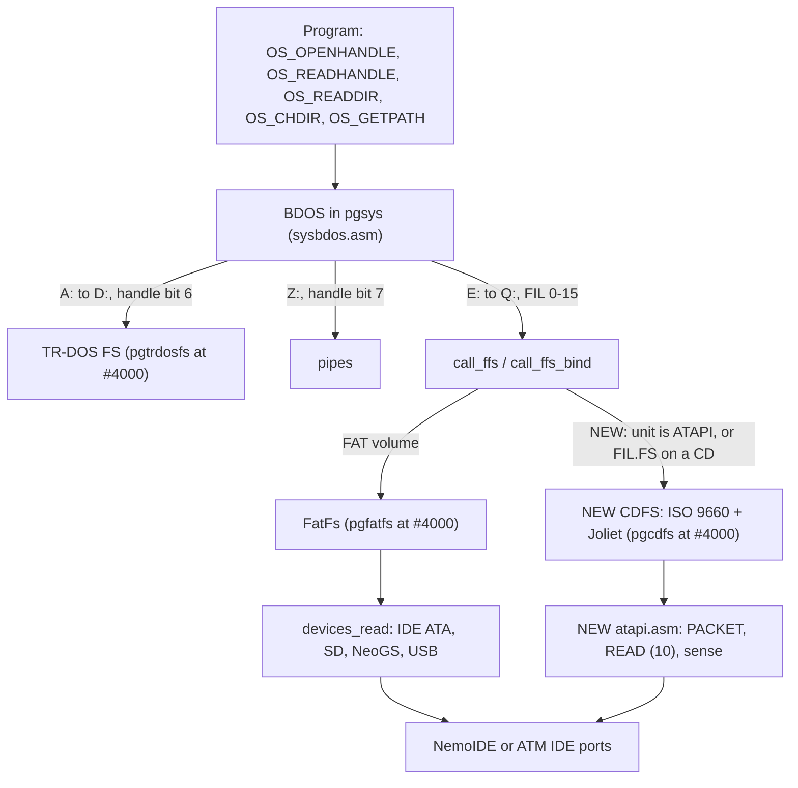

# NedoOS: ATAPI CD-ROM driver and CD file system (ISO 9660 + Joliet): design proposal

| | |
|---|---|
| **Date** | 2026-10-09 |
| **Status** | Proposal, not started. The work is in NedoOS, not in unreal-ng. unreal-ng only adds tests and fixtures |
| **NedoOS revision read** | fork `alfishe/NedoOS` at `a75034922945341a901025a0474b96f3c18afa9c` (2026-10-08). Cited as `NedoOS: src/...:line`. Links go to `https://github.com/alfishe/NedoOS/blob/a75034922945341a901025a0474b96f3c18afa9c/<path>` |
| **Unblocks** | [ACC-C5, the NedoOS half](../2026-10-05-media-multisource/TODO.md): NedoOS lists a composite CD on the ZX-Evo's ATAPI drive |
| **Owner's question** | "How much has to be written in NedoOS, fully compatible with its architecture and existing code, to add ATAPI, CD and the main CD file systems?" |

Measurement method. The kernel was assembled in a scratch copy of the fork with the tree's own sjasmplus
(`NedoOS: tools/src/sjasmplus`, built on Linux). `ffsfunc.asm` was generated from `NedoOS: src/fatfs4os/fatfs.exp`,
and the settings came from each `src/kernel/build_kernel_*.bat`. The free-space figures below are the assembler's own
`display` lines (`NedoOS: src/kernel/main.asm:1137, 1153, 1446`, `src/kernel/sysbdos.asm:3492`) and its symbol file.
Everything marked *est.* is an estimate.

---

## 1. Summary

**What is proposed.** The proposal adds a read-only CD file system to the NedoOS kernel, built the way the
TR-DOS file system already lives beside FatFs. It has three layers:

- An ATAPI PIO packet driver: PACKET, TEST UNIT READY, REQUEST SENSE, READ CAPACITY, READ (10), READ TOC and
  unit attention.
- A 2048-byte block cache.
- An ISO 9660 + Joliet reader that answers the same FatFs entry points the kernel already calls.

A CD drive shows up under the drive letter of its IDE unit's first partition: **`E:` for the master, `I:` for the
slave**. Today an ATAPI unit there gives "not ready". Programs (`cmd.com`, `nv.com`, anything using
`OS_OPENHANDLE` / `OS_READHANDLE` / `OS_READDIR` / `OS_CHDIR` / `OS_GETPATH`) need no change.

**Effort** (one experienced Z80 developer; every number here is *est.*. Section 4 gives each component's basis):

| # | Component | Language | Lines | Code bytes | Days | Risk |
|---|---|---|---:|---:|---:|---|
| 1 | ATAPI low-level driver (`atapi.asm`) | Z80 asm (sjasmplus) | 400 | 900 | 3 | M: real-drive timing |
| 2 | Unit detection, raw-sector guard (`fatfsdrv.asm` edits) | asm | 40 | 60 (pgsys) | 0.5 | M: status `00h` after reset |
| 3 | Block cache, 2 x 2048 B (+ optional 512 B bridge) | asm | 120 | 200 + 4 KB data | 1 | L |
| 4 | Volume recognition: sessions, PVD, Joliet SVD | asm | 150 | 350 | 1 | L |
| 5 | Directory records, path walk, name mapping, `FILINFO` | asm | 450 | 1,100 | 3 | M |
| 6 | File ops: open, read, lseek, close, stat, getutime | asm | 300 | 700 | 2 | M |
| 7 | Directory ops: opendir, readdir, chdir, getcwd | asm | 200 | 500 | 1.5 | M |
| 8 | Kernel glue: page choice in `call_ffs`, `BDOS_mount`, write refusal, page reservation | asm | 120 | <= 160 pgsys + 150 | 2 | **H**: pgsys has 208 B left in the tightest build |
| 9 | Media change, spin-up, timeouts | asm | 80 | 180 | 1 | M |
| 10 | Build integration (`CDFS` flag, page, init copy) | bat, asm | 40 | 0 | 0.5 | L |
| 11 | `cdtool.com`: phase-1 test vehicle that assembles the same sources in user space | asm | 250 | ~6 KB `.com` | 2 | L |
| 12 | Docs (`src/nedoos_en.md`, `src/nedoos.txt`, `_sdk` comments) | text | 80 | 0 | 0.5 | L |
| | **Core total (NedoOS)** | | **~2,230** | **~4.1 KB in a new 16 KB page + <= 0.2 KB in pgsys** | **18** | |
| opt | Rock Ridge (`NM`, `PX`) | asm | 200 | 450 | 2 | L |
| opt | `OS_READSECTORS` on a CD unit (512-byte view) | asm | 60 | 120 | 0.5 | L |
| opt | CD-DA: `cdplay.com` unchanged, coexistence only | none | 0 | 0 | 0.5 | L |
| opt | UDF 1.02 read-only | asm | 1,500+ | 4 KB+ | 10+ | H, not recommended |
| ext | unreal-ng tests and fixtures | C++ | 400 | none | 2-3 | L |
| ext | Real ZX-Evo with 2-3 different drives | none | none | none | 2-3 | M |

**Recommended design.** Use **staged C then A**:

- **Phase 1 (option C):** write the ATAPI and ISO code as kernel-ready asm, then assemble it first into a
  user-space `cdtool.com`. This is the test vehicle: it proves the driver on the emulator and on real drives with no
  kernel change.
- **Phase 2 (option A):** link the same sources into a dedicated kernel page `pgcdfs`. The kernel maps that page in
  place of `pgfatfs` when the volume (or the open `FIL`) belongs to an ATAPI unit, and the page answers the FatFs
  entry addresses (`ffsfunc.*`) with ISO 9660 / Joliet code.

FatFs, its binary (`fatfs.raw`), the system-call ABI, the existing drive letters and the memory map of the four
system pages are untouched. Option B (FatFs serving 2048-byte sectors) does not fit: the structures page has 361
bytes free and the FatFs page 472. Option B also needs the IAR compiler, which is not in the tree.

---

## 2. Current state

### 2.1 Devices, volumes, drive letters

| Fact | Where |
|---|---|
| Five physical devices, numbered 0 IDE master, 1 IDE slave, 2 Z-Controller SD, 3 NeoGS SD, 4 SL811 USB; `device_states` holds one status byte per device | `NedoOS: src/kernel/fatfsdrv.asm:21-26` (`device_states`), `:65-136` (`devices_init`) |
| Sector I/O dispatch by device number: `devices_read` / `devices_write` call `readsectorsIDE` (`0xE0` / `0xF0`), `readsectorsSD`, `readsectorsGS`, `SL811.RBC_Read` | `fatfsdrv.asm:159-212`, `:215-268` |
| IDE reads are ATA READ SECTORS `20h` only. `waitDRQ` has no timeout and ignores ERR (the timer code is commented out) | `fatfsdrv.asm:322-339`, `:341-370` |
| IDE data path: 16-bit through the NemoIDE latch. Reads go low port `#10` then high `#11`; writes go high first, then low | `fatfsdrv.asm:407-458`; ports `NedoOS: src/kernel/main.asm:47-77` (Nemo `#F0..#10/#11`, ATM `#FEEF..#FE0F/#FF0F`) |
| FatFs is told about the drivers through a pointer table patched at boot (`FFS_DRV.init/status/rd_to_usp/rd_to_buf/...`, plus the copy helpers `strcpy_usp2lib`, `memcpy_lib2usp`, ...) | `main.asm:386-413`; `FFS_DRV` layout `NedoOS: src/kernel/fatfs_h.asm:33-56`; `drv_calls` `NedoOS: src/fatfs4os/mylib.asm:33-55` |
| FatFs is IAR C (`iccz80`), linked to `#4000-#7FFF` and checked in as the binary `fatfs.raw` (15,912 bytes). `build.bat` skips the build when IAR is missing, and IAR is not in the tree | `NedoOS: src/fatfs4os/build.bat:3-7`, `link.lnk:2`, `fatfs.raw`; entry addresses `fatfs.exp` |
| `ffconf.h`: `_MAX_SS 512`, `_VOLUMES 12`, `_MULTI_PARTITION 1`, `_USE_LFN 1`, `_MAX_LFN 63`, `_CODE_PAGE 866`, `_FS_READONLY 0` | `NedoOS: src/fatfs4os/ffconf.h:23, 60, 93-94, 128, 132, 140` |
| The volume-to-device mapping is the kernel's, not FatFs's: `f_mount` uses the `curr_fatfs` the kernel sets. `disk_ioctl` is the constant 0 | `NedoOS: src/fatfs4os/ff.c:1868-1909`, `:1673-1730` (`chk_mounted`); `diskio.h:61-79` (`disk_ioctl` at `:71`) |
| `src/fatfs4os/savelij.asm` (`ID_DEV`, `nemo_read`, `disk_initialize`) is **not built** (the link has `ff` and `mylib` only). The live IDE code is `fatfsdrv.asm` | `link.lnk`, `build.bat:22-24` |

**Drive letters** (`NedoOS: src/kernel/sysbdos.asm:4-5`, `BDOS_mount :2859-2903`, boot mount loop
`NedoOS: src/kernel/idle.asm:98-127`):

| Letter | Volume index | Backing | Code |
|---|---|---|---|
| `A:`-`D:` | 0-3 | TR-DOS drives (ROM TR-DOS) | `vol_trdos=4`, `CHECKVOLUMETRDOS` `sysbdos.asm:33-36` |
| `E:`-`H:` | 4-7 | IDE master, partitions 0-3 | `BDOS_mount` `.isHDD`: drive = n >> 2, part = n & 3 |
| `I:`-`L:` | 8-11 | IDE slave, partitions 0-3 | same |
| `M:` | 12 | Z-Controller SD (device 2) | `cp 8 / sub 6` |
| `N:` | 13 | NeoGS SD (device 3) | same |
| `O:` | 14 | SL811 USB (device 4) | same |
| `P:`, `Q:` | 15, 16 | none (device 5, 6: `devices_init` answers "no such device") | `fatfsdrv.asm:135-136` |
| `Z:` | 25 | pipes | `vol_pipe=25` |

- `fatfsarray` has **13** `FATFS` slots (563 bytes each, `E:`..`Q:`), followed by 16 `FIL` objects (544 bytes each),
  in page `pgfatfs2` at `#C000`. They end at `#FE97` (`sysbdos.asm:3487-3492`).
- The idle task mounts `A:`..`O:` at boot and prints `Drive X mounted`. On an IDE failure other than 13 (no FAT) or 10
  (write-protected) it skips to the next unit's four letters (`idle.asm:98-127`).
- `nv.com` offers 15 drives, `A:`-`O:` (`NedoOS: src/nv/nv.asm:42`, `:1918`).

### 2.2 How a call reaches a file system

- **By volume.** `countfiledrive` takes the letter from the path, or `app.vol` (`sysbdos.asm:3072-3093`). Below 4 the
  call goes to TR-DOS, at 25 to the pipes; anything else reaches FatFs through `call_ffs` / `call_ffs_curvol`
  (`sysbdos.asm:2825-2856`). `call_ffs_bind` computes the `FATFS` slot, maps `pgfatfs` at `#4000`
  (`BDOSSETPGFATFS`), sets `FFS_DRV.curr_fatfs/curr_dir0/curr_dir2` from the task and jumps to `ffsfunc.f_xxx`.
- **By handle.**
  - Bit 7 of the handle means a pipe, bit 6 TR-DOS (`TRDOSADD40`). Anything else is a FatFs `FIL` index 0-15
    (`BDOS_closehandle :2355-2370`, `BDOS_readhandlego :2473-2497`, `BDOS_number_to_fil :2343-2353`).
  - FatFs calls on a `FIL` use `call_ffs_curvol`, which binds the **task's current** volume (`fatfs_h.asm:193-224`).
    FatFs itself follows `FIL.FS`.
- **The FatFs ABI as the kernel uses it.** The first argument goes in DE, the second in BC, the rest on the stack.
  The result is `FRESULT` in A: BDOS tests `or a` after the call (`fatfs_h.asm:1-31`, macros `:152-360`).
- **Structures programs see.**
  - `FILINFO`: `FSIZE` +0, `FDATE` +4, `FTIME` +6, `FATTRIB` +8, `FNAME[13]` +9 (8.3 with dot), `LNAME[64]` +22
    (`NedoOS: src/_sdk/sysdefs.asm:121-127`).
  - `cmd dir` prints `LNAME` and falls back to `FNAME` when `LNAME` is empty (`NedoOS: src/cmd/cmd.asm:1180-1231`).
- **Task state.** `app.vol` (BYTE), `app.dircluster` (DWORD) and `app.dir` (`DIR`, 26 bytes)
  (`NedoOS: src/kernel/syskrnl.asm:164-166`). A child task copies `vol` and `dircluster`
  (`NedoOS: src/kernel/bdospg2.asm:39-47`).
- **Direct `FIL` reads.** `OS_TELLHANDLE` and `OS_GETFILESIZE` read `FIL.FPTR` / `FIL.FSIZE` directly, without
  FatFs (`sysbdos.asm:2183-2228`). `findfreeffile` treats a `FIL` as busy when `FS` has a non-zero high byte
  (`:3312-3334`). Task exit closes a task's files by `FIL.PAD1` = owner id (`:1199-1216`).
- **Opening mode.** `OS_OPENHANDLE` always asks FatFs for `FA_READ|FA_WRITE` (`sysbdos.asm:2240-2245`).
  `OS_CREATEHANDLE` asks for `|FA_CREATE_ALWAYS` (`:2230-2238`).
- **No "get free space" system call.** The `f_getfree` slot in FatFs's call table is 0 (`mylib.asm:66`).

### 2.3 TR-DOS: the precedent for a second file system

| Aspect | How TR-DOS does it | Code |
|---|---|---|
| Own page | `pgtrdosfs` (physical page 8), mapped at `#4000` by `BDOSSETPGTRDOSFS`; `sys_curpg4000` remembers it for the interrupt handler | `main.asm:100-110`; `sysbdos.asm:38-52`; `syskrnl.asm:17-19` |
| Image | assembled in the init code (`wastrdosfs`, `disp`), copied to its page before the system part is unpacked, size asserted `<= #1C00` | `main.asm:325-330`, `:1139-1154` |
| Dispatch | about 25 branch points in `sysbdos.asm` (`*_noFATFS`, `*_trdos`, `bit 6,b`): fread, fwrite, opendir, readdir, readdirn, fsearch*, seek, getfilesize, open, close, read, write, fopen, fcreate, fclose, readsectors, writesectors, setdrv, delete, rename, chdir, getfiletime | `sysbdos.asm:1560-3141` (labels listed by `grep noFATFS`) |
| Size | `trdosfs.asm` 676 lines + `trdosio.asm` 1,208 lines, **1,820 bytes** (`#4378-#4A94`). The sector I/O is the TR-DOS ROM | measured |

CDFS follows the same pattern (own page, image copied at boot). It needs **far fewer** dispatch points because §3.1
switches pages inside `call_ffs`, so every FatFs-routed call is covered in one place.

### 2.4 Why an ATAPI drive is rejected today

1. `readidentIDE` (`fatfsdrv.asm:489-542`) treats status `00h` as "no device" (`:504-505`), but a packet device may
   legally show `00h` after a reset. The emulator's `AtapiCdrom` does exactly that (status 0 after a reset,
   [implementation-plan.md §5](../2026-09-28-ide-atapi/implementation-plan.md)).
2. If the status is non-zero, the kernel sends IDENTIFY DEVICE `ECh`. An ATAPI device aborts it and leaves the
   signature `14h/EBh` in the cylinder registers. `readidentIDE` compares it with `#EB14` and returns `A=1`
   (`:529-539`), `IDE_INIT` returns non-zero (`:272-278`), and `device_states` stays `1` (STA_NOINIT).
3. `chk_mounted` then returns `FR_NOT_READY` (3) (`ff.c:1709-1711`). The boot loop prints nothing for `E:`/`I:` and
   skips the unit's other three letters (`idle.asm:110-123`).
4. Nothing in the kernel can issue PACKET `A0h`. `OS_READSECTORS` on an ATAPI unit (`sysbdos.asm:2948-2961` to
   `devices_read_go_regs`) sends ATA `20h`, which the drive aborts, and `waitDRQ` then **loops forever**
   (`fatfsdrv.asm:330-338`).

The note in [2026-09-29-zxevo-cd-boot/README.md](../2026-09-29-zxevo-cd-boot/README.md) cites
`src/fatfs4os/savelij.asm` for this. The same check exists there, but that file is not built; `fatfsdrv.asm` is the
live code.

### 2.5 What `cdplay.com` already proves

`NedoOS: src/kapps/cdplay/main.c` is 1,316 lines of IAR C; `release/bin/cdplay.com` is 10,469 bytes. It runs from
user space with direct port I/O.

| Function | What it does | Lines |
|---|---|---|
| `init` | picks the Nemo or ATM port set from `OS_GETCONFIG` (1 Evo, 2/3 ATM, 6 P2.666) | `main.c:413-478` |
| `main` | software reset through the device control register: `hddupr` = `0x0C`, then `0x08` (SRST, nIEN) | `main.c:1306-1309` |
| `detectCd` | `ECh`, checks `#EB14`, then IDENTIFY PACKET DEVICE `A1h` and reads 2048 bytes | `main.c:259-334` (present, not called by `main`) |
| `waitBsy`, `waitDrq` | busy and DRQ polls with a 65,535-iteration timeout | `main.c:337-373` |
| `sendAtapiPacket` | DI, wait for BSY = 0, `A0h`, wait for DRQ, six words written high then low port | `main.c:376-411` |
| `readCdToc` | READ TOC `43h`, MSF, format 0; reads words while DRQ is set | `main.c:481-532` |
| PLAY MSF `47h`, PAUSE `4Bh`, READ SUB-CHANNEL `42h`, STOP `4Eh`, START/STOP `1Bh` | audio control, slave only (`#B0`) | `main.c:98-105, 575-616, 868` |

What it does **not** do (the kernel driver must):

- writes no byte-count limit (cylinder registers) and never reads the byte count back;
- reads no status after a packet and never checks ERR;
- has no REQUEST SENSE, TEST UNIT READY, READ CAPACITY or READ (10);
- uses only the slave.

It proves that the 16-bit latch order, the packet handshake and user-space port access work on NemoIDE and ATM IDE,
in unreal-ng and on hardware ([cd-audio README §3](../2026-10-02-cd-audio/README.md)).

### 2.6 Memory headroom (measured, every shipped kernel configuration)

| Build (settings from) | pgsys code room before the BDOS tables (`#3800 - "$ before align"`) | `pgtrdosfs` room (`#1C00 - trdosfs_sz`) |
|---|---:|---:|
| Evo W5300 `build_kernel_evo.bat` (`sd_boot.$C`) | 843 B | 2,304 B |
| Evo ESP `build_kernel_evo_esp.bat` | 2,567 B | 382 B |
| ATM2 HDD W5300 `build_kernel_atm2.bat` (`osatm2hd.$C`) | 348 B | 2,478 B |
| ATM2 HDD ESP `build_kernel_atm2_esp.bat` | 2,072 B | 209 B |
| ATM3 HDD `mkatm3hd.bat` | **208 B** | 2,478 B |
| P2.666 SD `mkpe26sd.bat` (KOE) | 283 B | 2,478 B |

Other pages:

| Page | Free | Source |
|---|---|---|
| `pgfatfs` | 472 B (`fatfs.raw` = 15,912 of 16,384) | measured |
| `pgfatfs2` structures | 361 B (`ffilearray_end = #FE97`, every build) | assembler display |
| user pool | Evo has 192 pages (3 MB), ATM2 64. Four system pages are reserved (physical 8-11; `tsys_pages`) | `sysbdos.asm:3510-3560` |

**Consequence:** a CD file system (about 4 KB of code plus a 4 KB cache) fits in no existing kernel page. It needs
its own page, like TR-DOS. The pgsys glue must stay at or below about 160 bytes so that every build still assembles.

---

## 3. Design options

| | **A. CDFS module beside FatFs (TR-DOS pattern)** | **B. 2048-byte sectors in FatFs, ISO layer inside FatFs** | **C. User-space tool only (`cdtool.com`, like `cdplay`)** |
|---|---|---|---|
| What changes where | New sources `src/kernel/atapi.asm`, `cdfs*.asm` in a new page `pgcdfs`. About 120 lines of glue in `sysbdos.asm` (`call_ffs_bind`, `BDOS_mount`), `fatfsdrv.asm` (unit kind, raw-read guard), `main.asm` (page, image copy), `fatfs_h.asm` (handle macros), `tsys_pages` | `ffconf.h _MAX_SS 2048` and a real `disk_ioctl` (`diskio.h:71`). `FATFS.win` and `FIL.BUF` grow to 2048 bytes. A new ISO layer in `ff.c`. Rebuild `fatfs.raw` with IAR | New `src/kapps/cdtool/` (or `src/cdtool/`): its own ATAPI port I/O and ISO reader. No kernel change |
| `cmd` `dir/cd/type/copy`, `nv`, open/read API | all work unchanged on `E:`/`I:` | would work | **no**: only `cdtool` sees the CD (`cdtool dir`, `cdtool copy` to a FAT drive) |
| Kernel memory | +1 page (16 KB) from the user pool; <= 160 B of pgsys | +19.5 KB in `pgfatfs2` (13 `win` buffers) and +24 KB of `FIL` buffers; the page has 361 B. +3-4 KB of code in `pgfatfs`, which has 472 B: **does not fit** without moving the structures to new pages, i.e. a new memory map | 0 |
| Toolchain | sjasmplus only (in the tree) | IAR `iccz80` (not in the tree, `build.bat:3-7`); `fatfs.raw` cannot be rebuilt from the repository | sjasmplus (or IAR, like `cdplay`) |
| Risk to existing behaviour | low: FatFs binary untouched, letters only gain meaning where they failed before | high: every FAT volume runs through changed sector-size code | none |
| Effort | 18 d (§1) | 25-35 d *est.*, plus a memory-map redesign; upstream unlikely to take it | 5-6 d *est.* (components 1, 3, 4, 5, part of 6, and 11) |
| Concurrency | the kernel owns the IDE channel; BDOS calls do not interleave | same | a task can be preempted mid-packet while the kernel uses the other unit on the channel; needs DI per command, as `cdplay` does (`main.c:380-408`) |

**Recommendation: C, then A, with the same source files.**

1. Write `atapi.asm`, `cdcache.asm` and `iso9660.asm` with no page or BDOS assumptions. They receive the buffer and
   page through two hooks: "copy to the caller" and "map the caller's pages".
2. Phase 1 assembles them into `cdtool.com`, with hooks that do plain `LDIR`. This is the ACC-C5 test vehicle and a
   useful tool for users of old kernels.
3. Phase 2 assembles the same files with `disp #4000` into the `pgcdfs` image. The hooks become
   `BDOS_setdepage` / `memcpy_lib2usp` / `BDOS_setpgstructs`.

B is rejected for memory and toolchain reasons. A alone, without C, works too, but loses the cheap first step and the
user-space fallback.

### 3.1 Option A in detail: the mechanism

- **Same entry addresses.**
  - `pgcdfs` is mapped at `#4000`, the same window as `pgfatfs`.
  - Its image places a 3-byte `JP` at each `ffsfunc.f_xxx` address of the current `fatfs.raw` (`fatfs.exp`:
    `f_open #6618`, `f_read #685B`, ...) with `org ffsfunc.f_open : jp cd_open`. Those addresses come from the same
    generated `ffsfunc.asm` the kernel already includes (`fatfs_h.asm:32`), so a FatFs rebuild moves the stubs
    automatically.
  - `call_ffs` then needs no function translation, only a different page.
- **Same header.** The first 38 bytes of `pgcdfs` mirror `FFS_DRV` (`fatfs_h.asm:33-56`). Kernel code that reads
  `fatfs_org+FFS_DRV.curr_dir0/curr_dir2` after a call (`setpath`, `sysbdos.asm:3115-3135`) then reads the CD's
  values with no change.
- **Volume test (path-based calls).** For letters `E:`-`L:` the unit is `(n >> 2)`. If the unit's kind byte, set by
  the new detection, is ATAPI, `call_ffs_bind` maps `pgcdfs` instead of `pgfatfs`. Partitions 1-3 of an ATAPI unit
  return `FR_NOT_READY`.
- **Object test (`FIL` and `DIR` calls).** `F_READ_CURDRV`, `F_LSEEK_CURDRV`, `F_WRITE_CURDRV` and
  `f_clos_curdrv_pp` (`fatfs_h.asm:193-235`, `syskrnl.asm:1051-1064`) switch to a variant that takes the page from
  `FIL.FS -> FATFS.fs_type`. CD volumes use `fs_type = #CD`; FatFs uses 1-3. This keeps a CD file readable while the
  task's current drive is `M:`.
- **The CD volume object** is the existing `FATFS` slot of `E:` or `I:` in `fatfsarray`. Its `fs_type`, `drv`, `id`
  and a few DWORDs (session start, root extent, path-table location, Joliet flag) live in the first 51 bytes; the
  512-byte `win` is unused. **No new structures-page memory is needed.**
- **CD files** use the ordinary `ffilearray` slots with the `FIL` layout kept:
  - `FS` points to the CD slot, `ID` = mount generation, `FPTR` / `FSIZE` as in FAT, `FCLUST` = extent LBA,
    `DSECT` = block in the cache.
  - Handles stay 0-15. `OS_TELLHANDLE`, `OS_GETFILESIZE`, `findfreeffile` and close-on-exit work unchanged.
- **Current directory** in `app.dircluster`: the directory extent LBA in bits 0-23 and the mount generation in bits
  24-31 (a CD has fewer than 2^19 blocks, a DVD fewer than 2^22). After a disc change a stale current directory is
  detected and reset to the root.

---

## 4. Work breakdown (recommended design)

Basis for the sizes: measured kernel code density on the Evo build.

| Existing code | Code lines (no comments) | Bytes | Bytes per line |
|---|---:|---:|---:|
| `fatfsdrv.asm` IDE part `:272-542` (ATA identify, init, read, write) | 220 | 326 (`#0DD3-#0F19`) | 1.5 |
| `trdosfs.asm` + `trdosio.asm` | 1,392 | 1,820 | 1.3 |
| `sl811.asm` (USB host + SCSI: `SPC_RequestSense`, `RBC_ReadCapacity`, `RBC_Read` READ (10)) | 1,167 | 2,253 (`#118F-#1A5C`) | 1.9 |
| `ff.c` (IAR C, the read-write FAT FS) | 2,670 | 15,912 | 6.0 |
| `cdplay/main.c` (IAR C with printf) | 1,154 | 10,469 `.com` | |
| ZX-Evo ERS `hdd_cd_boot.a80:118-620` (ATAPI + ISO root search, per [zxevo-cd-boot README](../2026-09-29-zxevo-cd-boot/README.md)) | about 500 | | |

The estimates use 1.6-2.0 bytes per asm line. The ATAPI command set matches what `sl811.asm` already sends over USB
(REQUEST SENSE, READ CAPACITY, READ (10)); only the transport differs.

**Test fixture used by all components.** Copy `testdata/machines/zxevo/nedoos/sdcard/`
([README](../../../testdata/machines/zxevo/nedoos/README.md)) to a new `testdata/machines/zxevo/nedoos/cdfs/` that
holds a CDFS kernel `SD_BOOT.$C` and `bin/cdtool.com`. The disc is composed at test time from a `ScratchFolder` and a
`cd.ucompose.yaml`, as `ZXEvoErs_Test.ErsBootsAutorunFromComposedIso` does
([zxevo_ers_test.cpp](../../../core/tests/emulator/machines/zxevo/zxevo_ers_test.cpp)), and inserted into
`ide0.slave` (shipped `CD1=1`), or into `ide0.master` with `device=cdrom`.

`IsoSynthVolume` builds level-1/2 names plus a Joliet tree ([isosynthvolume.h](../../../core/src/emulator/io/storage/cd/isosynthvolume.h)).
Shell output is read from the ATM text screen with the `screenHas` helper of `NedoOsShellRunsATypedCommand`.

### 4.1 ATAPI low-level driver

| | |
|---|---|
| Files | new `NedoOS: src/kernel/atapi.asm` (included by the `pgcdfs` image and by `cdtool`) |
| Does | Device select (`#A0`/`#B0` into `hddhead`). Signature probe after DEVICE RESET `08h` (never trusts status `00h`, §2.4). IDENTIFY PACKET DEVICE `A1h` (packet size 12 bytes, word 0 bits 1:0 = 0). `atapi_cmd(cdb, buffer, maxbytes)`: byte-count limit `#0800` into `hddcyllo/hi`, features 0 (PIO), `A0h`, wait for DRQ, then six words written high then low (`fatfsdrv.asm:423-458`, `cdplay main.c:403-407`). A data-in loop per DRQ block: byte count read back from `hddcyllo/hi`, `(count+1)/2` words, the odd trailing byte dropped. Completion: BSY = 0 and DRQ = 0, then ERR: error-register sense key (bits 7-4), REQUEST SENSE `03h` for ASC/ASCQ. Commands: TEST UNIT READY `00h`, REQUEST SENSE `03h`, READ CAPACITY `25h`, READ (10) `28h` (n blocks: to the cache, or straight to the caller's mapped buffer), READ TOC `43h` format 1 (last session start). Every wait is bounded by `sys_timer` with interrupts enabled (BSY 5 s, spin-up 10 s) |
| Interfaces | port symbols `hddstat ... hdddathi` from `main.asm:47-77` (Nemo and ATM), so one source serves both boards. `sys_timer`. Returns an ATA-style code in A: 0 OK, 1 error, 3 not ready (`fatfsdrv.asm:3-10`) |
| Fast path | Nemo ports are 8-bit decoded, so the 2048-byte loop can use `INI` / `INC C` / `INI` / `DEC C` (40 T per word, about 41,000 T per block: about 300 KB/s at 14 MHz). ATM ports (`#FE0F/#FF0F`) are 16-bit decoded, so they keep `IN r,(C)` with B reloaded, as `readsecIDE` does |
| Size | 400 lines, about 900 bytes *est.* |
| Test | Emulator: every command above exists in `AtapiCdrom` (§6.3). `cdtool info` prints the model (IDENTIFY PACKET bytes 54-93), the capacity and the sessions. Expected: `UNREALNG CD-ROM`, the capacity equal to the ISO's blocks less one. Byte-count splitting is already a device test (`AtapiCdrom_Test.SmallByteCountLimitSplitsBlocks`) |

### 4.2 Device registration and the drive letter

| | |
|---|---|
| Files | `fatfsdrv.asm` (`readidentIDE :489-542`, `IDE_INIT :272-320`, `devices_read_go :175-212`, `devices_write_go :231-268`), `sysbdos.asm` (`BDOS_mount :2859-2903`) |
| Does | `readidentIDE` reports `A=1` with a new byte `ide_kind[unit] = 1` (ATAPI) when it sees `#EB14`. It also probes with DEVICE RESET when the status is `00h` instead of giving up. `devices_read/write` return error 1 for an ATAPI unit at once, which removes the hang in §2.4. `BDOS_mount` for `E:`/`I:` with `ide_kind = 1` calls `cd_mount` in `pgcdfs`. Letters stay as in §2.1: **`E:` = CD on the master, `I:` = CD on the slave**. The idle boot loop needs no change: an empty drive returns 3, a disc prints `Drive I mounted` |
| Alternative | dedicated letters `Q:`/`R:`: `nv.com` cannot select them without raising `NDRIVES` (`nv.asm:42, 1918, 1964, 3012`), and the idle loop stops at `P:`. Rejected |
| Size | 40 lines, about 60 bytes in pgsys *est.* |
| Test | `NedoOsBootsWithAnEmptyCdDrive`: the shell prompt `M:/bin>` appears within the current boot-frame budget, with no hang. `NedoOsMountsTheCdAsDriveI`: with a disc, `Drive I mounted` is on the boot screen |

### 4.3 Sector size bridging and the cache

| | |
|---|---|
| Files | new `src/kernel/cdcache.asm` |
| Does | Two 2048-byte slots in `pgcdfs` (metadata and file data), tagged with LBA + unit + generation. `cache_get(lba)` returns a pointer. Partial reads copy from a slot. Whole blocks inside the request go straight to the caller with READ (10), n blocks, no cache. FatFs never sees a CD, so no 512-byte bridging is needed for the file system. *Optional:* `OS_READSECTORS` on a CD unit, where 512-byte sector `s` maps to block `s >> 2`, offset `(s & 3) * 512` |
| Size | 120 lines, 200 bytes of code, 4 KB of data *est.* |
| Test | `NedoOsCopiesAFileFromTheCd` with file sizes 1, 2047, 2048, 2049 and 70,000 bytes (crossing the 16 KB chunking of `BDOS_readhandle`, `sysbdos.asm:2407-2418`): the copies on the SD folder equal the source bytes |

### 4.4 ISO 9660 volume recognition

| | |
|---|---|
| Files | new `src/kernel/iso9660.asm` |
| Does | READ TOC format 1: the first track of the last session, `S` (0 for a single session). Read descriptors from `S+16` until type 255. Type 1 (PVD): identifier `CD001`, version 1, 2048-byte logical blocks only (otherwise `FR_NO_FILESYSTEM`); root record at offset 156; path table L (offset 140) and its size (132); volume ID (40). Type 2 with escape `%/@`, `%/C` or `%/E` at offset 88: the Joliet SVD, preferred. Writes `fs_type = #CD`, `id++` |
| Size | 150 lines, 350 bytes *est.* |
| Test | `NedoOsReadsTheDataSessionOfAnEnhancedCd` (the emulator answers READ TOC with sessions, [cd-audio §6](../2026-10-02-cd-audio/README.md)). A disc without Joliet (level 1 only, `IsoTargetOptions.joliet = false`) gives uppercase 8.3 names |

### 4.5 Directory traversal and name mapping

| | |
|---|---|
| Files | `iso9660.asm` |
| Does | A record iterator over a directory extent (records never cross blocks; a zero length byte means the next block). It skips records with interleave (file unit size != 0) and handles multi-extent (flag `80h`) only as "first extent" (files are below 4 GiB). Path walk: `/`, `.`, `..` (the `..` record), an optional `X:` prefix as `countfiledrive` hands it. Names, writing into the program-visible `FILINFO`: (1) strip `;1` and a trailing `.`; (2) `LNAME` = the Joliet UCS-2 name converted to CP866 with the `unicode_to_cp866` rule (ASCII, U+0410-044F, Ё/ё, else `_`; `mylib.asm:141-183`), capped at 63 characters (`DIRMAXFILENAME64`); without Joliet it is the ISO name; (3) `FNAME` = the 8.3 alias: uppercase, invalid characters to `_`, a lossy cut gets `~1`. Lookup compares case-insensitively (ASCII + CP866 Cyrillic) against `LNAME` and `FNAME`. `FDATE`/`FTIME` come from the 7-byte record date: `((y-80)<<9) \| (m<<5) \| d`, `(h<<11) \| (min<<5) \| (s/2)`; the GMT offset is ignored. `FATTRIB`: `AM_RDO` always, `AM_DIR` (flag bit 1), `AM_HID` (flag bit 0). The `.` and `..` records come out as `.` / `..` in subdirectories and are skipped in the root, as FAT behaves |
| Size | 450 lines, 1,100 bytes *est.* |
| Test | `NedoOsDirListsTheCdDrive` (**ACC-C5, NedoOS half**). Type `I:` and Enter, then `dir`. The screen shows `I:/>`, `README.TXT`, `Long Game Name.trd` (Joliet), `zz-last.bin` with size 5000, the directory `GAMES`, and `N files`. With Cyrillic Joliet names, the CP866 bytes in screen RAM |

### 4.6 File read

| | |
|---|---|
| Files | `iso9660.asm` (`cd_open`, `cd_read`, `cd_lseek`, `cd_close`, `cd_stat`, `cd_getutime`, at the `ffsfunc.f_*` stub addresses) |
| Does | `f_open(FIL*, path, mode)`: a mode with `FA_CREATE_*` or `FA_OPEN_ALWAYS` gives `FR_WRITE_PROTECTED` (10). **`FA_READ\|FA_WRITE` on an existing file opens it read-only**, because `OS_OPENHANDLE` always asks for write access (§2.2); refusing would make every CD file unopenable. A directory gives `FR_NO_FILE`. `f_read(FIL*, buf, btr, *br)`: clamp to `FSIZE`, copy the head from the cache, read whole blocks directly into the caller's pages (mapped with `BDOS_setdepage`, as `devices_read` does at `fatfsdrv.asm:159-165`), copy the tail from the cache. `f_lseek` checks against `FSIZE`. `f_close` clears `FS`; `f_clos_curdrv_pp` already zeroes the owner byte `FIL.PAD1` (offset 5) before the call. `f_stat` / `f_getutime` serve `OS_GETFILINFO` / `OS_GETFILETIME`. A `FIL.ID` that differs from the volume `id` gives `FR_INVALID_OBJECT` (9), the same rule as FatFs `validate` (`ff.c:1834-1850`) |
| Size | 300 lines, 700 bytes *est.* |
| Test | `NedoOsTypesAFileFromTheCd` (`type I:/README.TXT` prints `a composed CD`). `NedoOsCopiesAFileFromTheCd` (`copy I:/data.bin M:/data.bin`; compare the host folder with the source). `OS_SEEKHANDLE`/`OS_TELLHANDLE` through `cdtool seek` |

### 4.7 Directory calls, `readdir`, `stat`, getfree, read-only behaviour

| | |
|---|---|
| Files | `iso9660.asm`, `cdfs.asm` (the stub table) |
| Does | `f_opendir(DIR*, path)` keeps the iterator (extent, size, offset) in the 26-byte `app.dir`. `f_readdir(DIR*, FILINFO*)` fills `FILINFO` through `memcpy_lib2usp` (`sysbdos.asm:3470`); an empty `FNAME` marks the end, as `cmd` expects. `BDOS_readdir_n` and `OS_FSEARCHFIRST/NEXT` use `F_RDIR_CURDRV`, so they come for free. `f_chdir(path)` resolves to a directory extent, puts generation and LBA in `FFS_DRV.curr_dir0/2`, and `setpath` stores them. `f_getcwd(buf, 64)` rebuilds `/A/B` from the path table (parent numbers), not by scanning parents. Write entry points return `FR_WRITE_PROTECTED`: `f_write`, `f_unlink`, `f_mkdir`, `f_rename`, `f_utime`, `f_sync` (`f_sync` returns 0). Getfree: there is no system call (§2.2); if one is added, a CD answers 0 free |
| Size | 200 lines, 500 bytes *est.* |
| Test | `NedoOsChangesDirectoryOnTheCd`: `cd GAMES`, then `dir`, then `cd ..`; the prompts `I:/GAMES>` and `I:/>`. `NedoOsCdRefusesWrites`: `md I:/x` prints `Can't make the directory`, `copy M:/bin/cmd.com I:/c.com` prints `Can't copy`, `del I:/README.TXT` prints an error, and `dir` afterwards is unchanged. `NedoOsNvBrowsesTheCd`: nv drive menu, `i`, the panel lists the CD |

### 4.8 Kernel glue (pgsys budget <= 160 bytes)

| Change | Where | Bytes *est.* |
|---|---|---:|
| `call_ffs_bind`: if the volume is `E:`..`L:` and `ide_kind[unit] = 1`, map `pgcdfs`, otherwise `pgfatfs` | `sysbdos.asm:2835-2856` | 30 |
| `call_ffs_fil`: the page from `FIL.FS -> fs_type`; used by `F_READ_CURDRV`, `F_LSEEK_CURDRV`, `F_WRITE_CURDRV`, `f_clos_curdrv_pp` | `fatfs_h.asm:193-235`, `syskrnl.asm:1051-1064` | 35 |
| `BDOS_setpgcdfs` + `BDOSSETPGCDFS` macro (sets `sys_curpg4000`) | `sysbdos.asm:38-52`, `syskrnl.asm:13-23` | 10 |
| `BDOS_mount` branch to `cd_mount` | `sysbdos.asm:2859-2903` | 20 |
| `ide_kind[2]`, ATAPI guard in `devices_read/write`, `readidentIDE` probe | `fatfsdrv.asm` | 60 |
| Page constant `pgcdfs = pagexor-12` (TOPDOWNMEM: `pagexor-(sys_npages-5)`), `tsys_pages` entry 12 = `#FF` | `main.asm:100-110`, `sysbdos.asm:3510-3560` | 0 (data) |
| Image copy at boot, before the `DEC40` unpack | `main.asm:325-330` pattern; image built like `wastrdosfs` `:1139-1154` with `ASSERT cdfs_sz <= #4000` | init code only |
| **Total pgsys** | | **about 155** |

| | |
|---|---|
| Test | Every build in §2.6 assembles with `CDFS` on (the `display`/`ASSERT` lines pass). With `CDFS` off the binary is byte-identical to today's, checked by comparing `syscode.c` / `initcode.c` |

### 4.9 Media change

| | |
|---|---|
| Does | Every command checks the sense first. `06h/28h` (medium changed) or `06h/29h` (reset, e.g. `cdplay`'s SRST, `main.c:1306-1309`) means the volume is unmounted: `fs_type = 0`, `id++`, the cache tags dropped. The next path-based call remounts (TUR, then §4.4). `02h/3Ah` (no medium, tray open) gives `FR_NOT_READY`. `02h/04h/01h` (becoming ready) retries TUR until the spin-up timeout. Open `FIL`/`DIR` objects carry the old `id`, so `FR_INVALID_OBJECT`. A task's current directory from the old disc (generation byte) is reset to the root |
| Size | 80 lines, 180 bytes *est.* |
| Test | `NedoOsCdSeesADiscChange`: `dir`, then a swap to a second composed disc (`MediaManager::Insert` with the swap delay), then `dir` shows the new names. `NedoOsCdTrayOpenReportsNotReady`: eject, then `I:` prints `Drive not found` (`cmd.asm:1713`), and the shell stays alive. `NedoOsCdplayAndCdfsShareTheDrive`: run `cdplay`, quit, then `dir I:` still works after cdplay's SRST |

### 4.10 Rock Ridge (optional)

Read the SUSP `SP` entry in the root `.` record. Use `NM` for `LNAME` when there is no Joliet tree, and use `PX` to
skip non-regular files. 200 lines, 450 bytes, 2 days *est.*

Test: `NedoOsCdShowsRockRidgeNames`. This needs `IsoSynthVolume` to write Rock Ridge, **which it does not do today**
(level 1/2 + Joliet only), so it means an unreal-ng change first, or a static ISO fixture made with `genisoimage -R`.

### 4.11 CD-DA

No kernel work: `cdplay.com` keeps driving audio through the ports.

Rules:

- CDFS never sends PLAY, STOP or START STOP UNIT.
- A data READ during audio play may stop the play on real drives (drive-dependent; MMC leaves it open).
- `cdplay`'s SRST is absorbed by §4.9.

Regression tests: the existing `ZXEvoErs_Test.NedoOsCdplayPlaysAudioTracks` and
[`ATM710NedoOsCdplay_Test`](../../../core/tests/emulator/machines/atm710/atm710_nedoos_cdplay_test.cpp), re-run with
the CDFS kernel in the fixture.

### 4.12 Build integration

| | |
|---|---|
| Files | `NedoOS: src/kernel/build_kernel_evo.bat`, `build_kernel_evo_esp.bat`, `src/mkevo.bat`, `src/mkatm3*.bat`, `src/mkpe26sd.bat`: add `echo  define CDFS >> ..\_sdk\syssets.asm`. `main.asm` includes `cdfs_page.asm` under `ifdef CDFS`. `src/kernel/Makefile` needs nothing (the sources are included). New `src/cdtool/` with a `build.bat` and `Makefile` modelled on `src/kapps/cdplay/` (sjasmplus target instead of IAR) |
| Builds that get it | ZX-Evo (both network variants) and ATM3 / P2.666 (NemoIDE, 128-192 pages): on by default. ATM2 (`osatm2*`, 64 pages, ATM IDE): off by default. It assembles (348 / 2,072 B of pgsys room) but costs 1 of about 52 user pages, so it is the owner's choice |
| Boot image | `sd_boot.$C` grows by the unpacked CDFS image (about 5 KB *est.*, up from 22,289 B). It must still load below `#FFFF` from `#6000` (limit about 40 KB). Packing it with megalz like `syscode.c` is a follow-up |

### 4.13 Documentation

`NedoOS: src/nedoos_en.md`: a "CD-ROM" section: letters `E:`/`I:`, read-only, Joliet, a disc change, and `cdplay`
coexistence. Add the drive to the system requirements (`:34-46`). Same for `src/nedoos.txt` (Russian). Comments on
`OS_MOUNT`/`OS_SETDRV` in `src/_sdk/sys_h.asm`. A `cdtool` man page in `src/man/`.

---

## 5. Compatibility rules

| Must not change | How the design keeps it |
|---|---|
| Existing drive letters and their meaning | `E:`/`I:` change meaning only when the unit is ATAPI, where they fail today. No new letters; `nv` (15 drives) and the idle loop (`A:`..`O:`) see the CD as they are |
| FatFs behaviour | `fatfs.raw` and `ffsfunc.asm` are untouched. FAT volumes still go through `pgfatfs`. The page choice is one extra test in `call_ffs_bind` |
| The binary system-call ABI | Same `CMD_*` numbers, registers, `FILINFO`, `FIL` layout, handle range 0-15, error codes (`FRESULT`, `fatfs_h.asm:369-387`) |
| Memory map | The four system pages and their contents are unchanged. One more reserved page (physical 12) when `CDFS` is on. No new bytes in `pgfatfs2` |
| Task structure (`app`) | `vol`, `dircluster` and `dir` are reused with their sizes |
| Builds without `CDFS` | byte-identical kernel |

How programs see the CD:

| API | Behaviour on `E:`/`I:` with a disc |
|---|---|
| `OS_SETDRV`, `OS_CHDIR`, `OS_GETPATH` | normal; the path is `I:/DIR/SUB` |
| `OS_OPENDIR`, `OS_READDIR`, `OS_READDIRN`, `OS_FSEARCHFIRST/NEXT` | `FILINFO` with `LNAME` from Joliet, `FNAME` as the 8.3 alias, `AM_RDO` set |
| `OS_OPENHANDLE`, `OS_READHANDLE`, `OS_SEEKHANDLE`, `OS_TELLHANDLE`, `OS_GETFILESIZE`, `OS_CLOSEHANDLE`, `OS_GETFILINFO`, `OS_GETFILETIME`, CP/M `OS_FOPEN/FREAD` | normal, read-only |
| `OS_CREATEHANDLE`, `OS_WRITEHANDLE`, `OS_DELETE`, `OS_RENAME`, `OS_MKDIR`, `OS_SETFILETIME`, `OS_FCREATE/FWRITE` | error 10 (write-protected) or 7, no side effects |
| `OS_READSECTORS` / `OS_WRITESECTORS` with device 0/1 = ATAPI | error 1 at once (today: hangs); the optional 512-byte view later |
| No disc, tray open | `OS_SETDRV` returns non-zero, so `cmd` prints `Drive not found` |

---

## 6. Risks and open questions

### 6.1 Risks

| Risk | Impact | Mitigation |
|---|---|---|
| pgsys room: 208 B in `mkatm3hd`, 283 B in `mkpe26sd` | the glue could break a build | Glue budget <= 160 B (§4.8). Everything else goes in `pgcdfs`. Assemble every configuration in CI |
| A new reserved page | 16 KB fewer for tasks; matters on 64-page ATM2 | On by default only for 128/192-page builds. Possible follow-up: load `bin/cdfs.sys` into a page on first CD mount |
| 8-bit vs 16-bit transfers | ATAPI devices have no 8-bit PIO (SET FEATURES `01h` is CFA only) | NemoIDE and ATM IDE are 16-bit with a latch: use the existing order (§4.1). A board without the latch cannot do ATAPI |
| Slow drives, spin-up, timeouts | the kernel's IDE waits have no timeout; real drives take 1-10 s to spin up | Every wait is bounded by `sys_timer` with EI. TUR retry on `02h/04h/01h`. The boot mount waits at most about 1 s, then mounts lazily. **The emulator never models this**: `AtapiCdrom` completes every command at once ("never BSY between commands", `atapicdrom.h` timing note), so the wait paths need real hardware or a new delay option in unreal-ng (none exists today) |
| Status `00h` after reset | today's `readidentIDE` would call the drive absent | probe with the signature after DEVICE RESET (§4.2); confirm on 2-3 real drives |
| ATAPI on the master | the ERS CD boot and `cdplay` support only the slave; with a CD master, some old drives misbehave alongside an ATA slave | The driver takes the unit as a parameter. Test `NedoOsCdOnTheMasterIsDriveE` (`ide0.master` with `device=cdrom`, empty slave). Document "slave recommended" |
| Shared channel with an ATA disk | device select and command interleave between FatFs (HDD) and CDFS | BDOS calls do not interleave. Every command writes `hddhead` first (as `setblockparsIDE` does, `fatfsdrv.asm:460-487`). User programs (`cdplay`, `cdtool`) must DI per command |
| Multi-session discs | data in the last session (Enhanced CD has it in session 2) | READ TOC format 1 (§4.4). The emulator supports sessions, so it can be tested |
| Case and name mapping | duplicate 8.3 aliases (`~1` is not unique); Joliet characters outside CP866 become `_`; names over 63 characters are cut | Lookup matches `LNAME` first. Known limits go in the docs. FatFs has the same 63-character limit (`_MAX_LFN 63`) |
| Calling-convention details | the exact IAR return convention (A or HL) of each `ffsfunc` entry the kernel relies on | Read the call sites (BDOS tests `A`). Return the code in both A and L. Phase 1 runs `cdtool` through the same stub signatures |
| Upstream acceptance | the fork tracks the NedoOS SVN; maintainers (Alone Coder, DimkaM, Kulich) have their own style (CP866 Russian comments, `.bat` builds) | Agree on letters, page and flag in phase 0. Keep the patch additive behind `CDFS`. Offer `cdtool.com` alone if the kernel part is declined |

### 6.2 Open questions

1. Is the structures-page tail after `#FE97` really unused? It is not needed by this design; it is only an
   alternative home for CD volume objects.
2. Should a CD on the master take `E:` when a FAT HDD is expected there? A machine has one or the other on a unit, so
   there is no clash.
3. Should `cdplay` call the kernel when it gains a kernel CD API later? Out of scope.
4. UDF: only for DVDs without an ISO 9660 bridge, which ZX users rarely have. Not recommended (§1).

---

## 7. Phased plan

| Phase | Content | Days *est.* | Exit criteria | unreal-ng tests that prove it (style of `core/tests`, filled-in fixture `testdata/machines/zxevo/nedoos/cdfs/`) |
|---|---|---:|---|---|
| 0 | Agree with the maintainers: letters `E:`/`I:`, page 12, `CDFS` flag, `cdtool` name | 0.5 | written agreement | none |
| 1 | `atapi.asm`, `cdcache.asm`, `iso9660.asm` (read side, no kernel hooks), `cdtool.com` (`info`, `dir`, `type`, `copy` to a FAT path) | 8 | `cdtool dir /` on the slave lists a composed ISO in the emulator and on a real ZX-Evo with 2 drives; byte-exact copy | `ZXEvoErs_Test.NedoOsCdtoolListsAComposedIso`, `ZXEvoErs_Test.NedoOsCdtoolCopiesAFileToTheSdCard` (Joliet and level-1 discs) |
| 2 | Kernel: detection and guard (§4.2), page and image (§4.8, §4.12), stubs and `FFS_DRV` header, open, read, close, stat, opendir, readdir, chdir, getcwd | 6 | `cmd`: `I:`, `dir`, `cd`, `type`, `copy I: to M:`; `nv` browses `I:`; every build assembles; `CDFS` off gives a byte-identical kernel; existing NedoOS tests unchanged | `ZXEvoErs_Test.NedoOsDirListsTheCdDrive` (**closes ACC-C5 NedoOS half**), `.NedoOsTypesAFileFromTheCd`, `.NedoOsCopiesAFileFromTheCd`, `.NedoOsChangesDirectoryOnTheCd`, `.NedoOsNvBrowsesTheCd`, `.NedoOsBootsWithAnEmptyCdDrive`, `.NedoOsMountsTheCdAsDriveI`, plus `NedoOsShellRunsATypedCommand` / `NedoOsBootsFromTwoComposedFolders` green |
| 3 | Robustness: write refusal, media change, spin-up and timeouts, multi-session, CD on the master, coexistence with `cdplay` | 2.5 | all error paths return codes, no hang; a disc swap seen | `.NedoOsCdRefusesWrites`, `.NedoOsCdSeesADiscChange`, `.NedoOsCdTrayOpenReportsNotReady`, `.NedoOsReadsTheDataSessionOfAnEnhancedCd`, `.NedoOsCdOnTheMasterIsDriveE`, `.NedoOsCdplayAndCdfsShareTheDrive`, plus `NedoOsCdplayPlaysAudioTracks` green |
| 4 | Real hardware: ZX-Evo with 2-3 drives (old IDE CD-ROM, DVD-ROM, a slim drive with an adapter), spin-up and eject by hand | 2-3 | `dir`/`copy` work on every drive, cold and warm | none (owner's bench) |
| 5 | Optional: Rock Ridge, `OS_READSECTORS` 512-byte view, ATM2 builds | 2.5 | as per §4.10, §4.3 | `ZXEvoErs_Test.NedoOsCdShowsRockRidgeNames` (needs Rock Ridge in `IsoSynthVolume`), `ATM710NedoOsCdfs_Test.DirListsTheCdThroughAtmPorts` |
| 6 | Docs (§4.13), upstream patch | 0.5 | merged or the patch delivered | none |

Each emulator test is boot-bound: a real ROM plus a NedoOS boot takes about 300 frames, so each test carries the
justifying comment its neighbours carry. Each uses `EnableTurboMode()`, except where the screen is asserted.

### 7.1 What the emulator already answers (for testing the driver)

From [atapicdrom.cpp](../../../core/src/emulator/io/ide/ata/atapicdrom.cpp) `ExecutePacket` and
[atapicdrom.h](../../../core/src/emulator/io/ide/ata/atapicdrom.h):

| Side | Implemented |
|---|---|
| ATA | signature `14h/EBh` after reset, DEVICE RESET `08h`, IDENTIFY PACKET DEVICE `A1h`, PACKET `A0h`; `ECh` and the disk commands abort with the signature |
| Packets used by this design | TEST UNIT READY `00h`, REQUEST SENSE `03h` (fixed format, the pending unit attention), READ CAPACITY `25h`, READ (10) `28h`, READ TOC `43h` formats 0/1/2 with sessions |
| Other packets | INQUIRY `12h`, MODE SELECT/SENSE `15h/1Ah/55h/5Ah` (pages 01h, 0Dh, 0Eh, 2Ah, 3Fh), START STOP UNIT `1Bh`, PREVENT ALLOW `1Eh`, SEEK `2Bh`, SYNCHRONIZE CACHE `35h`, READ SUB-CHANNEL `42h`, READ HEADER `44h`, PLAY `45h/47h/48h/A5h`, GET EVENT STATUS `4Ah`, PAUSE `4Bh`, STOP `4Eh`, READ (12) `A8h`, READ CD MSF `B9h`, SET CD SPEED `BBh`, READ CD `BEh` |
| Protocol | the host's byte-count limit splits replies (`AtapiCdrom_Test.SmallByteCountLimitSplitsBlocks`); unit attention once per disc change (`.DiscSwapRaisesUnitAttentionOnce`); NOT READY `02h/3Ah` with the tray open; a disk and a CD on one channel (`.DiskAndCdOnOneChannel`) ([atapicdrom_test.cpp](../../../core/tests/emulator/io/ide/ata/atapicdrom_test.cpp)) |
| Media | ISO, CUE/BIN, CHD, composite folders as ISO 9660 level 1/2 + Joliet ([c5-iso.md §9](../2026-10-05-media-multisource/phases/c5-iso.md)) |
| Not modelled | command latency (BSY time, spin-up), so the timeout paths are hardware-only; Rock Ridge in composed discs |

---

## 8. References

- NedoOS kernel memory model, as read live: [nedoos-kernel-reference.md](../2026-09-30-nedoos-integration/nedoos-kernel-reference.md) §1, §4.7
- NedoOS release and builds: [nedoos-overview-and-release.md](../2026-09-30-nedoos-integration/nedoos-overview-and-release.md)
- IDE / ATAPI in unreal-ng: [implementation-plan.md](../2026-09-28-ide-atapi/implementation-plan.md)
- The ERS CD boot (a Z80 ATAPI + ISO reader, the slave convention): [2026-09-29-zxevo-cd-boot/README.md](../2026-09-29-zxevo-cd-boot/README.md)
- CD audio and `cdplay` in unreal-ng: [2026-10-02-cd-audio/README.md](../2026-10-02-cd-audio/README.md)
- The TODO item this unblocks: [2026-10-05-media-multisource/TODO.md](../2026-10-05-media-multisource/TODO.md) (ACC-C5, NedoOS half)
- NedoOS sources: https://github.com/alfishe/NedoOS/tree/a75034922945341a901025a0474b96f3c18afa9c/src
