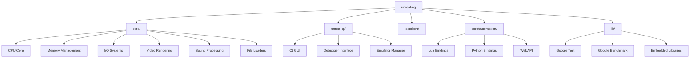
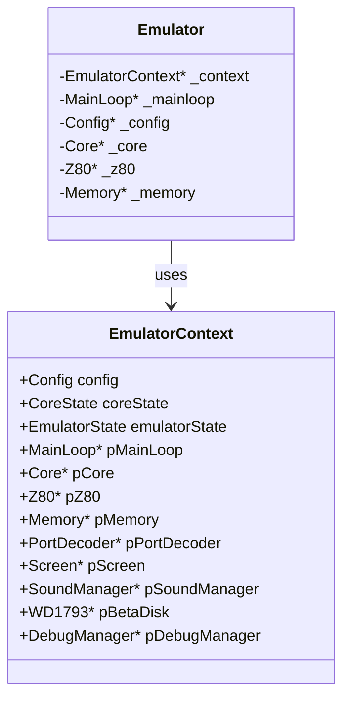
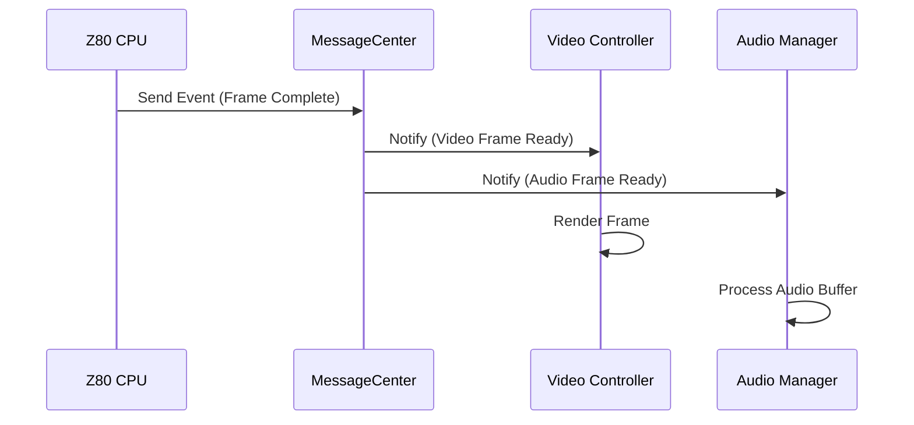
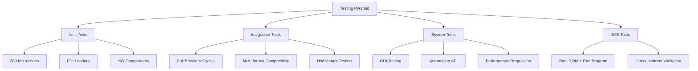
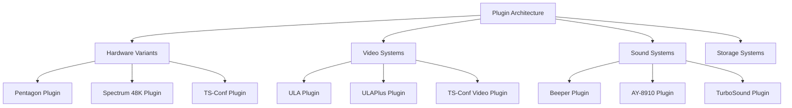
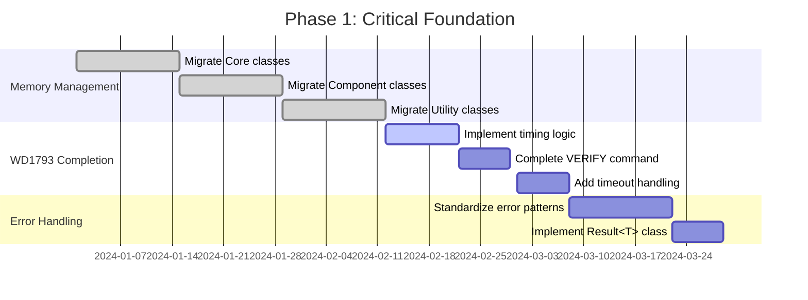
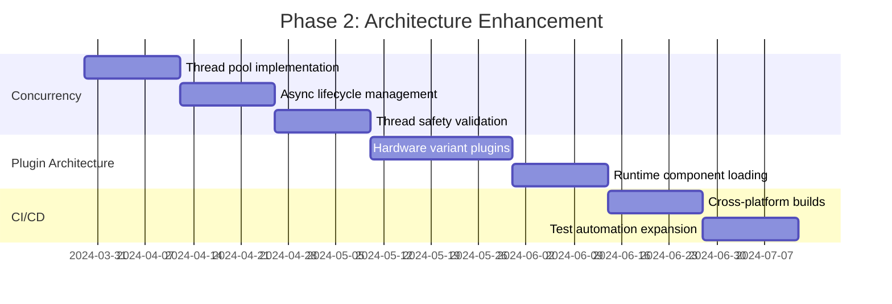
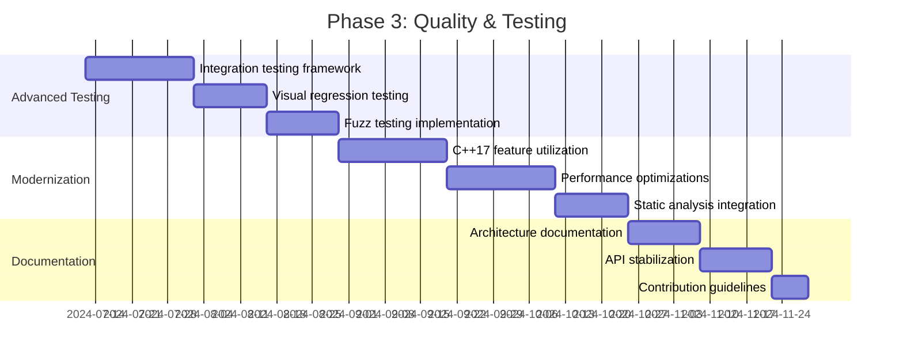

# Comprehensive Project Analysis: Unreal Speccy Emulator (unreal-ng)

## Executive Summary

The unreal-ng project is a sophisticated, cross-platform ZX Spectrum emulator targeting Pentagon 128K/512K and other clones, written in C++17. It features a well-designed modular architecture separating core emulation logic from user interfaces, with support for Windows, Linux, and macOS through CMake-based builds.

The codebase demonstrates solid architectural foundations but suffers from significant technical debt, particularly in memory management, incomplete critical components, and testing gaps. While the core emulation logic is mature and functional, modernization efforts are needed to ensure long-term maintainability and reliability.

## Architecture Overview

### High-Level Structure



The project maintains excellent separation of concerns with dedicated modules for each major component.

### Core Architecture Components

#### Dependency Injection Pattern
The `EmulatorContext` class acts as a central registry for components, enabling loose coupling:



#### Observer Pattern Implementation
The MessageCenter and EventQueue system provides decoupled inter-component communication:



### Build System & Dependencies

- **Modern CMake**: Hierarchical configuration with cross-platform compiler support
- **Submodule Management**: Reproducible dependency management for Google Test, Benchmark
- **Multi-configuration**: Debug/Release builds with appropriate compiler flags
- **Static Linking**: Platform-specific linking strategies for deployment

## Implementation Gaps & Code Quality Issues

### Critical Issues

#### 1. Memory Management (CRITICAL PRIORITY)

**Primary Issue**: Extensive use of manual memory management with raw pointers and manual `new`/`delete` operations.

**Evidence**:
- `Core::Release()` manually deletes component pointers
- `Screen::AllocateFramebuffer` uses `new uint8_t[]` and `delete[]`
- `ImageHelper` creates detached threads that manage buffer ownership manually
- Numerous raw pointer members throughout the codebase

**Risks**:
- Memory leaks during exception scenarios
- Double-free corruption
- Resource leaks in error paths
- Thread safety issues with shared ownership

**Recommended Solution**:
```cpp
// Current problematic pattern
class Core {
    PortDecoder* _portDecoder = nullptr;
    Screen* _screen = nullptr;
    SoundManager* _sound = nullptr;
    // ...
    ~Core() {
        delete _portDecoder;
        delete _screen;
        delete _sound;
        // Manual cleanup - error prone
    }
};

// Recommended modern pattern
class Core {
    std::unique_ptr<PortDecoder> _portDecoder;
    std::unique_ptr<Screen> _screen;
    std::unique_ptr<SoundManager> _sound;
    // Automatic cleanup, exception-safe, no manual memory management
};
```

#### 2. Incomplete Critical Components

**WD1793 Floppy Disk Controller** (HIGH PRIORITY):

**Missing Features**:
- Disk rotation timing logic ("index strobes should be set by disk rotation timings")
- VERIFY command implementation
- Timeout handling for various operations
- DRQ (Data Request) serve time timeout
- Proper error condition handling

**Impact**: Critical for disk-based software compatibility and reliability.

**Z80 CPU Implementation Gaps**:
- Some instructions need plugin-based refactoring
- Mixed manual/smart pointer usage in instruction handlers

**Memory System**:
- Incomplete extended port support
- Cache implementation gaps for certain hardware variants

**Video System**:
- TS-Conf components need plugin migration
- Inconsistent rendering pipeline for different video modes

#### 3. Concurrency Issues

**Detached Thread Management**:
```cpp
// Problematic current pattern in ImageHelper
std::thread([buffer = std::move(buffer)]() {
    // Async save operation
    delete[] buffer; // Manual cleanup in detached thread
}).detach(); // Fire and forget - no error handling
```

**Issues**:
- No error handling for async operations
- Difficult shutdown coordination
- Potential race conditions on shared data
- Resource leaks if thread fails

**Recommended Solution**:
```cpp
// Modern approach with proper lifecycle management
class ThreadPool {
public:
    std::future<void> submit(std::function<void()> task) {
        // Proper task management with return values
    }
};

// Usage
auto future = threadPool.submit([buffer = std::move(buffer)]() {
    // Async operation with proper error handling
    try {
        saveImage(buffer.get());
    } catch (const std::exception& e) {
        // Handle errors appropriately
    }
});
```

#### 4. Error Handling Inconsistencies

**Current Mixed Paradigms**:
- Some exceptions (`std::logic_error`)
- Boolean return codes for initialization
- Inconsistent error propagation
- Limited error context information

**Recommended Standardized Approach**:
```cpp
enum class EmulatorError {
    Success = 0,
    FileNotFound,
    InvalidFormat,
    HardwareNotSupported,
    MemoryAllocationFailed,
    InitializationFailed
};

class Result<T> {
private:
    std::variant<T, EmulatorError> data_;
    std::optional<std::string> error_message_;
    std::optional<std::source_location> location_;

public:
    static Result<T> success(T value) { /* ... */ }
    static Result<T> error(EmulatorError code, std::string message = "") { /* ... */ }

    bool is_success() const { return std::holds_alternative<T>(data_); }
    T& value() { return std::get<T>(data_); }
    EmulatorError error() const { return std::get<EmulatorError>(data_); }
};
```

### Code Quality Issues

#### Debug Code in Production
- Numerous debug print statements remain
- "Remove debug" TODOs throughout codebase
- Commented-out debug code affecting readability

#### Embedded Libraries Issues
- LodePNG contains many TODOs (external library)
- Potential security concerns with embedded code

#### C++17 Underutilization
- Limited use of modern C++ features despite C++17 requirement
- Manual memory management instead of smart pointers
- Raw loops instead of algorithms

## Testing Methodology Assessment

### Current Testing Infrastructure

**Coverage Statistics**:
- Test Code: ~12,357 lines
- Source Code: ~156,083 lines
- Coverage Ratio: ~7.9%

**Testing Frameworks**:
- Google Test for unit testing
- Google Benchmark for performance testing

**Current Test Categories**:
- Z80 CPU instruction testing (comprehensive)
- File format loaders (SNA, Z80, TAP, TZX, TRD, SCL)
- Hardware component testing (AY-8910, WD1793, port decoders)
- Basic emulator lifecycle tests
- Performance benchmarking

### Critical Testing Gaps

#### 1. Integration Testing Deficits


**Missing Areas**:
- End-to-end emulator testing (boot ROM → run program)
- GUI interaction testing for Qt frontend
- Automation API testing (Lua, Python, WebAPI)
- Cross-platform behavior validation

#### 2. FDC Testing Gaps
Given WD1793 complexity and incomplete implementation:
- Timing-dependent behavior not validated
- Error condition testing incomplete
- Disk image format compatibility testing limited

#### 3. CI/CD Limitations
**Current State**: Linux-only builds in GitHub Actions
**Missing**: Windows, macOS automated builds and testing

#### 4. Advanced Testing Missing
- **Visual Regression Testing**: Screenshot comparison against reference images
- **Fuzz Testing**: File format robustness against malformed inputs
- **Stress Testing**: Concurrent emulator instances, long-running stability
- **Memory Leak Detection**: Automated memory testing

## Comprehensive Recommendations

### Architectural Improvements

#### 1. Memory Management Modernization (Priority: Critical)
```cpp
// Migration strategy
class MigrationPlan {
public:
    // Phase 1: Core classes
    void migrate_core_classes() {
        // Emulator, Core, EmulatorContext
        // Replace raw pointers with unique_ptr
    }

    // Phase 2: Component classes
    void migrate_component_classes() {
        // Screen, SoundManager, PortDecoder
        // Implement proper ownership semantics
    }

    // Phase 3: Utility classes
    void migrate_utility_classes() {
        // ImageHelper, file loaders
        // Thread-safe resource management
    }
};
```

#### 2. Error Handling Standardization
Implement consistent error handling across all components with proper error propagation and context information.

#### 3. Plugin Architecture Enhancement


Benefits:
- Runtime hardware variant selection
- Reduced binary size for specific configurations
- Easier maintenance and extension
- Better separation of concerns

### Implementation Fixes

#### WD1793 Completion Strategy (Priority: High)
1. **Timing Implementation**: Implement proper disk rotation timing
2. **Command Completion**: Finish VERIFY and other missing commands
3. **Timeout Handling**: Add comprehensive timeout logic
4. **Error Conditions**: Implement proper error state handling
5. **Testing**: Add comprehensive FDC testing suite

#### Concurrency Stabilization
- Replace detached threads with managed thread pools
- Implement proper async task lifecycle management
- Add thread sanitizer integration to CI/CD

#### C++17 Modernization
```cpp
// Before: Manual optional handling
bool loadFile(const std::string& path, std::string* content) {
    if (/* file exists */) {
        *content = /* read content */;
        return true;
    }
    return false;
}

// After: Modern optional usage
std::optional<std::string> loadFile(const std::string& path) {
    if (/* file exists */) {
        return /* read content */;
    }
    return std::nullopt;
}
```

### Testing Strategy Enhancement

#### CI/CD Pipeline Expansion
```yaml
# .github/workflows/cmake-ci.yml
name: Build and Test
on: [push, pull_request]

jobs:
  build:
    strategy:
      matrix:
        os: [ubuntu-latest, windows-latest, macos-latest]
        compiler: [gcc, clang, msvc]
        config: [Debug, Release]
        exclude:
          - os: windows-latest
            compiler: gcc
          - os: macos-latest
            compiler: msvc

    runs-on: ${{ matrix.os }}

    steps:
    - uses: actions/checkout@v3
      with:
        submodules: recursive

    - name: Configure CMake
      run: cmake -B build -DCMAKE_BUILD_TYPE=${{ matrix.config }}

    - name: Build
      run: cmake --build build --config ${{ matrix.config }}

    - name: Test
      run: ctest --test-dir build --output-on-failure
```

#### Advanced Testing Implementation

**1. Visual Regression Testing**:
```cpp
class VisualRegressionTest : public ::testing::Test {
protected:
    void compareFramebuffers(const uint8_t* actual, const uint8_t* expected,
                           size_t width, size_t height) {
        // Implement perceptual image comparison
        // Account for acceptable differences in rendering
    }
};
```

**2. Integration Testing Framework**:
```cpp
class EmulatorIntegrationTest : public ::testing::Test {
protected:
    std::unique_ptr<Emulator> emulator;
    TestRomLoader romLoader;
    MockAudioCallback audioCallback;
    MockVideoRenderer videoRenderer;

    void SetUp() override {
        emulator = std::make_unique<Emulator>();
        // Setup test environment
    }

    void test_full_boot_cycle() {
        // Load ROM, boot, run test program, verify output
    }
};
```

**3. Fuzz Testing Setup**:
```cpp
extern "C" int LLVMFuzzerTestOneInput(const uint8_t* data, size_t size) {
    // Test file format parsers with fuzzed input
    try {
        auto loader = createLoaderForFormat(data, size);
        loader->loadFromMemory(data, size);
    } catch (const std::exception&) {
        // Expected for invalid input
    }
    return 0;
}
```

## Prioritized Implementation Roadmap

### Phase 1: Critical Foundation (1-2 months)


### Phase 2: Architecture Enhancement (2-3 months)


### Phase 3: Quality & Testing (3-6 months)


## Risk Assessment & Mitigation

### High Risk Issues
1. **Memory Management**: Potential crashes, data corruption, security vulnerabilities
   - **Mitigation**: Immediate smart pointer migration, static analysis tools

2. **WD1793 Incomplete Implementation**: Affects core functionality for disk-based software
   - **Mitigation**: Prioritize FDC completion with comprehensive testing

### Medium Risk Issues
3. **Concurrency Issues**: Race conditions, resource leaks in multi-threaded scenarios
   - **Mitigation**: Thread pool implementation, sanitizer integration

4. **Testing Gaps**: Regressions may go undetected
   - **Mitigation**: CI/CD pipeline expansion, advanced testing implementation

### Low-Medium Risk Issues
5. **Cross-platform Compatibility**: Platform-specific bugs may be missed
   - **Mitigation**: Automated cross-platform testing

6. **Code Quality**: Technical debt accumulation
   - **Mitigation**: Code quality tools, modernization efforts

## Success Metrics

### Technical Metrics
- **Memory Safety**: Zero memory leaks in CI/CD pipeline
- **Test Coverage**: Achieve 80%+ code coverage for critical paths
- **Build Stability**: All platforms building successfully in CI/CD
- **Performance**: No performance regressions in benchmarks

### Quality Metrics
- **Maintainability**: Reduced technical debt (measured by static analysis scores)
- **Reliability**: Reduced bug reports through comprehensive testing
- **Extensibility**: Plugin architecture enables easy hardware variant addition
- **Developer Experience**: Improved build times and debugging capabilities

## Conclusion

The unreal-ng project has a solid architectural foundation with mature emulation logic, but requires significant modernization to address technical debt and ensure long-term maintainability. The prioritized roadmap provides a clear path forward, focusing first on critical issues like memory management and incomplete components, then moving to architectural enhancements and comprehensive testing.

Successful implementation of these recommendations will result in a more robust, maintainable, and extensible ZX Spectrum emulator that can serve the retro computing community for years to come.

---

**Document Version**: 1.0
**Last Updated**: November 21, 2025
**Analysis Tools Used**: Static code analysis, manual code review, architectural pattern analysis
**Coverage**: Core architecture, implementation quality, testing methodology, improvement recommendations
