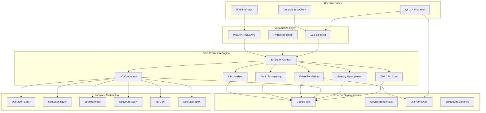
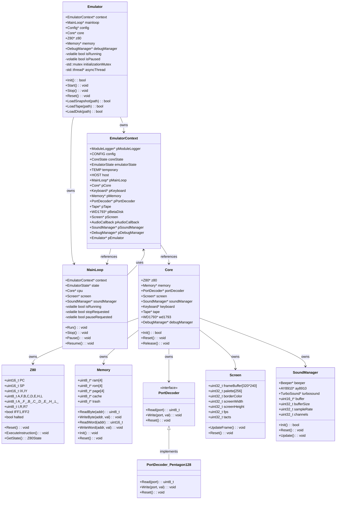
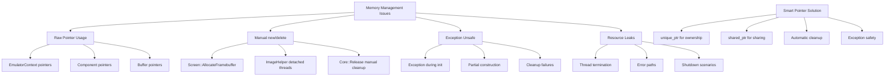
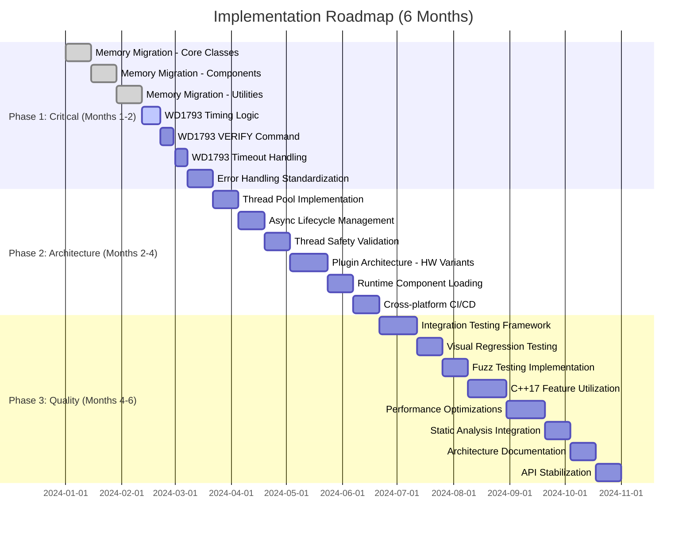

# Architecture Overview Diagrams

## High-Level System Architecture



## Component Dependency Diagram



## Memory Management Issues



## Testing Strategy Pyramid

```mermaid
graph TD
    A[Testing Strategy] --> B[Unit Tests<br/>~60% of tests]
    A --> C[Integration Tests<br/>~20% of tests]
    A --> D[System Tests<br/>~15% of tests]
    A --> E[E2E Tests<br/>~5% of tests]

    B --> B1[Z80 Instructions]
    B --> B2[File Format Loaders]
    B --> B3[Hardware Components]
    B --> B4[Utility Functions]

    C --> C1[Full Emulator Cycles]
    C --> C2[Component Integration]
    C --> C3[Multi-format Testing]
    C --> C4[Hardware Variant Testing]

    D --> D1[GUI Interaction]
    D --> D2[Automation APIs]
    D --> D3[Performance Regression]
    D --> D4[Memory Leak Detection]

    E --> E1[Boot to BASIC]
    E --> E2[Run Commercial Software]
    E --> E3[Cross-platform Validation]
    E --> E4[Long-running Stability]

    F[Test Infrastructure] --> G[Google Test Framework]
    F --> H[Google Benchmark]
    F --> I[CI/CD Pipeline]
    F --> J[Coverage Reporting]

    G --> B
    G --> C
    G --> D
    G --> E

    H --> I

    I --> J
```



## WD1793 Floppy Controller Issues

```mermaid
stateDiagram-v2
    [*] --> Idle: Controller Reset
    Idle --> Command: Command Received
    Command --> ReadSector: READ SECTOR
    Command --> WriteSector: WRITE SECTOR
    Command --> ReadTrack: READ TRACK
    Command --> WriteTrack: WRITE TRACK
    Command --> ReadAddr: READ ADDRESS
    Command --> ReadTrack: FORCE INTERRUPT
    Command --> Seek: SEEK
    Command --> Recalibrate: RECALIBRATE

    ReadSector --> Searching: Find Sector
    Searching --> Reading: Sector Found
    Reading --> Complete: Sector Read
    Reading --> Error: Read Error

    WriteSector --> Searching
    Searching --> Writing: Sector Found
    Writing --> Complete: Sector Written
    Writing --> Error: Write Error

    note right of Searching : MISSING: Disk rotation timing\nTODO: index strobes timing
    note right of ReadSector : MISSING: VERIFY command\nTODO: implement VERIFY
    note right of Writing : MISSING: timeout handling\nTODO: DRQ serve timeout

    Complete --> Idle: Operation Complete
    Error --> Idle: Error Handling

    Seek --> Seeking: Start Seek
    Seeking --> Complete: Track Found
    Seeking --> Error: Seek Error

    Recalibrate --> Seeking

    ReadAddr --> ReadingAddress: Read Address
    ReadingAddress --> Complete: Address Read

    ReadTrack --> ReadingTrack: Read Track
    ReadingTrack --> Complete: Track Read

    WriteTrack --> WritingTrack: Write Track
    WritingTrack --> Complete: Track Written
```

## Implementation Roadmap Timeline


