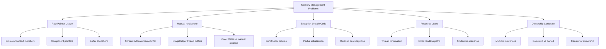
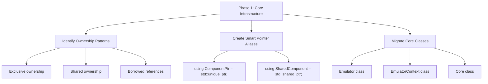
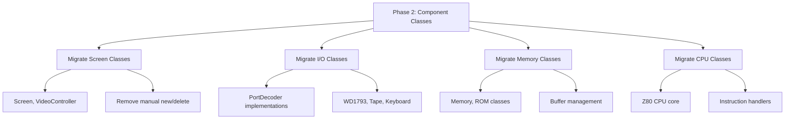
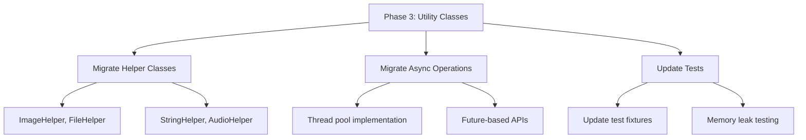
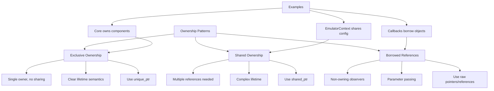
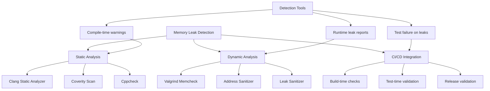
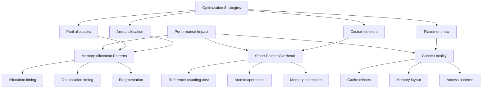

# Memory Management Analysis & Modernization

## Current Memory Management Issues



## Specific Problem Areas

### Core Class Memory Management

```cpp
// CURRENT: Problematic manual memory management
class Core {
private:
    PortDecoder* _portDecoder = nullptr;    // Raw pointer - manual cleanup needed
    Screen* _screen = nullptr;              // Raw pointer - manual cleanup needed
    SoundManager* _sound = nullptr;         // Raw pointer - manual cleanup needed
    Keyboard* _keyboard = nullptr;          // Raw pointer - manual cleanup needed
    Tape* _tape = nullptr;                  // Raw pointer - manual cleanup needed
    WD1793* _wd1793 = nullptr;              // Raw pointer - manual cleanup needed
    DebugManager* _debugManager = nullptr;  // Raw pointer - manual cleanup needed

public:
    bool Init() {
        // Complex initialization with potential failure points
        _portDecoder = new PortDecoder_Pentagon128();
        _screen = new Screen();
        _sound = new SoundManager();
        // ... more allocations

        // If any allocation fails here, we have partial initialization
        if (!_screen->Init()) {
            return false;  // Leak: _portDecoder, _sound already allocated
        }

        return true;
    }

    void Release() {
        // Manual cleanup - error prone and repetitive
        delete _portDecoder; _portDecoder = nullptr;
        delete _screen; _screen = nullptr;
        delete _sound; _sound = nullptr;
        delete _keyboard; _keyboard = nullptr;
        delete _tape; _tape = nullptr;
        delete _wd1793; _wd1793 = nullptr;
        delete _debugManager; _debugManager = nullptr;
    }
};
```

### Screen Framebuffer Allocation

```cpp
// CURRENT: Manual buffer management
class Screen {
private:
    uint8_t* _frameBuffer = nullptr;  // Raw pointer to buffer

public:
    bool AllocateFramebuffer(size_t size) {
        _frameBuffer = new uint8_t[size];  // Manual allocation
        return _frameBuffer != nullptr;
    }

    ~Screen() {
        delete[] _frameBuffer;  // Manual cleanup - exception unsafe
    }
};
```

### ImageHelper Detached Threads

```cpp
// CURRENT: Dangerous detached thread pattern
class ImageHelper {
public:
    static void SaveScreenshotAsync(uint8_t* buffer, size_t size) {
        // Transfer ownership to detached thread
        std::thread([buffer = buffer, size]() {  // Copy raw pointer
            // Async save operation
            SaveImage(buffer, size);
            delete[] buffer;  // Manual cleanup in thread - dangerous
        }).detach();  // Fire and forget - no error handling
    }
};
```

## Recommended Smart Pointer Solution

### Core Class Modernization

```cpp
// RECOMMENDED: Smart pointer modernization
class Core {
private:
    std::unique_ptr<PortDecoder> _portDecoder;      // Exclusive ownership
    std::unique_ptr<Screen> _screen;                // Exclusive ownership
    std::unique_ptr<SoundManager> _sound;           // Exclusive ownership
    std::unique_ptr<Keyboard> _keyboard;            // Exclusive ownership
    std::unique_ptr<Tape> _tape;                    // Exclusive ownership
    std::unique_ptr<WD1793> _wd1793;                // Exclusive ownership
    std::unique_ptr<DebugManager> _debugManager;    // Exclusive ownership

public:
    bool Init() {
        try {
            // Exception-safe initialization
            _portDecoder = std::make_unique<PortDecoder_Pentagon128>();
            _screen = std::make_unique<Screen>();
            _sound = std::make_unique<SoundManager>();

            // If any initialization fails, smart pointers automatically clean up
            if (!_screen->Init()) {
                return false;  // All previously allocated objects automatically destroyed
            }

            return true;
        } catch (const std::exception&) {
            // All allocations automatically cleaned up on exception
            return false;
        }
    }

    // No manual Release() needed - destructor handles cleanup automatically
};
```

### Screen Framebuffer Modernization

```cpp
// RECOMMENDED: Smart pointer buffer management
class Screen {
private:
    std::unique_ptr<uint8_t[]> _frameBuffer;  // Smart pointer to buffer
    size_t _bufferSize = 0;

public:
    bool AllocateFramebuffer(size_t size) {
        _frameBuffer = std::make_unique<uint8_t[]>(size);
        _bufferSize = size;
        return _frameBuffer != nullptr;
    }

    // No manual destructor needed - unique_ptr handles cleanup automatically
    // Exception-safe, no memory leaks
};
```

### Thread-Safe Resource Management

```cpp
// RECOMMENDED: Proper async resource management
class ImageHelper {
private:
    static std::shared_ptr<ThreadPool> _threadPool;  // Managed thread pool

public:
    static std::future<bool> SaveScreenshotAsync(std::unique_ptr<uint8_t[]> buffer, size_t size) {
        // Return future for proper lifecycle management
        return _threadPool->submit([buffer = std::move(buffer), size]() mutable {
            try {
                SaveImage(buffer.get(), size);
                return true;  // Success
            } catch (const std::exception&) {
                return false;  // Error occurred
            }
            // buffer automatically destroyed when lambda exits
        });
    }
};
```

## Screen Framebuffer Allocation - Detailed Fix

### Current Problematic Implementation

```cpp
// CURRENT: Manual buffer management
class Screen {
private:
    uint8_t* _frameBuffer = nullptr;  // Raw pointer to buffer

public:
    bool AllocateFramebuffer(size_t size) {
        _frameBuffer = new uint8_t[size];  // Manual allocation
        return _frameBuffer != nullptr;
    }

    ~Screen() {
        delete[] _frameBuffer;  // Manual cleanup - exception unsafe
    }
};
```

**Critical Issues:**
1. **Exception Unsafe**: If any code after `new uint8_t[size]` throws an exception, the allocated memory leaks
2. **Manual Memory Management**: Requires explicit `delete[]` in destructor
3. **Resource Ownership Confusion**: Raw pointer doesn't indicate ownership semantics
4. **Double-Free Risk**: If object is copied/moved incorrectly, could lead to double deletion

### Recommended Solution: Smart Pointer Migration

#### Use `std::unique_ptr<uint8_t[]>` for Exclusive Ownership

```cpp
// RECOMMENDED: Modern smart pointer approach
class Screen {
private:
    std::unique_ptr<uint8_t[]> _frameBuffer;  // Smart pointer owns the buffer
    size_t _bufferSize = 0;                   // Track size for bounds checking

public:
    // Exception-safe allocation
    bool AllocateFramebuffer(size_t size) {
        try {
            _frameBuffer = std::make_unique<uint8_t[]>(size);
            _bufferSize = size;
            return true;
        } catch (const std::bad_alloc&) {
            _bufferSize = 0;
            return false;  // Allocation failed, no memory to clean up
        }
    }

    // No manual destructor needed - unique_ptr handles cleanup automatically
    // ~Screen() = default; // Compiler-generated destructor calls unique_ptr destructor

    // Optional: Provide safe access methods
    uint8_t* GetBuffer() const noexcept { return _frameBuffer.get(); }
    size_t GetBufferSize() const noexcept { return _bufferSize; }

    // Optional: Bounds-checked access
    uint8_t& At(size_t index) {
        if (index >= _bufferSize) {
            throw std::out_of_range("Framebuffer index out of bounds");
        }
        return _frameBuffer[index];
    }
};
```

### Key Benefits of This Approach

1. **Exception Safety**: If `std::make_unique<uint8_t[]>` succeeds, ownership is safely transferred. If it fails, no cleanup needed.

2. **Automatic Resource Management**: `std::unique_ptr` automatically calls `delete[]` when the object is destroyed, moved, or goes out of scope.

3. **No Manual Destructor**: The compiler-generated destructor properly cleans up the smart pointer.

4. **Clear Ownership Semantics**: `unique_ptr` indicates exclusive ownership - only one object can own the buffer at a time.

5. **Move Semantics**: The class can be moved efficiently without copying the buffer.

### Alternative: Custom Deleter for Specialized Allocation

If you need custom allocation (e.g., aligned memory, specific allocators):

```cpp
// For custom allocation patterns
class Screen {
private:
    std::unique_ptr<uint8_t, decltype(&std::free)> _frameBuffer{nullptr, &std::free};
    size_t _bufferSize = 0;

public:
    bool AllocateFramebuffer(size_t size) {
        // Use custom allocation if needed
        void* ptr = std::malloc(size);  // or _aligned_malloc(size, alignment)
        if (!ptr) {
            _bufferSize = 0;
            return false;
        }

        _frameBuffer.reset(static_cast<uint8_t*>(ptr));
        _bufferSize = size;
        return true;
    }
};
```

### Implementation Steps for Screen Class

1. **Include Headers**: Add `#include <memory>` to the header file.

2. **Update Member Variables**:
   - Change `uint8_t* _frameBuffer = nullptr;` to `std::unique_ptr<uint8_t[]> _frameBuffer;`
   - Add `size_t _bufferSize = 0;` for size tracking

3. **Update Allocation Method**:
   - Use `std::make_unique<uint8_t[]>(size)` instead of `new uint8_t[size]`
   - Handle allocation failure gracefully
   - Set `_bufferSize` on success

4. **Remove Manual Destructor**:
   - Delete the `~Screen()` method entirely
   - Let the compiler generate it automatically

5. **Update Access Patterns**:
   - Change direct pointer access to `_frameBuffer.get()` when needed
   - Add bounds checking methods if appropriate

6. **Update Move/Copy Semantics**:
   - Ensure the class properly supports move operations
   - Consider deleting copy constructor/assignment if buffer ownership should be exclusive

### Testing Considerations

After implementing this change, add tests to verify:

```cpp
// Example test cases to add
TEST(ScreenTest, AllocationSuccess) {
    Screen screen;
    EXPECT_TRUE(screen.AllocateFramebuffer(1024));
    EXPECT_EQ(screen.GetBufferSize(), 1024);
    EXPECT_NE(screen.GetBuffer(), nullptr);
}

TEST(ScreenTest, AllocationFailure) {
    Screen screen;
    // Simulate allocation failure by requesting huge amount
    EXPECT_FALSE(screen.AllocateFramebuffer(std::numeric_limits<size_t>::max()));
}

TEST(ScreenTest, ExceptionSafety) {
    Screen screen;
    // Verify no leaks if exceptions occur after allocation
    EXPECT_TRUE(screen.AllocateFramebuffer(1024));
    // If any subsequent operations throw, memory should be cleaned up
}
```

### Migration Benefits

- **Zero Memory Leaks**: RAII ensures cleanup in all code paths
- **Exception Safety**: No resource leaks even when exceptions occur
- **Simplified Code**: No manual destructor or cleanup logic
- **Better Performance**: No overhead compared to manual management
- **Thread Safety**: Smart pointers are thread-safe for the ownership operations
- **Modern C++**: Uses current best practices and standard library features

This approach follows the C++ Core Guidelines principle of "no naked `new`" and ensures your framebuffer allocation is robust, safe, and maintainable.

## Migration Strategy

### Phase 1: Core Infrastructure (Week 1-2)



### Phase 2: Component Classes (Week 3-4)



### Phase 3: Utility Classes (Week 5-6)



## Ownership Pattern Analysis



## Exception Safety Analysis

### Current Exception Unsafe Code

```cpp
// PROBLEMATIC: Exception unsafe initialization
bool Emulator::Init() {
    _context = new EmulatorContext();  // Allocation
    _mainloop = new MainLoop(_context);  // Allocation - can throw
    _config = new Config();  // If this throws, _context and _mainloop leak

    if (!_context->Init()) {  // Failure path
        return false;  // Memory leak: objects allocated but not cleaned up
    }

    return true;
}
```

### Recommended Exception Safe Code

```cpp
// SAFE: Exception safe with smart pointers
bool Emulator::Init() {
    try {
        _context = std::make_unique<EmulatorContext>();
        _mainloop = std::make_unique<MainLoop>(_context.get());  // Pass raw pointer for borrowing
        _config = std::make_unique<Config>();

        if (!_context->Init()) {
            return false;  // All allocations automatically cleaned up
        }

        return true;
    } catch (const std::exception&) {
        // All partially constructed objects automatically destroyed
        return false;
    }
}
```

## Memory Leak Detection Strategy



## Performance Impact Assessment



## Migration Checklist

- [ ] Analyze current ownership patterns
- [ ] Identify exception unsafe code paths
- [ ] Create smart pointer type aliases
- [ ] Implement custom deleters for platform resources
- [ ] Migrate core infrastructure classes
- [ ] Update component classes
- [ ] Refactor async operations
- [ ] Update test fixtures
- [ ] Add memory leak detection
- [ ] Performance testing and optimization
- [ ] Documentation updates
- [ ] Code review and validation

## Success Metrics

1. **Zero Memory Leaks**: All CI/CD builds pass leak detection
2. **Exception Safety**: No resource leaks in exception paths
3. **Performance**: No degradation in emulator performance
4. **Maintainability**: Reduced manual memory management code
5. **Reliability**: Fewer crashes due to memory corruption

## Risk Mitigation

1. **Incremental Migration**: Migrate components one at a time
2. **Comprehensive Testing**: Memory leak tests for each migrated component
3. **Performance Monitoring**: Benchmark before/after each migration phase
4. **Code Review**: Peer review of all memory management changes
5. **Rollback Plan**: Ability to revert changes if issues arise
