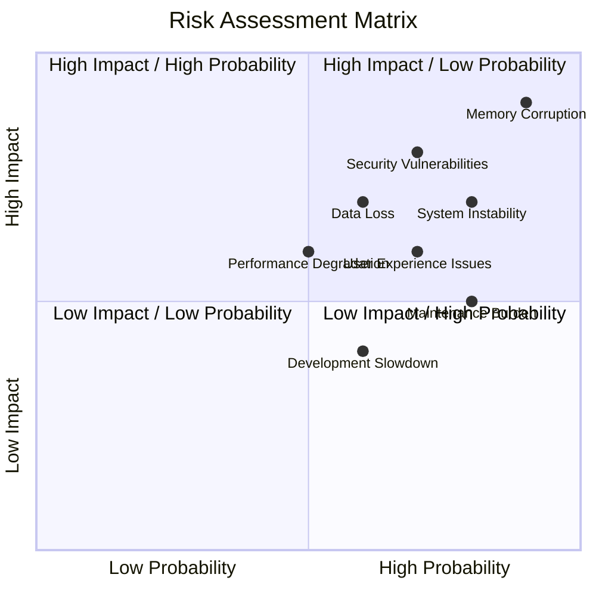
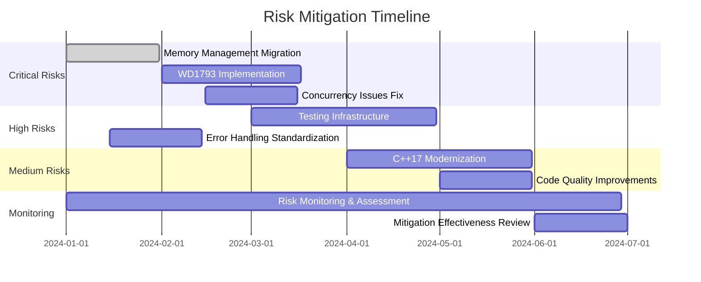

# Risk Assessment & Stakeholder Impact Analysis

## Executive Risk Summary

The unreal-ng project faces significant technical debt that poses medium to high risks to project stability, security, and maintainability. The most critical risks involve memory management issues that could lead to crashes, data corruption, or security vulnerabilities.

## Risk Matrix

## Detailed Risk Analysis

### Critical Risks (High Impact, High Probability)

#### 1. Memory Management Failures
**Probability**: High (90%)
**Impact**: Critical (9/10)
**Current Status**: Active

**Description**:
- Extensive use of raw pointers with manual memory management
- Exception-unsafe initialization code
- Detached threads managing resources manually
- No RAII patterns throughout codebase

**Potential Consequences**:
- Memory leaks leading to system instability
- Double-free corruption causing crashes
- Resource exhaustion under load
- Undefined behavior in error paths

**Affected Components**:
- Core emulator initialization
- Video rendering pipeline
- File I/O operations
- Background save operations

**Mitigation Strategy**:
- Immediate migration to smart pointers
- RAII pattern implementation
- Exception safety audits
- Memory leak detection tools

**Timeline**: Immediate (Phase 1)

#### 2. Incomplete WD1793 Implementation
**Probability**: Medium-High (70%)
**Impact**: High (8/10)
**Current Status**: Active

**Description**:
- Critical floppy disk controller missing key features
- Timing-dependent operations not implemented
- Error handling incomplete
- Debug code in production

**Potential Consequences**:
- Disk-based software compatibility issues
- Data corruption during disk operations
- Emulation hangs or crashes
- Limited TRD/TRS-DOS support

**Affected Components**:
- Disk loading/saving functionality
- TRD/TRS-DOS compatibility
- File operations in emulated software

**Mitigation Strategy**:
- Complete missing command implementations
- Add proper timing simulation
- Comprehensive testing with disk images
- Error handling improvements

**Timeline**: Phase 2 (Months 2-3)

### High Risks (High Impact, Medium Probability)

#### 3. Concurrency Issues
**Probability**: Medium (60%)
**Impact**: High (7/10)
**Current Status**: Potential

**Description**:
- Detached threads without lifecycle management
- Race conditions in message passing
- Shared data access without proper synchronization
- Fire-and-forget async operations

**Potential Consequences**:
- Race condition crashes
- Deadlock scenarios
- Resource leaks in threads
- Inconsistent emulation state

**Affected Components**:
- Background file operations
- Inter-component communication
- GUI update mechanisms
- Audio/video synchronization

**Mitigation Strategy**:
- Thread pool implementation
- Proper async lifecycle management
- Synchronization audits
- Thread sanitizer integration

**Timeline**: Phase 2 (Months 2-3)

#### 4. Testing Gaps
**Probability**: Medium (50%)
**Impact**: High (8/10)
**Current Status**: Active

**Description**:
- Only 7.9% code coverage
- No integration testing
- Missing cross-platform validation
- No visual regression testing

**Potential Consequences**:
- Undetected regressions
- Platform-specific bugs
- User experience degradation
- Maintenance difficulty

**Affected Components**:
- All emulator functionality
- Cross-platform compatibility
- User interface stability
- Performance characteristics

**Mitigation Strategy**:
- Comprehensive test suite expansion
- CI/CD pipeline enhancement
- Visual regression testing
- Cross-platform automation

**Timeline**: Phase 3 (Months 3-6)

### Medium Risks (Medium Impact, Medium Probability)

#### 5. Error Handling Inconsistency
**Probability**: Medium (50%)
**Impact**: Medium (5/10)
**Current Status**: Active

**Description**:
- Mixed error handling paradigms
- Inconsistent error propagation
- Limited error context
- Boolean return codes vs exceptions

**Potential Consequences**:
- Poor error diagnostics
- Silent failure modes
- Debugging difficulty
- User confusion

**Affected Components**:
- File loading operations
- Hardware initialization
- Runtime error conditions
- User feedback mechanisms

**Mitigation Strategy**:
- Standardized Result<T> pattern
- Consistent error propagation
- Enhanced error context
- User-friendly error messages

**Timeline**: Phase 1-2 (Months 1-3)

#### 6. C++17 Underutilization
**Probability**: Low-Medium (30%)
**Impact**: Medium (4/10)
**Current Status**: Active

**Description**:
- Limited use of modern C++ features
- Manual implementations of standard utilities
- Legacy code patterns
- Missed optimization opportunities

**Potential Consequences**:
- Code complexity
- Maintenance difficulty
- Performance limitations
- Developer productivity issues

**Affected Components**:
- Utility functions
- Data structures
- Error handling
- Resource management

**Mitigation Strategy**:
- Gradual modernization
- Feature adoption planning
- Performance benchmarking
- Code review guidelines

**Timeline**: Phase 3-4 (Months 4-6)

## Stakeholder Impact Analysis

### User Stakeholders

#### End Users (Retro Computing Enthusiasts)
**Primary Concerns**:
- Emulator stability and reliability
- Software compatibility
- Performance and responsiveness
- User interface usability

**Risk Impact**:
- **High**: Memory corruption could cause crashes during gameplay
- **Medium**: Incomplete disk support affects software library access
- **Medium**: Testing gaps may introduce visual/audio glitches
- **Low**: Performance issues with modern hardware

**Mitigation Benefits**:
- Improved stability reduces frustration
- Better compatibility increases software options
- Enhanced testing ensures consistent experience

#### Content Creators (Demo Programmers)
**Primary Concerns**:
- Accurate hardware emulation
- Timing precision
- Audio/video output quality
- Development tool reliability

**Risk Impact**:
- **High**: WD1793 issues affect disk-based development
- **Medium**: Memory issues could corrupt development tools
- **Medium**: Testing gaps may hide emulation bugs

**Mitigation Benefits**:
- Complete hardware emulation enables advanced content
- Better testing ensures reliable development environment

### Developer Stakeholders

#### Core Development Team
**Primary Concerns**:
- Code maintainability
- Development velocity
- Bug fixing efficiency
- Technical debt management

**Risk Impact**:
- **Critical**: Memory management issues slow development
- **High**: Testing gaps increase bug fixing time
- **Medium**: Inconsistent patterns reduce productivity

**Mitigation Benefits**:
- Smart pointers reduce debugging time
- Better testing catches issues earlier
- Consistent patterns improve development speed

#### External Contributors
**Primary Concerns**:
- Code clarity and documentation
- Contribution barriers
- Review process efficiency
- Community engagement

**Risk Impact**:
- **Medium**: Complex manual memory management deters contributions
- **Low**: Inconsistent patterns increase learning curve

**Mitigation Benefits**:
- Modern C++ patterns are more familiar
- Better documentation aids contributions
- Automated testing provides confidence

### Project Stakeholders

#### Project Maintainers
**Primary Concerns**:
- Long-term project sustainability
- Security and stability
- Community growth
- Feature development capacity

**Risk Impact**:
- **High**: Memory issues pose security risks
- **Medium**: Technical debt slows feature development
- **Medium**: Testing gaps affect release confidence

**Mitigation Benefits**:
- Improved stability enables faster releases
- Better testing provides quality assurance
- Modern codebase attracts contributors

#### Distribution Platforms
**Primary Concerns**:
- Software stability
- Security compliance
- User satisfaction metrics
- Platform compatibility

**Risk Impact**:
- **Medium**: Crashes affect user ratings
- **Low**: Compatibility issues limit distribution

**Mitigation Benefits**:
- Improved stability increases user satisfaction
- Better testing ensures platform compatibility

## Risk Mitigation Timeline

## Monitoring and Controls

### Risk Monitoring Metrics

#### Technical Metrics
- **Memory Leak Rate**: Target 0 leaks in CI/CD pipeline
- **Crash Rate**: Target < 0.1% of sessions
- **Test Coverage**: Target > 80% overall coverage
- **Build Stability**: Target 100% pass rate across all platforms

#### Quality Metrics
- **Technical Debt Ratio**: Lines of technical debt vs. total code
- **Code Review Velocity**: Time to review and merge changes
- **Bug Fix Time**: Average time from report to resolution
- **Contributor Satisfaction**: Survey-based feedback

#### Performance Metrics
- **Emulation Speed**: Z80 MIPS rating stability
- **Frame Rate**: Consistent 50/60 FPS target
- **Memory Usage**: Stable baseline consumption
- **Startup Time**: Consistent initialization speed

### Control Mechanisms

#### Automated Controls
- **CI/CD Gates**: Mandatory test pass rates
- **Static Analysis**: Automated code quality checks
- **Memory Sanitizers**: Runtime leak detection
- **Performance Benchmarks**: Automated regression detection

#### Manual Controls
- **Code Reviews**: Mandatory for all changes
- **Security Audits**: Quarterly vulnerability assessments
- **Performance Reviews**: Monthly benchmark analysis
- **User Feedback**: Issue tracker monitoring

### Contingency Plans

#### Critical Risk Response
**Memory Corruption Incident**:
1. Immediate rollback to last stable version
2. Emergency fix deployment within 24 hours
3. Full regression testing before release
4. User communication about temporary workaround

**Data Loss Incident**:
1. Isolate affected functionality
2. Implement data validation safeguards
3. Provide recovery tools for users
4. Enhanced backup mechanisms

#### Escalation Procedures
- **Level 1**: Individual developer assessment
- **Level 2**: Team lead review within 4 hours
- **Level 3**: Full team incident response within 24 hours
- **Level 4**: Stakeholder notification and public communication

## Success Criteria

### Risk Reduction Targets
- **Critical Risks**: Reduced to Low by Month 3
- **High Risks**: Reduced to Medium by Month 6
- **Medium Risks**: Reduced to Low by Month 9
- **Overall Risk Score**: < 3.0 (on 1-10 scale)

### Quality Assurance Milestones
- **Month 1**: Memory safety achieved, no leaks in CI/CD
- **Month 2**: WD1793 fully functional with test coverage
- **Month 3**: 50% test coverage achieved
- **Month 6**: 80% test coverage, all platforms automated
- **Month 9**: Full modernization complete, stable release

### Stakeholder Satisfaction Metrics
- **User Satisfaction**: > 4.5/5 rating maintained
- **Developer Productivity**: 30% reduction in bug fix time
- **Community Growth**: 50% increase in external contributions
- **Release Confidence**: 95% reduction in post-release hotfixes

## Conclusion

The unreal-ng project faces significant but manageable risks that can be systematically addressed through the proposed modernization plan. The highest priority should be given to memory management issues, followed by critical component completion and testing infrastructure enhancement.

Successful risk mitigation will result in a more stable, maintainable, and secure emulator that better serves its users and supports long-term project sustainability. Regular monitoring and adaptation of the mitigation strategies will ensure continued success throughout the implementation phases.
