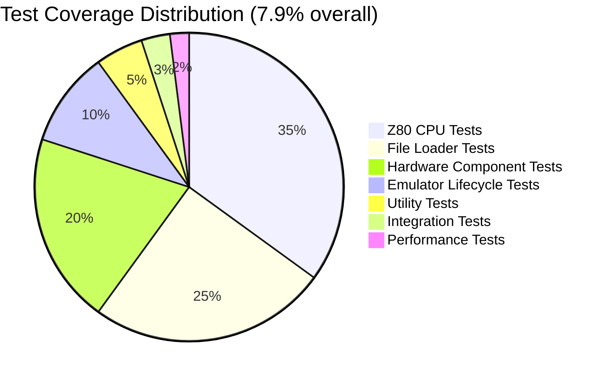
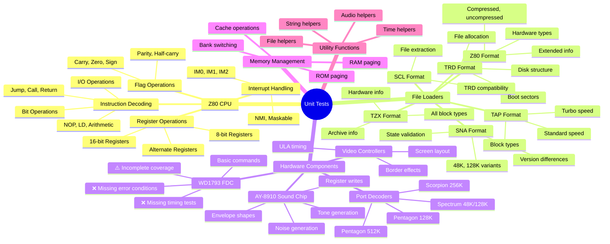
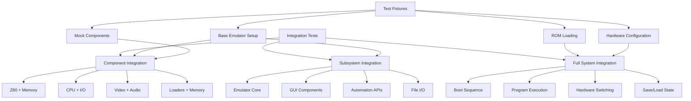
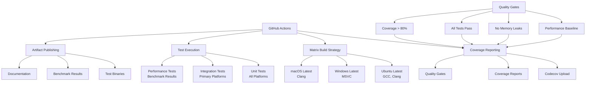
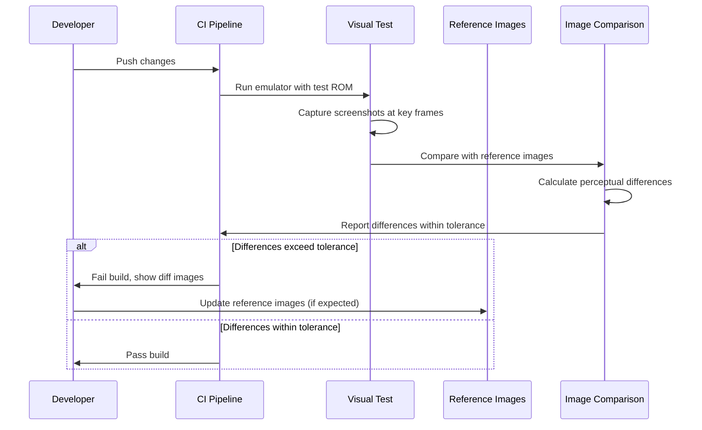
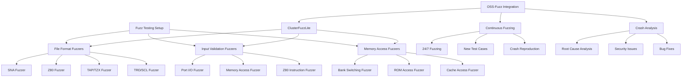
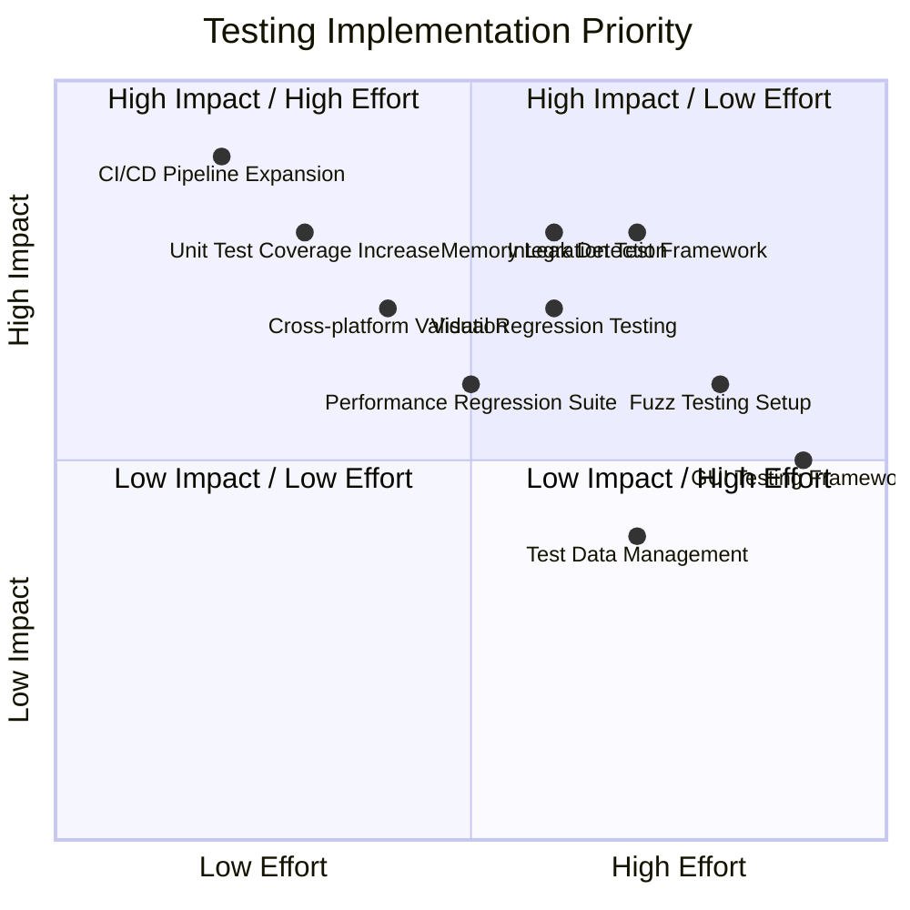

# Testing Strategy and Implementation

## Current Test Coverage Analysis

## Recommended Testing Pyramid

```mermaid
graph TD
    A[Testing Pyramid] --> B[Unit Tests<br/>70-80%]
    A --> C[Integration Tests<br/>15-20%]
    A --> D[System Tests<br/>5-10%]
    A --> E[E2E Tests<br/>1-5%]

    B --> B1[Z80 Instruction Tests<br/>✅ Well Covered]
    B --> B2[File Format Parsers<br/>✅ Well Covered]
    B --> B3[Hardware Components<br/>⚠️ Needs Expansion]
    B --> B4[Utility Functions<br/>⚠️ Needs Expansion]

    C --> C1[Component Integration<br/>❌ Missing]
    C --> C2[Full Emulator Cycles<br/>❌ Missing]
    C --> C3[Hardware Variants<br/>❌ Missing]
    C --> C4[Multi-format Compatibility<br/>❌ Missing]

    D --> D1[GUI Testing<br/>❌ Missing]
    D --> D2[Automation APIs<br/>❌ Missing]
    D --> D3[Performance Regression<br/>⚠️ Basic Coverage]
    D --> D4[Memory Leak Detection<br/>❌ Missing]

    E --> E1[Boot to BASIC<br/>❌ Missing]
    E --> E2[Run Commercial Software<br/>❌ Missing]
    E --> E3[Cross-platform Validation<br/>❌ Missing]
    E --> E4[Long-running Stability<br/>❌ Missing]

    F[Test Infrastructure] --> G[Google Test<br/>✅ Available]
    F --> H[Google Benchmark<br/>✅ Available]
    F --> I[CI/CD Pipeline<br/>⚠️ Linux Only]
    F --> J[Coverage Tools<br/>❌ Missing]
```

## Unit Test Categories Detail

## Integration Test Strategy

## CI/CD Pipeline Architecture

## Advanced Testing Techniques

### Visual Regression Testing

### Fuzz Testing Implementation

## Test Data Management

```mermaid
graph TD
    A[Test Data Strategy] --> B[Reference Files]
    A --> C[Test ROMs]
    A --> D[Test Tapes]
    A --> E[Test Snapshots]
    A --> F[Benchmark Data]

    B --> B1[Known Good Outputs]
    B --> B2[Expected Results]
    B --> B3[Validation Data]

    C --> C1[Diagnostic ROMs]
    C --> C2[Test Programs]
    C --> C3[Demo Programs]

    D --> D1[TAP Files]
    D --> D2[TZX Files]
    D --> D3[Hardware Test Tapes]

    E --> E1[SNA Files]
    E --> E2[Z80 Files]
    E --> E3[State Validation]

    F --> F1[Performance Baselines]
    F --> F2[Regression Detection]
    F --> F3[Optimization Metrics]

    G[Data Organization] --> H[Structured Storage]
    G --> I[Version Control]
    G --> J[Automated Updates]

    H --> B
    H --> C
    H --> D
    H --> E
    H --> F

    I --> K[Git LFS for large files]
    I --> L[Checksum validation]
    I --> M[Change tracking]

    J --> N[CI/CD integration]
    J --> O[Automated validation]
    J --> P[Quality assurance]
```

## Performance Testing Strategy

```mermaid
graph TD
    A[Performance Testing] --> B[Microbenchmarks]
    A --> C[Macrobenchmarks]
    A --> D[Regression Testing]
    A --> E[Profiling]

    B --> B1[Z80 Instruction Timing]
    B --> B2[Memory Access Speed]
    B --> B3[I/O Operation Latency]
    B --> B4[Video Rendering Speed]

    C --> C1[Full Frame Rendering]
    C --> C2[Audio Buffer Generation]
    C --> C3[ROM Loading Speed]
    C --> C4[Snapshot Save/Load]

    D --> D1[Performance Baselines]
    D --> D2[Threshold Alerts]
    D --> D3[Historical Tracking]

    E --> E1[CPU Usage Profiling]
    E --> E2[Memory Usage Analysis]
    E --> E3[Cache Performance]
    E --> E4[Bottleneck Identification]

    F[Tools & Infrastructure] --> G[Google Benchmark]
    F --> H[Custom Profiling]
    F --> I[Performance CI/CD]
    F --> J[Visualization]

    G --> B
    G --> C

    H --> E

    I --> D
    I --> K[Automated Regression Detection]

    J --> L[Performance Dashboards]
    J --> M[Historical Charts]
    J --> N[Comparative Analysis]
```

## Implementation Priority Matrix

