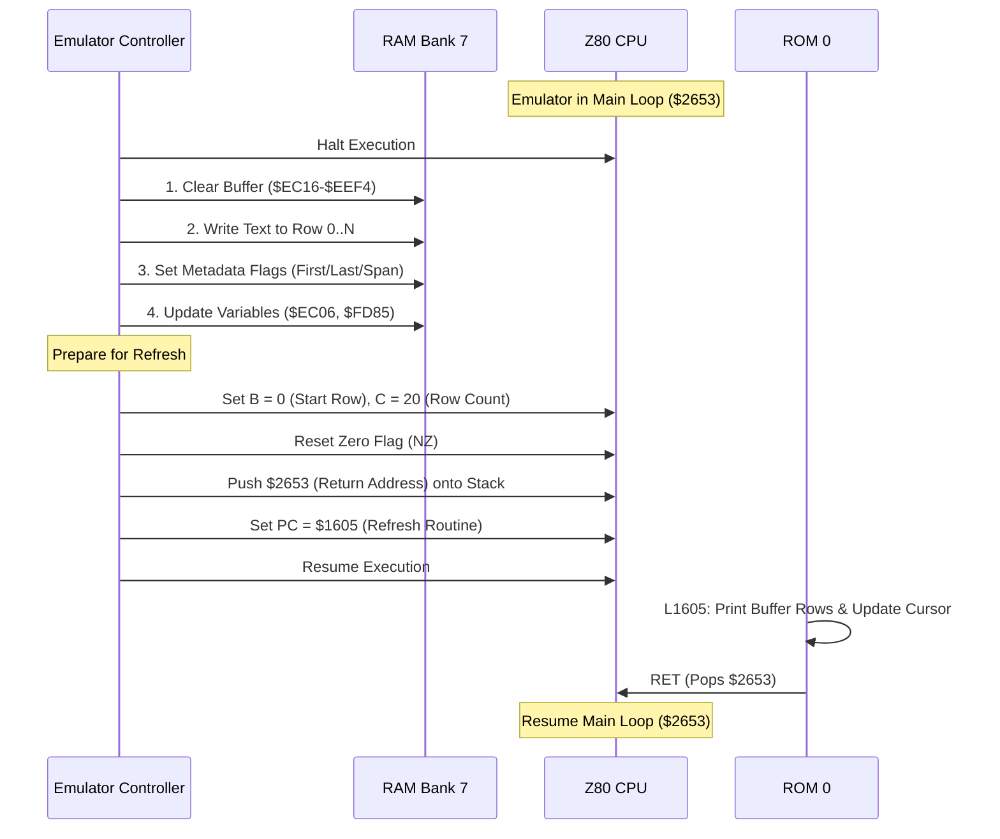

# Spectrum 128k BASIC Editor Text Injection Strategy

## 1. Executive Summary
This document outlines a robust strategy for injecting text directly into the ZX Spectrum 128k BASIC Editor's edit buffer and forcing an immediate screen refresh. This method allows for "pasting" code or text into the emulator without simulating individual keystrokes, ensuring speed and reliability.

The strategy relies on direct manipulation of the **Screen Line Edit Buffer** in RAM Bank 7 and hijacking the internal ROM routine **`L1605`** to repaint the screen and update the visual cursor position.

## 2. Architectural Analysis

### 2.1 Memory Management
The 128k Editor operates primarily in **RAM Bank 7** (Logical Bank 4 in the 128k mapping scheme). The relevant workspace variables and buffers are located in the range `$EC00-$FFFF`.

> **ROM Note:** "These occupy addresses $EC00-$FFFF in physical RAM bank 7, and form a workspace used by 128 BASIC Editor."

### 2.2 Screen Line Edit Buffer (`$EC16`)
The core data structure is the `Screen Line Edit Buffer`, which holds the text currently visible and editable on the screen.

- **Address:** `$EC16`
- **Size:** 21 rows (Rows 0-20).
- **Row Format:** Each row is **35 bytes** long.

**Row Structure:**
| Offset | Size | Description | Details |
| :--- | :--- | :--- | :--- |
| `0-31` | 32 Bytes | **Character Data** | ASCII characters. Unused spaces must be filled with `$00`. |
| `32` | 1 Byte | **Metadata Flags** | `Bit 0`: First row; `Bit 1`: Spans next row; `Bit 3`: Last row; `Bit 4`: Line # stored. |
| `33-34` | 2 Bytes | **Line Number** | Stored in Little Endian. Valid only for the *first* row. |

### 2.3 Key State Variables
The following state variables must be updated to ensure the editor processes the injected text correctly.

| Address | Size | Name | Description |
| :--- | :--- | :--- | :--- |
| **`$EC06`** | 2 Bytes | `CURSOR_POS` | Count of editable characters *before* the cursor. **Critical for cursor placement.** |
| **`$FD85`** | 2 Bytes | `LINE_LEN` | Total count of characters in the typed BASIC line. |
| **`$EC15`** | 1 Byte | `ROW_COUNT` | Number of editing rows on screen (Default: `20` / `$14`). |

## 3. Injection Strategy

### 3.1 Process Flow



### 3.2 Implementation Steps

#### Step 1: Buffer Preparation & Writing
1. **Clear**: Zero out the buffer area from `$EC16` to `$EEF4`.
2. **Formatting**: Split the input string into 32-character segments.
3. **Write**: Populate the character slots (bytes 0-31) of each required row in `$EC16`.

#### Step 2: Metadata & State Updates
1. **Flags**: Set Byte 32 for each row according to its position (e.g., Row 0 gets `Bit 0`, intermediate rows get `Bit 1`, the final row gets `Bit 3`).
2. **Line Length**: Write the total character count to **`$EC06`** and **`$FD85`**.

#### Step 3: Visual Refresh (Execution Hijack)
We utilize the internal routine `L1605` which repaints the editor and recalculates the visual cursor position based on `$EC06`.

**Register & Stack Setup:**
- **PC**: `$1605`
- **SP**: Decrement by 2, and write `$2653` (Main Loop address) to the new stack location.
- **B**: `0` (Start Row).
- **C**: `20` (Row Count).
- **F (Flags)**: Ensure the **Zero Flag is clear** (NZ) to trigger the cursor update logic in `L1605`.

## 4. Safety & Constraints

1.  **Halt State**: The emulator must be **paused** during memory and register manipulation.
2.  **Context Check**: Verify the `PC` is within the Editor Main Loop range (approx. `$2600-$2700`) to avoid corrupting a running program.
3.  **Buffer Limits**: Injected strings should not exceed the maximum buffer capacity of 672 characters (21 rows × 32 chars).
4.  **Bank Access**: Ensure **RAM Bank 7** is accessible during the memory write phase.

## 5. Python Implementation Concept

```python
def inject_text_128k(emulator, text):
    emulator.pause()
    
    # Verify we are in the editor loop
    if not (0x2600 <= emulator.get_register('PC') <= 0x2700):
        raise StateError("Emulator not in Editor Loop")

    # Write text and metadata
    buffer_addr = 0xEC16
    segments = [text[i:i+32] for i in range(0, len(text), 32)]
    
    for idx, segment in enumerate(segments):
        offset = buffer_addr + (idx * 35)
        emulator.write_memory(offset, segment.encode('ascii').ljust(32, b'\0'))
        
        meta = 0x01 if idx == 0 else 0
        if idx < len(segments) - 1: meta |= 0x02
        else: meta |= 0x08
        
        emulator.write_memory(offset + 32, bytes([meta]))
        emulator.write_memory(offset + 33, b'\0\0')

    # Update length and cursor variables
    length_bytes = len(text).to_bytes(2, 'little')
    emulator.write_memory(0xEC06, length_bytes)
    emulator.write_memory(0xFD85, length_bytes)

    # Force Refresh via L1605
    sp = emulator.get_register('SP') - 2
    emulator.set_register('SP', sp)
    emulator.write_memory(sp, (0x2653).to_bytes(2, 'little'))
    
    emulator.set_register('B', 0)
    emulator.set_register('C', 20)
    emulator.set_register('PC', 0x1605)
    emulator.set_register('F', emulator.get_register('F') & ~0x40) # Reset Z flag

    emulator.resume()
```

## 6. Execution & Insertion Logic

The 128k ROM handles the processing of the edit line after the user presses ENTER. The behavior depends on whether the line starts with a number.

### 6.1 Direct Execution (No Line Number)
When a line is entered without a number (e.g., `PRINT "HELLO"`), the ROM treats it as a direct command to be executed immediately.

**Routine Analysis (`L02C1` -> `L02DF`):**
1.  **Line Number Check**: The ROM calls `E_LINE_NO` ($19FB). If no number is found, it proceeds to the direct execution path.
2.  **Screen Setup**: The lower screen is cleared (`CLS_LOWER`) and scroll counters are initialized.
3.  **Stack Preparation**:
    -   A **GO SUB stack marker** ($3E00) is pushed onto the stack. This ensures that `RETURN` statements without a corresponding `GOSUB` are handled correctly, although a known bug exists where previous stack markers might be lost.
    -   The **Error Handler address** (`ONERR`) is pushed.
4.  **Execution**: The code jumps to `L1838` (Line Run entry point), which effectively passes control to the BASIC interpreter to run the statements in the edit buffer.

### 6.2 Program Insertion (With Line Number)
When a line starts with a number (e.g., `10 PRINT "HELLO"`), it is treated as a program line to be added, replaced, or deleted.

**Routine Analysis (`L03F7`):**
1.  **Target Identification**: The line number is stored in `E_PPC` ($5C49).
2.  **Existing Line Check**: `LINE_ADDR` ($196E) is called to check if the line already exists in the program area.
    -   If it exists, `RECLAIM_2` ($19E8) is called to delete the existing line to make way for the new one (or simply remove it if the new line is empty).
3.  **Deletion**: If the typed line consists *only* of a line number (length is 1, just the Enter key), the routine exits here, effectively deleting the line. The program cursor (`E_PPC`) is updated to the next available line.
4.  **Insertion**:
    -   **Space Allocation**: `MAKE_ROOM` ($1655) is called to open a gap in the program memory area (`PROG`) matching the length of the new line.
    -   **Copy**: The line data is copied from the **Work Space** (`WORKSP`) into the newly allocated gap in the program area.
    -   **Header Update**: The 4-byte header (Line Number + Length) is written to the start of the new line structure.