# TR-DOS and 48K ROM Interaction Analysis

## Executive Summary

TR-DOS operates on Beta 128 disk interface which has **hardware-based ROM switching**. The DOS ROM (TR-DOS) frequently **temporarily switches to the SOS ROM** (48K BASIC ROM) for:
- Character/string printing (`RST #20` → calls ROM routines)
- Keyboard scanning
- Mathematical operations via the calculator
- Error handling through the standard BASIC error mechanism

This document analyzes how to **reliably detect DOS ROM activity** even during these temporary SOS ROM switches.

---

## 1. ROM Switching Mechanism

### 1.1 Hardware-Level ROM Paging (Beta 128)

The Beta 128 interface uses **address-based ROM switching**:
- **DOS ROM pages in** when PC reaches address range `$3D00-$3DFF` (trap addresses)
- **DOS ROM pages out** (SOS ROM pages in) when PC reaches address `$5CC2` (contains `RET` instruction in RAM)

```
┌─────────────────────────────────────────────────────────────────┐
│                     ROM Switching Mechanism                     │
├─────────────────────────────────────────────────────────────────┤
│                                                                 │
│   SOS ROM (48K BASIC)           DOS ROM (TR-DOS)                │
│   ┌─────────────────┐           ┌─────────────────┐             │
│   │                 │           │                 │             │
│   │  Normal BASIC   │◄────┐ ┌───►  TR-DOS Code    │             │
│   │  Execution      │     │ │   │                 │             │
│   │                 │     │ │   │                 │             │
│   └────────┬────────┘     │ │   └────────┬────────┘             │
│            │              │ │            │                      │
│            ▼              │ │            ▼                      │
│   ┌─────────────────┐     │ │   ┌─────────────────┐             │
│   │ PC = $3D00-$3DFF├─────┘ │   │ PC = $5CC2      │             │
│   │ (Trap Range)    │       │   │ (RAM RET)       │             │
│   └─────────────────┘       │   └─────────────────┘             │
│                             │                                   │
│   Hardware pages in DOS ROM └───Hardware pages in SOS ROM       │
│                                                                 │
└─────────────────────────────────────────────────────────────────┘
```

#### ROM Switch Decision Flow

The Beta 128 interface maintains a **hardware latch** that determines which ROM is paged at `$0000-$3FFF`:

```mermaid
stateDiagram-v2
    [*] --> SOS : Power On / Reset
    
    SOS : 🔵 SOS ROM Paged
    SOS : 48K BASIC at $0000-$3FFF
    
    DOS : 🟢 DOS ROM Paged  
    DOS : TR-DOS at $0000-$3FFF
    
    SOS --> DOS : Opcode fetch from $3D00-$3DFF
    DOS --> SOS : Opcode fetch from RAM ($4000+)
```



**Hardware Rules:**
| Current State | Trigger Condition | New State |
|--------------|-------------------|-----------|
| SOS ROM paged | Opcode fetch from `$3D00-$3DFF` | **DOS ROM paged** |
| DOS ROM paged | Opcode fetch from `$4000-$FFFF` (RAM) | **SOS ROM paged** |
| Either | Opcode fetch from other ROM addresses | No change |

> **Critical**: The switch to SOS happens when PC fetches from **RAM** (≥$4000), not a specific address. `$5CC2` is just a convenient RAM location containing `RET ($C9)`.

#### Detailed ROM Switch Sequence (RST #20 Call to SOS ROM)

This walkthrough shows **exactly** what happens when TR-DOS calls a 48K ROM routine via `RST #20`:

**Starting state**: DOS ROM paged, executing TR-DOS code that needs to print a character.

```
┌─────┬────────────────────────────────────────────────────────────────────────┐
│ #   │ Step Description                                                       │
├─────┼────────────────────────────────────────────────────────────────────────┤
│     │ INITIAL STATE                                                          │
│     │ • Latch: DOS ROM paged at $0000-$3FFF                                  │
│     │ • PC: somewhere in TR-DOS (e.g., $3D94)                                │
│     │ • Stack: [..., ret_addr]                                               │
├─────┼────────────────────────────────────────────────────────────────────────┤
│ 1   │ TR-DOS executes: RST #20 / DW $0010                                    │
│     │ • PC = $3D94, fetches RST #20 opcode ($DF)                             │
│     │ • Latch: Still DOS (fetch from $3D94 is in trap range)                 │
│     │ • RST #20 pushes PC+1 ($3D95) and jumps to $0020                       │
│     │ • Stack: [..., ret_addr, $3D95]                                        │
├─────┼────────────────────────────────────────────────────────────────────────┤
│ 2   │ Execute $0020 (in DOS ROM): JP $2F72                                   │
│     │ • PC = $0020, fetch from DOS ROM                                       │
│     │ • Latch: Still DOS (PC < $4000)                                        │
│     │ • Jump to $2F72 (RST #20 handler)                                      │
├─────┼────────────────────────────────────────────────────────────────────────┤
│ 3   │ Handler at $2F72 reads inline address and sets up stack:               │
│     │ • Reads $0010 from address $3D95 (the DW after RST)                    │
│     │ • Pushes: return address ($3D97), then $3D2F, then $0010, then $5CC2   │
│     │ • Stack: [..., ret_addr, $3D97, $3D2F, $0010, $5CC2]                   │
│     │                                     ↑       ↑       ↑                   │
│     │                              DOS return  target  RAM stub              │
├─────┼────────────────────────────────────────────────────────────────────────┤
│ 4   │ Handler executes RET                                                   │
│     │ • RET pops $5CC2 from stack, PC becomes $5CC2                          │
│     │ • Stack: [..., ret_addr, $3D97, $3D2F, $0010]                          │
│     │ • ⚡ LATCH TRIGGERS: Opcode fetch from $5CC2 (RAM, ≥$4000)             │
│     │ • Latch: → SOS ROM now paged at $0000-$3FFF                            │
├─────┼────────────────────────────────────────────────────────────────────────┤
│ 5   │ Execute $5CC2 (RAM): contains RET ($C9)                                │
│     │ • PC = $5CC2, fetches RET opcode from RAM                              │
│     │ • RET pops $0010 from stack, PC becomes $0010                          │
│     │ • Stack: [..., ret_addr, $3D97, $3D2F]                                 │
│     │ • Latch: Still SOS (PC = $0010 is in SOS ROM, no trigger)              │
├─────┼────────────────────────────────────────────────────────────────────────┤
│ 6   │ Execute $0010 (SOS ROM): Print character routine                       │
│     │ • Now running 48K BASIC ROM code                                       │
│     │ • Character is printed to screen                                       │
│     │ • When done, SOS routine executes RET                                  │
├─────┼────────────────────────────────────────────────────────────────────────┤
│ 7   │ SOS routine RET                                                        │
│     │ • RET pops $3D2F from stack, PC becomes $3D2F                          │
│     │ • Stack: [..., ret_addr, $3D97]                                        │
│     │ • ⚡ LATCH TRIGGERS: Opcode fetch from $3D2F (trap range!)             │
│     │ • Latch: → DOS ROM now paged at $0000-$3FFF                            │
├─────┼────────────────────────────────────────────────────────────────────────┤
│ 8   │ Execute $3D2F (DOS ROM): NOP + RET                                     │
│     │ • PC = $3D2F, fetches from DOS ROM                                     │
│     │ • RET pops $3D97 from stack, PC becomes $3D97                          │
│     │ • Stack: [..., ret_addr]                                               │
│     │ • Back in TR-DOS, continues after the RST #20 / DW $0010               │
└─────┴────────────────────────────────────────────────────────────────────────┘
```

**Key mechanism - The "RAM Trampoline":**
1. TR-DOS cannot directly call SOS ROM (latch wouldn't switch)
2. Instead, it **RETs to RAM** ($5CC2), which triggers latch → SOS
3. The RAM location contains `RET`, which bounces to the actual SOS target
4. When SOS returns, it **RETs to trap address** ($3D2F), triggering latch → DOS
5. $3D2F contains `NOP; RET`, bouncing back to original TR-DOS caller

```
    DOS ROM                RAM ($5CC2)              SOS ROM
    ┌──────┐              ┌──────────┐             ┌──────┐
    │      │──RET──────── │ RET ($C9)│──RET──────► │ $0010│
    │$2F72 │   ($5CC2)    └──────────┘  ($0010)    │ PRINT│
    │      │                  ▲                     │      │
    └──────┘                  │                     └──┬───┘
        ▲                     │                        │
        │              Latch flips                     │
        │              SOS→DOS                    RET ($3D2F)
        │                     │                        │
    ┌──────┐              ┌───┴──────┐                 │
    │$3D2F │◄─────────────│ Latch    │◄────────────────┘
    │NOP   │              │ flips    │
    │RET   │              │ DOS→SOS  │
    └──────┘              └──────────┘
```

### 1.2 Key Entry Points (Trap Addresses in Range $3D00-$3DFF)

| Address | Purpose | Description |
|---------|---------|-------------|
| `$3D00` | Entry to TR-DOS | Main entry point (NOP + JR to `$3D31`) |
| `$3D03` | Command execution | Execute TR-DOS commands from BASIC |
| `$3D06` | File input | Data file input routine |
| `$3D0D`/`$3D0E` | File output | Data file output routine |
| `$3D10` | Memory change | Change memory configuration |
| `$3D13` | Machine code call | Call TR-DOS from machine code |
| `$3D16` | Error handler | TR-DOS error handler |
| `$3D1A` | Command exec (no switch) | Execute command without initial ROM switch |
| `$3D2F` | ROM switch trampoline | **Key address**: Switch ROM and jump to stacked address |
| `$3D31` | Full DOS entry | Creates sys vars if needed, enters command processor |

### 1.3 The ROM Switch Trampoline (`$3D2F`)

This is the **critical routine** that temporarily switches to SOS ROM:

```assembly
; Address $3D2F - Switch ROM to TR-DOS and jump to stacked address
x3D2F:      NOP         ; This address triggers ROM switch when reached
            RET         ; Pop and jump to address on stack
```

When the Z80 PC reaches `$3D2F`:
1. Hardware pages in DOS ROM
2. `RET` instruction executes
3. Control returns to the address pushed on the stack

---

## 2. Temporary SOS ROM Calls from TR-DOS

### 2.1 RST #20 Mechanism (Call SOS ROM Subroutines)

TR-DOS uses `RST #20` to call 48K BASIC ROM routines. The mechanism at address `$0020` in TR-DOS:

```assembly
; TR-DOS RST #20 handler at $0020
x0020:      JP      x2F72       ; Jump to call mechanism

; Subroutine at $2F72 - Call BASIC ROM routines
x2F72:      LD      (#5D02),HL  ; Save HL and DE
            LD      (#5D04),DE
            POP     HL          ; Get return address (points to DW after RST)
            LD      E,(HL)      ; Get target subroutine address (low)
            INC     HL
            LD      D,(HL)      ; Get target subroutine address (high)
            INC     HL
            PUSH    HL          ; Push return address (after DW)
            
            ; Stack setup for double ROM switch:
            LD      HL,x3D2F    ; Push $3D2F (switch back to DOS)
            PUSH    HL
            PUSH    DE          ; Push target BASIC routine address
            LD      HL,#5CC2    ; Push $5CC2 (RAM location with RET)
            PUSH    HL
            
            LD      HL,(#5D02)  ; Restore HL and DE
            LD      DE,(#5D04)
            RET                 ; Jump to $5CC2 (triggers SOS ROM switch)
```

**Stack after setup:**
```
SP → $5CC2    ← Top: RAM location with RET (switches to SOS ROM)
     target   ← BASIC ROM routine address
     $3D2F    ← Switch back to DOS ROM when BASIC routine returns
     return   ← Original return address in DOS code
```

**Execution flow:**
1. `RET` pops `$5CC2`, PC goes there
2. Hardware sees PC at `$5CC2`, pages in **SOS ROM**
3. `RET` at `$5CC2` pops target address, executes BASIC routine
4. BASIC routine `RET` pops `$3D2F`
5. Hardware sees PC at `$3D2F`, pages in **DOS ROM**
6. `RET` at `$3D2F` pops original return address, back in TR-DOS

### 2.2 Common SOS ROM Routines Called by TR-DOS

TR-DOS specifies **which SOS ROM routine it needs** via **inline address bytes** immediately following the `RST #20` instruction:

```assembly
; How TR-DOS calls a specific SOS ROM routine:
        RST     #20         ; 1 byte: Execute call mechanism
        DW      $0010       ; 2 bytes: Target address in SOS ROM (little-endian)
        ; ...continues here after SOS routine returns
```

The `RST #20` handler at `$2F72` reads the 2-byte address from `(PC)`, then sets up the stack to:
1. Execute at that target address in SOS ROM
2. Return to DOS ROM via `$3D2F`
3. Continue execution after the `DW` directive

**This is a "parameterized call" pattern** - the call target is encoded in the instruction stream, not in registers.

TR-DOS frequently calls these BASIC ROM routines via `RST #20`:

| Address Called | Purpose | Example Usage |
|---------------|---------|---------------|
| `$0010` | Print character | `RST #20` / `DW $0010` for character output |
| `$028E` | Keyboard scan | Check for key presses |
| `$031E` | Key test | Get key code |
| `$0D6E` | Clear lower screen | Before displaying catalog |
| `$0D6B` | (Similar) | Screen operations |
| `$1655` | MAKE_ROOM | Create space in memory |
| `$1727` | Stream offset | Get stream channel offset |
| `$196E` | Line address | Find BASIC line address |
| `$1F54` | BREAK check | Check if BREAK pressed |
| `$1B7B` | (variable) | Various BASIC operations |

### 2.3 Character/String Printing via Temporary ROM Switch

The print routines at `$3D80` (newline) and `$3D82` (character):

```assembly
; Address $3D80 - Print newline
x3D80:      LD      A,#D        ; ENTER character
; Address $3D82 - Print character from A register
x3D82:      PUSH    HL          ; Save registers
            PUSH    BC
            PUSH    DE
            PUSH    AF          ; Save character
            CALL    x20F1       ; Change memory (if needed)
            POP     AF          ; Restore character
x3D8A:      CALL    x3D94       ; Actually print
            CALL    x20F1       ; Restore memory
            POP     DE          ; Restore registers
            POP     BC
            POP     HL
            RET

; Address $3D94 - Print without memory change
x3D94:      RST     #20         ; Call BASIC print routine
            DW      $0010       ; BASIC's RST $10 equivalent
            RET
```

**Key insight**: When printing a character, the flow is:
1. TR-DOS code calls `$3D82`
2. `$3D94` uses `RST #20` with target `$0010`
3. **SOS ROM becomes active** to execute print routine
4. Returns to DOS ROM at `$3D2F`

---

## 3. State Variables for Detecting DOS Activity

### 3.1 Critical System Variables

| Address | Name | Purpose |
|---------|------|---------|
| `$5CC2` | ROM switch stub | Contains `$C9` (RET) - presence indicates TR-DOS initialized |
| `$5CF6` | Current drive | Current floppy drive number (0-3) |
| `$5D0C` | Buffer flag | `$FF` = no buffer, else buffer exists |
| `$5D0F` | Error code | TR-DOS error code (0 = no error) |
| `$5D15` | Message flag | 0 = print messages, non-zero = suppress |
| `$5D16` | System register | Last value written to port `$FF` |
| `$5D17` | Splash flag | `$AA` = skip splash screen |
| `$5D18` | Memory change | Memory change allowed flag |
| `$5D19` | Default drive | Default drive number |
| `$5D1A` | Return address | Where to return after command |
| `$5D1C` | Saved SP | Saved stack pointer |
| `$5D1F` | Machine code flag | Non-zero if command from machine code |

### 3.2 Detecting DOS ROM vs Temporary SOS Switch

**The challenge**: When TR-DOS temporarily switches to SOS ROM (e.g., for printing), the hardware **physically pages in the 48K ROM**. The CPU is executing BASIC ROM code.

**Solution**: Track the "logical" DOS activity, not just which ROM is paged:

#### Method 1: Stack Context Analysis

When DOS switches to SOS temporarily, the stack contains:
- Return address `$3D2F` (or other DOS trap addresses)
- TR-DOS working variables are preserved

**Detection approach**:
```
IF stack contains $3D2F-$3DFF return address
   AND system variables at $5CF6-$5D25 are initialized
THEN DOS is logically active (even if SOS ROM is paged)
```

#### Method 2: System Variable Presence

Check for TR-DOS system variable area existence:

```assembly
; From TR-DOS code at $31F3
x31F3:      LD      HL,(#5C4F)  ; Get CHANS address
            OR      A
            LD      BC,#5D25    ; Expected if TR-DOS initialized
            SBC     HL,BC
            RET                 ; C flag set = NOT initialized
```

If `(CHANS) = $5D25`, TR-DOS has created its system variables and is logically "active".

#### Method 3: Port $FF State Tracking

TR-DOS writes to port `$FF` for disk controller operations and saves the value:
- `$5D16` holds the last value written to port `$FF`
- If `$5D16` ≠ `$FF`, disk operations are/were in progress

---

## 4. Reliable DOS ROM Active Detection Algorithm

### 4.1 Three-Tier Detection Strategy

```
┌────────────────────────────────────────────────────────────────────┐
│                   DOS ROM ACTIVE DETECTION                         │
├────────────────────────────────────────────────────────────────────┤
│                                                                    │
│  TIER 1: HARDWARE STATE (Instant)                                  │
│  ├── Check current paged ROM via hardware register                 │
│  └── If DOS ROM paged → DEFINITELY ACTIVE                          │
│                                                                    │
│  TIER 2: STACK CONTEXT (Logical activity during SOS execution)     │
│  ├── Scan stack for $3D00-$3DFF return addresses                   │
│  ├── If found AND Tier 3 satisfied → LOGICALLY ACTIVE              │
│  └── (DOS temporarily using SOS for printing/keyboard)             │
│                                                                    │
│  TIER 3: SYSTEM VARIABLE STATE (Initialization check)              │
│  ├── (CHANS) at $5C4F == $5D25 → TR-DOS sys vars exist             │
│  ├── ($5CC2) == $C9 → TR-DOS ROM switch stub installed             │
│  └── ($5D16) ≠ $FF → Disk operations configured                    │
│                                                                    │
└────────────────────────────────────────────────────────────────────┘
```

### 4.2 Pseudocode Implementation

```c
bool isDOSLogicallyActive() {
    // Tier 1: Check hardware ROM state
    if (isDOSROMPaged()) {
        return true;
    }
    
    // Tier 3: Check if TR-DOS was ever initialized this session
    if (!isTRDOSInitialized()) {
        return false;  // Never entered TR-DOS
    }
    
    // Tier 2: We're in SOS ROM but check if DOS is the "caller"
    return stackContainsDOSReturnAddress();
}

bool isTRDOSInitialized() {
    // Check system variable presence
    uint16_t chans = readMem16(0x5C4F);
    uint8_t romStub = readMem8(0x5CC2);
    
    return (chans == 0x5D25) && (romStub == 0xC9);
}

bool stackContainsDOSReturnAddress() {
    uint16_t sp = z80.SP;
    uint16_t stackTop = 0xFFFF;  // Or appropriate limit
    
    // Scan up to 16 stack entries
    for (int i = 0; i < 16 && (sp + i*2) < stackTop; i++) {
        uint16_t retAddr = readMem16(sp + i*2);
        if (retAddr >= 0x3D00 && retAddr <= 0x3DFF) {
            return true;  // Found DOS trap return address
        }
    }
    return false;
}
```

### 4.3 Breakpoint-Based Detection (For Analyzer)

For the TR-DOS analyzer to track DOS activity:

**Entry Detection Breakpoints** (DOS becoming active):
- `$3D00` - Main entry
- `$3D03` - Command execution from BASIC
- `$3D13` - Machine code calls
- `$3D2F` - ROM switch return (DOS paging in)
- `$3D31` - Full DOS entry

**Exit Detection Breakpoints** (DOS relinquishing control):
- Memory at `$5CC2` executed (PC == `$5CC2`) - Switching to SOS
- But this is **temporary** if stack still has `$3D2F` return!

**True Exit**: When command processor returns control to BASIC:
- Watch for `JP` or `RET` to addresses outside DOS ROM
- Watch stack for final cleanup (no more `$3D2F` entries)

---

## 5. Sequence Diagrams

### 5.1 DOS Command Execution with Print I/O

```
┌────────┐         ┌────────┐         ┌─────────┐        ┌────────┐
│ BASIC  │         │ TR-DOS │         │ SOS ROM │        │ Screen │
└───┬────┘         └───┬────┘         └────┬────┘        └───┬────┘
    │                  │                   │                 │
    │ USR 15616        │                   │                 │
    │ (PC=$3D13)       │                   │                 │
    │─────────────────>│                   │                 │
    │   [HW: DOS IN]   │                   │                 │
    │                  │                   │                 │
    │                  │ CAT command       │                 │
    │                  │ Need to print     │                 │
    │                  │ filename          │                 │
    │                  │                   │                 │
    │                  │ CALL $3D82        │                 │
    │                  │ (print 'A')       │                 │
    │                  │                   │                 │
    │                  │ Stack: $3D2F      │                 │
    │                  │────────RET───────>│                 │
    │                  │ [HW: SOS IN]      │                 │
    │                  │                   │                 │
    │                  │                   │ RST $10         │
    │                  │                   │────────────────>│
    │                  │                   │  'A' printed    │
    │                  │                   │<────────────────│
    │                  │                   │                 │
    │                  │<───────RET────────│                 │
    │                  │ (return to $3D2F) │                 │
    │                  │ [HW: DOS IN]      │                 │
    │                  │                   │                 │
    │                  │ ...more work...   │                 │
    │<─────────────────│                   │                 │
    │ Command complete │                   │                 │
    │ [HW: SOS IN]     │                   │                 │
    │                  │                   │                 │
```

### 5.2 Keyboard Scanning During DOS Operation

```
    ┌─────────────────────────────────────────────┐
    │            Keyboard Scan Sequence           │
    ├─────────────────────────────────────────────┤
    │                                             │
    │  TR-DOS (waiting for input)                 │
    │        │                                    │
    │        │ RST #20                            │
    │        │ DW $028E                           │
    │        ▼                                    │
    │  ┌──────────────┐                           │
    │  │ $2F72 setup  │ Push $5CC2, target, $3D2F │
    │  └──────────────┘                           │
    │        │ RET                                │
    │        ▼                                    │
    │  ┌──────────────┐                           │
    │  │ $5CC2 (RAM)  │ [HW switches to SOS]      │
    │  └──────────────┘                           │
    │        │ RET                                │
    │        ▼                                    │
    │  ┌──────────────┐                           │
    │  │ $028E KEYSCAN│ Execute in 48K ROM        │
    │  └──────────────┘                           │
    │        │ RET                                │
    │        ▼                                    │
    │  ┌──────────────┐                           │
    │  │ $3D2F        │ [HW switches to DOS]      │
    │  └──────────────┘                           │
    │        │ RET                                │
    │        ▼                                    │
    │  Back in TR-DOS with key result             │
    │                                             │
    └─────────────────────────────────────────────┘
```

---

## 6. Implementation Recommendations for Emulator

### 6.1 State Tracking Structure

```cpp
struct TRDOSState {
    bool dosRomPaged;           // Hardware state: is DOS ROM in $0000-$3FFF?
    bool dosLogicallyActive;    // Logical state: is DOS "in control"?
    int sosNestingLevel;        // Depth of temporary SOS calls
    uint16_t lastDOSEntryPC;    // Where DOS was entered
    bool sysVarsInitialized;    // TR-DOS system variables created?
};
```

### 6.2 Event Detection Points

| Event | Detection | Meaning |
|-------|-----------|---------|
| TRDOS_ENTRY | PC enters `$3D00-$3DFF` from outside | User entered TR-DOS |
| TRDOS_COMMAND_START | PC at `$030A` (command dispatch) | Command parsing begins |
| TRDOS_SOS_CALL | PC at `$5CC2` with `$3D2F` on stack | Temporary SOS call |
| TRDOS_SOS_RETURN | PC at `$3D2F` | Returning from SOS call |
| TRDOS_EXIT | PC leaves DOS without `$3D2F` on stack | Full exit to BASIC |
| FDC_OPERATION | Port `$1F`/`$3F`/`$5F`/`$7F` accessed | Disk controller activity |

### 6.3 Robust Activity Detection

```cpp
bool isTRDOSLogicallyActive() {
    // If DOS ROM is paged in, definitely active
    if (betaInterface.isDosRomPaged()) {
        return true;
    }
    
    // Check if TR-DOS was initialized
    if (memory.read(0x5CC2) != 0xC9) {
        return false;  // ROM switch stub not installed
    }
    
    // Check if this is a temporary SOS call
    // Scan stack for DOS return addresses
    uint16_t sp = z80.getSP();
    for (int depth = 0; depth < 32; depth++) {
        uint16_t addr = memory.read16(sp + depth * 2);
        if (addr >= 0x3D00 && addr <= 0x3DFF) {
            return true;  // DOS is waiting on stack
        }
        if (addr < 0x4000) {
            // Hit a ROM address - stop if not in trap range
            break;
        }
    }
    
    return false;
}
```

---

## 7. Summary

| Aspect | Detection Method |
|--------|-----------------|
| **DOS ROM physically active** | Hardware register check (Beta 128 latch) |
| **DOS entered** | Breakpoint on `$3D00-$3DFF` range |
| **Temporary SOS call** | PC at `$5CC2` + stack has `$3D2F` |
| **Return from SOS** | PC at `$3D2F` trap address |
| **DOS initialized** | `($5CC2)==$C9` AND `(CHANS)==$5D25` |
| **True DOS exit** | Return to caller without `$3D2F` on stack |

The key insight is that **hardware ROM state ≠ logical DOS activity**. TR-DOS frequently borrows 48K ROM routines for I/O, but the disk operation context remains active. Stack analysis combined with system variable checks provides reliable detection of DOS "ownership" of the current operation.
