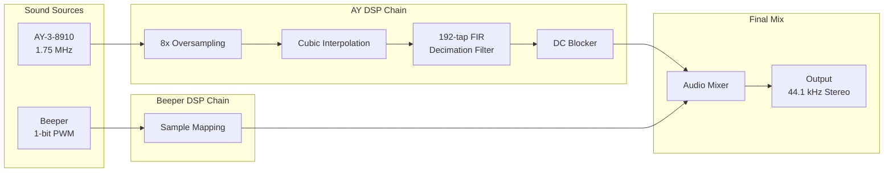

# Audio Processing Pipeline

This document describes the DSP (Digital Signal Processing) algorithms used in the emulator's audio chain.

## Overview



---

## 1. AY-3-8910 Processing

The AY chip runs at 1.75 MHz (Pentagon) or 1.7734 MHz (genuine Spectrum). Converting this to 44.1 kHz audio requires careful anti-aliasing to prevent artifacts.

### 1.1 Oversampling and Interpolation

**Problem:** The AY chip produces stepped waveforms at ~218 kHz (1.75 MHz ÷ 8 prescaler). Direct downsampling to 44.1 kHz would cause severe aliasing.

**Solution:** 8× oversampling with cubic interpolation, followed by FIR decimation.

#### Cubic Interpolation

Uses 4-point polynomial interpolation to smooth transitions between samples:

```cpp
// From filter_interpolate.cpp
y[0] = y[1];
y[1] = y[2];
y[2] = y[3];
y[3] = sample;

// Calculate polynomial coefficients
y1 = y[2] - y[0];
c[0] = 0.5 * y[1] + 0.25 * (y[0] + y[2]);
c[1] = 0.5 * y1;
c[2] = 0.25 * (y[3] - y[1] - y1);

// Evaluate: y = c[2]*x² + c[1]*x + c[0]
result = (c[2] * x + c[1]) * x + c[0];
```

**Signal Flow:**

```
AY Output (stepped)          After Interpolation (smooth)
    ┌───┐                         ╭───╮
    │   │                        ╱     ╲
────┘   └────────            ───╯       ╰──────
```

### 1.2 FIR Decimation Filter

**Purpose:** Remove frequencies above Nyquist (22.05 kHz) before downsampling to prevent aliasing.

**Implementation:** 192-tap polyphase decimator (from the Ayumi project)

```
Filter Specifications (MATLAB fdatool):
├── Type: Direct-Form FIR Polyphase Decimator
├── Order: 191
├── Decimation Factor: 8
├── Sampling Frequency: 44,100 Hz (output)
├── Passband: 0 - 10,800 Hz
├── Stopband: > 22,050 Hz
└── Window: Hamming
```

**Frequency Response:**

```
Gain (dB)
    0 ┤━━━━━━━━━━━━━━━━━━┓
      │                  ┃
      │                  ┃
  -20 ┤                  ┗━┓
      │                    ┃
  -40 ┤                    ┗━━━━━━━━━━━━━━
      │                         
  -60 ┼────────┬────────┬────────┬────────
      0       10       20       30    kHz
              ↑                 ↑
          Passband          Stopband
```

**Polyphase Structure:**

Instead of running a 192-tap filter at 8× the output rate, polyphase decomposition runs 8 parallel 24-tap filters at the output rate:

```
Input (352.8 kHz) ─┬─→ [Phase 0] ─┐
                   ├─→ [Phase 1] ─┤
                   ├─→ [Phase 2] ─┤
                   ├─→ [Phase 3] ─┼─→ Σ ─→ Output (44.1 kHz)
                   ├─→ [Phase 4] ─┤
                   ├─→ [Phase 5] ─┤
                   ├─→ [Phase 6] ─┤
                   └─→ [Phase 7] ─┘
```

### 1.3 DC Blocker

**Problem:** The AY DAC output may have DC offset, which can cause clicks and reduce headroom.

**Implementation:** Moving average with 1024-sample window

```cpp
// From filter_dc.h
double filter(T sample)
{
    // Remove oldest sample, add new one
    _sum += -_delayBuffer[_index] + sample;
    _delayBuffer[_index] = sample;
    
    // Circular buffer index
    _index = (_index + 1) & (DC_FILTER_BUFFER_SIZE - 1);
    
    // Subtract DC component
    return sample - (_sum / DC_FILTER_BUFFER_SIZE);
}
```

**Transfer Function:**

```
          1 - z^(-N)
H(z) = ─────────────
           N
           
where N = 1024 (buffer size)
```

This creates a highpass filter with cutoff at approximately:

```
fc = fs / (2πN) ≈ 44100 / (2π × 1024) ≈ 6.8 Hz
```

**Alternative IIR Implementation** (filter2 method):

```cpp
// Single-pole highpass with α = 0.995
value = sample - xm1 + 0.995 * ym1;
xm1 = sample;
ym1 = value;
```

---

## 2. Alternative FIR Filter (UnrealFilter)

A second filter implementation designed for the original Unreal emulator:

### 2.1 Specifications

```
Filter Parameters (MATLAB fdatool):
├── Type: FIR Window (Hamming)
├── Order: 127
├── Oversampling Factor: 64
├── Effective Sampling Rate: 2,822,400 Hz (44100 × 64)
├── Cutoff Frequency: 11,025 Hz
└── -3dB Bandwidth: 1% of π rad/sample
```

### 2.2 Coefficient Table

128 symmetric coefficients designed with Hamming window:

```cpp
static constexpr double _oversamplingFIRCoefficients[128] = {
    0.000797243121022152, 0.000815206499600866, ...
    // Peak at center: 0.015530130313785910
    ..., 0.000815206499600866, 0.000797243121022152
};
```

**Impulse Response:**

```
Amplitude
   0.016 ┤            ╭─╮
         │           ╱   ╲
   0.012 ┤          ╱     ╲
         │         ╱       ╲
   0.008 ┤       ╱           ╲
         │      ╱             ╲
   0.004 ┤    ╱                 ╲
         │ ╱                       ╲
   0.000 ┼─────────┬─────────┬─────────
         0        64       128
                  Tap
```

### 2.3 Step Response Precomputation

For efficient interpolation, cumulative sums are precomputed:

```cpp
UnrealFilter::UnrealFilter()
{
    double sum = 0.0;
    for (size_t i = 0; i < FILTER_ARRAY_SIZE; i++)
    {
        _stepResponseCoefficients[i] = (size_t)(sum * 0x10000);
        sum += _oversamplingFIRCoefficients[i];
    }
}
```

This allows O(1) interpolation between any two points using the step response:

```
output = (stepResponse[end] - stepResponse[start]) × sample
```

---

## 3. Beeper Processing

The Spectrum beeper is a 1-bit PWM (Pulse Width Modulation) output on port #FE bit 4.

### 3.1 Signal Generation

```cpp
// From beeper.cpp
uint8_t earValue = value & 0b0001'0000;
bool beeperBit = earValue > 0;

int16_t left = beeperBit ? INT16_MAX : INT16_MIN;
int16_t right = left;
```

**Output Waveform:**

```
Port #FE writes:  ┌─────┐     ┌───┐   ┌─┐
                  │     │     │   │   │ │
──────────────────┘     └─────┘   └───┘ └─────

Beeper output:   +32767 ─────┐     ┌───┐   ┌─┐
                      0 ─────┼─────┼───┼───┼─┼─────
                 -32768 ─────┘     └───┘   └─┘
```

### 3.2 Sample Timing

Beeper samples are mapped to the audio buffer based on T-state timing:

```cpp
size_t sampleIndex = (frameTState * SAMPLES_PER_FRAME) / scaledFrame;
```

For a 50 Hz frame (69888 T-states at 3.5 MHz):

```
T-states:    0        17472      34944      52416      69888
             │          │          │          │          │
             ▼          ▼          ▼          ▼          ▼
Samples:     0         220        441        661        882
```

### 3.3 DAC Volume Levels

The Spectrum has multiple audio sources on port #FE:

```
Bit [3]: MIC output
Bit [4]: EAR output (beeper)
```

Issue 2 vs Issue 3 motherboards have different voltage levels:

| Configuration | Issue 2 | Issue 3 |
|--------------|---------|---------|
| Both off     | 0.39V   | 0.34V   |
| MIC only     | 0.73V   | 0.66V   |
| EAR only     | 3.66V   | 3.56V   |
| Both on      | 3.79V   | 3.70V   |

---

## 4. Audio Mixing

### 4.1 Channel Combination

AY and beeper outputs are mixed in `SoundManager::handleFrameEnd()`:

```cpp
AudioUtils::MixAudio(
    (const int16_t*)_ayBuffer,  // AY stereo
    _beeperBuffer,               // Beeper stereo
    _outBuffer,                  // Output
    AUDIO_BUFFER_SAMPLES_PER_FRAME
);
```

### 4.2 Ring Buffer

The Qt sound manager uses a lock-free ring buffer for audio output:

```cpp
AudioRingBuffer<int16_t, AUDIO_BUFFER_SAMPLES_PER_FRAME * 8> _ringBuffer;
```

**Buffer Flow:**

```
Emulator Thread          Audio Thread (miniaudio)
     │                          │
     ▼                          │
[Generate Frame]                │
     │                          │
     ▼                          │
ringBuffer.enqueue() ────────────────────→ ringBuffer.dequeue()
     │                                        │
     │                                        ▼
     │                               [DAC Output]
```

---

## 5. Quality Modes

The emulator supports two audio quality modes controlled by the `soundhq` feature flag:

### 5.1 High Quality Mode (Default)

```
Pipeline:
AY Chip → 8× Oversampling → Cubic Interpolation → 192-tap FIR → DC Block → Output

CPU Cost: ~15% higher
Quality:  Excellent anti-aliasing, smooth transitions
```

### 5.2 Low Quality Mode

```
Pipeline:
AY Chip → 8× Oversampling → Simple Averaging → Output

CPU Cost: Baseline
Quality:  May have aliasing artifacts on high frequencies
```

Toggle via CLI:
```bash
feature soundhq off   # Low quality (saves ~15% CPU)
feature soundhq on    # High quality (default)
```

---

## 6. Volume/DAC Tables

### 6.1 AY-3-8910 DAC

Logarithmic amplitude scaling (32 entries for 5-bit envelope + 16 volume levels):

```cpp
static constexpr double AY_DAC_TABLE[] = {
    0.0,              0.0,               // Volume 0
    0.00999465934234, 0.00999465934234,  // Volume 1
    0.01445029373620, 0.01445029373620,  // Volume 2
    // ...
    0.80558480201400, 0.80558480201400,  // Volume 14
    1.0, 1.0                              // Volume 15
};
```

**Logarithmic Curve:**

```
Amplitude
   1.0 ┤                              ●
       │                           ●
   0.8 ┤                        ●
       │                     ●
   0.6 ┤                  ●
       │               ●
   0.4 ┤            ●
       │         ●
   0.2 ┤      ●
       │   ●
   0.0 ┼●●●──┬────┬────┬────┬────┬────
       0    4    8   12   16   20   24   28   32
                        Volume Level
```

### 6.2 YM2149 DAC (Alternative)

The YM2149 (AY clone) has different DAC characteristics with true 5-bit resolution:

```cpp
static constexpr double YM_DAC_TABLE[] = {
    0.0, 0.0,
    0.00465400167849, 0.00772106507973,
    // ... 32 unique entries
    0.87992675669500, 1.0
};
```

---

## 7. Stereo Panning

AY channels A, B, C are panned for stereo imaging:

```cpp
class ToneGenerator {
    double _panLeft;   // 0.0 - 1.0
    double _panRight;  // 0.0 - 1.0
};
```

**Default ACB Stereo Layout:**

```
Channel A: Left (panLeft=1.0, panRight=0.0)
Channel C: Center (panLeft=0.5, panRight=0.5)
Channel B: Right (panLeft=0.0, panRight=1.0)

       Left ◄─────────────────────► Right
         │                           │
    ┌────┴────┐    ┌────┴────┐    ┌────┴────┐
    │    A    │    │    C    │    │    B    │
    └─────────┘    └─────────┘    └─────────┘
```

---

## 8. Implementation Files

| Component | Header | Implementation |
|-----------|--------|----------------|
| FIR Interpolation Filter | `filter_interpolate.h` | `filter_interpolate.cpp` |
| Unreal FIR Filter | `filter_unreal.h` | `filter_unreal.cpp` |
| DC Blocker | `filter_dc.h` | (inline template) |
| Low Pass Filter | `filter_lpf.h` | (inline) |
| AY-3-8910 | `soundchip_ay8910.h` | `soundchip_ay8910.cpp` |
| TurboSound (2× AY) | `soundchip_turbosound.h` | `soundchip_turbosound.cpp` |
| Beeper | `beeper.h` | `beeper.cpp` |
| Sound Manager | `soundmanager.h` | `soundmanager.cpp` |
| Qt Audio Output | `soundmanager.h` (Qt) | `soundmanager.cpp` (Qt) |

---

## 9. References

- [Ayumi PSG Emulator](https://github.com/true-grue/ayumi) - Source of FIR filter coefficients
- [MATLAB Filter Designer](https://www.mathworks.com/help/signal/ref/filterdesigner-app.html) - Tool used to design filters
- [General Instrument AY-3-8910 Datasheet](http://map.grauw.nl/resources/sound/generalinstrument_ay-3-8910.pdf)
- [ZX Spectrum 48K Reference](http://www.worldofspectrum.org/faq/reference/48kreference.htm) - Beeper DAC levels
