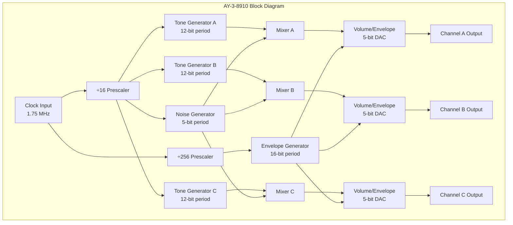
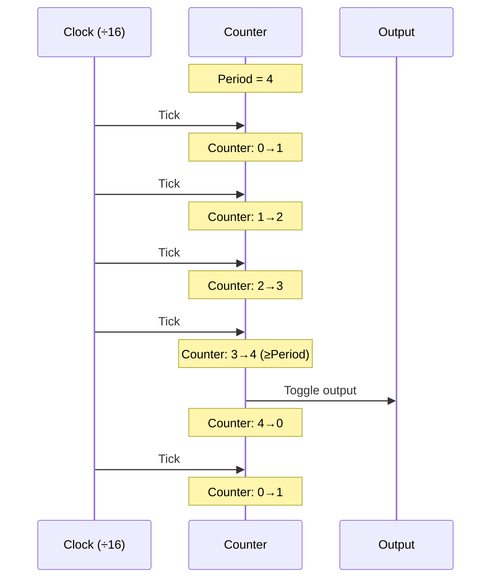
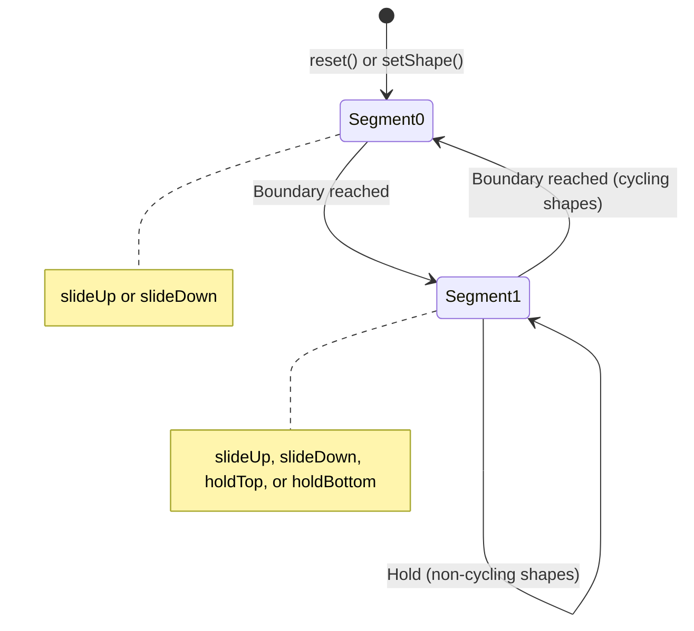
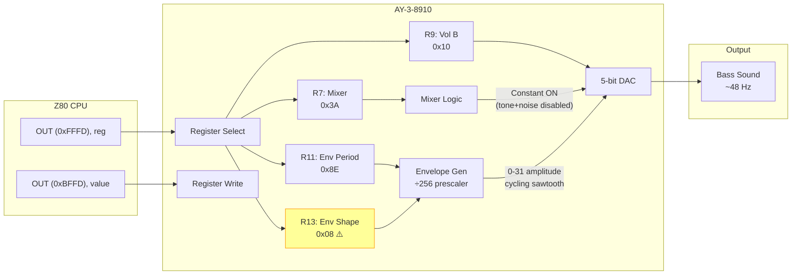
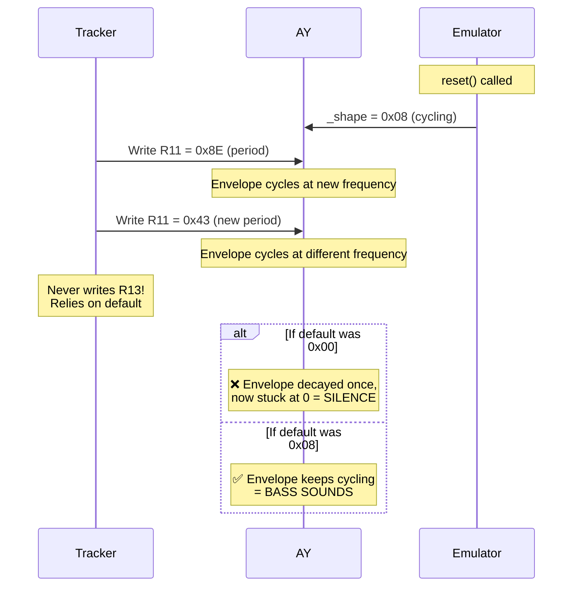
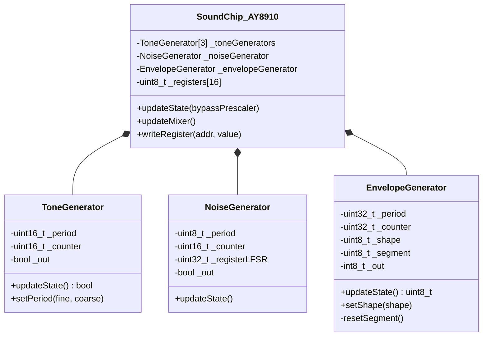
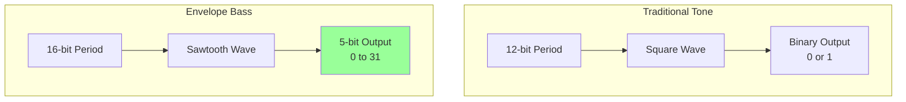
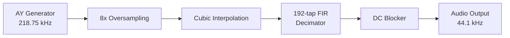

# AY-3-8910 Sound Chip Emulation

This document describes the AY-3-8910 Programmable Sound Generator (PSG) emulation in unreal-ng, covering architecture, timing, envelope generation, and implementation details.

## References

- [AY-3-8910 Datasheet (General Instrument)](http://map.grauw.nl/resources/sound/generalinstrument_ay-3-8910.pdf)
- [World of Spectrum AY Documentation](https://worldofspectrum.org/faq/reference/ay.htm)
- [Ayumi - Accurate AY Emulator](https://github.com/true-grue/ayumi)

---

## Architecture Overview

The AY-3-8910 contains three independent tone generators, one noise generator, one envelope generator, and a mixer that combines them into three output channels.



---

## Clock and Prescalers

### Base Clock Frequencies

| Platform | AY Clock | CPU Clock |
|----------|----------|-----------|
| Pentagon 128K | 1.750 MHz | 3.5 MHz |
| ZX Spectrum 128K | 1.7734 MHz | 3.5469 MHz |
| Amstrad CPC | 1.0 MHz | 4.0 MHz |

### Prescaler Ratios

The AY uses different prescalers for different subsystems:

| Subsystem | Prescaler | Effective Rate (Pentagon) |
|-----------|-----------|---------------------------|
| Tone Generators | ÷16 | 109.375 kHz |
| Noise Generator | ÷16 | 109.375 kHz |
| Envelope Generator | ÷256 | 6.836 kHz |

**Important:** The envelope generator runs 16× slower than the tone generators. This is often overlooked in emulators.

---

## Register Map

| Register | Name | Bits | Description |
|----------|------|------|-------------|
| R0 | Tone A Fine | 8 | Lower 8 bits of 12-bit period |
| R1 | Tone A Coarse | 4 | Upper 4 bits of 12-bit period |
| R2 | Tone B Fine | 8 | Lower 8 bits of 12-bit period |
| R3 | Tone B Coarse | 4 | Upper 4 bits of 12-bit period |
| R4 | Tone C Fine | 8 | Lower 8 bits of 12-bit period |
| R5 | Tone C Coarse | 4 | Upper 4 bits of 12-bit period |
| R6 | Noise Period | 5 | Noise generator period |
| R7 | Mixer Control | 8 | Enable/disable tone and noise per channel |
| R8 | Volume A | 5 | Bit 4: envelope mode, Bits 0-3: fixed volume |
| R9 | Volume B | 5 | Bit 4: envelope mode, Bits 0-3: fixed volume |
| R10 | Volume C | 5 | Bit 4: envelope mode, Bits 0-3: fixed volume |
| R11 | Envelope Fine | 8 | Lower 8 bits of 16-bit period |
| R12 | Envelope Coarse | 8 | Upper 8 bits of 16-bit period |
| R13 | Envelope Shape | 4 | Selects one of 16 envelope shapes |

### Mixer Control (R7)

```
Bit 7: Not used (I/O port B direction)
Bit 6: Not used (I/O port A direction)  
Bit 5: Noise C enable (0=on, 1=off)
Bit 4: Noise B enable (0=on, 1=off)
Bit 3: Noise A enable (0=on, 1=off)
Bit 2: Tone C enable (0=on, 1=off)
Bit 1: Tone B enable (0=on, 1=off)
Bit 0: Tone A enable (0=on, 1=off)
```

**Note:** Enable bits are active-low (0 = enabled, 1 = disabled).

---

## Tone Generation

Each tone generator produces a square wave by counting down from a 12-bit period value.

### Frequency Calculation

```
Frequency = Clock / (16 × Period)
```

For Pentagon (1.75 MHz clock):
- Minimum period (1): 109.375 kHz (inaudible)
- Maximum period (4095): 26.7 Hz (low bass)

### Square Wave Generation



---

## Noise Generation

The noise generator uses a 17-bit Linear Feedback Shift Register (LFSR) with taps at bits 0 and 3.

### LFSR Polynomial

```
Feedback = Bit0 XOR Bit3
New Bit16 = Feedback
Output = Bit0
```

### Noise Frequency

```
Noise Frequency = Clock / (16 × Period)
```

The 5-bit period register allows periods from 1 to 31.

---

## Envelope Generator

The envelope generator produces amplitude shapes that can modulate any channel's volume. It's the most complex part of the AY.

### Envelope Shapes

The 4-bit shape register (R13) selects one of 16 envelope patterns:

```
Shape   Binary    Pattern     Description
─────────────────────────────────────────────
0x00    0000      \___        Decay, hold at 0
0x01    0001      \___        Decay, hold at 0
0x02    0010      \___        Decay, hold at 0
0x03    0011      \___        Decay, hold at 0
0x04    0100      /___        Attack, hold at 0
0x05    0101      /___        Attack, hold at 0
0x06    0110      /___        Attack, hold at 0
0x07    0111      /___        Attack, hold at 0
0x08    1000      \\\\        Continuous sawtooth down
0x09    1001      \___        Decay, hold at 0
0x0A    1010      \/\/        Triangle (down-up-down-up...)
0x0B    1011      \‾‾‾        Decay, hold at max
0x0C    1100      ////        Continuous sawtooth up
0x0D    1101      /‾‾‾        Attack, hold at max
0x0E    1110      /\/\        Triangle (up-down-up-down...)
0x0F    1111      /___        Attack, hold at 0
```

### Envelope Waveforms (Visual)

```
Shape 0x08 (\\\\) - Continuous Sawtooth Down:
31 ┤\    \    \    \
   │ \    \    \    \
   │  \    \    \    \
   │   \    \    \    \
 0 ┤    \    \    \    \
   └────────────────────→ time

Shape 0x0C (////) - Continuous Sawtooth Up:
31 ┤   /    /    /    /
   │  /    /    /    /
   │ /    /    /    /
   │/    /    /    /
 0 ┤    /    /    /    /
   └────────────────────→ time

Shape 0x0A (\/\/) - Triangle (Down-Up):
31 ┤\      /\      /\
   │ \    /  \    /  \
   │  \  /    \  /    \
   │   \/      \/      \
 0 ┤
   └────────────────────→ time

Shape 0x00 (\___) - Decay, Hold at 0:
31 ┤\
   │ \
   │  \
   │   \____________________
 0 ┤
   └────────────────────→ time
```

### Default Shape on Reset

**Implementation note:** We default to shape 0x08 (continuous sawtooth) rather than 0x00 (one-shot decay). Many demos and games never write to R13 and rely on the envelope cycling continuously for bass synthesis. Shape 0x00 would decay once and produce silence thereafter.

```cpp
// In EnvelopeGenerator::reset()
_shape = 0x08;  // Continuous sawtooth, not one-shot decay
```

### Envelope State Machine



### Envelope Period and Frequency

```
Envelope Frequency = Clock / (256 × Period)
```

For bass synthesis using envelope, typical periods:
- Period 142 (0x8E): ~48 Hz bass note
- Period 67 (0x43): ~101 Hz bass note

---

## Mixer Logic

The mixer combines tone and noise for each channel. The logic is:

```
Channel Output = (Tone OR ToneDisabled) AND (Noise OR NoiseDisabled)
```

This means:
- Disabling both tone AND noise produces a constant HIGH (channel always on)
- The channel can then be amplitude-modulated by the envelope alone

### Bass Synthesis Technique

A popular technique for deep bass uses the envelope generator as an LFO to create frequencies below what tone generators can produce.

#### Setup Steps

1. **Disable tone in mixer** (R7 bit set) — removes square wave
2. **Enable envelope mode** (R8/R9/R10 bit 4 set) — envelope controls amplitude
3. **Use a cycling envelope shape** (0x08 or 0x0C) — continuous oscillation
4. **Set envelope period** for desired bass frequency

#### Signal Flow



#### Register Write Sequence

The Z80 writes to AY registers via two I/O ports:

| Step | Port | Value | Purpose |
|------|------|-------|---------|
| 1 | 0xFFFD | 0x07 | Select register R7 (Mixer) |
| 2 | 0xBFFD | 0x3A | Write mixer value |
| 3 | 0xFFFD | 0x09 | Select register R9 (Volume B) |
| 4 | 0xBFFD | 0x10 | Write envelope mode enabled |
| 5 | 0xFFFD | 0x0B | Select register R11 (Env Period Fine) |
| 6 | 0xBFFD | 0x8E | Write period = 142 |
| 7 | 0xFFFD | 0x0D | Select register R13 (Env Shape) |
| 8 | 0xBFFD | 0x08 | Write continuous sawtooth ⚠️ **Often skipped!** |

#### Register Bit Breakdown

```
┌─────────────────────────────────────────────────────────────────────┐
│ R7 (Mixer Control) = 0x3A = 0b00111010                              │
├─────────────────────────────────────────────────────────────────────┤
│ Bit 7: 0  │ I/O Port B direction (unused)                           │
│ Bit 6: 0  │ I/O Port A direction (unused)                           │
│ Bit 5: 1  │ Noise C: DISABLED ─────────┐                            │
│ Bit 4: 1  │ Noise B: DISABLED ─────────┼─► Channel B: both off      │
│ Bit 3: 1  │ Noise A: DISABLED          │   = constant HIGH output   │
│ Bit 2: 0  │ Tone C:  enabled           │                            │
│ Bit 1: 1  │ Tone B:  DISABLED ─────────┘                            │
│ Bit 0: 0  │ Tone A:  enabled                                        │
└─────────────────────────────────────────────────────────────────────┘

┌─────────────────────────────────────────────────────────────────────┐
│ R9 (Volume B) = 0x10 = 0b00010000                                   │
├─────────────────────────────────────────────────────────────────────┤
│ Bit 4: 1  │ Envelope Mode: ON ──► Volume controlled by envelope     │
│ Bit 3-0:  │ 0000 (ignored when envelope mode is on)                 │
└─────────────────────────────────────────────────────────────────────┘

┌─────────────────────────────────────────────────────────────────────┐
│ R11 (Envelope Period Fine) = 0x8E = 142                             │
│ R12 (Envelope Period Coarse) = 0x00 = 0 (often not written)         │
├─────────────────────────────────────────────────────────────────────┤
│ Total Period = (R12 << 8) | R11 = 142                               │
│                                                                     │
│ Envelope Frequency = 1,750,000 / (256 × 142 × 32) ≈ 1.5 Hz          │
│ Output Frequency   = 1.5 Hz × 32 steps ≈ 48 Hz (bass note)          │
└─────────────────────────────────────────────────────────────────────┘

┌─────────────────────────────────────────────────────────────────────┐
│ R13 (Envelope Shape) = 0x08 = 0b00001000                            │
├─────────────────────────────────────────────────────────────────────┤
│ Shape 0x08 = Continuous sawtooth down (\\\\)                        │
│                                                                     │
│ ⚠️  WARNING: Many trackers/demos NEVER WRITE THIS REGISTER!         │
│     They rely on envelope already cycling from:                     │
│       • Previous software                                           │
│       • Power-on default (hardware undefined)                       │
│       • Emulator default (must be 0x08, not 0x00!)                  │
└─────────────────────────────────────────────────────────────────────┘
```

#### Z80 Assembly Example

```asm
; Setup bass on Channel B using envelope
; Assumes AY is at standard Spectrum 128K ports

    ld   a, 7           ; Select R7 (Mixer)
    ld   bc, 0xFFFD
    out  (c), a
    ld   a, 0x3A        ; Tone B off, Noise B off
    ld   bc, 0xBFFD
    out  (c), a

    ld   a, 9           ; Select R9 (Volume B)  
    ld   bc, 0xFFFD
    out  (c), a
    ld   a, 0x10        ; Envelope mode on
    ld   bc, 0xBFFD
    out  (c), a

    ld   a, 11          ; Select R11 (Envelope Period Fine)
    ld   bc, 0xFFFD
    out  (c), a
    ld   a, 0x8E        ; Period = 142 (~48 Hz bass)
    ld   bc, 0xBFFD
    out  (c), a

    ; R13 (Envelope Shape) often NOT written!
    ; Relies on default or previous state
    ; To be safe, uncomment below:
    ;
    ; ld   a, 13        ; Select R13 (Envelope Shape)
    ; ld   bc, 0xFFFD
    ; out  (c), a
    ; ld   a, 0x08      ; Continuous sawtooth
    ; ld   bc, 0xBFFD
    ; out  (c), a
```

#### Why R13 Is Often Not Written

Music trackers like Vortex Tracker, Pro Tracker, and others optimize by:
1. Setting envelope shape once at song start
2. Only updating period (R11/R12) for different bass notes
3. Assuming shape persists between notes

This works on real hardware if the previous software set a cycling shape. It works in emulators **only if the default shape is cycling (0x08)**, not one-shot decay (0x00).



#### Real-World Register Trace and Waveform

Below is an actual trace from the "Eye Ache" demo showing register writes and resulting waveforms:

```
┌──────────────────────────────────────────────────────────────────────────┐
│ FRAME 0: Initial Setup                                                   │
├──────────────────────────────────────────────────────────────────────────┤
│ Time    Register  Value   Meaning                                        │
│ ─────────────────────────────────────────────────────────────────────────│
│ T=35    R10       0xAF    Ch C: envelope ON (bit4=1), vol bits ignored   │
│ T=40    R4        0xE0    Ch C tone period fine = 224                    │
│ T=45    R5        0x08    Ch C tone period coarse = 8 → period=2272      │
│ T=55    R9        0xB0    Ch B: envelope ON ──► BASS CHANNEL             │
│ T=60    R2        0xE0    Ch B tone period fine = 224                    │
│ T=65    R3        0x08    Ch B tone period coarse = 8 → period=2272      │
│ T=80    R8        0xAC    Ch A: envelope ON                              │
│ T=85    R0        0x1C    Ch A tone period fine = 28                     │
│ T=85    R1        0x01    Ch A tone period coarse = 1 → period=284       │
│ T=90    R6        0x00    Noise period = 0 (minimum)                     │
│ T=95    R7        0x1A    Mixer: ToneB=OFF, NoiseB=OFF (bass setup!)     │
└──────────────────────────────────────────────────────────────────────────┘

┌──────────────────────────────────────────────────────────────────────────┐
│ FRAME 1: Envelope Period Set                                             │
├──────────────────────────────────────────────────────────────────────────┤
│ T=4470  R11       0x8E    Envelope period = 142 → ~48 Hz bass            │
│                           NOTE: R13 (shape) NEVER WRITTEN!               │
└──────────────────────────────────────────────────────────────────────────┘
```

**Resulting Channel B Waveform:**

```
Channel B Output (Bass via Envelope)
────────────────────────────────────

Mixer Logic:  (ToneB_out OR !ToneB_enabled) AND (NoiseB_out OR !NoiseB_enabled)
            = (X OR TRUE) AND (X OR TRUE)
            = TRUE AND TRUE
            = 1 (constant HIGH)

Volume:       Envelope mode ON → output = envelope_value (0-31)

Envelope Shape: 0x08 (continuous sawtooth, default)

                     ┌── One envelope cycle ──┐
                     │   Period = 142         │
                     │   × 256 (prescaler)    │
                     │   = 36,352 clocks      │
                     │   = ~20.8 ms           │
                     │                        │
Amplitude            │                        │
   31 ┤\             │\             \         │
      │ \            │ \             \        │
      │  \           │  \             \       │
      │   \          │   \             \      │
      │    \         │    \             \     │
      │     \        │     \             \    │
      │      \       │      \             \   │
      │       \      │       \             \  │
      │        \     │        \             \ │
    0 ┤─────────\────┼─────────\─────────────\┼─────
      └──────────────┴───────────────────────────────→ Time
      
      Output Frequency = 1 / 0.0208 s ≈ 48 Hz (G1 bass note)
```

**Comparison: What happens with different R13 values:**

```
┌─────────────────────────────────────────────────────────────────────────┐
│ R13 = 0x08 (Continuous Sawtooth) ✅ CORRECT                             │
├─────────────────────────────────────────────────────────────────────────┤
│                                                                         │
│   31 ┤\      \      \      \      \      \      \                       │
│      │ \      \      \      \      \      \      \                      │
│      │  \      \      \      \      \      \      \                     │
│      │   \      \      \      \      \      \      \                    │
│    0 ┤────\──────\──────\──────\──────\──────\──────\──────             │
│      └───────────────────────────────────────────────────→ time         │
│                                                                         │
│   Result: Continuous 48 Hz sawtooth bass                                │
└─────────────────────────────────────────────────────────────────────────┘

┌─────────────────────────────────────────────────────────────────────────┐
│ R13 = 0x00 (One-Shot Decay) ❌ WRONG DEFAULT                            │
├─────────────────────────────────────────────────────────────────────────┤
│                                                                         │
│   31 ┤\                                                                 │
│      │ \                                                                │
│      │  \                                                               │
│      │   \___________________________________________________           │
│    0 ┤                                                                  │
│      └───────────────────────────────────────────────────→ time         │
│                                                                         │
│   Result: Single decay then SILENCE (envelope stuck at 0)               │
└─────────────────────────────────────────────────────────────────────────┘

┌─────────────────────────────────────────────────────────────────────────┐
│ R13 = 0x0E (Triangle /\/\)                                              │
├─────────────────────────────────────────────────────────────────────────┤
│                                                                         │
│   31 ┤   /\      /\      /\      /\      /\                             │
│      │  /  \    /  \    /  \    /  \    /  \                            │
│      │ /    \  /    \  /    \  /    \  /    \                           │
│      │/      \/      \/      \/      \/      \                          │
│    0 ┤                                                                  │
│      └───────────────────────────────────────────────────→ time         │
│                                                                         │
│   Result: Softer bass (triangle = fewer harmonics than sawtooth)        │
└─────────────────────────────────────────────────────────────────────────┘
```

#### Note Changes via R11 Updates Only

As the music plays, only R11 (envelope period) is updated to change bass notes:

```
┌────────────────────────────────────────────────────────────────────────┐
│ BASS NOTE SEQUENCE (R11 writes only, R13 never written)                │
├────────────────────────────────────────────────────────────────────────┤
│ Frame   R11     Period    Frequency    Note                            │
│ ────────────────────────────────────────────────────────────────────── │
│ 1       0x8E    142       ~48 Hz       G1                              │
│ 11      0x43    67        ~101 Hz      G2                              │
│ 21      0x8E    142       ~48 Hz       G1                              │
│ 31      0x4F    79        ~86 Hz       F2                              │
│ 41      0x8E    142       ~48 Hz       G1                              │
│ 151     0x3F    63        ~108 Hz      A2                              │
│ 161     0x7E    126       ~54 Hz       A1                              │
│ 171     0x3C    60        ~113 Hz      A#2                             │
└────────────────────────────────────────────────────────────────────────┘

Generated Audio Waveform (envelope output over time):

Frame 1-10 (G1):    Frame 11-20 (G2):   Frame 21-30 (G1):
Period=142          Period=67           Period=142
~48 Hz              ~101 Hz             ~48 Hz

   \  \  \  \        \\\\\\\\\\          \  \  \  \
    \  \  \  \       \\\\\\\\\\           \  \  \  \
     \  \  \  \      \\\\\\\\\\            \  \  \  \
──────────────────────────────────────────────────────→
   └─ slow ─┘        └─ fast ─┘          └─ slow ─┘
```

---

## Volume and DAC

### Fixed Volume Mode

When envelope mode is disabled (bit 4 of R8/R9/R10 = 0), the lower 4 bits set a fixed volume level (0-15).

### Envelope Volume Mode

When envelope mode is enabled (bit 4 = 1), the 5-bit envelope generator output (0-31) controls volume.

### DAC Logarithmic Table

The AY uses a logarithmic DAC, not linear. The voltage levels are:

```cpp
static constexpr double AY_DAC_TABLE[] = {
    0.0,              0.0,              // 0-1
    0.00999465934234, 0.00999465934234, // 2-3
    0.01445029373620, 0.01445029373620, // 4-5
    0.02105745021740, 0.02105745021740, // 6-7
    0.03070115205620, 0.03070115205620, // 8-9
    0.04554818036160, 0.04554818036160, // 10-11
    0.06449988555730, 0.06449988555730, // 12-13
    0.10736247806500, 0.10736247806500, // 14-15
    0.12658884565500, 0.12658884565500, // 16-17
    0.20498970016000, 0.20498970016000, // 18-19
    0.29221026932200, 0.29221026932200, // 20-21
    0.37283894102400, 0.37283894102400, // 22-23
    0.49253070878200, 0.49253070878200, // 24-25
    0.63532463569100, 0.63532463569100, // 26-27
    0.80558480201400, 0.80558480201400, // 28-29
    1.0,              1.0               // 30-31
};
```

---

## Implementation Details

### File Structure

```
core/src/emulator/sound/chips/
├── soundchip_ay8910.h      # AY chip class with nested generators
├── soundchip_ay8910.cpp    # Implementation
└── soundchip_turbosound.h  # Dual-AY TurboSound wrapper
```

### Class Hierarchy



### Envelope Handler Matrix

The envelope uses a 2D handler matrix indexed by shape and segment:

```cpp
EnvelopeHandler _handlers[16][2] = {
    { slideDown, holdBottom },  // 0x00: \___
    { slideDown, holdBottom },  // 0x01: \___
    { slideDown, holdBottom },  // 0x02: \___
    { slideDown, holdBottom },  // 0x03: \___
    { slideUp,   holdBottom },  // 0x04: /___
    { slideUp,   holdBottom },  // 0x05: /___
    { slideUp,   holdBottom },  // 0x06: /___
    { slideUp,   holdBottom },  // 0x07: /___
    { slideDown, slideDown  },  // 0x08: \\\\ (continuous)
    { slideDown, holdBottom },  // 0x09: \___
    { slideDown, slideUp    },  // 0x0A: \/\/ (triangle)
    { slideDown, holdTop    },  // 0x0B: \‾‾‾
    { slideUp,   slideUp    },  // 0x0C: //// (continuous)
    { slideUp,   holdTop    },  // 0x0D: /‾‾‾
    { slideUp,   slideDown  },  // 0x0E: /\/\ (triangle)
    { slideUp,   holdBottom },  // 0x0F: /___
};
```

### Segment Transition Logic

```cpp
void slideDown(EnvelopeGenerator* obj) {
    obj->_out -= 1;
    if (obj->_out < 0) {
        obj->_segment ^= 1;  // Toggle segment
        obj->resetSegment(); // Set appropriate initial value
    }
}

void resetSegment() {
    EnvelopeHandler handler = _handlers[_shape][_segment];
    
    if (handler == &slideDown)
        _out = 0x1F;      // Start at max (31)
    else if (handler == &slideUp)
        _out = 0x00;      // Start at min (0)
    else if (handler == &holdBottom)
        _out = 0x00;      // Hold at 0
    else if (handler == &holdTop)
        _out = 0x1F;      // Hold at 31
}
```

---

## Digitized Bass (Envelope-Driven LFO)

One of the most distinctive AY techniques is using the envelope generator as a Low Frequency Oscillator (LFO) to create deep bass sounds that the tone generators cannot produce directly.

### The Problem

Tone generators have a minimum frequency of ~27 Hz (period 4095), but:
- Square waves sound thin at low frequencies
- The 12-bit period limits the lowest note
- No waveform shaping possible

### The Solution: Envelope as LFO

The envelope generator can produce frequencies as low as **0.1 Hz** (period 65535 at ÷256 prescaler), with a 5-bit (32-level) amplitude resolution that creates a richer waveform than a binary square wave.



### Register Configuration

```
┌─────────────────────────────────────────────────────────────┐
│ DIGITIZED BASS SETUP                                        │
├─────────────────────────────────────────────────────────────┤
│ R7  (Mixer)     = 0x3A  ──► Tone B OFF, Noise B OFF         │
│                            (bits 1 and 4 set = disabled)    │
│                                                             │
│ R9  (Volume B)  = 0x10  ──► Envelope mode ON (bit 4)        │
│                            Volume bits ignored              │
│                                                             │
│ R11 (Env Fine)  = 0x8E  ──► Period low byte = 142           │
│ R12 (Env Coarse)= 0x00  ──► Period high byte = 0            │
│                            Total period = 142               │
│                                                             │
│ R13 (Env Shape) = 0x08  ──► Continuous sawtooth (\\\\)      │
│                            OFTEN NOT WRITTEN!               │
└─────────────────────────────────────────────────────────────┘
```

### Frequency Calculation

```
Bass Frequency = Clock / (256 × Period × 32)

For Pentagon (1.75 MHz) with Period = 142:
  Frequency = 1,750,000 / (256 × 142 × 32)
            = 1,750,000 / 1,163,264
            ≈ 1.5 Hz per envelope cycle
            
But the OUTPUT frequency is 32× higher (one cycle = 32 amplitude steps):
  Output Frequency = 1.5 × 32 ≈ 48 Hz (low bass note)
```

### Common Bass Periods

| Period (hex) | Period (dec) | Approximate Note |
|--------------|--------------|------------------|
| 0x008E | 142 | G1 (~48 Hz) |
| 0x0043 | 67 | G2 (~101 Hz) |
| 0x004F | 79 | F2 (~86 Hz) |
| 0x003F | 63 | A2 (~108 Hz) |
| 0x007E | 126 | D2 (~54 Hz) |

### The "Silent Bass" Bug

Many demos and trackers **never write to R13** (envelope shape register). They rely on the envelope already being in a cycling mode from:
1. Previous software
2. Power-on state
3. Emulator default

**The fix:** Default to shape 0x08 (continuous sawtooth), not 0x00 (one-shot decay):

```cpp
void EnvelopeGenerator::reset() {
    _period = 0x0001;
    _shape = 0x08;  // Continuous sawtooth, NOT 0x00!
    _counter = 0;
    _segment = 0;
    resetSegment();
}
```

If defaulting to 0x00:
```
Shape 0x00: \___
            ↓
         Decays once from 31 to 0, then HOLDS AT ZERO FOREVER
            ↓
         Bass channel produces silence
```

If defaulting to 0x08:
```
Shape 0x08: \\\\
            ↓
         Continuously cycles 31→0→31→0→31...
            ↓
         Bass channel produces sawtooth waveform at envelope frequency
```

### Waveform Visualization

```
Continuous Sawtooth Bass (Shape 0x08):

Amplitude
31 ┤\      \      \      \      \
   │ \      \      \      \      \
   │  \      \      \      \      \
   │   \      \      \      \      \
   │    \      \      \      \      \
   │     \      \      \      \      \
 0 ┤──────\──────\──────\──────\──────\──
   └───────────────────────────────────────→ Time
   
   ←─────── One period = 142 × 256 clocks ──────→
   
   Output frequency ≈ 48 Hz (audible bass note)
```

### Why It Sounds Good

1. **Harmonic Content**: A sawtooth wave contains all harmonics (1f, 2f, 3f, 4f...), giving it a rich, "buzzy" quality ideal for bass.

2. **32-Level Resolution**: Unlike a binary square wave, the 32 amplitude steps create a smoother waveform with less aliasing.

3. **Deep Frequencies**: The ÷256 prescaler allows frequencies below what tone generators can produce.

### Mixer Logic for Bass

When both tone AND noise are disabled for a channel:

```cpp
// Mixer formula
channelOut = (toneGenerator.out() || !toneEnabled) 
           && (noiseGenerator.out() || !noiseEnabled);

// With tone disabled (toneEnabled=false) and noise disabled (noiseEnabled=false):
channelOut = (anything || true) && (anything || true)
           = true && true
           = true  // Channel is ALWAYS "on"

// The envelope then modulates this constant "on" signal:
volume = envelopeGenerator.out();  // 0-31 amplitude from envelope
finalOutput = channelOut * volume; // = 1 * envelope = envelope
```

### Implementation Checklist

To correctly render digitized bass:

- [ ] Envelope generator runs at ÷256 (not ÷16 like tone)
- [ ] Default envelope shape is 0x08 (continuous), not 0x00 (one-shot)
- [ ] Segment transitions call `resetSegment()` to set proper initial values
- [ ] `holdBottom` sets output to 0, `holdTop` sets output to 31
- [ ] Cycling shapes (0x08, 0x0A, 0x0C, 0x0E) never stop oscillating
- [ ] Volume register bit 4 correctly enables envelope mode
- [ ] Mixer disabled-tone + disabled-noise = constant HIGH output

### Debugging Silent Bass

If bass is missing:

1. **Check envelope shape**: Is it 0x00 (one-shot) or 0x08 (cycling)?
2. **Check envelope output**: Is `_out` stuck at 0 or -1?
3. **Check mixer**: Is channel output always 0 due to incorrect mixer logic?
4. **Check envelope mode**: Is bit 4 of volume register set?
5. **Check segment transitions**: Does `resetSegment()` properly initialize output?

---

## Common Pitfalls

### 1. Wrong Envelope Prescaler

The envelope generator uses ÷256, not ÷16 like tone generators. Running envelope at the wrong rate makes bass 16× too high or too low.

### 2. One-Shot Default Shape

Many demos never write R13 and expect the envelope to cycle. Using shape 0x00 (one-shot decay) as default produces silence after the first decay.

### 3. Mixer Active-Low Logic

The mixer enable bits are inverted: 0 means enabled, 1 means disabled.

### 4. Hold State Initialization

When transitioning to a hold state, the output must be clamped to the appropriate boundary (0 for holdBottom, 31 for holdTop), not left at whatever value the previous segment left it.

---

## Audio Processing Chain

After the raw AY samples are generated, they go through additional processing:



See [audio-processing.md](audio-processing.md) for detailed DSP algorithm documentation.

---

## Testing

Load `testdata/loaders/sna/eyeache1.sna` to verify envelope-based bass synthesis. The central channel (B) uses:
- Tone disabled in mixer
- Envelope mode enabled
- Cycling envelope for low-frequency bass

If bass is missing, check envelope shape default and segment transition logic.
