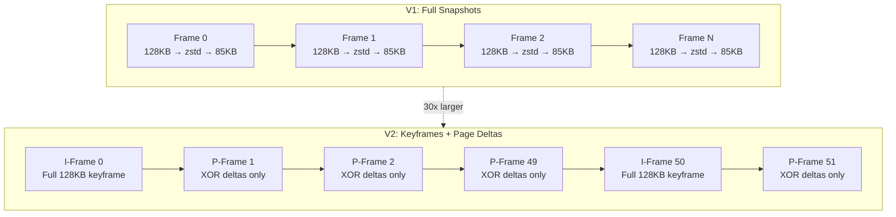
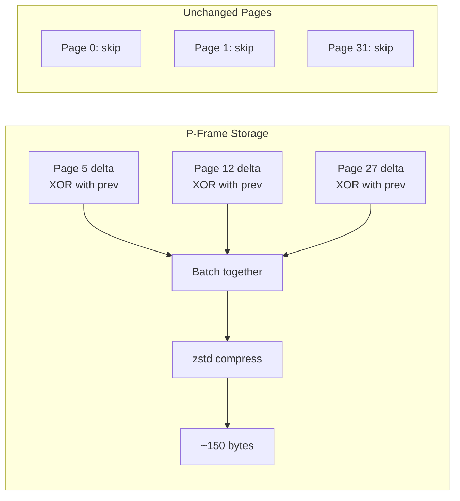
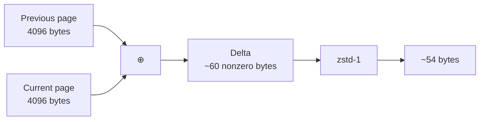
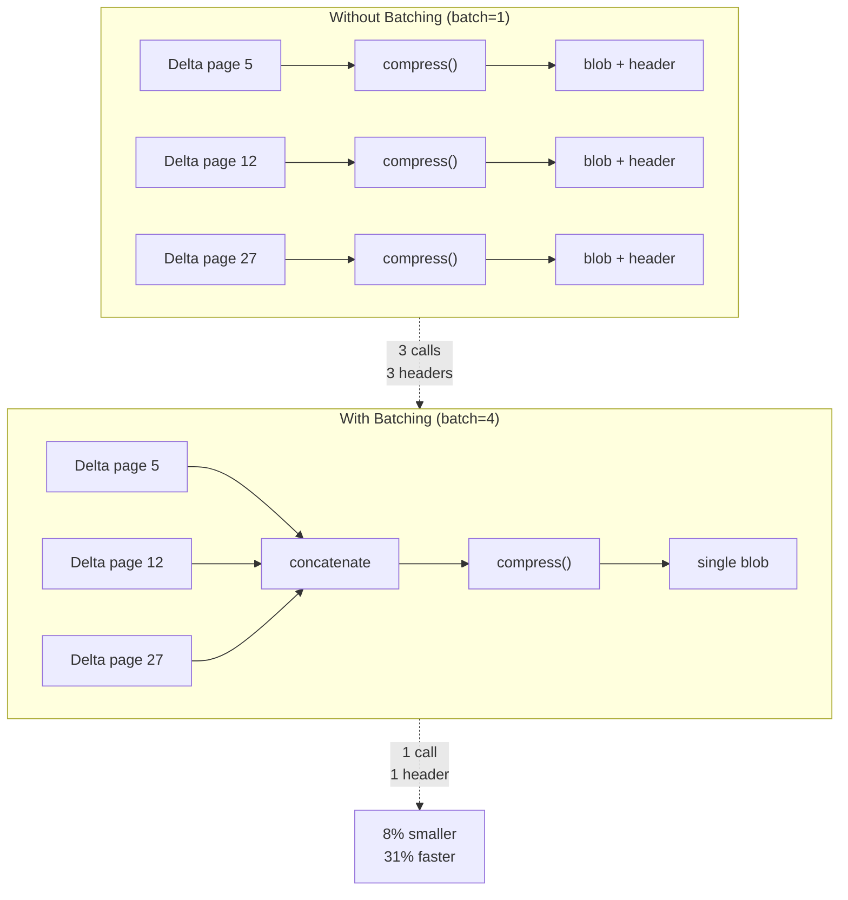
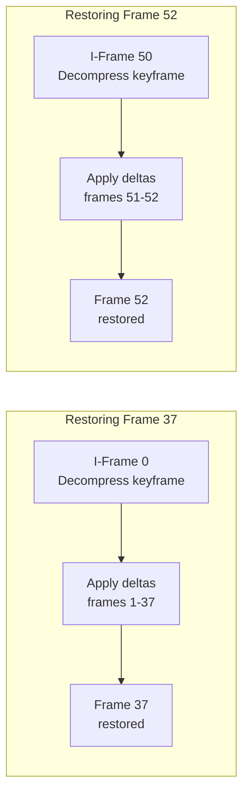
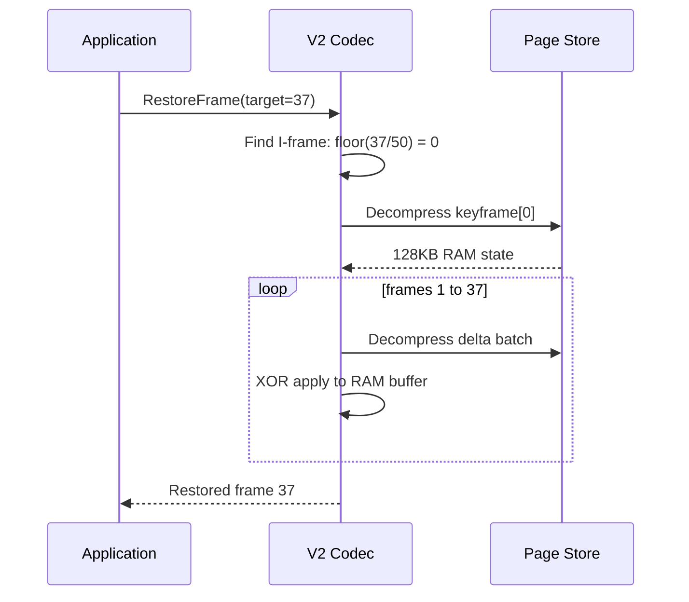
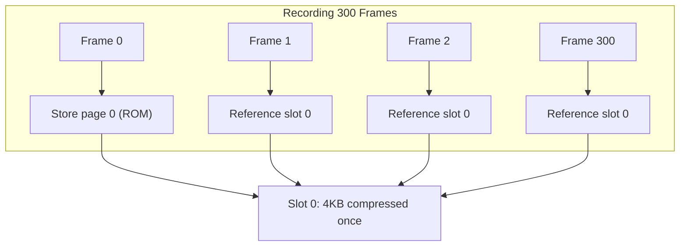
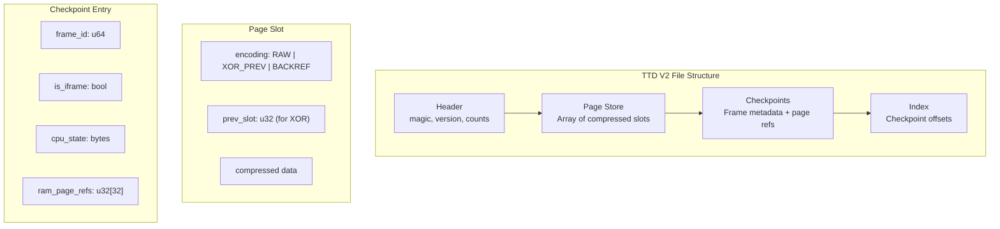

# TTD V2 Technical Design

## Executive Summary

Time Travel Debugging (TTD) captures emulator state at every frame, enabling developers to scrub backwards through execution history. The original V1 format stores complete 128KB snapshots per frame — simple but storage-hungry. V2 introduces page-granular XOR deltas with periodic keyframes, achieving **30x smaller storage** with only **1.6x slower restore** on real ZX Spectrum recordings.

This document describes the V2 architecture, the benchmarking process that shaped it, and the trade-offs involved in each design decision.

---

## The Problem V2 Solves

A ZX Spectrum 128K has 128KB of RAM organized as 32 pages of 4KB each. At 50 FPS, capturing full snapshots generates:

```
128 KB × 50 frames/sec × 60 sec = 375 MB per minute
```

For long debugging sessions, this becomes prohibitive. Yet most of that data is redundant:

1. **Static pages (~60%)**: ROM shadow copies, unused banks, and display memory regions that rarely change
2. **Sparse changes**: Even "active" pages typically modify only 1-2% of bytes per frame
3. **Temporal locality**: The same pages tend to change frame after frame

V2 exploits all three properties.

---

## Architecture Overview



### V1: The Baseline

V1 treats each frame independently. Every frame compresses the entire 128KB RAM state with zstd level 1, producing roughly 85KB of compressed data. Restore is trivial: decompress the target frame.

**Advantages:**
- O(1) restore — decompress one blob
- Simple implementation
- No dependencies between frames

**Disadvantages:**
- No deduplication of unchanged data
- Storage grows linearly with recording length
- 85KB × 50 FPS = 4.25 MB/sec

### V2: Page-Granular Deltas

V2 partitions RAM into 4KB pages and tracks changes at page granularity. The format uses two frame types:

**I-frames (Intra-coded):** Complete 128KB snapshots, stored every N frames. These serve as random-access anchor points.

**P-frames (Predicted):** Store only the pages that changed since the previous frame, encoded as XOR deltas. Unchanged pages cost zero bytes.



---

## XOR Delta Encoding

The core insight is that XOR between consecutive frames produces extremely sparse data. When a game updates a few sprite positions, only those bytes differ — the XOR result is mostly zeros, which zstd compresses to near-nothing.



### Why XOR Beats Other Transforms

We benchmarked several delta encodings on real TTD captures:

| Method | Compressed Size | Encode Time | Verdict |
|--------|-----------------|-------------|---------|
| **XOR + zstd-1** | **54 bytes/page** | **4.8 µs** | **Winner** |
| Delta RLE + zstd | 60 bytes/page | 138 µs | 30x slower, worse compression |
| SUB filter + zstd | 66 bytes/page | 150 µs | Worse on both axes |
| Raw page + zstd | 2.1 KB/page | 12 µs | No delta benefit |

XOR wins because it produces runs of zeros that zstd's entropy coder handles optimally. More sophisticated transforms (like PNG's SUB filter or run-length encoding) add CPU overhead without improving compression on already-sparse data.

---

## Batching: Amortizing Compression Overhead

Each zstd compress call has fixed overhead (~3 µs for context setup). With 2-3 changed pages per frame, that overhead dominates. Batching concatenates multiple page deltas before compression:



### Batch Size Trade-off

| Batch Size | Storage | Restore Time | Analysis |
|------------|---------|--------------|----------|
| 1 | 314 KB | 160 µs | Maximum granularity, highest overhead |
| **4** | **290 KB** | **110 µs** | **Sweet spot** |
| 8 | 289 KB | 108 µs | Diminishing returns |
| 16 | 287 KB | 105 µs | Minimal additional benefit |

Batch=4 captures most of the benefit. Beyond that, we're fighting diminishing returns while increasing the minimum decompression unit.

---

## I-Frame Interval: The Core Trade-off

The I-frame interval determines how far back restore must walk to reconstruct a target frame. This is the fundamental storage-vs-latency trade-off in V2.



### Interval Benchmarks

We measured storage and restore latency across different I-frame intervals on real TTD files:

| I-Frame Interval | Storage | Restore Latency | % of 6ms Budget |
|------------------|---------|-----------------|-----------------|
| V1 (every frame) | 64 MB | 3.6 µs | 0.06% |
| 5 frames | 13.1 MB | 16 µs | 0.3% |
| 10 frames | 6.7 MB | 31 µs | 0.5% |
| 25 frames | 2.9 MB | 78 µs | 1.3% |
| **50 frames** | **1.6 MB** | **155 µs** | **2.6%** |
| 100 frames | 0.9 MB | 310 µs | 5.2% |

```mermaid
xychart-beta
    title "I-Frame Interval Trade-off"
    x-axis "I-Frame Interval" [5, 10, 25, 50, 100]
    y-axis "Storage (MB)" 0 --> 15
    line "Storage" [13.1, 6.7, 2.9, 1.6, 0.9]
```

### Why 50 Frames (1 Second)

At 50 FPS, an I-frame every 50 frames means one keyframe per second. This provides:

1. **40x storage reduction** vs V1
2. **155 µs worst-case restore** — only 2.6% of the 6ms frame budget
3. **Natural scrubbing granularity** — timeline scrubbing at second boundaries is instant

The key insight is that delta storage is roughly constant regardless of I-frame interval (the same pages change the same amount). Only keyframe storage scales with interval frequency. At I@50, keyframes are 82% of V2 storage — going to I@100 halves them but doubles worst-case restore latency.

---

## Restore Algorithm

Restoring a frame requires:
1. Finding the nearest preceding I-frame
2. Decompressing the keyframe
3. Walking forward through P-frames, applying each delta



### Implementation

```cpp
void RestoreFrame(int target_frame) {
    // 1. Find nearest I-frame (O(1) lookup)
    int kf_idx = target_frame / I_FRAME_INTERVAL;
    int kf_frame = kf_idx * I_FRAME_INTERVAL;
    
    // 2. Decompress keyframe to restore buffer (~90 µs)
    Decompress(keyframes[kf_idx], restore_buffer);
    
    // 3. Apply delta chain forward (~3 µs per page delta)
    for (int f = kf_frame + 1; f <= target_frame; ++f) {
        for (auto& [pages_in_batch, compressed] : deltas[f].batches) {
            // Decompress the batch
            Decompress(compressed, decomp_buffer);
            
            // XOR apply each page (~63 ns per page)
            for (int i = 0; i < pages_in_batch; ++i) {
                int page_idx = deltas[f].page_indices[i];
                XorApply(restore_buffer + page_idx * PAGE_SIZE,
                         decomp_buffer + i * PAGE_SIZE);
            }
        }
    }
}
```

### Latency Breakdown

| Operation | Time | Notes |
|-----------|------|-------|
| Decompress 128KB keyframe | ~90 µs | Dominates for frames near I-frame |
| Decompress 1 page batch | 3.2 µs | ~3 µs zstd overhead + ~0.2 µs memcpy |
| XOR apply 1 page | 63 ns | Negligible — memory bandwidth limited |
| **Worst case (49 P-frames)** | **~250 µs** | 90 + 49 × (3.2 × 2 pages) |
| **Average (25 P-frames)** | **~161 µs** | Measured on real TTD files |

---

## Static Page Optimization

ZX Spectrum RAM contains large regions that never change during execution:

- **ROM shadow** (pages 0-3): Copy of ROM, read-only
- **Display memory** (pages 10-11): Often static between games
- **Unused banks**: Games rarely use all 128KB

V2 detects static pages by hashing and stores them exactly once. Subsequent frames reference the original slot:



In real recordings, ~60% of pages are static across the entire session. This alone provides 2.5x compression vs storing every page every frame.

---

## File Format



### Header

```
Offset  Size  Field
------  ----  -----
0       4     magic: "TTD2" (0x54544432)
4       2     version: 1
6       2     flags
8       4     model_id
12      4     model_ram_pages (32 for 128K)
16      4     page_store_count
20      4     checkpoint_count
24      4     iframe_interval (50)
```

### Page Slot Encodings

| Code | Name | Description |
|------|------|-------------|
| 0 | `RAW` | Compressed full page (I-frame pages) |
| 1 | `XOR_PREV` | XOR delta from `prev_slot` |
| 2 | `BACKREF` | Reference to identical slot (no data) |

---

## Benchmark Results

### Real TTD Files

We tested on four real ZX Spectrum recordings with varying activity levels:

| Recording | Content | Frames | V1 Size | V2 Size | Ratio |
|-----------|---------|--------|---------|---------|-------|
| demo_7threality | Demo with heavy effects | 303 | 25.7 MB | 707 KB | **36x** |
| demo_across-the-edge | Demo with scrolling | 301 | 21.8 MB | 716 KB | **31x** |
| active_demo | Interactive game | 303 | 5.2 MB | 153 KB | **34x** |
| idle_session | Menu/idle | 302 | 2.8 MB | 271 KB | **10x** |
| **Total** | | **1209** | **55.5 MB** | **1.85 MB** | **30x** |

### Restore Latency

| Metric | V1 | V2 (I@50 + batch=4) |
|--------|-----|---------------------|
| Restore time | 98 µs | 161 µs |
| Ratio | 1.0x | 1.6x slower |
| % of 6ms budget | 1.6% | 2.7% |

V2 trades 1.6x slower restore for 30x smaller storage — a clear win for any recording longer than a few seconds.

---

## Decision Summary

| Decision | Choice | Rationale |
|----------|--------|-----------|
| Delta encoding | XOR | Fastest, best compression on sparse data |
| Compression | zstd level 1 | Speed matters more than 2% extra compression |
| Batch size | 4 pages | Sweet spot for overhead vs granularity |
| I-frame interval | 50 frames | 2.6% of frame budget is acceptable for 40x storage |

### Recommended Configuration

```cpp
constexpr int I_FRAME_INTERVAL = 50;   // 1 keyframe per second at 50 FPS
constexpr int BATCH_SIZE = 4;          // Pages per compress call
constexpr int ZSTD_LEVEL = 1;          // Fast compression
constexpr bool CHECKSUM_ENABLED = false; // Skip for speed
```

---

## When to Tune

| Scenario | Adjustment | Trade-off |
|----------|------------|-----------|
| Very long recordings | I@100 | 2x storage savings, 2x restore latency |
| Frequent scrubbing | I@10-25 | Faster restore, larger storage |
| Archival storage | batch=8, zstd-3 | 15% smaller, 3x slower |
| Real-time capture | batch=1, zstd-1 | Lowest capture latency |

---

## References

### Benchmark Source Code
- [tools/poc/011-ttd-v2-capture-analysis/benchmarks/real_ttd_v1_v2_bench.cpp](../benchmarks/real_ttd_v1_v2_bench.cpp) — V1 vs V2 on real TTD files
- [tools/poc/011-ttd-v2-capture-analysis/benchmarks/batch_size_bench.cpp](../benchmarks/batch_size_bench.cpp) — Batch size analysis
- [tools/poc/011-ttd-v2-capture-analysis/benchmarks/iframe_interval_tradeoff.cpp](../benchmarks/iframe_interval_tradeoff.cpp) — I-frame interval trade-offs
- [tools/poc/011-ttd-v2-capture-analysis/benchmarks/v2_restore_breakdown.cpp](../benchmarks/v2_restore_breakdown.cpp) — Operation-level profiling

### Analysis Documents
- [tools/poc/011-ttd-v2-capture-analysis/knowledge/compression-analysis.md](compression-analysis.md) — Codec comparison
- [tools/poc/011-ttd-v2-capture-analysis/knowledge/v1-vs-v2-benchmark-report.md](v1-vs-v2-benchmark-report.md) — Full benchmark report
- [tools/poc/011-ttd-v2-capture-analysis/AUDIT.md](../AUDIT.md) — Verified metrics

### Data Export
- [tools/poc/011-ttd-v2-capture-analysis/scripts/export_ttd_frames.py](../scripts/export_ttd_frames.py) — TTD to binary converter for C++ benchmarks

### Production Implementation
- [core/src/debugger/ttd/ttdcodecpagestore.cpp](../../../core/src/debugger/ttd/ttdcodecpagestore.cpp) — Page store codec
- [core/src/debugger/ttd/ttdcompression.h](../../../core/src/debugger/ttd/ttdcompression.h) — Compression utilities
