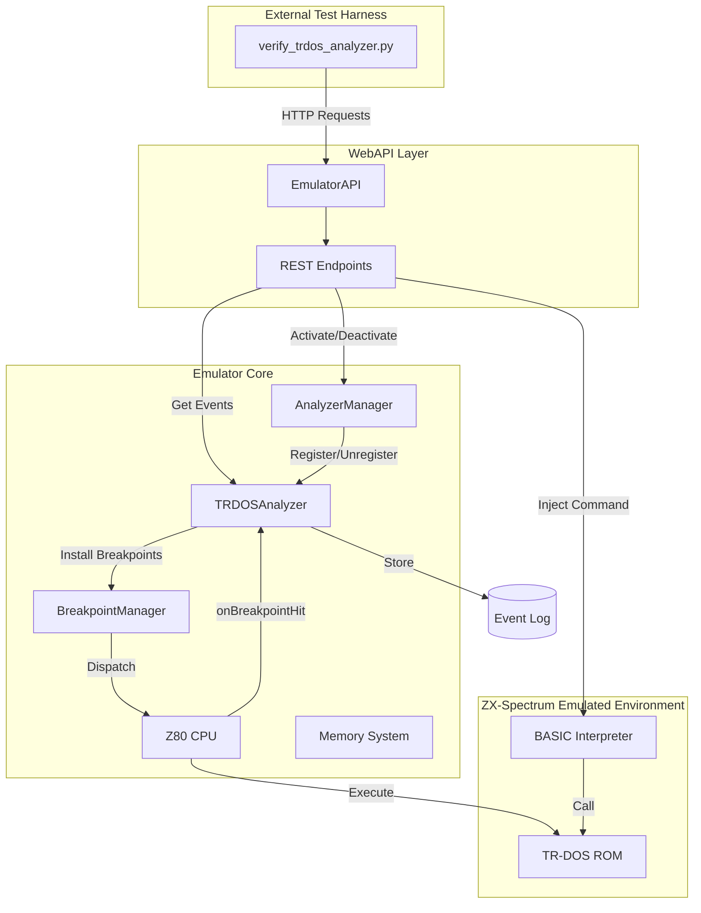
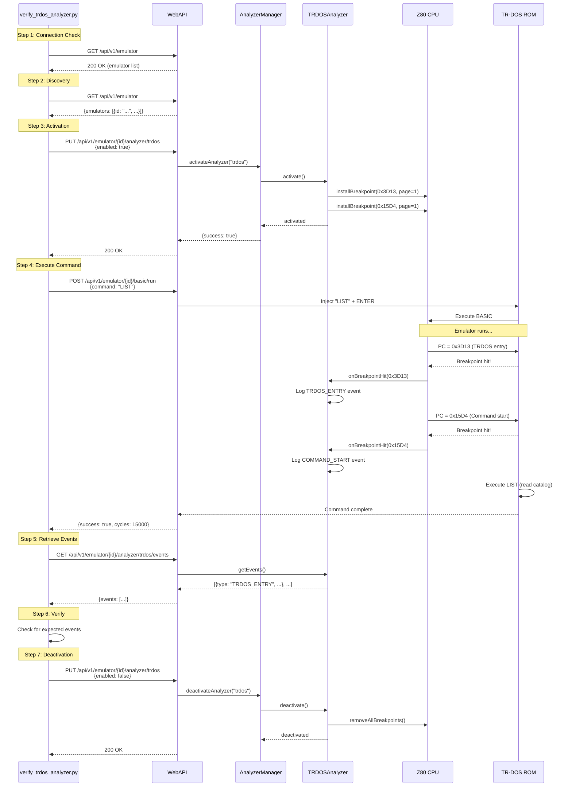
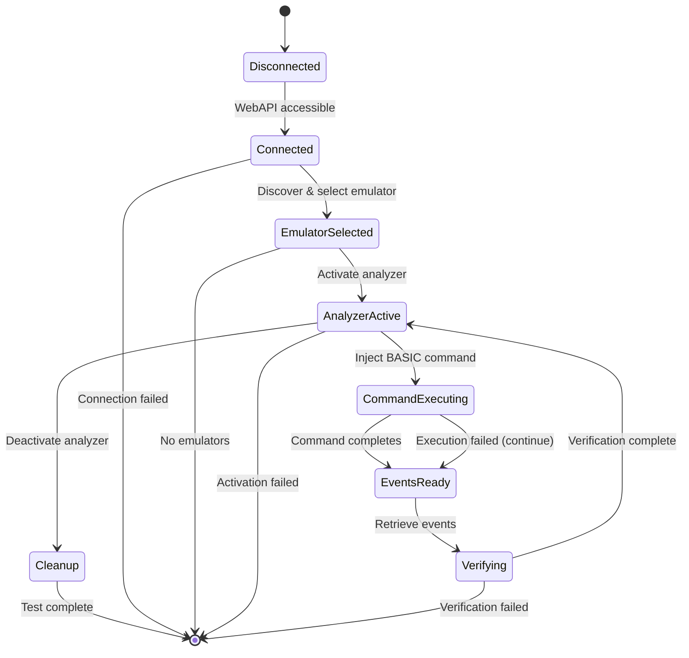
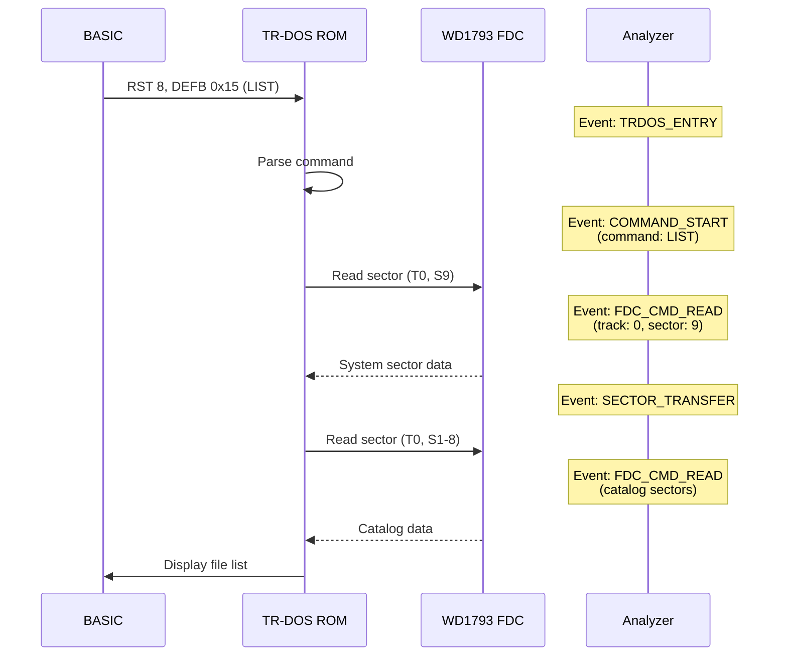

# TR-DOS Analyzer Verification Tool

Python script for verifying TR-DOS analyzer functionality via WebAPI.

## Requirements

```bash
pip install requests
```

## Usage

### Basic Usage (Auto-discover emulator)
```bash
python verify_trdos_analyzer.py
```

### Specify Custom Port
```bash
python verify_trdos_analyzer.py --port 8090
```

### Specify Emulator UUID
```bash
python verify_trdos_analyzer.py --uuid 12345678-1234-1234-1234-123456789abc
```

### All Options
```bash
python verify_trdos_analyzer.py --host localhost --port 8090 --uuid <UUID>
```

## Use Case & Architecture

### Purpose

This verification tool validates the TR-DOS analyzer's ability to capture and report high-level disk operations when TR-DOS commands are executed in the emulated ZX Spectrum environment. It ensures the complete integration chain works correctly:

1. **WebAPI Layer** - REST endpoints for analyzer control
2. **Analyzer Manager** - Lifecycle management and event routing
3. **TR-DOS Analyzer** - Breakpoint-based event capture
4. **Z80 CPU** - Breakpoint dispatch mechanism
5. **BASIC Injection** - Command orchestration

### How It Works

The verification script acts as an external test harness that:

1. Connects to a running emulator instance via WebAPI
2. Activates the TR-DOS analyzer (which installs page-specific breakpoints)
3. Injects a TR-DOS command (`LIST`) via BASIC
4. Allows the emulator to execute the command
5. Retrieves captured events from the analyzer
6. Validates that expected events were recorded

### Architecture Overview



### Verification Flow



### State Diagram



### Event Capture Mechanism

The TR-DOS analyzer uses **page-specific breakpoints** to intercept TR-DOS ROM execution:

1. **Entry Point (0x3D13, Page 1)** - Main TR-DOS entry point
   - Triggered when BASIC calls into TR-DOS
   - Captures: Command type, registers, stack state

2. **Command Dispatcher (0x15D4, Page 1)** - Command execution start
   - Triggered when TR-DOS begins processing a command
   - Captures: Command parameters, drive selection

3. **FDC Operations** - Disk controller interactions
   - Captured via FDC state monitoring
   - Includes: Sector reads, track seeks, data transfers

### Expected Event Sequence for `LIST` Command



## Verification Steps


The script performs the following verification workflow:

1. **Check WebAPI Connection** - Verifies WebAPI is accessible
2. **Discover Emulators** - Lists running emulator instances
3. **Activate Analyzer** - Activates TR-DOS analyzer
4. **Execute Command** - Injects and executes `LIST` command via BASIC
5. **Retrieve Events** - Gets captured events from analyzer
6. **Verify Events** - Checks for expected event types
7. **Deactivate Analyzer** - Cleans up

## Expected Output

### Success
```
============================================================
TR-DOS Analyzer Verification
============================================================

[Step 1] Checking WebAPI connection...
✓ WebAPI is accessible at http://localhost:8090

[Step 2] Discovering emulator instances...
✓ Found 1 emulator instance(s)
  1. UUID: 12345678... Model: Pentagon, State: running

[Step 3] Activating TR-DOS analyzer...
✓ TR-DOS analyzer activated

[Step 4] Executing BASIC command: LIST
✓ Command 'LIST' executed
ℹ Executed 15000 CPU cycles

[Step 5] Retrieving analyzer events...
✓ Retrieved 5 event(s)

[Step 6] Verifying collected events...

Event Summary:
  TRDOS_ENTRY: 1
  COMMAND_START: 1
  FDC_CMD_READ: 2
  SECTOR_TRANSFER: 1

✓ Found expected event: TRDOS_ENTRY
✓ Found expected event: COMMAND_START

Detailed Events:
  1. [    1000] TRDOS_ENTRY
  2. [    2000] COMMAND_START (Command: LIST)
  3. [    3000] FDC_CMD_READ (Track: 0, Sector: 1)
  4. [    4000] SECTOR_TRANSFER
  5. [    5000] FDC_CMD_READ (Track: 0, Sector: 2)

[Step 7] Deactivating TR-DOS analyzer...
✓ TR-DOS analyzer deactivated

============================================================
✓ VERIFICATION PASSED
TR-DOS analyzer is working correctly!
============================================================
```

### Failure (No Events)
```
[Step 6] Verifying collected events...
✗ No events collected!
ℹ Expected events for LIST command:
ℹ   - TRDOS_ENTRY
ℹ   - COMMAND_START
ℹ   - FDC_CMD_READ (catalog sectors)

============================================================
✗ VERIFICATION FAILED
No events were collected.
============================================================
```

## Exit Codes

- `0` - Verification passed
- `1` - Verification failed
- `130` - Interrupted by user (Ctrl+C)

## Troubleshooting

### Connection Error
```
✗ Cannot connect to WebAPI at http://localhost:8090
ℹ Make sure the emulator is running with WebAPI enabled
```

**Solution**: Start the emulator with WebAPI enabled on port 8090.

### No Emulators Found
```
⚠ No running emulator instances found
```

**Solution**: Start an emulator instance before running the verification.

### Activation Failed
```
✗ HTTP error during activation: 404
ℹ Endpoint not found. Check if analyzer API is implemented.
```

**Solution**: Verify the WebAPI has the analyzer endpoints implemented.

### No Events Collected
```
✗ No events collected!
```

**Possible causes**:
1. Analyzer not properly activated
2. TR-DOS ROM not available in emulator
3. BASIC command execution failed
4. Dispatch chain broken

**Solution**: Check emulator logs and verify TR-DOS ROM is loaded.

## Integration with CI/CD

### GitHub Actions Example
```yaml
- name: Verify TR-DOS Analyzer
  run: |
    python tools/verification/analyzers/trdos/verify_trdos_analyzer.py
```

### Jenkins Example
```groovy
stage('Verify TR-DOS Analyzer') {
    steps {
        sh 'python tools/verification/analyzers/trdos/verify_trdos_analyzer.py'
    }
}
```

## Development

### Running Tests
```bash
# Install dependencies
pip install requests

# Run verification
python verify_trdos_analyzer.py

# Run with verbose output
python verify_trdos_analyzer.py --verbose
```

### Modifying Expected Events

Edit the `verify_events()` method to change expected event types:

```python
expected_events = ['TRDOS_ENTRY', 'COMMAND_START', 'YOUR_EVENT']
```

## See Also

- [Testing Summary](../../docs/inprogress/2026-01-21-trdos-analyzer/testing-summary.md)
- [Quick Reference](../../docs/inprogress/2026-01-21-trdos-analyzer/quick-reference.md)
- [WebAPI Documentation](../../docs/analysis/capture/high-level-disk-operations.md#section-21-webapi-testing)
