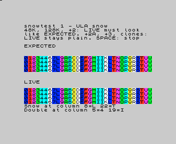

# snowtest - ULA snow, expected and live side by side

A ZX Spectrum test program that shows the **ULA snow** effect next to a drawing of what it should look like, so
anyone can tell at a glance whether a machine or an emulator gets it right.

## What snow is (short)

On the Sinclair machines with the Ferranti ULA (16K, 48K, 128K, +2) the CPU refreshes its memory after every
opcode fetch, using the address held in its `I` and `R` registers. When `I` points into the memory the screen
lives in (#40-#7F), that refresh can land on the same clock tick as the ULA reading the picture, and the ULA then
reads a byte from the wrong place. On screen, a character cell shows another cell's contents ("snow"), or
repeats its left neighbour ("double"). Games avoid it by keeping `I` elsewhere. The +2A, +3 and the Soviet
clones do not snow. Details and sources: [docs/inprogress/2026-09-29-ula-snow](../../../../docs/inprogress/2026-09-29-ula-snow/research.md).

## How to run it

| Machine | File | How |
|:--|:--|:--|
| 48K | `snowtest.tap` | `LOAD ""` |
| 128K, +2 | `snowtest.tap` | the 128K menu's Tape Loader, or `LOAD ""` from 128 BASIC |
| +2A, +3 | `snowtest.tap` | from +3 BASIC: `LOAD "t:"`, then `LOAD ""` |
| Pentagon, Scorpion and other clones with TR-DOS | `snowtest.trd` | `RUN` in TR-DOS |

It runs at 3.5 MHz only (switch any turbo off). SPACE stops it.

## What you see

- **EXPECTED**: a band of 32 characters, `0`..`9`, `A`..`V`, each in its own colour, drawn with the cells the
  snow model predicts already changed.
- **LIVE**: the same 32 characters, drawn plain; while this band is on screen the program runs a loop locked
  to the picture, with `I` = #40.
- The last two lines say which columns change: for example `Snow at column 8=L 22=T` (column 8 shows the
  character `L`) and `Double at column 5=4 19=I` (column 5 repeats `4`, its left neighbour).

| Machine | What LIVE must look like |
|:--|:--|
| 48K, 128K, +2 | exactly like EXPECTED, steady |
| +2A, +3, Pentagon, Scorpion, other clones | plain: `0123456789ABCDEFGHIJKLMNOPQRSTUV` |

What a difference means:

| You see | Meaning |
|:--|:--|
| LIVE plain on a 48K / 128K / +2 | the machine or emulator does not emulate snow |
| Snow in other columns than predicted | the snow happens at another tick than the model says (the columns move by one per tick) |
| The right columns, other characters | the address the snow uses comes from a different `R` (before or after its increment) |
| LIVE changes from frame to frame | the machine's frame is not 69888 / 70908 ticks, or its timing drifts |
| Snow on a +2A / +3 or a clone | the emulator snows where the hardware does not |

## How it works

Each screen line of the LIVE band runs 32 x `LD A,0` (7 ticks each: 224 ticks, one 48K line; on the 128K's 228
tick line the last one is `OUT (#FF),A`, 11 ticks). So `R` advances by exactly 32 per line: a cell that snows
takes its column from `R`'s low 5 bits, which are the same on every line, so it shows one whole character. The
band covers a group of four character rows with the same characters, so the two `R` bits that pick the row do
not matter either. The loop starts at an exact tick (the Bobrowski / Rak measuring engine, as in
[ctprobe](../ctprobe/README.md)) and measures its own length to repeat every frame exactly.

The EXPECTED band is filled in by unreal-ng's test suite (`core/tests/emulator/video/snowtest_test.cpp`) from
the model: snow when the refresh's first tick (T3) falls on the ULA's fetch of the first pixel byte of a
16-pixel group, double when it falls on the second; the address's low 7 bits from `R` before its increment.
That tick and that `R` were fixed on photos of Snow Hold (Mark Woodmass) from three real 48K machines
([research](../../../../docs/inprogress/2026-09-29-ula-snow/research.md)).

## Files

| File | What |
|:--|:--|
| `snowtest.asm` | the program; the measuring engine is ctprobe's `engine.asm` |
| `snowtest.tap`, `snowtest.trd`, `snowtest.sym` | built by the test suite (`UNREAL_SNOWTEST_EXPORT=1`); a test keeps them equal to the source |
| `expected-screen.png` | the screen on unreal-ng's 48K |

## Results so far

| Machine / emulator | Result |
|:--|:--|
| unreal-ng 48K, 128K | LIVE as EXPECTED (the test suite checks it pixel by pixel) |
| unreal-ng +3, Pentagon | LIVE plain |
| Real hardware | not run yet: please send photos |
